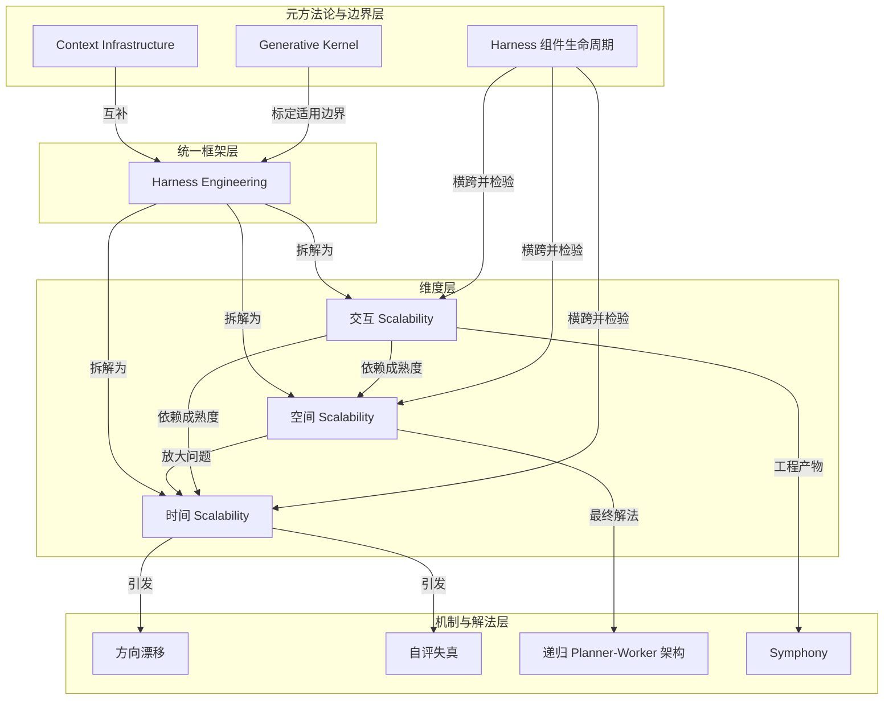

# 概念解析辞典

> 针对《Harness Engineering 三个 Scaling 维度的统一框架》（作者：grapeot，原文：https://yage.ai/share/harness-engineering-scalability-20260330.html）的概念提取

## 一、核心概念

### 1. **Harness Engineering**

- **context**：

  > 2026 Q1，三家先后发布 agent-first 软件开发实践报告，都被归入 harness engineering，但讲的是三件完全不同的事。

- **费曼一下**：Harness 原意是“驾驭”。Harness engineering 不是教 agent 写更好的代码，而是设计让 agent 可靠工作的环境、流程、约束和反馈回路。本文的关键判断是：这个术语掩盖了三种不同的 scaling 问题——时间、空间、交互。理解 harness engineering，先要问它到底在解决哪一个维度。

### 2. **时间 Scalability（Temporal Scalability）**

- **context**：

  > agent 在精心设计的环境里开始工作后，怎么在几个小时的连续运行中保持方向和质量？

- **费曼一下**：时间 scaling 解决单个 agent 长时间自主运行不失控的问题。难点不在起点环境，而在运行中出现的两类失败：方向漂移和自评失真。Anthropic 的实践是这一维度的代表，它把单 agent 拆成 Planner、Generator、Evaluator 三个角色来对抗长时间运行的质量衰减。

### 3. **空间 Scalability（Spatial Scalability）**

- **context**：

  > 能否通过投入 10x 计算获得 10x 有意义吞吐量？

- **费曼一下**：空间 scaling 解决几百个 agent 并行工作时如何形成接近线性的吞吐量。核心难点是协调：共享状态会造成锁竞争，集中式规划会成为瓶颈。Cursor 的答案是递归 Planner-Worker 架构，让 Worker 完全隔离、规划递归拆分，使并行度真正扩展到数百个 agent。

### 4. **交互 Scalability（Interaction Scalability）**

- **context**：

  > agent 产出速度远超人类注意力时，人应该通过什么界面来 steer 整个系统？

- **费曼一下**：交互 scaling 解决人的注意力如何跟上 agent 的产出速度。当单个 run 足够可靠、系统能同时管理大量 run 后，人类不可能再逐条 prompt 或逐个 review。OpenAI 的答案是把交互从“写 prompt 并触发”降为“写 ticket 并移动状态”，用调度、自我验证和自动化熵管理替代人工审视。

### 5. **方向漂移（Direction Drift）**

- **context**：

  > 上下文窗口逐渐变满 → 一致性衰减 → 偏离方向、遗忘早期约束、在细节中越走越深

- **费曼一下**：长时间运行中的 agent 不会突然崩溃，而是缓慢“走偏”。上下文累积到一定程度后，早期目标被淹没，模型对局部细节的关注取代了整体方向感。这是时间 scaling 必须对抗的核心失败模式之一。

### 6. **自评失真（Self-evaluation Distortion）**

- **context**：

  > agent 能发现自己产出的缺陷，但随后说服自己可以接受，给出通过判断

- **费曼一下**：当 agent 同时是执行者和验收者时，它会对自己的缺陷倾向于找理由放行。这不是模型缺乏发现能力，而是“当事人评审”带来的系统性偏差。Anthropic 引入独立 Evaluator，正是为了打破这种自我宽容，使验证具备客观性。

### 7. **递归 Planner-Worker 架构**

- **context**：

  > 根 Planner 拥有整个项目范围，范围过大时生成子 Planner，递归进行。Worker 在自己的 repo 副本上独立工作，完成后写 handoff（做了什么、发现了什么、有什么担忧）提交给 Planner。Worker 之间互不感知，信息严格向上流动。

- **费曼一下**：这是 Cursor 在四次架构迭代失败后得到的最终方案。规划层通过递归拆分避免单一 Planner 成为瓶颈；执行层通过隔离 repo 副本消除锁竞争；质量层接受小而稳定的错误率，让错误被其他 agent 自然修复。它支撑了空间 scaling 的线性扩展。

### 8. **Symphony**

- **context**：

  > 把交互从「写 prompt 并触发」简化为「写 ticket 并移动状态」。用 Elixir/BEAM 构建的持久化守护进程。项目管理工具（Linear）变成 agent 的 job scheduler。

- **费曼一下**：OpenAI 开源的 agent 编排系统，是交互 scaling 的工程化产物。人类只需在项目管理工具中移动 ticket 状态，Symphony 就会自动创建工作空间、派发 Codex、收集证明并开 PR。agent 策略通过 repo 内的 WORKFLOW.md 与代码一起版本化，使反馈循环沉淀回 harness 本身。

### 9. **Harness 组件生命周期**

- **context**：

  > 每个 harness 组件都是对当前模型能力边界的一个假设。这些假设有不同的过期速度。关键做法：逐一移除旧组件、测试质量是否真的下降，而不是继续叠加新组件。

- **费曼一下**：这是贯穿三个维度的元方法论。Context reset、sprint 分解、evaluator 都不是永久标配，而是“当前模型可能做不到某件事”的假设。模型迭代后，正确做法是定期移除旧组件，检验质量是否真下降，而不是无脑堆叠防御。Anthropic 的实践显示，不同组件的过期速度不同，evaluator 的生命周期最长。

### 10. **Context Infrastructure**

- **context**：

  > 三家讨论的 scaling 都在优化 agent 怎么工作，但质量上限取决于它拿到什么样的 context。Harness 解决工作方式和协调，context infrastructure 解决认知密度。

- **费曼一下**：作者对三份报告共同盲区的补充。Harness engineering 决定 agent“怎么干活”，context infrastructure 决定 agent“带着什么知识干活”。没有后者，优化工作流只能产出“正确的废话”；有高密度 context 后才能产生“有判断力的分析”。两者互补。

### 11. **Generative Kernel**

- **context**：

  > 当交付物从成品软件变成 Generative Kernel 时，harness engineering 的重要性会下降——需要被 harness 的系统复杂度本身在降低。

- **费曼一下**：这是作者给 harness engineering 标定的适用边界。如果未来软件不再以大型复杂系统的形式交付，而是按需生成的一次性内核，那么“驾驭复杂系统”这一需求本身会减少。它提醒读者，harness engineering 的价值与系统复杂度绑定，不是无条件的终极答案。

## 二、概念架构图

