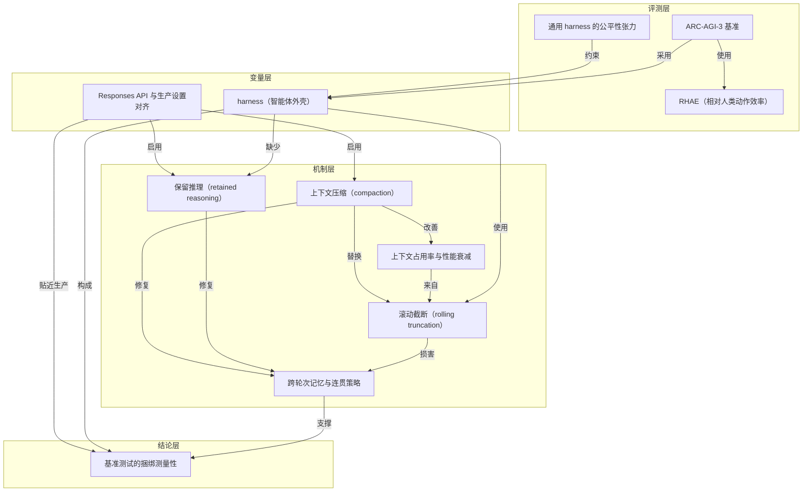

# 概念解析辞典

> 针对《只改两个 API 设置，OpenAI 把 ARC-AGI-3 成绩提到三倍》（OpenAI｜openai.com）的概念提取

## 一、核心概念

### 1. **harness（智能体外壳）**

- **context**：全文的核心变量。ARC-AGI-3 使用通用 harness，商业开发者则围绕模型特性优化 harness；OpenAI 最终把低分归因于外壳设置，而不是模型权重。

  > “not inherent to the model itself, but due to settings in the harness”
  >
  > “intentionally generic”
  >
  > “each model's features and quirks”

- **费曼一下**：harness 是包在模型外面的运行框架，决定模型每一轮能看到什么、记住什么、能调用什么工具、上下文满了怎么办。本文里模型权重没变，只是换了两项 API 设置，成绩就变成三倍，所以 harness 是那个容易被忽略的隐形变量。

### 2. **基准测试的捆绑测量性**

- **context**：全文主命题，开头和结尾都指出基准分数同时在衡量模型之外的选择。

  > “Benchmarks rarely measure AI models in isolation. They also measure less visible choices about API settings, harness design, and prompting.”

- **费曼一下**：你以为分数是模型的体检报告，其实它是模型加上一整套工程默认值的联考成绩。想从分数里读出模型能力，必须先知道评测规则；否则比较的可能只是两套脚手架。

### 3. **通用 harness 的公平性张力（intentionally generic harness）**

- **context**：ARC 特意用通用 harness 保证比较公平，商业部署却反过来为模型特性和怪癖优化外壳，两者形成张力。

  > ARC-AGI-3 刻意使用一个通用（intentionally generic）harness，不带工具，也没有特殊功能。ARC 的理由很清楚：简单的 harness 会让模型的缺陷更可见，也让模型之间的比较更公平。
  >
  > 商业开发者的做法正好相反：他们围绕每个模型的特性和怪癖（each model's features and quirks）去优化 harness。

- **费曼一下**：统一考场对所有考生一视同仁，却也剥夺了每个人惯用的工具。通用 harness 更公平、更可比，但可能测出模型在“失忆状态”下的下限；商业 harness 更贴近真实交付，却不那么公平。公平和代表性在这里不是同一个方向。

### 4. **RHAE（Relative Human Action Efficiency）**

- **context**：ARC-AGI-3 的评分指标，把模型表现与人类基线相比。

  > 评分口径是 RHAE（Relative Human Action Efficiency），一个把模型表现与人类基线相比的指标。基于官方人类测试日志，OpenAI 估计人类测试者的平均分约为 48%。

- **费曼一下**：它不只看最终有没有通关，而看你用多少动作达成目标，再和人类比较。一个反复重来、每步都像重新开始的模型，会在动作效率上被狠狠扣分，所以这个评分口径对记忆缺失格外敏感。

### 5. **保留推理（retained reasoning）**

- **context**：两个被打开的 API 设置之一。原 harness 在每次动作后丢弃全部私有推理，模型只能看到动作记录，看不到导致这些动作的计划、洞察和思路；在 Responses API 中传入上一条 response ID 即可自动保留。

  > “asked to figure out the game anew”
  >
  > “the plans, insights, or thoughts that led to them”
  >
  > “much better at learning over time and employing coherent strategies”

- **费曼一下**：让模型把自己的草稿纸留在桌上，而不是每做完一步就撕掉。有草稿在，它不必重新推导已经想明白的事，所以反而想得更少、走得更快，也更能把连续动作累积成策略。

### 6. **滚动截断（rolling truncation）**

- **context**：官方 harness 的上下文管理方式：超过 175,000 字符就丢弃最旧的消息。

  > “rolling truncation window”
  >
  > “which can slightly impair performance”
  >
  > harness 使用滚动截断窗口（rolling truncation window），随着历史增长，较早的动作会变得不可见。

- **费曼一下**：像一条只能记住最近几步的传送带，旧东西自动掉出去。模型不仅忘掉自己的思考，连自己做过什么也在逐步丢失；而且大部分时间都运行在很满的上下文窗口下，表现还会被轻微拖累。

### 7. **上下文压缩（compaction）**

- **context**：用来替换滚动截断的第二个设置。上下文快满时，不是丢掉旧消息，而是把已有信息压成摘要接续。

  > “compaction”
  >
  > “better able to preserve what it had learned about each game across longer runs”
  >
  > 第二步改进是用 compaction 替换滚动截断。

- **费曼一下**：把厚厚一叠会议记录压成一页纪要——占地小了，结论还在。模型因此能在更长的运行中保住对每个游戏学到的东西，用更少的输出 token 拿到更高的分数。

### 8. **跨轮次记忆与连贯策略**

- **context**：修复带来的实质收益。丢弃推理切断思考连续性，滚动截断切断观察与动作连续性；两者叠加造成失忆。保留推理和 compaction 共同修复记忆后，模型才能采用连贯策略。

  > “much better at learning over time and employing coherent strategies”
  >
  > 丢弃推理和滚动截断这两个特性，共同制造了一个每一步都被重置的学习者。

- **费曼一下**：能不能把每一步的经验累积成一套打法，是探索型任务的胜负手。没有记忆，模型只是在做一串互不相关的单步决策；有了记忆，这些决策才连成策略。

### 9. **Responses API 与生产设置对齐**

- **context**：修复的实现路径。OpenAI 用 Responses API 重新实现 ARC-AGI-3 的 harness，让评测环境贴近生产环境，并建议开发者使用 Responses API 而非 legacy Chat Completions API。

  > “To better match our production setup”
  >
  > “use the Responses API, not the legacy Chat Completions API.”

- **费曼一下**：把评测环境改造成和产品线上一模一样，再去量成绩。保留推理和 compaction 之所以能在评测里生效，是因为换了这套 API 外壳；这样测出的结果也更接近 ChatGPT 和 Codex 里的真实使用。

### 10. **上下文占用率与性能衰减**

- **context**：滚动截断的第二个弊端：模型在任务大部分时间里都运行在一个更满的上下文窗口下。

  > “which can slightly impair performance”
  >
  > 模型在任务的大部分时间里都运行在一个更满的上下文窗口下，而这会轻微损害表现。

- **费曼一下**：上下文窗口不是装满了才算用好，越满往往越迟钝。压缩通过腾出空间同时缓解了这一点，所以在记忆之外还补了一份性能增益。

## 二、概念架构图

