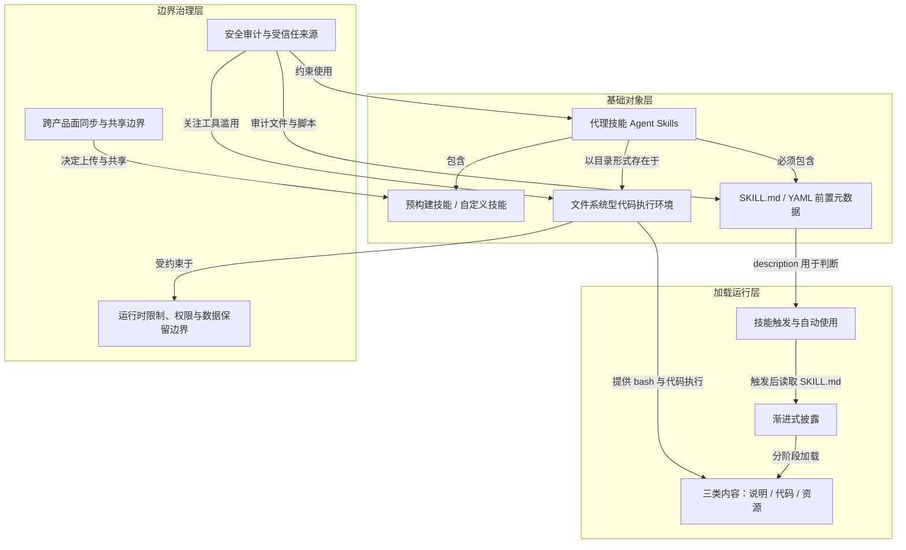
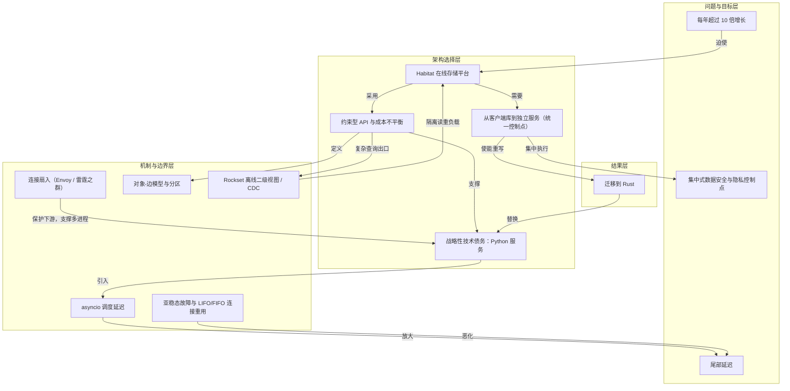
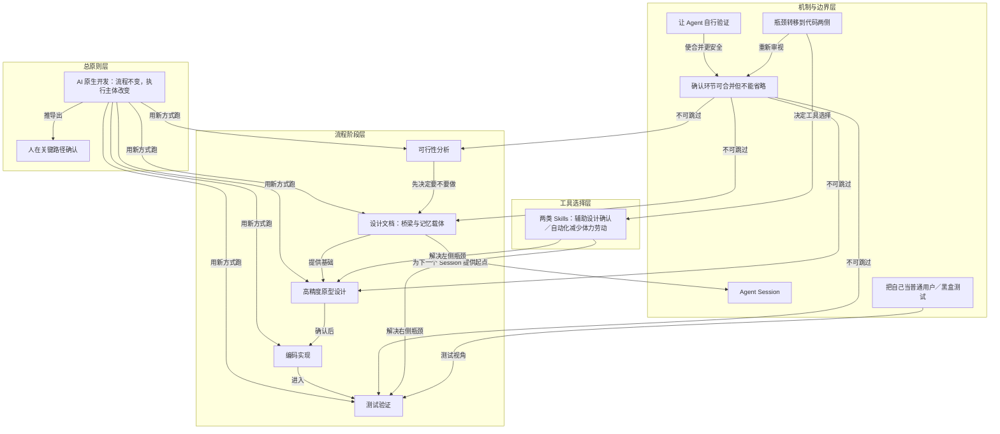
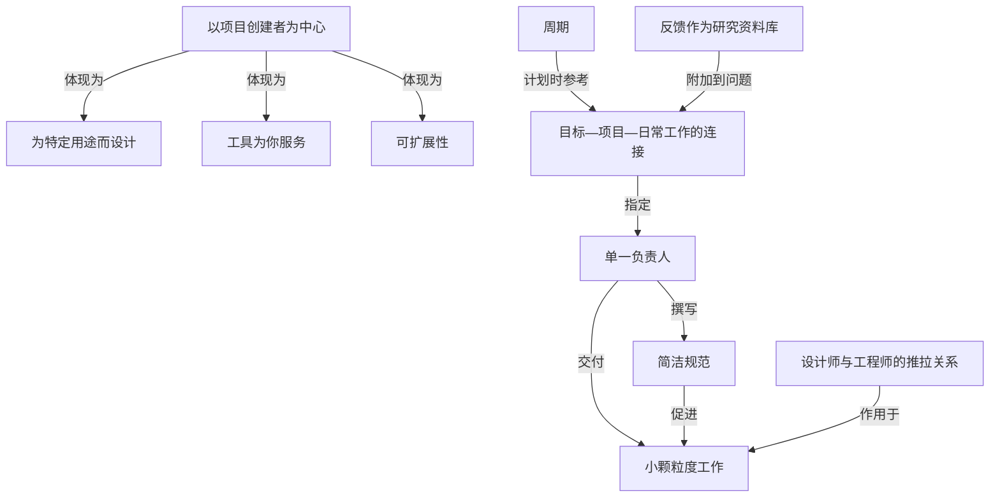
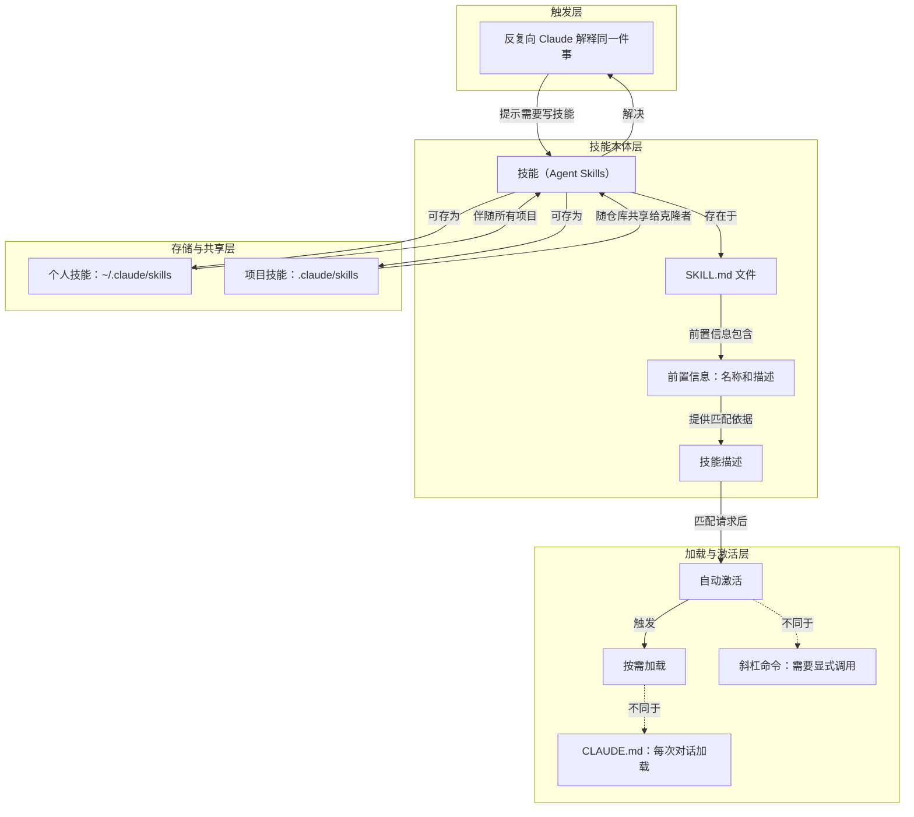
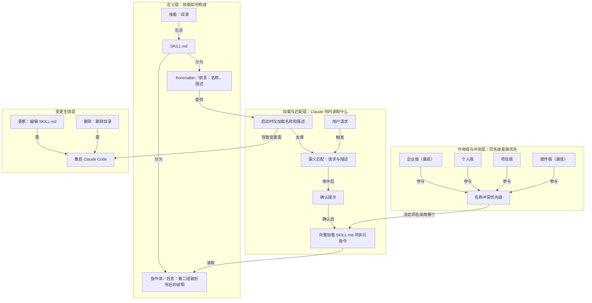
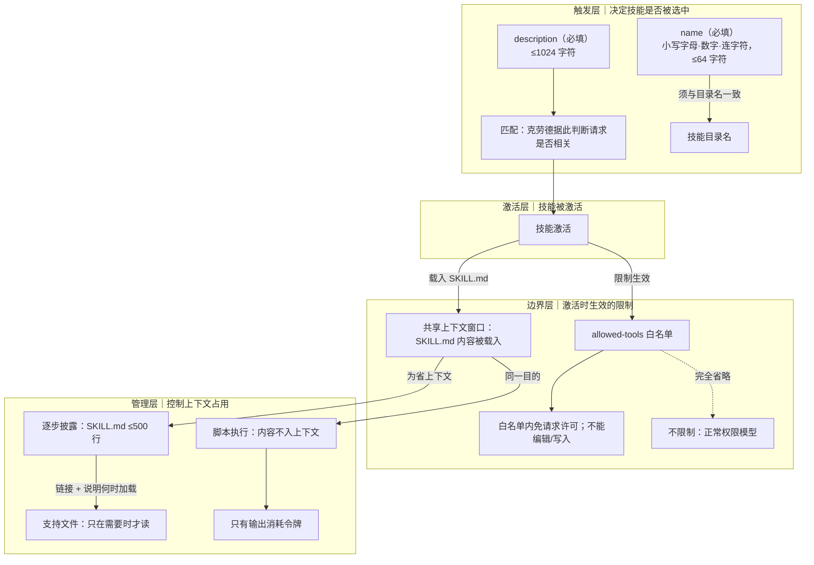
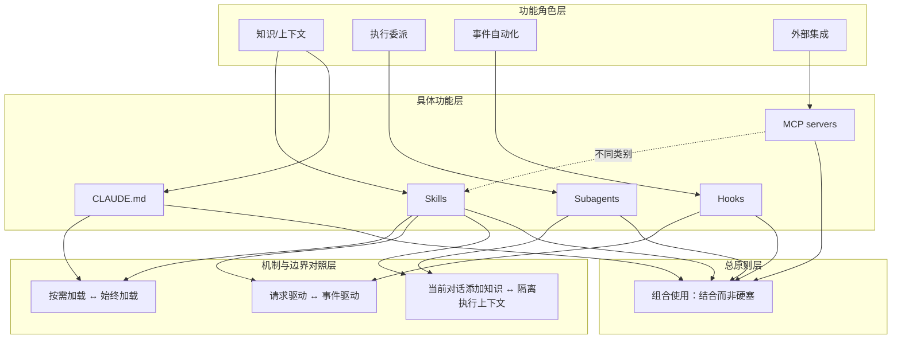
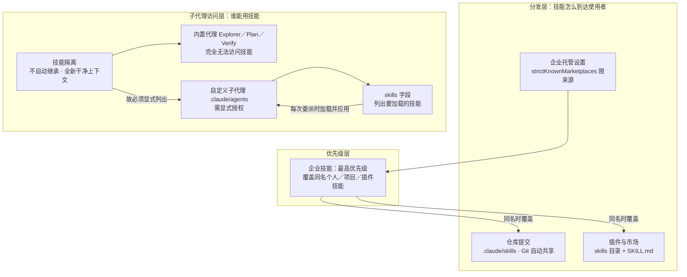

# AI 内参 · 260912 期（倒推版）

- **期数**：260912（2026-09-12）
- **来源**：今日 Readwise 精选 11 篇 → 处理 10 篇，跳过 1 篇（见文末记账）
- **流水线**：原文快照 → 三级笔记（note-taking-pro SOP）→ 概念辞典（concept-learning SOP）→ AI 费曼示范 ｜ 模型 deepseek-flash ｜ 0 tokens
- **生成时间**：2026/9/12 23:21:32

## 今日导读

1. **Using Agent Skills with the API（用 API 使用 Agent Skills）**（platform.claude.com）—— Skills 文件系统按需加载；API 靠代码执行工具。
2. **Rapidly scaling online storage to serve over 1 billion ChatGPT users（存储平台 Habitat 的扩容复盘）**（openai.com）—— Habitat 用受限 API 与 Python 服务撑住超高速增长，最终迁到 Rust。
3. **我的 AI 原生开发流程：一个真实案例的完整复盘**（baoyu.io）—— AI 原生开发流程没变，变的是执行主体——人成了指挥官。
4. **原则与实践（Linear 的产品原则）**（linear.app）—— 项目管理工具应服务用户，以周期、目标和精简流程保持团队势头。
5. **Claude 官方课程 · 第 1 课：什么是 Agent Skills**（academy.claude.com）—— 技能把重复解释变成按需自动加载的任务指令。
6. **Claude 官方课程 · 第 2 课：技能的结构（SKILL.md 与 frontmatter）**（academy.claude.com）—— 技能靠名称与描述被匹配，确认后才加载全文执行。
7. **Claude 官方课程 · 第 3 课：写好 name 与 description**（academy.claude.com）—— description 是最重要字段，决定 Claude 何时匹配并触发技能。
8. **Claude 官方课程 · Skills 与其他 Claude Code 功能的比较**（academy.claude.com）—— 各功能各有专长，应按需求组合使用，避免硬塞进 skills。
9. **Claude 官方课程 · 第 5 课：技能的分发与共享**（academy.claude.com）—— 技能共享更有价值；仓库、插件、企业分发，子代理需显式列技能。
10. **Claude 官方课程 · 第 6 课：技能排障**（academy.claude.com）—— 技能失效可归入几类可预测的故障，每类都有直接对应的修复方法。

---
## 1｜[Using Agent Skills with the API（用 API 使用 Agent Skills）](https://platform.claude.com/docs/en/agents-and-tools/agent-skills/overview)

> platform.claude.com ｜ 概念文 ｜ 约 31 分钟

**一句话主旨**：Skills 文件系统按需加载；API 靠代码执行工具。

### AI 费曼示范

这篇文章回答的是：怎样让 Claude 不靠一次次重复提示，而是自动获得特定领域能力？答案是“代理技能”——把指令、脚本和资料打包成文件系统里的文件夹，Claude 需要时自动使用。

核心机制叫“渐进式披露”：启动时只加载每个技能的名字和描述，约一百词；你的请求匹配描述后，Claude 才用 bash（命令行）读 `SKILL.md` 主说明，再按需读附带文件或运行脚本。脚本代码本身不进上下文，只有输出进入，所以省空间又能带很多资料。

类比：新员工先拿到一张技能清单，真遇到做 PPT 或填 PDF 表格，才翻对应手册、附件和工具，用完不必把整柜文件塞进脑子。

代价是：在 Claude API 上，技能跑在沙盒容器里，没有网络访问，也不能运行时安装新包，只能用预装依赖。所以规划技能时必须顺着这些限制来。


### 三级笔记

# Using Agent Skills with the API（用 API 使用 Agent Skills）

## 一句话主旨
Skills 文件系统按需加载；API 靠代码执行工具。

## 作者试图回答的问题
核心问题：Agent Skills 是什么、如何工作，以及如何在 Claude API 中使用。关联子问题：预置与自定义 Skill 如何编写/上传、在各产品面如何共享与受限；安全、数据留存和运行环境边界是什么。

## 三级论证骨架
### 一、Agent Skills 的定位与价值
#### 1.1 定义
- 每个 Skill 是模块化功能，包含指令、元数据和可选资源（脚本、模板）；Claude 在需要时自动使用。
  - 技能是文件系统上的可重用资源，赋予 Claude 特定领域专业知识：工作流程、上下文、最佳实践，使通用代理转变为专家。
#### 1.2 与提示的区别
- 提示是对话级、一次性任务指令；Skills 按需加载，无需在不同对话中重复相同指导。
#### 1.3 主要优势
- Claude 专精：针对特定领域任务定制功能。
- 减少重复：一次创建，自动使用。
- 组合能力：结合多种技能完成复杂多步骤任务。
#### 1.4 预置与自定义
- Anthropic 提供预置文档技能（PowerPoint、Excel、Word、PDF），也可创建自定义技能；两者工作方式相同：一旦在环境中可用，Claude 会在相关时自动使用。
  - 预置可用面：claude.ai、Claude API、AWS 上的 Claude Platform、Microsoft Foundry；在 Microsoft Foundry 上，Agent Skills 需部署在 Anthropic。
  - 自定义可打包领域专业知识和组织经验；可在 Claude Code 创建、通过 Claude API 上传，或在 claude.ai 设置中添加；AWS/Microsoft Foundry 通过 Skills API 上传。

### 二、工作原理：虚拟机 + 渐进式披露
#### 2.1 文件系统与虚拟机
- Skills 利用 Claude 的虚拟机环境，提供仅凭提示无法实现的功能；Claude 在具有文件系统访问权限的 VM 中运行，Skills 以目录形式存在，包含指令、可执行代码和参考资料，类似为新团队成员创建的入职指南。
#### 2.2 三类内容与加载时机
- YAML frontmatter：提供发现信息；启动时加载进系统提示。Claude 根据 `description` 判断是否触发技能，因此它必须说明技能功能和使用时机。
  - 轻量：技能触发前，只有名称和描述占用上下文，可安装多个技能而不造成上下文开销。
- SKILL.md 主体：包含程序性知识——工作流程、最佳实践、指南；当请求与技能描述相符时，Claude 用 bash 从文件系统读取，此时内容才进入上下文。
- 捆绑材料：附加 Markdown（如 FORMS.md、REFERENCE.md）、代码（如 fill_form.py、validate.py）、资源（数据库 schema、API 文档、模板、示例）；仅在引用时访问。
  - 文件系统模型下各有强项：instructions 用于灵活指导，code 用于可靠性，resources 用于事实查找。
#### 2.3 三级加载与 token 成本
- Level 1 Metadata：始终在启动时加载；约 100 tokens/技能；内容为 YAML frontmatter 的 name 和 description。
- Level 2 Instructions：技能触发时加载；低于 5k tokens；内容为 SKILL.md 主体。
- Level 3+ Resources：按需加载；访问前无成本；引用文件读入上下文；脚本通过 bash 运行，只有输出进入上下文。
- 渐进式披露保证任一时刻只有相关内容占用上下文窗口。
#### 2.4 访问机制与收益
- 触发后，Claude 用 bash 读 SKILL.md；若指令引用其他文件，再用 bash 读取；若提到可执行脚本，通过 bash 运行，只接收输出，脚本代码本身从不进入上下文。
  - 按需文件访问：只读任务所需文件；技能可含数十个参考文件，但若只需 sales schema，就只加载该文件，其余零 token。
  - 高效脚本执行：运行 validate_form.py 时代码不进入上下文，只有输出（如 "Validation passed" 或具体错误）消耗 token；比让 Claude 临时生成等效代码更高效。
  - 捆绑内容无实际限制：未访问不消耗上下文，可包含全面 API 文档、大数据集、大量示例；未使用无上下文惩罚。
#### 2.5 示例：自定义 pdf-processing
- 启动：系统提示包含描述 "pdf-processing - Extract text and tables from PDF files, fill forms, merge documents. Use when working with PDF files or when the user mentions PDFs, forms, or document extraction."
- 用户请求："Extract the text from this PDF and summarize it"。
- Claude 调用：`bash: cat pdf-processing/SKILL.md` → 指令载入上下文。
- Claude 判断：不需要填表，因此不读取 FORMS.md。
- Claude 执行：用 SKILL.md 指令完成任务。

### 三、在 Claude API 与各产品面使用
#### 3.1 API 使用方式
- Claude API 支持预置和自定义 Skills，两者工作方式相同：在 `container` 参数指定相关 `skill_id`，并配合 code execution tool。
  - 前置条件：通过 API 使用 Skills 需要 code execution tool，Skills 在其容器中运行。
  - 预置：引用 `skill_id`（`pptx`、`xlsx`、`docx`、`pdf`）。
  - 自定义：通过 Skills API（`/v1/skills` endpoints）创建和上传；自定义 Skills 工作区范围共享，所有工作区成员可访问。
  - API 上的 Skills 运行在沙箱容器：无网络访问、无运行时包安装。
#### 3.2 其他产品面差异
- AWS 上的 Claude Platform 和 Microsoft Foundry 继承与 Claude API 相同的 Skills 行为。
- Claude Code：支持自定义 Skills；预置文档 Skills 不可用，但开源 Claude API skill 捆绑其中。
  - 自定义 Skills 以目录和 SKILL.md 存在，Claude 自动发现使用；文件系统型，无需 API 上传；放在 `~/.claude/skills/`（个人）或 `.claude/skills/`（项目）。
- claude.ai：支持预置和自定义。
  - 预置在创建文档时激活，无需设置。
  - 自定义通过 Settings > Features 以 zip 上传；需 Pro、Max、Team、Enterprise 计划且启用代码执行；自定义 Skills 个人独有，不组织级共享，管理员不能集中管理。

### 四、编写 Skill：文件格式与要求
- 每个 Skill 都需要 SKILL.md，含 YAML frontmatter：
  - 必需字段：`name` 和 `description`；正文可含 Instructions、Examples。
  - 示例结构：`--- name: your-skill-name description: Brief description... --- # Your Skill Name ## Instructions... ## Examples...`
- `name` 要求：最多 64 字符；只允许小写字母、数字和连字符；不能含 XML 标签；不能含保留词 "anthropic"、"claude"。
- `description` 要求：非空；最多 1024 字符；不能含 XML 标签。
- `description` 必须同时说明技能做什么和 Claude 何时使用它。完整编写指南见 Skill authoring best practices。

### 五、安全与治理
#### 5.1 来源原则
- 只使用可信来源的 Skills：自己创建或从 Anthropic 获得。
  - 原因：Skills 通过指令和代码给 Claude 新能力；恶意 Skill 可诱导 Claude 以不符合声明目的的方式调用工具或执行代码。
  - 若必须使用不可信或未知来源：极度谨慎，使用前彻底审计；视 Claude 执行时的访问权限，恶意 Skills 可能导致数据外泄、未授权系统访问等安全风险。
#### 5.2 关键安全考量
- 彻底审计：检查 Skill 内所有文件——SKILL.md、脚本、图片、资源；寻找异常模式，如意外网络调用、文件访问模式、不符合声明目的的操作。
- 外部来源风险：从外部 URL 取数据的 Skills 尤其危险，抓取内容可能含恶意指令；即使可信 Skills 也可能因外部依赖变化而被污染。
- 工具滥用：恶意 Skills 可以有害方式调用工具（文件操作、bash 命令、代码执行）。
- 数据暴露：能访问敏感数据的 Skills 可能被设计成向外部系统泄露信息。
- 像安装软件一样对待：集成到可访问敏感数据或关键操作的生产系统时尤其小心。
#### 5.3 企业治理与扫描
- 组织规模治理、审查、部署见 Skills for enterprise。
- Claude Enterprise 可开启 Skill content scanning，扫描 claude.ai 和 Claude Cowork 中上传的自定义 Skills；不覆盖通过 Skills API 或 Claude Console 上传的 Skills。

### 六、可用技能与数据留存
#### 6.1 可用预置技能
- PowerPoint（`pptx`）：创建演示文稿、编辑幻灯片、分析演示内容。
- Excel（`xlsx`）：创建电子表格、分析数据、生成带图报表。
- Word（`docx`）：创建文档、编辑内容、格式化文本。
- PDF（`pdf`）：生成格式化 PDF 文档和报告。
- 可用面：Claude API、Claude Platform on AWS、Microsoft Foundry、claude.ai；有 quickstart tutorial。
- 开源 Skills（skills repository）：
  - Claude API skill：提供最新 API 参考、SDK 文档和八种编程语言最佳实践；捆绑于 Claude Code，也可从 skills repository 安装。
  - 自定义完整示例见 Skills cookbook。
#### 6.2 数据留存
- Agent Skills 不在 ZDR 安排覆盖范围内；Skill 定义和执行数据按 Anthropic 标准数据留存政策保留。
- ZDR eligibility 见 API and data retention；Skills API 操作审计日志见 Audit logging in Using Agent Skills with the API。

## 作者边界、反例与不确定性
- 明确边界：自定义 Skills 不跨 surface 同步；共享模型按产品面不同；API 沙箱无网络、无运行时包安装；claude.ai 自定义 Skills 仅个人、不能集中管理或组织分发；扫描不覆盖 Skills API/Claude Console 上传；Agent Skills 不在 ZDR 覆盖范围；Microsoft Foundry 预置技能需部署在 Anthropic。
- 反例与风险：恶意 Skill、外部 URL 内容、外部依赖变化、工具滥用、数据暴露都可能改变 Skills 的安全适用范围；作者要求只从可信来源使用，并像安装软件一样对待。
- 未展开或需转指：API 端到端调用细节、预装包清单、扫描范围外治理、企业部署细节，原文均指向其他文档，未在本页完整给出。


### 概念辞典

# 概念解析辞典

> 针对《Using Agent Skills with the API（用 API 使用 Agent Skills）》（Claude Platform Docs，platform.claude.com）的概念提取

## 一、核心概念

### 1. **代理技能（Agent Skills）**

- **context**：

  > 代理技能是扩展 Claude 功能的模块化功能。每个技能都包含指令、元数据和可选资源（脚本、模板），Claude 会在需要时自动使用这些资源。

  > 技能是基于文件系统的可重用资源，赋予 Claude 特定领域的专业知识：工作流程、上下文和最佳实践，使通用代理转变为专家。与提示（针对一次性任务的对话级指令）不同，技能按需加载，因此您无需在不同的对话中重复相同的指导。

- **费曼一下**：本文把“技能”定义为一种可复用、基于文件系统的能力包，而不是一次性的对话提示。技能里可以放指令、元数据和脚本模板，Claude 在相关任务出现时自动加载。它解决的是“通用代理如何变成特定领域专家”和“如何不重复写同一套指导”的问题。全文的加载方式、文件结构、共享模型、安全边界都围绕这个对象展开。

### 2. **预构建技能与自定义技能（Pre-built vs Custom Skills）**

- **context**：

  > Anthropic 提供预置的代理技能，用于处理常见的文档任务（PowerPoint、Excel、Word、PDF），您也可以创建自定义技能。两者的工作方式相同：一旦技能在您的环境中可用，Claude 就会在与您的请求相关时自动使用它。

  > 自定义技能可让您将领域专业知识和组织经验打包在一起。它们适用于 Claude 的所有产品：您可以在 Claude Code 中创建自定义技能，通过 Claude API 上传，或在 claude.ai 设置中添加。

- **费曼一下**：技能按来源分成两类：Anthropic 提供的预构建文档技能，以及用户自己打包组织经验的自定义技能。关键点是，两类技能在运行方式上没有区别；一旦进入某个环境，Claude 都会在相关时自动使用。但它们的来源、上传方式和后续的共享范围不同，这会影响“谁能用、在哪里用”。

### 3. **SKILL.md 与 YAML 前置元数据（SKILL.md / YAML frontmatter）**

- **context**：

  > Every Skill requires a SKILL.md file with YAML frontmatter

  > Required fields: name and description

  > The description must include both what the Skill does and when Claude should use it.

  > name:
  >  Maximum 64 characters
  >  Must contain only lowercase letters, numbers, and hyphens
  >  Cannot contain XML tags
  >  Cannot contain reserved words: "anthropic", "claude"
  > description:
  >  Must be non-empty
  >  Maximum 1024 characters
  >  Cannot contain XML tags

- **费曼一下**：SKILL.md 是每个技能的入口文件，YAML 前置元数据是技能的“发现层”。其中 `name` 和 `description` 是必需字段，而 `description` 必须同时说明技能做什么、Claude 什么时候该用它。原因是 Claude 靠这段元数据判断是否触发技能。元数据之外的 SKILL.md 正文才承载具体工作流程和指南。字段限制则构成技能定义文件的边界。

### 4. **技能触发与自动使用（Skill Triggering / Automatic Use）**

- **context**：

  > Claude 会根据此元数据来判断是否触发技能，因此它必须同时说明技能的功能和使用时机。

  > 当您请求的内容与技能描述相符时，Claude 会使用 bash 从文件系统中读取 SKILL.md 文件。只有这样，该文件的内容才会显示在上下文窗口中。

  > 一旦技能在您的环境中可用，Claude 就会在与您的请求相关时自动使用它。

- **费曼一下**：技能不是用户每次手动挑选的，而是 Claude 根据请求与 `description` 的匹配情况自动触发。触发之后，Claude 才会用 bash 读取 SKILL.md，把正文指令带进上下文。这个机制解释了为什么描述必须同时写“功能”和“使用时机”：描述本身就是触发判断的依据。

### 5. **渐进式披露（Progressive Disclosure）**

- **context**：

  > 这种基于文件系统的架构实现了渐进式披露： Claude 根据需要分阶段加载信息，而不是预先获取上下文。

  > Level 1: Metadata Always (at startup) ~100 tokens per Skill name and description from YAML frontmatter
  > Level 2: Instructions When Skill is triggered Under 5k tokens SKILL.md body with instructions and guidance
  > Level 3+: Resources As needed None until accessed Bundled files. Reference files load into context when read. Scripts run through bash, and only their output enters context

  > Progressive disclosure ensures only relevant content occupies the context window at any given time.

- **费曼一下**：渐进式披露是技能节省上下文的核心机制。技能不是一启动就把全部内容塞进上下文，而是分层加载：启动时只有元数据，触发后才读 SKILL.md 正文，资源文件被引用时才读取，脚本则只把输出带进上下文。这样即使安装很多技能，也只有当前相关的内容占用上下文窗口。

### 6. **三类内容：说明、代码、资源（Instructions, Code, Resources）**

- **context**：

  > 技能可以包含三种类型的内容，每种内容的加载时间都不同：

  > 说明：包含专门指导和工作流程的附加 Markdown 文件（FORMS.md、REFERENCE.md）

  > 代码： Claude 使用 bash 运行的可执行脚本（fill_form.py、validate.py），无需将代码加载到上下文中即可提供确定性操作。

  > Resources: Reference materials such as database schemas, API documentation, templates, or examples

  > The filesystem model means each content type has different strengths: instructions for flexible guidance, code for reliability, resources for factual lookup.

- **费曼一下**：技能内部不是只有一段说明，而是分成三类内容。说明适合灵活指导；代码通过 bash 执行，只把输出带进上下文，因此可靠且省 token；资源是数据库结构、API 文档、模板、示例等事实材料，被引用时才读取。这个分类决定了每种内容如何加载、为什么能节省成本，以及它们在技能里各自承担什么角色。

### 7. **文件系统型代码执行环境（Filesystem-based Code Execution Environment）**

- **context**：

  > Skills 利用 Claude 的虚拟机环境，提供仅凭提示无法实现的功能。Claude 在具有文件系统访问权限的虚拟机中运行，使得 Skills 可以以目录的形式存在，其中包含指令、可执行代码和参考资料，其组织方式类似于您为新团队成员创建的入职指南。

  > Skills run in a code execution environment where Claude has filesystem access, bash commands, and code execution capabilities. Skills exist as directories on a virtual machine, and Claude interacts with them using the same bash commands you'd use to navigate files on your computer.

  > When a Skill is triggered, Claude uses bash to read SKILL.md from the filesystem, bringing its instructions into the context window.

- **费曼一下**：技能不是纯文本提示，而是放在虚拟机目录里的文件包。Claude 在这个环境中有文件系统访问、bash 命令和代码执行能力，可以像人操作电脑文件一样读取 SKILL.md、引用其他文件、运行脚本。这个环境解释了技能为什么能包含脚本和资源，也解释了为什么脚本代码本身不必进入上下文，只有输出会进入。

### 8. **跨产品面的同步与共享边界（Surface-specific Sync and Sharing）**

- **context**：

  > Custom Skills do not sync across surfaces. Skills uploaded to one surface are not automatically available on others:
  > Skills uploaded to claude.ai must be separately uploaded to the API
  > Skills uploaded through the API are not available on claude.ai
  > Claude Code Skills are filesystem-based and separate from both claude.ai and API

  > Skills have different sharing models depending on where you use them:
  > claude.ai: Individual user only. Each team member must upload separately.
  > Claude API: Workspace-wide. All workspace members can access uploaded Skills.
  > Claude Code: Personal (~/.claude/skills/) or project-based (.claude/skills/). Can also be shared through Claude Code Plugins.

  > claude.ai does not support centralized admin management or org-wide distribution of custom Skills.

- **费曼一下**：技能在不同产品面之间不会自动同步。上传到 claude.ai 的技能不会自动出现在 API，API 上传的也不会出现在 claude.ai，Claude Code 的技能则基于文件系统，和两者分开。共享范围也不同：claude.ai 是个人级，API 是工作区级，Claude Code 是个人或项目级。理解“技能在哪里可用、谁能看到”必须看这个边界，不能假设一次上传处处可用。

### 9. **运行时限制、权限与数据保留边界（Runtime Limitations, Constraints, and Retention）**

- **context**：

  > The exact runtime environment available to your Skill depends on the product surface where you use it.

  > Claude API: No network access: Skills cannot make external API calls or access the internet. No runtime package installation: Only pre-installed packages are available. You cannot install new packages during execution.

  > claude.ai: Varying network access: Depending on user/admin settings, Skills may have full, partial, or no network access.

  > Claude Code: 完全网络访问权限： Skills 与用户计算机上的任何其他程序具有相同的网络访问权限。不建议进行全局软件包安装： Skills 应该只在本地安装软件包，以避免干扰用户的计算机。

  > Agent Skills is not covered by ZDR arrangements. Skill definitions and execution data are retained according to Anthropic's standard data retention policy.

- **费曼一下**：技能能做什么，取决于它在哪个产品面运行。API 是沙箱，不能访问网络，也不能在运行时安装新包；claude.ai 的网络权限可能完整、部分或没有；Claude Code 有完整网络权限，但原文不建议全局安装软件包。数据保留方面，Agent Skills 不在 ZDR 覆盖范围内，技能定义和执行数据按标准数据保留政策保留。这些限制决定技能是否可规划、能否联网、能否装包，以及数据如何被保留。

### 10. **安全审计与受信任来源（Security Considerations / Trusted Sources）**

- **context**：

  > Use Skills only from trusted sources: those you created yourself or obtained from Anthropic. Skills give Claude new capabilities through instructions and code, which also means a malicious Skill can direct Claude to invoke tools or execute code in ways that don't match the Skill's stated purpose.

  > If you must use a Skill from an untrusted or unknown source, exercise extreme caution and thoroughly audit it before use. Depending on what access Claude has when executing the Skill, malicious Skills could lead to data exfiltration, unauthorized system access, or other security risks.

  > Key security considerations:
  > Audit thoroughly: Review all files bundled in the Skill: SKILL.md, scripts, images, and other resources. Look for unusual patterns such as unexpected network calls, file access patterns, or operations that don't match the Skill's stated purpose
  > External sources are risky: Skills that fetch data from external URLs pose particular risk, as fetched content may contain malicious instructions. Even trustworthy Skills can be compromised if their external dependencies change over time
  > Tool misuse: Malicious Skills can invoke tools (file operations, bash commands, code execution) in harmful ways
  > Data exposure: Skills with access to sensitive data could be designed to leak information to external systems
  > Treat like installing software: Be especially careful when integrating Skills into production systems with access to sensitive data or critical operations

- **费曼一下**：安全边界来自技能能通过指令和代码给 Claude 新能力。恶意技能可能让 Claude 以不符合声明目的的方式调用工具、执行代码，导致数据外泄或未授权访问。本文把技能当作要安装的软件来对待，强调来源可信，并要求审计技能包中的所有文件，包括 SKILL.md、脚本、图片和其他资源。外部 URL 风险、工具滥用、数据暴露是这条防御结构里的几个关键边界。

## 二、概念架构图




---

## 2｜[Rapidly scaling online storage to serve over 1 billion ChatGPT users（存储平台 Habitat 的扩容复盘）](https://openai.com/index/scaling-storage-one-billion-users-part-one/)

> openai.com ｜ 工程复盘 ｜ 约 29 分钟

**一句话主旨**：Habitat 用受限 API 与 Python 服务撑住超高速增长，最终迁到 Rust。

### AI 费曼示范

OpenAI 讲的是存储平台 Habitat 如何在三年里每年增长十倍，撑住每周十亿用户、每秒七千万次请求。答案是把存储逻辑从各产品自带的 Python 小库抽出来，变成集中式服务，统一管路由、授权、加密、缓存和数据来源。

关键机制是故意“做少”：只提供简单 NoSQL 接口，不开放任意 SQL，让每个请求开销可预测。为抢速度，他们明知 Python 不优仍用它当战略负债——每个进程只处理少量并发，靠大量进程扛吞吐；修掉功能标志定时解析带来的卡顿；把连接复用从后进先出改成先进先出，打断慢服务器越接越多请求的循环。最后靠 Codex 和 GPT‑5.5，两名工程师把服务重写成 Rust，CPU 效率提升六倍。

类比：以前每户自己管水电，现在改成统一物业，但物业只准用小功率电器；谁要复杂查询，得自己去外面租 Rockset。

作者承认的代价正是这个：API 不强大是明确取舍，复杂遍历效率低，客户还得自己维护 Rockset，平添麻烦。


### 三级笔记

# 《Rapidly scaling online storage to serve over 1 billion ChatGPT users（存储平台 Habitat 的扩容复盘）》

## 一句话主旨
Habitat 用受限 API 与 Python 服务撑住超高速增长，最终迁到 Rust。

## 作者试图回答的问题
如何把 Habitat 从 2023 年一个连单数据库的 Python 客户端库，扩展成每秒 7000 万+ 请求、每周 10 亿+ 用户、500 PB+ 数据的在线存储平台？本文（两篇系列第一篇）聚焦：为何要从库变成独立服务、为何明知不优仍坚持 Python 服务、如何治理其尾延迟、为何主动让 API“做得少”、以及最终如何迁到 Rust。多租户可靠性、读取分层、与 Azure Cosmos DB 的扩容合作留到第二篇。

## 三级论证骨架

### 一、Habitat 面对的问题：规模本身不特殊，增长速度才特殊
#### 1.1 产品快慢直接取决于数据访问
- 用户登录、查看 Codex 设置、发起对话都要多次独立数据查询；请求慢则产品感觉慢，请求失败则产品完全停止工作。
#### 1.2 作者明说“并非特别具有挑战性”的是规模本身
- Habitat 目前每秒处理 7000 万+ 请求，覆盖近 40 个地理区域，支撑每周 10 亿+ 用户，处理 500 PB+ 数据。
- 独特之处在工作方式：通常系统工程师按 10 倍规模建设、期望撑几年；Habitat 过去三年每年增长都超过 10 倍。
  - 于是变成一连串策略性决策与步骤：深入了解每个组件底层运作以压榨现有技术栈性能，同时应对存储和计算瓶颈，为基础性投资争取时间。
#### 1.3 Habitat 承担的具体职责
- 存储逻辑解耦后，缓存、ACL 授权、部署与数据驻留、加密、多租户隔离、限速请求整形、路由模式查找都由 Habitat 处理。
  - 底层存储资源横跨 Azure Cosmos DB、缓存（Valkey 等）、Blob 存储、CDC 服务、Databricks、Rockset、Kafka 等。

### 二、从 Python 库变成独立服务
#### 2.1 初始形态：一个让产品工程师不必考虑数据库管理的库
- 2023 年 DevDay 发布，为支撑 GPT 而生：小型 Python 库，与 ChatGPT 主服务器交互，少量操作在底层映射到 Azure Cosmos DB。
- 产品工程师无需关心模式查找、路由、授权、加密、序列化、请求整形、连接池，甚至无需考虑数据来自 Cosmos DB、缓存还是其他存储。
- 采用情况：OpenAI 并未集中推动弃用自建 Postgres 和 Cosmos DB，但库运行良好、被产品工程师迅速采用；产品开发者还能轻松往共享库加客户端缓存、压缩、加密。
#### 2.2 库形态在 2025 年年中触顶
- 随着 Habitat 层变复杂、服务数量增加，向后兼容的协议变更已不可行。
- 典型案例：为缩小单区域中断影响，要把最关键数据集迁到一组区域分布的 Cosmos DB 账户，需要在客户端加路由逻辑、用功能标志禁用、确保所有客户端已部署、再启用。
  - 协调数十个服务部署并与各团队上线耗费数天；意识到需加影子机制验证分片正确性又花数天；修复发现的 bug 又数天；终于要启用时，某团队因与缺陷客户端无关的原因回滚了服务，造成他们竭力避免的服务中断。
- 结论：客户端库变更需要数十个服务复杂协调，越来越脆弱、低效、易出运行故障。
#### 2.3 服务化的两个收益
- 建立部署、可观测性、平台增强的单一控制点：改进可集中实施、立即惠及每个 OpenAI 产品，而非管理分散更新。
- 集中提供最强的数据安全与隐私机制：集中执行访问控制策略、审计日志，并限制对底层存储资源的访问。
  - 作者定位 Habitat 在防止外部、内部和代理的未授权访问中“发挥着至关重要的作用”。

### 三、用 Python 撑住规模：承担战略技术债，主攻尾延迟
#### 3.1 明知不优仍选 Python，是刻意的取舍
- 相比库内执行，Python 跑高吞吐服务会增加网络延迟、显著抬高 CPU 和内存扩展成本；作者判断 Python 的低效在 100 倍规模下不可接受，最终几乎肯定需要重写。
- 但当时视其为“战略性的技术债务承担”：首要目标不是成本或资源优化，而是为产品开发者扫清障碍、实现平台稳定性。
  - 接受短期性能妥协，是为了优先建立核心 API、构建强大的基础设施。
- 另一个深思熟虑的赌注：自身编码模型的快速发展会简化技术路径——到必须完全从 Python 迁移时，Codex 和 GPT 会使迁移成为可能。作者称“最终，这个赌注被证明是正确的”。
#### 3.2 主要挑战是尾部延迟
- 当平均每个用户请求会引发数百次数据库调用，“用户感受到的延迟往往是最慢的那次”。
#### 3.3 治理一：把 asyncio 调度延迟当成一等指标
- asyncio 能并发处理 I/O 密集型负载，但无法绕过 GIL、不提供 CPU 并行性；Habitat 除 I/O 请求代理外还做路由、压缩、加密、校验和计算、下游健康检查、请求影子和对冲等 CPU 密集与后台任务。
- 观察：初始服务上线前调优时，p99 及以上请求的跟踪显示，下游存储响应迅速，但请求常因等待负责解析响应的协程重新调度而停滞。
- 手段：定期调度后台任务、记录预期与实际执行时间之差，实时实证测量事件循环调度延迟。
  - 量化：高利用率且有大量耗时任务时，即使每进程并发数不多，调度抖动也可达数百毫秒，极端情况达数秒。
  - 对策：让每个进程只处理少量并发请求，然后大规模扩展 Python 工作进程数量。
#### 3.4 治理二：功能标志配置引发的尾延迟
- 上线初期通过实时服务 CPU 分析找到根因：Statsig 定期解析功能标志配置 JSON。
  - 默认每分钟无抖动轮询一次，且配置包含所有服务的所有生产规则；叠加“每个 Pod 跑最多 8 个 Python 进程”的架构决定。
  - 合并后果：每个 Pod 每分钟都有某一刻，所有工作进程停止处理进行中请求，把 CPU 周期用于解析一个庞大配置文件。
- 修复简单：部署更小的目标配置、延长刷新间隔、给这类后台任务加抖动。
#### 3.5 治理三：负载均衡与连接池（LIFO→FIFO）
- 不调整的话，连接池会与“保持低 asyncio 延迟”背道而驰：单个客户端进程即使并发请求很多，也可能只建立少数几条服务器连接，把负载压到少数进程上。
  - 调整前服务利用率波动很大，一些尾部进程处理的并发请求数是平均水平的 5 到 10 倍。
- 偶然发现：停掉导致部分服务过载的客户端后，某些进程在突发流量过后仍处于降级状态，并“失控降级”——接收越来越多请求，直到被重启。
  - 团队中有人在前一份工作中熟悉这类故障：亚稳态故障（metastable failure）。
- 验证路径：怀疑连接池 → 限制最大连接重用持续时间 → 性能下降确实被缓解 → 确认方向。
- 根因是 Python aiohttp TCPConnector 默认采用 LIFO 连接重用（选最近返回的连接）。
  - 该默认通常合理：重用最近连接可避免为突发流量创建的额外连接超时，减少维护开销。
  - 但在此构成反馈回路：请求激增时，发给较慢、过载服务器的请求更晚才把连接还回池子，后续请求于是更频繁选中这些连接，把更多流量集中到已不堪重负的 Pod。
  - 改为 FIFO 打破了反馈循环，还降低了稳态下的请求波动。
- 现状：如今主要依靠 Istio 和 Envoy 在全基础设施提供连接池和更好的服务器负载感知均衡策略，完全避免该问题。
#### 3.6 治理四：避免“雷霆之群”淹没下游
- 低 asyncio 延迟 + 大量 Python 进程的副作用：很容易用海量连接压垮下游依赖。
  - 例子：一次没调慢的日常部署，就可能因连接反复建立/断开造成显著 CPU churn；一次连接泄漏就可能打满 NAT 网关拖垮网络。
  - 作者判断：这问题其他服务也有，但进程数多一个数量级会显著降低触发阈值，常打满客户端在稳态下按纯吞吐量并不预期需要处理的网络相关资源。
- 手段：用 Envoy 最大化连接聚合（fan-in）——把 Python 的 HTTP/1 连接升级到 HTTP/2 以利用多路复用，再池化并延长连接寿命。
  - Envoy 也是集中实现限流和熔断的地方，作者判断这些放在每个独立 Python 进程里效果会更差。

### 四、“Habitat 做得少”是能撑住 Python 规模的前提
#### 4.1 受限 API 让请求成本可预测
- 不允许客户端构造任意 SQL（可能大表扫描、跨多表 join），只暴露简单 NoSQL API；“缺乏强大的 API”是 Habitat 设计中的明确取舍。
- 目标：优化简单、可预测、恒定工作量的请求。作者判断这类系统明显更容易扩展、更难被用错或误用；不可预测扇出的请求在运维上很危险——复杂化隔离与负载均衡，并引入服务和客户端都难扩展的延迟悬崖。
#### 4.2 代价的历史来源：Postgres 时期的“成本失衡”
- 迁到 Habitat + Cosmos DB 前，OpenAI 大多在线数据存于 Postgres。
  - 当时容易审查所有查询与模式变更，确保行为良好、走索引后才上线。
  - 随团队和产品增长，这迅速变得不可管理，成为频繁故障来源：热路径上一条昂贵的新查询就能打挂数据库。
- 作者概括问题本质为成本失衡：写一条又贵又难跑的 SQL 查询既便宜又容易。Habitat 要让昂贵查询在客户端就极其显眼。
  - 没有能压垮 Habitat 的无界查询；复杂 join 和图上遍历需要产品团队自己承担一部分重活，从而整体优化出更高效的设计。
#### 4.3 具体模型与它的能力边界
- NoSQL API 围绕客户端定义的对象与边类型，灵感来自 TAO；客户端预定义对象、边及其关联，但不定义每种类型的内容。
  - 关系看起来像图，但 Habitat 本身除查询某对象的直接边外，不支持典型的图遍历查询。
- 分区方式：把每个对象及其对应的边共置在一个存储级分区，但不在数据库层面刻意让对象与其边指向的远端对象同址。
  - 结果：模型易于水平扩展分区，但图遍历低效——任意一跳都可能需跨区域从两个完全不同的 Cosmos DB 账户取数。
#### 4.4 复杂查询的“逃生舱”：Rockset 离线副视图
- 用变更数据捕获（CDC）把在线存储的变更近实时流到隔离的 Rockset 实例；每个客户端团队自行为自己复杂查询需求扩容其 Rockset 实例。
- 作者承认这给客户带来额外摩擦，但认为在此刻是正确的取舍：让简单查询成为默认，同时为需要复杂查询者留逃生舱，并把在线存储与读重的分析、搜索负载隔离开。

### 五、从 Python 迁移到 Rust：赌注兑现
- 把 Python 重写推迟一年，让团队在超高速增长期专注于更紧急、更有影响的问题。
  - 背景：Habitat 已是 OpenAI 按核数第二大的服务（Envoy 足迹第四）；峰值时 Python 帮他们每秒服务超过 2000 万请求。
- 2026 年 Q2，仅 2 名工程师 + Codex + GPT-5.5，把整个服务用 Rust 重写。
  - 新 Rust 服务已处理 95% 生产请求，未来几周将完全弃用 Python。
  - 数据：Rust 版 CPU 效率高 6 倍、内存效率高 15 倍，平均和尾部延迟显著更低；计划在后续博客分享更多。
- 作者明确本文边界：Python（现 Rust）服务只是 Habitat 的一面；第二篇将讲存储层，以及 Habitat 如何服务 500 PB+ 和每秒 7000 万+ 请求。

## 作者边界、反例与不确定性
- 规模本身不是难点——作者明说“构建和运营如此大规模的基础设施绝非易事，但也并非特别具有挑战性”，独特之处是必须在构建成熟平台的同时以前所未有的速度扩展。
- Python 服务被作者自认为从性能角度“并非最优”，且 100 倍规模下不可接受；这是主动承担的技术债，而非未察觉的问题。
- “编码模型会成熟到能完成迁移”是一个赌注，作者称事后被证明正确——属于事后叙述，未见当时量化依据。
- 受限 API、图遍历低效、Rockset 逃生舱的额外摩擦都是作者承认的取舍，不是遗漏。
- 亚稳态故障的叙述带有偶然发现色彩；作者用“怀疑—验证—根因”链条推进，而非一开始就定位。
- 存储层细节、多租户可靠性、读取分层、Cosmos DB 扩容合作明确留到第二篇，本文未给出。


### 概念辞典

# 概念解析辞典

> 针对《Rapidly scaling online storage to serve over 1 billion ChatGPT users（存储平台 Habitat 的扩容复盘）》（openai.com｜OpenAI）的概念提取

## 一、核心概念

### 1. **每年超过 10 倍增长**

- **context**：文章用常规系统扩容节奏作对照，给出全文的背景约束。

  > 通常，系统工程师会以 10 倍的规模进行构建，并希望它能维持几年，同时为下一个 10 倍的增长做好准备。而我们，在过去三年中，每年都实现了超过 10 倍的增长。

- **费曼一下**：这是全文的问题设定。Habitat 不是在一个稳定规模上慢慢优化，而是每年规模增长超过 10 倍，所以团队必须在超增长过程中同时建设平台。这个约束解释了后文为什么会出现战略性技术债务、服务化、约束 API 和快速重写等选择。

### 2. **Habitat（在线存储平台）**

- **context**：文章先定义 Habitat 的定位和规模，再说明它从简单库演化成分布式系统。

  > Habitat 是我们构建的在线存储平台，旨在让 OpenAI 产品能够快速可靠地访问所需信息。Habitat 目前每秒处理超过 7000 万个请求，为每周超过 10 亿用户使用的产品提供支持，覆盖近 40 个地理区域。
  >
  > Habitat 最初于 2023 年的 DevDay 大会上发布，旨在支持 GPT 模型，最初只是一个简单的 Python 客户端库，连接到单个数据库。如今，它已发展成为一个复杂的分布式系统，能够处理超过 500 PB 的数据。

- **费曼一下**：Habitat 是 OpenAI 产品与底层存储之间的平台。产品工程师不必关心数据库管理、路由、授权、加密、序列化、请求整形和连接池等问题。全文讨论的扩容、服务化、Python 性能、API 约束、Rust 重写，都是围绕 Habitat 如何从一个 Python 库长成大规模在线存储平台展开的。

### 3. **从客户端库到独立服务（统一控制点）**

- **context**：客户端库变更需要协调数十个服务，最终迫使 Habitat 解耦为独立服务。

  > 到 2025 年年中，Habitat 作为客户端实现已达到其极限。
  >
  > 通过将存储逻辑解耦为独立服务，我们建立了一个统一的控制点，用于部署、可观测性和平台增强。

- **费曼一下**：原先把 Habitat 做成客户端库时，任何改动都要推动许多产品服务一起部署、回滚和上线，协调成本高且脆弱。把存储逻辑变成独立服务后，部署、观测和平台增强集中在一个控制点，改进可以立即惠及所有 OpenAI 产品。这是全文架构转折点。

### 4. **集中式数据安全与隐私控制点**

- **context**：服务化不仅解决部署问题，也建立统一的安全和权限边界。

  > 集中式服务为我们提供了一个统一的控制点，从而能够提供最强大的数据安全和隐私保护机制。通过 Habitat 服务，我们可以集中执行访问控制策略、执行审计日志记录，并限制对底层存储资源（例如 Azure Cosmos DB）的访问。

- **费曼一下**：Habitat 作为独立服务后，访问控制策略、审计日志和对底层存储资源的访问限制都集中在一层执行。这样，外部、内部和代理的未授权访问都要先经过 Habitat 的权限边界。拿掉这个控制点，读者就无法理解服务化在安全与隐私上的承重作用。

### 5. **约束型 API 与成本不平衡**

- **context**：Habitat 故意限制 API 能力，让请求成本可预测，避免 SQL 式成本不对称。

  > One reason we could scale Python this far was Habitat’s constrained API, which keeps request cost predictable.
  >
  > The problem here is in cost imbalance: it is cheap and easy to write SQL queries that are expensive and hard to run. In Habitat, we avoid this and make expensive queries exceedingly obvious client-side.
  >
  > 我们旨在优化简单、可预测、恒定工作量的请求。

- **费曼一下**：写一条 SQL 查询很便宜，但让它高效运行可能很贵；一条热路径上的昂贵查询就可能拖垮数据库。Habitat 不开放任意 SQL，而提供简单 NoSQL API，使请求成本可预测、工作量恒定。这个约束是 Python 服务能扩展到很大规模的原因之一，也是 Habitat 设计中的明确取舍。

### 6. **对象-边模型与分区**

- **context**：约束型 API 的具体数据形态是客户端定义的对象和边，像图但不支持典型图遍历。

  > Habitat exposes a NoSQL API modeled around client-defined object and edge types, inspired by TAO. Clients predefine objects and edges and how they relate to each other, but not the content of each type. The resulting relationships resemble a graph, but Habitat itself does not support typical graph traversal queries outside of querying direct edges of a particular object.
  >
  > We partition this graph so that each object and its corresponding edges are colocated in a storage-level partition, but we make no concerted database-level effort to colocate objects and the remote objects to which their edges point.

- **费曼一下**：Habitat 的数据模型像图：客户端预先定义对象和边，但只能查某个对象的直接边，不支持典型图遍历。分区时，每个对象和它的边放在同一存储分区，便于水平扩展；但不保证远程对象也同区，所以跨对象跳转可能跨区域，图遍历效率低。这解释了约束 API 的边界在哪里。

### 7. **Rockset 离线二级视图（CDC 逃生舱）**

- **context**：复杂查询不直接压在线 Habitat，而是通过 CDC 同步到隔离的 Rockset 实例。

  > For clients with more complex querying needs, we do provide an offline secondary view of Habitat exposed via Rockset. We use change data capture (CDC) to stream changes from the online storage out to isolated Rockset instances in near-real-time.
  >
  > making simple queries the default while providing an escape hatch for those who need complex queries.

- **费曼一下**：Habitat 把简单查询作为默认路径，复杂查询通过变更数据捕获同步到隔离 Rockset 实例，由客户团队自行扩展。这样在线存储与读很重的分析、搜索负载隔离开来。它是约束型 API 的配套逃生舱，防止复杂查询破坏在线存储的可预测性。

### 8. **战略性技术债务：Python 服务**

- **context**：团队明知 Python 高吞吐服务有性能代价，仍暂时选择它，以先解决更紧迫问题，并赌未来能重写。

  > 我们当时将此视为一种战略性的技术债务承担。我们的首要目标并非成本或资源优化，而是为产品开发人员扫清障碍，实现平台稳定性。
  >
  > 我们还做出了一个经过深思熟虑的赌注：我们自身编码模型的快速发展将在未来简化技术路径。我们预测，到需要完全从 Python 迁移的时候，Codex 和 GPT 将会使这种迁移成为可能。最终，这个赌注被证明是正确的。

- **费曼一下**：用 Python 跑高吞吐服务会增加网络延迟、CPU 和内存成本，100 倍规模下几乎肯定要重写。但团队优先建立核心 API 和基础设施，把性能优化延后，作为战略性技术债务。这个选择是理解为何 Habitat 先用 Python、后来又迁移到 Rust 的关键。

### 9. **asyncio 调度延迟与尾部延迟**

- **context**：Habitat 的请求由大量数据库调用组成，用户感受到的是最慢那次；Python 的 asyncio 调度延迟会放大尾部延迟。

  > 当平均每个用户请求都会导致数百次数据库调用时，用户感受到的延迟往往是最慢的那次。我们发现，在这种规模下运行 Python 服务的主要挑战在于如何管理这些尾部延迟。
  >
  > 由于我们的服务中包含大量 CPU 密集型工作负载和后台任务，asyncio 调度延迟很容易导致尾部请求延迟过高。

- **费曼一下**：一个用户请求可能触发数百次数据库调用，总体验由最慢的调用决定，这就是尾部延迟。Python 的 asyncio 能并发处理 I/O，但不能绕过 GIL 提供 CPU 并行性；CPU 密集任务会让事件循环上其他协程等待，产生调度抖动，放大尾部延迟。因此 Habitat 限制每个进程并发请求数，并大规模扩展 Python 工作进程。

### 10. **亚稳态故障与 LIFO/FIFO 连接重用**

- **context**：突发流量移除后，部分进程仍持续过载，直到重启；根因是连接池的 LIFO 重用形成反馈循环。

  > 尽管我们停止了导致部分服务过载的客户端，但部分进程在突发流量过后仍然处于降级状态。事实上，我们注意到这些进程出现了失控降级，接收到的请求越来越多，直到我们重启它们为止。一旦某个 Pod 过载，某些行为就会将更多流量集中到过载的 Pod 上。我们的一些团队成员在之前的工作中已经熟悉这类故障：亚稳态故障。
  >
  > Python 的 aiohttp TCPConnector 默认采用后进先出 (LIFO) 的连接重用机制：即选择最近返回的连接用于下一个请求。
  >
  > 在请求激增期间，对速度较慢、负载过重的服务器的请求会稍后才将连接返回到连接池，因此后续请求会更频繁地选择这些连接，从而逐渐将更多流量集中在已经不堪重负的 Pod 上。将连接池修改为使用先进先出 (FIFO) 的连接重用机制打破了这种反馈循环，甚至还降低了我们稳定状态下的请求波动。

- **费曼一下**：亚稳态故障是指外部触发压力消失后，系统仍卡在坏状态。这里，慢 Pod 最后才把连接归还连接池，而 LIFO 又优先重用最近归还的连接，于是后续请求更频繁地打向慢 Pod，流量越来越集中。FIFO 打破这个正反馈，使连接和工作负载更公平地分配。它是理解连接池为什么会影响尾部延迟和稳定性的机制边界。

### 11. **连接扇入（Envoy / 雷霆之群）**

- **context**：大量 Python 进程会带来过多连接，可能压垮下游；Habitat 用 Envoy 做连接扇入、多路复用和集中限流。

  > 调整为降低 asyncio 延迟并拥有如此多的 Python 进程的一个副作用是，很容易使下游依赖项被大量的连接压垮（被称为“雷霆之群”）。
  >
  > We also rely on Envoy to maximize our connection fan-in. We use it to upgrade Python’s HTTP/1 connections to HTTP/2 to take advantage of multiplexing and then to pool those connections and extend connection lifetimes. Envoy also gives us a central place to implement rate limits and circuit breakers that would be less effective in each standalone Python process.

- **费曼一下**：为了降低 asyncio 延迟，Habitat 增加了很多 Python 进程，但进程一多，连接数会暴涨，容易形成雷霆之群，压垮下游依赖或 NAT 网关。Envoy 把 HTTP/1 连接升级为 HTTP/2，利用多路复用、连接池和更长连接寿命，把相同请求合并到更少连接上，并集中实现限流和熔断。它保护下游，也支撑了 Python 服务的大规模进程模型。

### 12. **迁移到 Rust（Python→Rust）**

- **context**：平台成熟后，团队借助 Codex 和 GPT-5.5 将整个服务重写为 Rust。

  > In Q2 2026, with just 2 engineers, Codex, and GPT‑5.5, we were able to rewrite the entire service in Rust. This new Rust service is now handling 95% of our production requests; we’ll be deprecating Python entirely in the coming weeks. Our data shows the Rust service is 6x more CPU efficient and 15x more memory efficient than the Python version, with significantly lower average and tail latencies.

- **费曼一下**：这是战略性技术债务的收束。平台成熟、增长继续加速，团队终于把 Python 服务重写为 Rust。两名工程师借助 Codex 和 GPT-5.5 完成整个服务重写，Rust 服务处理 95% 生产请求，并且 CPU 效率、内存效率和延迟都显著优于 Python。它验证了先前“未来编码模型会让迁移成为可能”的赌注。

## 二、概念架构图




---

## 3｜[我的 AI 原生开发流程：一个真实案例的完整复盘](https://baoyu.io/blog/2026-08-24/ai-native-dev-workflow)

> baoyu.io ｜ 实践复盘 ｜ 约 17 分钟

**一句话主旨**：AI 原生开发流程没变，变的是执行主体——人成了指挥官。

### AI 费曼示范

这篇文章回答的是：AI 时代加一个功能该怎么走流程？答案是流程一步没少，但干活的人换成了 Agent，人退到关键节点拍板。

具体机制是：需求从用户留言来，先让 Agent 做可行性分析，由你决定做不做；再让它写设计文档，文档像一张"记忆卡"，把决策固定下来，成为下一个对话窗口的起点；然后反复打磨高精度原型，最后才让 Agent 按文档写代码，并自己跑测试、自己截图验证。人只管判断：要不要做、方向对不对、好不好用。类比一下，你从泥瓦匠变成了装修业主——不亲手砌墙，但定方案、看效果图、最后验收。

作者承认的代价是：他这次偷懒细看设计文档，也跳过了代码审查，只做黑盒测试，理由是 Agent 已自验证；但这只在普通功能上成立，金融核心逻辑仍需 Review。此外可行性分析也会看走眼，他曾因此白干几天；文档若不及时更新，反而会给 Agent 喂错上下文。


### 三级笔记

# 《我的 AI 原生开发流程：一个真实案例的完整复盘》

## 一句话主旨
AI 原生开发流程没变，变的是执行主体——人成了指挥官。

## 作者试图回答的问题
AI 到底怎样改变了软件开发？在一个真实功能开发案例中，哪些环节变了、哪些没变，人该把精力放在哪里。

## 三级论证骨架

### 一、核心认知：流程没变，角色变了
#### 1.1 不变的是流程，变的是执行主体
- AI 原生开发本质上还是传统流程：可行性分析、方案设计、原型设计、编码实现、测试验证，一个都没少。
  - 变的是执行主体：人变成指挥官，Agent 变成执行者；人只在关键路径做确认和决策，具体分析、设计、编码、调试交给 Agent。
  - 比喻："你从一线程序员升级成了技术总监。"
#### 1.2 编码反而是变化最小的环节
- 作者判断：写代码在整个流程中只是环节之一，且在 AI 时代变化最小、最不需要操心。
  - 依据：大模型在编码方面"已经训练得极好了"，简单自然语言提示词就够了。
  - 真正有意思的变化在代码之外：需求分析、方案设计、原型、测试。

### 二、案例五关：远程转录功能的完整流程
案例背景：用户 GitHub Issue 提需求，要在电脑 B 上使用 BaoCut 时把转录任务丢给算力强的电脑 A 跑；作者判断场景合理、有价值、与产品定位吻合。

#### 2.1 可行性分析——先决定要不要做
- 这是"整个流程中最容易被跳过、但最不该被跳过的一步"，先决定要不要做，再去做。
  - 反例：作者前几天做的"用本地文本模型辅助拆分对齐字幕"功能，可行性分析觉得技术没问题，做完体验很糟糕，最终砍掉，"浪费了好几天时间和一堆 token"。
  - 作者对可行性分析的定性："它是一个期望值的赌注：大部分时候能帮你避开弯路，偶尔也会看走眼。"
- 看两个层面：产品角度（价值、与 App 定位是否匹配）、技术角度（能否做到、成本是否可控）。
  - 本例产品层面已判断值得做，故只聚焦技术可行性。
- 模式：Agent 做分析和罗列方案，人做最终判断拍板。
  - Claude Code 结合项目现状分析后判断"可行"并列方案。
  - 方案 0 和方案 C：不需改代码，但要自己搭 ASR 服务器，普通用户玩不转，对用户太不友好。
  - 方案 A 最优：装了 App 就能启动自己的转录服务，对用户最简单。
  - 方案 B：对 Windows 不够友好。
  - 决定按方案 A 推进，同时加上方案 0 中"提供 HTTP 转录 API"的附加功能。

#### 2.2 设计文档——Agent 之间的桥梁
- 关键认知：文档在 AI 时代有了全新角色——人和 Agent 之间、Agent 和 Agent 之间的桥梁，是"记忆载体"。
  - 原因一：文档是给人确认和修改的载体，可通读、看方向、直接在文档上改。
  - 原因二：文档是 Agent Session 之间传递上下文的媒介；每个 Session 上下文窗口有限，从"设计"进入"开发"往往是新 Session，没有文档就是"从零开始"。
- 本例写的是产品设计和技术设计的混合体：需求是什么、架构怎么设计、接口怎么定义。
- 关键操作细节：确认后的文档就是下一个 Agent Session 的全部起点，只需一句"按 docs/remote-transcription.md 实现"。
- 理想状态：每阶段结束都应生成可留档交付物（需求文档、设计方案、原型设计、代码和测试），并与 git 等版本管理结合，交付物本身还可作审计记录：谁提的需求、Agent 产出了什么、谁批准了它。
- 作者自陈的偷懒与边界：这次设计文档写完后直接去做原型，因为可行性阶段的方案没问题且信任 Fable 5；更复杂的项目应仔细审查设计文档，"这个成本远低于写完代码再推翻"。

#### 2.3 高精度原型设计——需求、原型、UI 三合一
- 这是作者认为 AI 原生开发中变化最大的环节之一。
  - 传统流程中需求文档、原型设计、UI 设计是三个独立步骤、由不同的人完成，每次交接都有信息损耗，每次修改都要多方协调。
  - AI 加持下三者合并为一步"高精度原型设计"：不是线框图，而是接近最终成品的高保真设计，直接包含交互逻辑和视觉设计。
  - 以前不可行是因为成本极高：一个人难同时具备产品思维、交互设计和 UI 设计能力，就算有，做一个高保真原型也要好几天；现在一个 AI Agent 加一个好的 Design Skill（首推 Claude Design，也可用作者的 baoyu-design，对话中说"原型设计"即自动触发）就能快速产出。
- 本例的反复调整（每次只需自然语言描述变化）：
  - 布局从列表改成 Tab；把"开启服务"和"访问其他节点"分开，因为这是两个不同使用场景，混在一起用户会困惑。
  - 加图标显示服务状态，让用户一眼看出服务开着还是关着。
  - 发现放在设置页面太深（用户需频繁查看服务状态），又挪到主界面。
- 判断：原型阶段修改成本低，做出真正产品后再改成本很高，"这个阶段值得花时间反复打磨"；界面和交互一旦开发完成，修改成本会呈指数级上升（要改代码逻辑、样式、状态管理、测试用例），原型阶段改一个布局可能就是一句话的事。
- 人的注意力全部放在产品层面判断（交互是否友好、界面是否美观、用户是否自然），不纠结像素和布局实现。

#### 2.4 实现——代码已经不是瓶颈
- 有设计文档和确认过的高精度原型后，让 Agent 写代码对现在的模型来说很简单。
  - 用 /goal 命令把设计文档和原型一起发给 Claude Code（Fable 5），按文档规划的里程碑实现；它会自己规划实现顺序、写代码、运行测试、截图验证结果。
- 作者常强调的技巧：让 Agent 自行验证，可减少人需要介入的次数。
  - 相当于给 Agent 一个自己的反馈循环；人做最终确认时拿到的是 Agent 已验证过的结果，而非粗糙初稿。
  - 这也是合并确认环节（如跳过 Code Review 直接黑盒测试）相对安全的原因：Agent 自身能力足够 + 开发中做了自验证。
- 瓶颈判断：代码已经不是瓶颈，瓶颈转移到代码两侧——左边是设计和确认，右边是测试、验证和部署，这些仍以人类速度运行，才是需要优化的地方。
  - 传统流程中 PRD、估时、安全审查是为了在开发前对齐（开发可能几周甚至几个月），当 Agent 几小时完成编码，这些确认流程需要重新审视。

#### 2.5 测试——把自己当普通用户
- 关键心态转变：把自己当普通用户，而不是开发者。
  - 开发者会下意识避开边界情况、按预期路径操作；普通用户会乱点、输入没想到的内容、用没预想到的方式使用功能。
  - 做法：打开 App 假装第一次看到该功能，凭直觉用，看提示够不够清楚、交互够不够自然、出错有没有合理引导；问题直接扔给 Agent 修。
- 作者的取舍：没有 Review 代码，只做黑盒测试，信任 Fable 5 的编码能力；"两层验证加起来已经足够了"（开发过程中的自跑测试/自截图 + 用户视角黑盒）。
  - 边界：取舍取决于项目重要程度，"如果是金融系统的核心逻辑，你可能还是需要 Code Review"，但对大部分功能开发黑盒测试足够。

### 三、三个本质变化
#### 3.1 执行主体从人变成了 Agent
- 每个环节真正干活的是 Agent：不需自己写可行性分析报告、画原型图、写代码、写测试用例，只需在关键节点确认和决策。
  - 人的精力集中在判断和决策，Agent 处理执行和细节。
#### 3.2 确认环节可以合并，但不能省略
- 传统中需求确认、原型确认、UI 确认是三个独立评审会，现在可合并（需求+原型+UI 一体化成高精度原型，一次性确认），设计文档和原型设计也可放在一起看。
- 但"确认环节本身绝对不能省"，每个确认环节都有存在理由：
  - 可行性确认：先决定要不要做，避免做半天发现白忙活。
  - 技术方案确认：方向是不是最优，有没有更好路径。
  - 原型/UI 确认：交互是否友好、界面是否美观；做出来再改成本极高，原型阶段修改极容易。
  - 测试确认：站在用户角度验证好不好用，而不是开发者角度验证能不能跑。
- 结论：可以加速确认（合并环节、简化流程），但不能跳过；"人的判断力是整个流程中不可替代的部分"。
#### 3.3 文档重要性更高
- 传统开发中文档是附属品（代码写完补，甚至不补）；AI 原生开发中成为核心基础设施。
- 两个职能：给人类做确认和修改的载体（审查设计文档、批注原型、修改技术方案都在文档层面发生）；给 Agent 的 Session 之间传递上下文（设计文档传给开发 Session，原型传给实现 Session）。
  - 与口头描述比更精确，比聊天记录更有结构。
  - 新问题：如果版本没有及时更新，"反而会产生错误的上下文"。

### 四、Skills 的反直觉观点
- 作者答案：大部分开发类 Skills 是没必要的。
  - 依据：大模型编码已训练得极好；作者整个流程与 Agent 的对话都是简单自然语言（"帮我分析一下可行性""按方案 A 写个设计文档""按这个设计做原型""按文档实现"），无复杂 prompt engineering、无特殊 coding skills。
- 只用两类 Skills，恰好对应两个瓶颈：
  - 辅助设计确认的（解决左侧瓶颈）：如 Claude Design / baoyu-design，把原型设计和 UI 设计合二为一，在代码之前确认界面和交互。
  - 自动化减少体力劳动的（解决右侧瓶颈）：如自动部署、自动发布（不需判断力但耗时间）；/goal 命令让 Agent 按里程碑自动推进，减少手动拆分任务。
- 中间那一层（编码本身）模型已足够好，精力花在流程设计上比花在 prompt 优化上回报大得多。

### 五、写在最后
- 从 GitHub Issue 到完整可用，写代码几乎没花时间；花时间最多的是可行性判断、原型反复打磨、测试时把自己当小白用户。
- 人的角色：从写代码的人变成管理 Agent 的人；产出不再是代码，而是"一个个判断和决策"。
- 作者承认放下对代码的执念不容易（不看每一行就合并心里不踏实），自己也是一步步才走到只做黑盒测试的状态；判断趋势是模型编码能力只会更强，人的价值越来越集中在代码两侧。

## 作者边界、反例与不确定性
- 反例：可行性分析也会判断失误——本地文本模型辅助拆分对齐字幕的功能，技术可行性认为没问题，实际体验糟糕被砍掉，浪费数天时间和 token。
- 本次流程中作者自陈"偷了个懒"：设计文档写完直接做原型，未仔细审查；明确指出更复杂项目应审查设计文档。
- 黑盒测试有适用边界：金融系统核心逻辑可能仍需 Code Review；"大部分功能开发"黑盒测试才足够。
- 文档的新风险：版本未及时更新会产生错误的上下文。
- 效率提升"数量级"为作者的主观感受，文中未给出量化数据；结论主要基于单个个人项目案例。


### 概念辞典

# 概念解析辞典

> 针对《我的 AI 原生开发流程：一个真实案例的完整复盘》（宝玉，baoyu.io）的概念提取

## 一、核心概念

### 1. **AI 原生开发（AI-native development）**

- **context**：作者先纠正常见理解，再给出贯穿全文的总定义。

  > AI 原生开发，本质上还是传统的软件开发流程——可行性分析、方案设计、原型设计、编码实现、测试验证。这些步骤一个都没少。
  >
  > AI 原生开发不是发明了一套新流程，而是用新的方式跑旧的流程。

- **费曼一下**：在本文里，AI 原生开发不是让 AI 写代码的同义词，也不是一套全新流程。它指旧的软件开发流程照跑，但每个环节的执行方式和承担者变了。它是全文的起点，因为只有先接受这个定义，读者才会把注意力从编码移到代码之外。

### 2. **执行主体从人变成 Agent**

- **context**：作者说明流程中真正变化的是什么。

  > 变的是什么？执行主体。
  >
  > 以前每个环节都是人亲手干。现在，人变成了指挥官，Agent 变成了执行者。人只在关键路径上做确认和决策，但具体的分析、设计、编码、调试，全部交给 Agent 去执行。

- **费曼一下**：流程步骤没变，但具体做分析、设计、编码、调试的人不再是人，而是 Agent。人升到指挥官位置。这个概念承重，因为后面讲的确认合并、文档桥梁、瓶颈转移，都是执行主体改变后的结果。

### 3. **人在关键路径确认**

- **context**：作者用一个具体模式解释人的新角色。

  > 注意这里的模式：Agent 做分析和罗列方案，人做最终判断和拍板。这就是“人在关键路径确认”的含义——你不需要自己去研究每个技术方案的细节，但你需要基于自己的产品判断和技术直觉做最终决策。

- **费曼一下**：人不是全程不参与，也不是全程亲手做；只在决定做不做、选哪个方向、交互是否友好、能不能用等关键节点拍板。它定义了人不可替代的判断力边界。

### 4. **可行性分析**

- **context**：作者把它称为最不该跳过的一步，并说明它看两个层面。

  > 这是整个流程中最容易被跳过、但最不该被跳过的一步。
  >
  > 它是一个期望值的赌注：大部分时候能帮你避开弯路，偶尔也会看走眼。
  >
  > 可行性分析通常看两个层面：
  > 产品角度：这个功能有没有价值？和 App 的定位是不是匹配？
  > 技术角度：技术上能不能做到？成本是不是可控？

- **费曼一下**：先决定要不要做，再进入设计和编码。产品角度看价值与定位，技术角度看可行与成本。它不是不出错的保险，而是期望值下减少更多坑的关卡。它是流程第一关，也是后面所有工作的前提。

### 5. **设计文档（桥梁与记忆载体）**

- **context**：作者重新定义文档在 AI 时代的角色。

  > 文档在 AI 时代有了全新的角色，它是人和 Agent 之间、以及 Agent 和 Agent 之间的桥梁。
  >
  > 换句话说，文档是 AI 原生开发中的“记忆载体”。
  >
  > 确认后的文档，就是下一个 Agent Session 的全部起点。

- **费曼一下**：传统文档可能是写完就过时的负担；本文里文档是核心中间物。人靠它确认和修改方案，Agent Session 靠它继承前一个 Session 的决策和上下文。没有它，人无法高效确认，Agent 也无法跨阶段接力。

### 6. **Agent Session**

- **context**：作者用 Session 的上下文限制说明文档为何成为记忆载体。

  > 每一个 Agent Session 的上下文窗口是有限的，当你从“设计”进入“开发”，往往是一个新的 Session。前一个 Session 的思考过程、决策依据、技术方案，都需要通过文档传递给下一个 Session。没有文档，下一个 Session 就是从零开始。

- **费曼一下**：Agent Session 是一次上下文有限的工作会话。阶段切换常开新 Session，旧 Session 的记忆不会自动延续。文档因此成为跨 Session 传递上下文的载体。它是理解文档作用的机制性概念。

### 7. **高精度原型设计**

- **context**：作者认为这是 AI 原生开发中变化最大的环节之一。

  > 在 AI 的加持下，这三者可以合并成一个步骤——高精度原型设计。什么意思？就是你做出来的原型，不是线框图，而是接近最终成品的高保真设计，直接包含了交互逻辑和视觉设计。
  >
  > 原型设计阶段的修改成本相对很低，而做出真正的产品后再改成本就很高了。

- **费曼一下**：把需求、原型、UI 设计合成一步，产出接近成品、包含交互和视觉的高保真原型。AI 把过去成本极高的事变快。它让确认环节可以合并，也让修改发生在低成本阶段。

### 8. **让 Agent 自行验证**

- **context**：作者把它作为减少人类介入次数的关键技巧。

  > 让 Agent 自行验证，可以减少你需要介入的次数。
  >
  > 相当于给 Agent 一个自己的反馈循环，让它在你看到结果之前先自己检查一遍。
  >
  > 这也是为什么合并一些确认环节（比如跳过 Code Review 直接黑盒测试）相对是安全的

- **费曼一下**：Agent 写代码后自己跑测试、调试、截图确认，形成内部反馈循环。人拿到的不是粗糙初稿，而是已自检结果。它解释了为什么可以合并确认而不牺牲太多质量。

### 9. **确认环节可以合并，但不能省略**

- **context**：作者把它列为三个本质变化之一，并划出边界。

  > 变化二：确认环节可以合并，但不能省略
  >
  > 但确认环节本身绝对不能省。
  >
  > 你可以加速确认（合并环节、简化流程），但不能跳过确认。人的判断力是整个流程中不可替代的部分。

- **费曼一下**：需求、原型、UI 等确认可以合并成一次，流程可以简化；但可行性、技术方向、原型／UI、测试这些确认不能取消。它划出 AI 原生开发中可优化和绝对禁止的边界。

### 10. **瓶颈转移到代码两侧**

- **context**：作者用这个判断重新分配流程注意力。

  > 代码已经不是瓶颈了。
  >
  > 瓶颈转移到了代码两侧：左边是设计和确认，右边是测试、验证和部署。
  >
  > 这些环节仍然在以人类速度运行，它们才是现在需要优化的地方。

- **费曼一下**：编码被 Agent 加速后，不再是拖慢流程的中心。真正慢的是编码前的设计确认和编码后的测试验证部署。它是全文重新分配注意力的框架，也解释为什么重点谈可行性、原型和测试。

### 11. **把自己当普通用户／黑盒测试**

- **context**：作者说明测试阶段的关键心态，也给出这种取舍的边界。

  > 关键心态转变：把自己当普通用户，而不是开发者。
  >
  > 你要问我有没有 Review 代码？没有。我把自己当成 QA，只做了黑盒测试，我信任 Fable 5 的编码能力。
  >
  > 当然，这个取舍取决于项目的重要程度。如果是金融系统的核心逻辑，你可能还是需要 Code Review。

- **费曼一下**：测试时不按开发者的预期路径走，要假装第一次用，凭直觉乱点、输入意外内容。作者自己只做黑盒测试，不逐行 Review；但这不是绝对规则，核心系统仍可能要 Code Review。它说明测试确认的用户视角，以及合并确认的安全边界。

### 12. **两类 Skills（辅助设计确认／自动化减少体力劳动）**

- **context**：作者给出一个反直觉结论，并说明它和瓶颈的关系。

  > 我的答案可能会出乎意料：大部分开发类 Skills 是没必要的。
  >
  > 我一般只用两类 Skills，恰好对应这两个瓶颈：
  >
  > 第一类是辅助设计确认的——解决左侧瓶颈。
  >
  > 第二类是自动化减少体力劳动的——解决右侧瓶颈。

- **费曼一下**：作者不靠大量编码类 Skills，因为模型编码已足够好。只用两类：帮助左侧设计确认，如高精度原型工具；帮助右侧自动化，如部署发布。它是瓶颈转移后的工具选择结论。

## 二、概念架构图

按功能角色分层：总原则层说明整体判断，流程阶段层呈现旧流程，机制与边界层解释 AI 原生开发如何运转，工具选择层对应瓶颈两侧的 Skills。边只表示原文能支持的关系。




---

## 4｜[原则与实践（Linear 的产品原则）](https://linear.app/method/introduction)

> linear.app ｜ 观点文 ｜ 约 4 分钟

**一句话主旨**：项目管理工具应服务用户，以周期、目标和精简流程保持团队势头。

### AI 费曼示范

这篇文章问：团队做软件，工具和流程该围着什么转？答案是围着做事的人转，让人高效专注、持续交付，而不是追求完美报告和复杂流程。

核心机制是：目标清楚，再拆成小项目，每个项目只设一个负责人；用固定短周期推进，周期里别塞满，没做完就顺延；文档只讲清“为什么、是什么、怎么做”；反馈挂到具体事项；大任务切小，方便完成和审查；工具服务人，别让人维护它。周期就是固定一小段时间，比如两周一轮。

像厨房出菜：目标明确，每道菜一个主厨，按晚市一轮轮出；不记住所有点过的菜，只留会再点的，靠反馈调整。

代价是聚焦：作者承认，不必无限期保存所有功能请求，所以低优先级请求可能永远不解决；有时也没有最佳答案，只能先决定再前进。


### 三级笔记

# 《原则与实践（Linear 的产品原则）》

## 一句话主旨
项目管理工具应服务用户，以周期、目标和精简流程保持团队势头。

## 作者试图回答的问题
如何设计软件项目管理工具，并安排团队工作方式，使个人保持高效、团队保持势头？
关联子问题：工具应专用还是灵活？如何对齐目标与周期？如何管理项目、反馈、漏洞和协作？

## 三级论证骨架

### 一、产品与工具设计：以最终用户和特定用途为中心
#### 1.1 最终用户优先
- 项目管理工具设计应以最终用户（项目创建者）为中心。
  - 保持个人高效工作比生成完美报告更重要。

#### 1.2 专用而非过度灵活
- 生产力软件必须根据特定用途设计，才能发挥作用。
  - 过于灵活的软件让每个人自建工作流程，团队扩大后导致混乱。

#### 1.3 工具服务人，且随团队扩展
- 工具不应让用户成为开发者/维护者；工具应为人服务。
  - 移除或自动化“变通之法”，以专注真正重要的事。
- 好工具应易于上手，并能随团队规模扩大增强功能。
  - 团队规模不同，需求也不同。

### 二、目标与周期：把日常工作挂到远大目标上
#### 2.1 远大目标与对齐
- 只有设定远大目标，才能产生重大影响；公司制定高层方向应重点关注这些目标。
  - 将日常工作与更大目标联系，并通过项目实现；所有项目和工作都应与目标直接相关。
  - 在项目启动会审查项目及目标日期，制定周期计划时参考项目内容。
- 即使日常被琐事填满，也务必让所有人明白工作目的和长期目标；里程碑、项目和计划是制定每周计划必须考虑的因素。

#### 2.2 预留空间与调整
- 产品时间表应预留空间应对计划外突发工作，并允许产品计划必要时调整。

#### 2.3 周期节律
- 周期性安排能建立健康日常流程，让团队专注下一步；目标是保持团队良好势头，不急于求成。
  - 通过周期性安排确定优先级并分配职责。
  - 软件开发中两周周期最常见：足够短不忽略其他优先事项，足够长构建重要功能。
  - 周期应合理，不塞满任务；未完成任务自动进入下一个周期。

#### 2.4 决策与前进
- 并非总有最佳答案；有时最重要的是做出决定，然后继续前进。

### 三、项目与任务执行：明确责任、简洁、小步推进
#### 3.1 单一负责人
- 每个项目指定一位负责人，负责撰写项目简报并交付成果。
  - 问题处理同理；即使涉及其他人，责任也由一个人承担。

#### 3.2 简洁规范
- 力求简洁；简短规范更容易阅读。
  - 规范目的是向团队简要传达项目的“为什么”、“是什么”和“如何做”。
  - 简短文档促使明确工作范围，清晰划分优先级，避免开发错误东西。

#### 3.3 避免自创术语
- 尽量不自创术语，以免混淆和跨团队含义不同。
  - 项目就应该被称为项目。

#### 3.4 分解任务与小改动
- 大型任务难见进展，可能打击积极性；应尽量分解为更小部分，每部分创建一个问题。
  - 理想情况下每周完成几个具体任务；将问题标记为已完成带来成就感。
  - 判断完成最直接方法是查看代码或设计文件差异；任务范围小则修改小、易审查。
  - 避免提交大规模拉取请求或进行大设计变更。

#### 3.5 聚焦待办与变更日志
- 无需无限期保存所有功能请求或反馈；重要请求会再次出现，低优先级请求永远不会解决。
  - 更聚焦的待办列表让周期规划更轻松快捷，确保工作落实。
- 编写变更日志对内部和外部沟通都有益。
  - 内部：跟踪进度、反思成果；外部：让用户了解动态，展现改进产品决心。

### 四、反馈与质量：把用户声音和修复纳入开发
#### 4.1 漏洞与修复
- 所有软件都存在漏洞，数量远超能修复范围；将漏洞修复和其他修复纳入开发周期。
  - 投资工具，运用得当可倍增效率。

#### 4.2 用户反馈
- 产品越受欢迎，反馈越多；邮箱爆满是个好兆头（除非是bug报告）。
  - 收集反馈作为开发新功能的研究资料库，尝试发现趋势。
  - 将请求和反馈附加到相关问题，让客户声音直接融入产品开发。
  - 阅读反馈，即使抱怨，也是了解用户并打造他们真正需要产品的好机会。

### 五、团队协作：设计师与工程师的推拉关系
#### 5.1 推拉合作
- 设计师和工程师应在项目中通力合作，形成自然的“推拉关系”。
  - 设计师探索创意，推动团队思考；工程师着眼实施方案，挑战既有思维模式，并将创意变为现实。
  - 优秀创造者往往兼具这两种才能。

## 作者边界、反例与不确定性
- 明确边界/反例：过于灵活软件在团队扩大后导致混乱；工具不应让人成为开发者/维护者；自创术语可能造成混淆；周期不应塞满，未完成自动进入下周期；无需无限期保存所有功能请求/反馈，低优先级可能永远不会解决；漏洞数量远超能修复范围；邮箱爆满是好兆头，除非是bug报告；避免大规模拉取请求或大设计变更；并非总有最佳答案。
- 不确定性：原文以原则式断言展开，未提供数据、来源或统一论证；除上述限定外，未明确列出反例、不适用场景或未解决矛盾。


### 概念辞典

# 概念解析辞典

> 针对《原则与实践（Linear 的产品原则）》（linear.app）的概念提取

## 一、核心概念

### 1. **以项目创建者为中心（最终用户）**

- **context**：

  > 软件项目管理工具的设计应该以最终用户（即项目创建者）为中心。保持个人高效工作比生成完美的报告更重要。

- **费曼一下**：这是全文的出发点。工具为谁而造？作者的回答是"做活的人"——即创建项目的那个人，而不是查看报告的管理者。它决定了衡量标准：个人能否高效工作，优先于报表是否漂亮。拿掉这一条，后面"简洁""小颗粒度""工具为你服务"都会失去依据。

### 2. **为特定用途而设计（反对过度灵活）**

- **context**：

  > 生产力软件必须根据特定用途进行设计。只有这样，产品才能真正发挥其应有的作用。过于灵活的软件允许每个人自行创建工作流程，但随着团队规模的扩大，最终会导致混乱。

- **费曼一下**：作者把"灵活"当成陷阱而非优点。人人自建流程在小团队里没问题，但规模一上来就变成混乱。这是全文里少见的"边界性"判断：好工具应当收窄可能性，围绕特定用途把一件事做对，而不是什么都能改。理解它才能明白为什么 Linear 主张固定流程、固定用词。

### 3. **周期（Cycle）**

- **context**：

  > 周期性的工作安排能够建立健康的日常流程，并让团队专注于下一步需要完成的工作。在软件开发中，两周周期最为常见。这个周期既足够短，不会忽略其他优先事项，又足够长，可以构建重要的功能。周期应该合理。不要让每个周期都塞满任务，未完成的任务应该自动进入下一个周期。

- **费曼一下**：周期是让节奏落地的机制。它解决"什么时候重新排优先级、下一步做什么"的问题。边界很明确：两周——短到不会漏掉其他优先事项，长到能做出真功能；而且是软边界，未完成的任务自动滚入下一周期，避免每个周期都被塞死。这套"既…又…"的取舍是承重部分。

### 4. **目标—项目—日常工作的连接**

- **context**：

  > 将日常工作与更大的目标联系起来，并通过项目来实现这些目标。

  > 所有项目和工作都应与这些目标直接相关。在项目启动会议上审查项目及其目标日期，并在制定周期计划时参考项目内容。

- **费曼一下**：这是把"远大目标"和"今天在干什么"缝在一起的结构。目标是方向，项目是抓手，日常工作通过项目挂到目标上——而不是各自漂浮。作者还给出操作点：启动会上审目标日期、排周期计划时回看项目。承重之处在于它回答了"怎么保证琐碎工作不偏离长期方向"。

### 5. **工具为你服务，而非你为工具服务**

- **context**：

  > 工具不应该让你成为它们的开发者和维护者。工具应该为你服务，而不是你为工具服务。移除或自动化那些"变通之法"，这样你才能专注于真正重要的事情。

- **费曼一下**：这是一条关于人与工具关系的原则。判断标准是：你在用工具做事，还是在花时间伺候工具本身？作者给的机制动作是"移除或自动化变通之法"——那些为了将就工具而发明的绕路操作，本身就是信号，说明工具没服务好你。它承接了"以创建者为中心"的立场。

### 6. **单一负责人（Owner）**

- **context**：

  > 每个项目都应该指定一位负责人，负责撰写项目简报并交付成果。同样的原则也适用于问题处理。即使涉及其他人，责任也应该由一个人承担。

- **费曼一下**：责任不摊薄到团队，而是收束到一个人身上：写简报、交成果。作者强调"即使涉及其他人"也由一个人负责——区分了"参与"和"负责"。它是项目能否被推动的关键机制，也是后面"简报""小颗粒度交付"的执行主体。

### 7. **简洁规范（项目简报）**

- **context**：

  > 力求简洁。简短的规范更容易被阅读。规范的目的是向团队其他成员简要传达项目的"为什么"、"是什么"和"如何做"。理想情况下，这些简短的文档能够促使团队明确工作范围，从而清晰地划分优先级，避免团队开发错误的东西。

- **费曼一下**：规范的价值在短，不在全。它只回答三个问题——为什么做、做什么、怎么做。作者把"简洁"当成强制划范围的手段：正因为写不下细节，团队才被迫把范围想清楚，进而排好优先级、避免做错东西。它是"单一负责人"的产物。

### 8. **分解为小颗粒度工作**

- **context**：

  > 处理大型任务时，很难看到明显的进展，这可能会打击积极性。尽可能将工作分解成更小的部分，并为每个部分创建一个问题。理想情况下，每周可以完成几个具体的任务。将问题标记为已完成会带来成就感。

  > 判断某项工作是否完成的最直接方法是查看代码或设计文件中的差异。当任务范围较小时，你的修改也会较小，更容易审查。

- **费曼一下**：把大任务切小，有两个作用：一是让人看得见进展、获得完成感、维持动力；二是让审查变容易——小任务对应小 diff，小改动好审。作者用"查看差异"作为判断完成的最直接办法，反过来要求改动别太大。这条机制同时服务于动力和可审查性。

### 9. **反馈作为研究资料库**

- **context**：

  > 产品越受欢迎，收到的反馈就越多。邮箱爆满是个好兆头（除非是bug报告）。收集用户反馈，并将其作为开发新功能的研究资料库。尝试发现趋势。将请求和反馈附加到相关问题中，让客户的声音直接融入产品开发。阅读反馈，即使是抱怨，也是了解用户并打造他们真正需要的产品的好机会。

- **费曼一下**：反馈不是待办债务，而是研究材料。作者要的不是逐条满足，而是"发现趋势"，并把请求挂到相关问题里，让用户的声音直接进入开发过程。这解释了为什么"重要的请求会再次出现"，也说明为什么不必无限期保存所有请求——只留能形成趋势的部分。

### 10. **可扩展性**

- **context**：

  > 团队规模不同，需求也不同。一款好的工具应该易于上手，并能随着团队规模的扩大而不断增强功能。

- **费曼一下**：工具要在两端都成立——小团队上手容易，团队变大后功能还能跟上。这条与"为特定用途设计"配套：既不能灵活到失控，也不能僵化到撑不住增长。它是判断一款工具好坏的规模维度。

### 11. **设计师与工程师的推拉关系**

- **context**：

  > 设计师和工程师应该在项目中通力合作，形成自然的推拉关系。设计师运用他们的技能探索创意，推动团队的思考。工程师则着眼于实施方案，挑战既有的思维模式，并将最终的创意变为现实。优秀的创造者往往兼具这两种才能。

- **费曼一下**：这是两种角色在项目中的协作模型——设计师往前推（探索创意、推动思考），工程师往回拉（盯可行性、挑战思路、把想法落地）。作者强调这种张力是"自然的推拉"，而非谁服从谁，并且最好的创造者两种能力兼具。它为"项目怎么被做出来"补上人的维度。

## 二、概念架构图

材料本身是一份并列的原则清单，多数条目平行铺开；下图只保留原文能支持的分层与关系，边标注的是原文给出的关系（如"撰写""附加到""参考"）。其余并列原则不再强行连边。




---

## 5｜[Claude 官方课程 · 第 1 课：什么是 Agent Skills](https://academy.claude.com/courses/introduction-to-agent-skills/what-are-skills)

> academy.claude.com ｜ 课程 ｜ 约 4 分钟

**一句话主旨**：技能把重复解释变成按需自动加载的任务指令。

### AI 费曼示范

这篇文章在回答 **Claude Code 的“技能”是什么、有什么用**。答案是：把你反复要交代的做事方法写成一份 SKILL.md，让 Claude 在合适时自动发现并套用，不必每次重讲。

核心机制像办公室文件柜：每个文件夹外贴着名称和描述，里面才是审阅清单、格式偏好等详细说明。你提出请求后，Claude 先扫这些“标签”，拿请求和技能描述比对，匹配上才打开文件读指令。个人技能放在 `~/.claude/skills`，跟着你所有项目；项目技能放在仓库 `.claude/skills`，克隆仓库


### 三级笔记

# 《Claude 官方课程 · 第 1 课：什么是 Agent Skills》

## 一句话主旨
技能把重复解释变成按需自动加载的任务指令。

## 作者试图回答的问题
什么是 Agent Skills，它们如何让 Claude Code 更准确地处理任务？关联问题包括：技能如何被发现、匹配和加载？为什么需要技能？个人技能和项目技能放在哪里、如何共享？与 CLAUDE.md、斜杠命令相比有何不同？何时应该写技能？

## 三级论证骨架
### 一、技能是什么：可发现、可匹配、自动加载的指令文件夹
#### 1.1 技能定义与文件载体
- 技能是 Claude Code 可以发现和使用的指令文件夹，用于更准确地处理任务。
  - 每个技能存在于一个 SKILL.md 文件中，其前端包含名称和描述。
#### 1.2 激活机制：用技能描述匹配请求
- Claude 根据技能描述匹配请求；将请求与所有可用技能描述比较，并激活匹配的技能。
  - 例：请求 Claude 审核 PR 时，它会将请求与可用技能描述匹配，找到相关技能。
  - 当 Claude 将技能匹配到请求时，终端中会看到它加载出来。
#### 1.3 加载方式：按需、自动
- 技能按需加载；当 Claude 识别到相应情况时，技能会自动激活。
  - 对比：CLAUDE.md 每次对话都会加载；斜杠命令需要显式调用。

### 二、为什么需要技能：消除重复解释，教一次后自动应用
#### 2.1 问题信号：反复解释同一件事
- 如果反复向 Claude 解释同一件事，说明这项技能需要写出来。
  - 重复场景：解释团队编码规范、重新描述希望 PR 审查反馈的结构、提醒提交信息格式。
#### 2.2 解决方式：Markdown 文件教一次
- 技能是一个 Markdown 文件，教会 Claude 如何做某事一次；之后 Claude 会在需要时自动应用这些知识。
  - 技能描述是 Claude 决定是否使用该技能的依据。
  - 在前言下方写实际说明：审阅清单、格式偏好，或 Claude 需要知道的关于该任务的任何信息。

### 三、技能放在哪里：个人技能与项目技能
#### 3.1 个人技能：跨项目伴随
- 个人技能记录在 `~/.claude/skills` 主目录中，会贯穿所有项目。
  - 包括提交信息风格、文档格式、喜欢的代码解释方式。
  - Windows 中存储在 `C:/Users/<your-user>/.claude/skills`。
#### 3.2 项目技能：随仓库共享
- 项目技能放在 `.claude/skills` 代码仓库根目录下；任何克隆该仓库的人都会自动获得这些技能。
  - 团队标准放这里，例如公司品牌指南、首选字体和网页设计颜色。
  - 项目技能会与代码一起提交到版本控制系统中，以便整个团队共享。

### 四、技能在 Claude Code 自定义方式中的位置
#### 4.1 与 CLAUDE.md 对比：常驻上下文 vs 按需加载
- CLAUDE.md 文件会在每次对话中加载；若希望 Claude 始终使用 TypeScript 严格模式，需在 CLAUDE.md 文件中设置。
- 技能在与请求匹配时按需加载；Claude 最初只加载名称和描述，因此不会占据整个上下文窗口。
  - PR 审核清单在调试时无需显示在上下文中，会在实际请求审核时加载。
#### 4.2 与斜杠命令对比：手动调用 vs 自动应用
- 斜杠命令需要手动输入，技能不需要；Claude 在识别到相应情况时自动应用技能。
#### 4.3 技能独特性：自动化且与特定任务相关
- Claude Code 提供多种自定义行为方式；技能的独特之处在于它们是自动化的，并且与特定任务相关。

### 五、适用场景与判断法则
#### 5.1 最适用：将专业知识应用于特定任务
- 技能最适用于将专业知识应用于特定任务的情况。
#### 5.2 经验法则
- 经验法则：反复向 Claude 解释同一件事，则这项技能需要写出来。
  - 反思最近一次与 Claude Code 的互动：重复了哪些指令？如果当时有技能，会如何节省时间？
#### 5.3 下一课
- 下一课将从头开始创建第一个技能，并学习 Claude Code 如何在后台发现、匹配和加载技能。

## 作者边界、反例与不确定性
- 作者明确边界：技能最适用于将专业知识应用于特定任务；按需加载，最初只加载名称和描述；个人技能跨项目，项目技能随仓库共享。
- 原文未给出不适用或失败场景的反例；未明确技能与 CLAUDE.md、斜杠命令是完全替代还是互补，只作对比。
- 原文提到“以下是技能的前置信息示例”，但正文未给出实际示例内容；创建第一个技能留到下一课。


### 概念辞典

# 概念解析辞典

> 针对《Claude 官方课程 · 第 1 课：什么是 Agent Skills》（Claude Academy，academy.claude.com）的概念提取

## 一、核心概念

### 1. **技能（Agent Skills）**

- **context**：课程先给出技能的定义，再说明它作为 Markdown 文件所解决的问题。

  > 技能是 Claude Code 可以发现和使用的指令文件夹，用于更准确地处理任务。每个技能都存在于一个SKILL.md文件中，其前端包含名称和描述。

  > 技能是一个 Markdown 文件，它教会 Claude 如何做某事一次。之后，Claude 会在需要时自动应用这些知识。

- **费曼一下**：在本文里，技能就是把重复要解释的做事方式封装起来，让 Claude Code 能发现、匹配并在需要时自动应用的专业指令包。它是全文的中心对象：后面讲的存储位置、描述、加载方式、手动调用对比，都是为了说明这个指令包如何工作。

### 2. **SKILL.md 与前置信息**

- **context**：课程说明技能的物理载体和内部结构：前置信息放名称与描述，正文放实际说明。

  > 每个技能都存在于一个SKILL.md文件中，其前端包含名称和描述。

  > 以下是技能的前置信息示例：

  > 在前言下方，你可以写出实际的说明——你的审阅清单、格式偏好，或者克劳德需要知道的关于该任务的任何信息。

- **费曼一下**：SKILL.md 是技能的文件形态。它上面有前置信息，至少包含名称和描述；下面是真正的任务说明，比如审阅清单或格式偏好。这个结构很重要，因为 Claude 一开始只用前置信息来发现和匹配技能，不必先加载完整正文。

### 3. **技能描述**

- **context**：课程把技能描述说成 Claude 决定是否使用技能的依据。

  > 技能描述是克劳德决定是否使用该技能的依据。当你请求克劳德审核PR时，它会将你的请求与可用的技能描述进行匹配，找到相关的技能。克劳德会阅读你的请求，将其与所有可用的技能描述进行比较，并激活匹配的技能。

  > 克劳德会根据技能描述来匹配你的请求。当你请求克劳德做某事时，他会将你的请求与可用的技能描述进行比较，并激活匹配的技能。

- **费曼一下**：技能描述不是技能正文，而是让 Claude 判断“这个请求该不该用这个技能”的匹配依据。用户发出请求后，Claude 把请求与可用技能描述比较，匹配成功才激活技能。没有清楚描述，自动匹配就无法可靠发生。

### 4. **按需加载**

- **context**：课程通过与 CLAUDE.md 的每次加载对比，说明技能何时进入上下文。

  > 技能按需加载——与CLAUDE.md（每次对话都会加载）或斜杠命令（需要显式调用）不同，当克劳德识别到相应情况时，技能会自动激活。

  > 技能会在与您的请求匹配时按需加载。Claude 最初只会加载名称和描述，因此不会占据整个上下文窗口。您的 PR 审核清单在您调试时无需显示在上下文中——它会在您实际请求审核时加载。

- **费曼一下**：按需加载是技能的上下文策略。Claude 最初只加载名称和描述，只有当请求匹配时，才加载技能正文。它不同于 CLAUDE.md 那种每次对话都加载的方式，因此能让很多专业知识存在，而不会一直占满上下文窗口。

### 5. **自动激活**

- **context**：课程用斜杠命令作为对照，说明技能不需要手动调用。

  > 技能按需加载——与CLAUDE.md（每次对话都会加载）或斜杠命令（需要显式调用）不同，当克劳德识别到相应情况时，技能会自动激活。

  > 斜杠命令需要你手动输入，而技能则不需要。克劳德会在识别到相应情况时自动应用技能。

- **费曼一下**：自动激活是技能的触发方式。用户不必像使用斜杠命令那样手动输入；Claude 识别到相应情况后会自动应用技能。它和斜杠命令的边界在于：斜杠命令靠显式调用，技能靠识别与匹配后自动触发。

### 6. **个人技能与项目技能**

- **context**：课程按存储位置区分两种技能作用域，并说明它们的共享边界。

  > 个人技能会~/.claude/skills伴随你参与所有项目。项目技能则会存储.claude/skills在代码仓库中，并与所有克隆该仓库的用户共享。

  > 个人技能记录在~/.claude/skills你的主目录中。这些技能会贯穿你所有的项目——包括你的提交信息风格、文档格式以及你喜欢的代码解释方式。

  > 项目技能放在.claude/skills代码仓库的根目录下。任何克隆该仓库的人都会自动获得这些技能。团队标准也放在这里，例如公司的品牌指南、首选字体和网页设计颜色。

  > 项目技能会与代码一起提交到版本控制系统中，以便整个团队共享。

- **费曼一下**：个人技能保存在用户主目录，跟随个人跨项目使用，适合个人偏好；项目技能保存在代码仓库中，随版本控制提交，克隆仓库的人会自动获得，适合团队标准。这个区分决定技能的共享范围：个人范围还是项目/团队范围。

### 7. **反复解释同一件事**

- **context**：课程把这个现象当作判断技能是否该写的经验法则。

  > 如果你发现自己反复向克劳德解释同一件事，那说明你还有待提高这方面的技能。

  > 每次你向 Claude 解释团队的编码规范时，你都在重复自己。每次 PR 审查，你都要重新描述你希望反馈的结构。每次提交信息，你都要提醒 Claude 你偏好的格式。技能可以解决这个问题。

  > 经验法则很简单：如果你发现自己反复向克劳德解释同一件事，那么这项技能就需要写出来。

- **费曼一下**：在本文中，反复解释同一件事不是普通抱怨，而是创建技能的触发信号。它把“为什么需要技能”具体化了：同一类说明、审查结构、格式偏好如果每次都重复，就可以封装成技能，让 Claude 之后自动应用。

## 二、概念架构图

图按触发、技能本体、加载与激活、存储与共享四层组织；CLAUDE.md 与斜杠命令作为加载和激活的边界对照出现。




---

## 6｜[Claude 官方课程 · 第 2 课：技能的结构（SKILL.md 与 frontmatter）](https://academy.claude.com/courses/introduction-to-agent-skills/creating-your-first-skill)

> academy.claude.com ｜ 课程 ｜ 约 5 分钟

**一句话主旨**：技能靠名称与描述被匹配，确认后才加载全文执行。

### AI 费曼示范

技能就是一个目录，里面放一个 SKILL.md。这个文件被两行 `---` 分成两半：上半是“名片”，只有名称和描述；下半是“说明书”，写具体怎么做。Claude 启动时只看名片，不看说明书——它靠语义匹配，把你的请求和所有技能的描述比对，找到匹配的就先问你一句“要不要加载”，你确认后才把整份说明书读进上下文去执行。

生活类比：像一柜贴着标签的工具。平时你只扫标签，不翻说明书；真要用哪个，才把说明书抽出来看，而且抽之前还问你一声。标签写得含糊，就会拿错工具。

同一名字撞车时，优先级是：企业版 → 个人版 → 项目版 → 插件版，所以公司能强制统一标准，你仍可在个人层面自定义。作者也点明了代价：新增或修改技能后必须重启 Claude Code 才生效。


### 三级笔记

# Claude 官方课程 · 第 2 课：技能的结构（SKILL.md 与 frontmatter）

## 一句话主旨
技能靠名称与描述被匹配，确认后才加载全文执行。

## 作者试图回答的问题
技能由什么构成、Claude Code 如何在后台加载与匹配技能、如何从头创建一项个人技能，以及技能重名时谁优先。

## 三级论证骨架
### 一、技能结构与加载机制
#### 1.1 技能的最小结构
- 技能是一个目录，其中包含 `SKILL.md`。
- `SKILL.md` 分两部分：frontmatter 元数据（名称、描述）与第二组破折号之后的说明/指令。

#### 1.2 启动时只加载元数据
- Claude 在启动时仅加载技能名称和描述，不加载完整内容。
- 名称代表技能；描述告诉 Claude 何时使用该技能，是匹配条件。
- Claude Code 启动时会扫描四个位置的技能，但只加载名称和描述，这是作者强调的重要细节。

#### 1.3 请求匹配与确认加载
- 发送请求时，Claude 将消息与所有可用技能的描述进行比对。
- 例：“解释这个函数的作用”会匹配到“用图表解释代码”技能，因为意图有所重叠。
- 找到匹配后，Claude 会要求确认加载技能。
- 确认步骤让用户了解 Claude 正在获取哪些上下文；确认后，Claude 读取整个 `SKILL.md` 并执行其中指令。

#### 1.4 更新与删除
- 更新技能：编辑其配置 `SKILL.md`。
- 删除技能：删除其配置文件目录。
- 更改后务必重启 Claude Code 生效。

### 二、创建个人技能：统一 PR 描述格式
#### 2.1 定位与目录
- 示例创建的是个人技能，教 Claude 以统一格式撰写 PR 描述。
- 个人技能位于主目录，并适用于所有项目。
- 在技能文件夹内创建用于存放技能的目录，目录名称应与技能名称一致。

#### 2.2 示例 SKILL.md
- frontmatter 示例：
```yaml
---
name: pr-description
description: Writes pull request descriptions. Use when creating a PR, writing a PR, or when the user asks to summarize changes for a pull request.
---
```
- 第二组破折号之后的所有内容，是 Claude 激活技能后需要执行的指令。
- 指令要求：运行 `git diff main...HEAD` 查看本分支所有更改；按固定格式写描述。
- PR 描述固定格式包含：
  - `What`：一句话说明这个 PR 做什么。
  - `Why`：简要说明为什么需要这项更改。
  - `Changes`：具体更改的 bullet points；将相关更改分组；提及删除或重命名的文件。

#### 2.3 测试与效果
- 创建后重启 Claude Code，通过查看可用技能列表确认技能是否可用。
- 在分支上做更改，然后说类似“为我的更改编写 PR 描述”。
- Claude 会显示正在使用 PR 描述技能，检查 diff，并按照模板编写描述，每次格式都相同。

### 三、重名冲突与优先级
#### 3.1 优先级顺序
- 材料开头给出的名称冲突优先级：企业版 → 个人版 → 项目版 → 插件版。
- 后文进一步解释：企业级—管理设置，最高优先级；个人—主目录（`~/.claude/skills`）；插件—已安装插件，优先级最低。

#### 3.2 企业强制与个人定制
- 该机制让企业可通过企业级技能强制执行标准，同时允许个人进行个性化定制。
- 例：公司已有企业级“代码审查”技能，个人又创建同名“代码审查”技能，则企业级版本优先。

#### 3.3 命名建议
- 为避免冲突，使用描述性名称。
- 例：不要只用“review”，而应使用 `frontend-review` 或 `backend-review`。

### 四、课程延伸
#### 4.1 留给读者的问题
- 日常工作流程中的哪一项任务可以立即转化为一项技能？这项技能的描述会是什么样的？

#### 4.2 下一课内容
- 高级配置选项，包括元数据字段、工具限制 `allowed-tools`。
- 如何使用渐进式披露和多文件组织来构建更大的技能。

## 作者边界、反例与不确定性
- 优先级列表内部不一致：一处说四个位置并按“企业版 → 个人版 → 项目版 → 插件版”，后文只列企业级、个人、插件，未提项目版；项目版的具体路径和说明未给出。
- 除个人技能路径 `~/.claude/skills` 外，其他扫描位置/路径未明确。
- 材料存在翻译或笔误：如“前言/后言”“重启游戏”等表述，按后文应理解为 frontmatter/正文，以及重启 Claude Code。
- 未说明确认提示是否可跳过、匹配失败如何处理、多个技能同时匹配时如何选择。


### 概念辞典

# 概念解析辞典

> 针对《Claude 官方课程 · 第 2 课：技能的结构（SKILL.md 与 frontmatter）》（Claude Academy，academy.claude.com）的概念提取

## 一、核心概念

### 1. **技能与 SKILL.md 结构（Skill / SKILL.md）**

- **context**：材料先给出技能的最小结构：一个目录，以及其中 SKILL.md 的两段划分。

  > 技能是一个目录，其中包含一个SKILL.md文件，该文件的前言部分包含元数据（名称、描述），后言部分包含说明。

  > 第二组破折号之后的所有内容是克劳德激活技能后需要执行的指令。

- **费曼一下**：在本文里，技能不是一段单独的提示词，而是一个目录加一个入口文件 SKILL.md。SKILL.md 又分成两段：前面放元数据，也就是名称和描述；后面放说明，也就是 Claude 激活技能后要执行的指令。名称用来标识技能，描述用来后续匹配；说明不是启动时就读，而是匹配确认后才执行。拿掉这个结构，后面“只加载名称和描述”“第二组破折号后是指令”都无从理解。

### 2. **名称与描述（name / description）**

- **context**：材料明确区分了名称和描述各自的作用。

  > 技能名称代表你的技能。技能描述告诉克劳德何时使用该技能——这是匹配条件。

  > 当你发送请求时，Claude 会将你的消息与所有可用技能的描述进行比对。例如，“解释这个函数的作用”会匹配到“用图表解释代码”这项技能，因为它们的意图有所重叠。

- **费曼一下**：名称和描述不是同一类东西。名称是技能的身份标识，用来在列表、冲突优先级里识别技能。描述是匹配条件，告诉 Claude 什么时候该使用这个技能。用户请求不是直接匹配完整技能内容，而是先匹配描述，而且匹配是语义上的，允许意图重叠。所以描述写的是使用场景，不是技能内容摘要。这个区分是本文匹配机制的核心。

### 3. **启动时仅加载名称和描述**

- **context**：材料反复强调启动阶段只读取轻量元数据，不读取完整内容。

  > Claude在启动时仅加载技能名称和描述，然后使用语义匹配将传入的请求与这些描述进行匹配。

  > Claude Code启动时，会扫描四个位置的技能，但只会加载技能名称和描述，而非完整内容。这是一个重要的细节。

- **费曼一下**：Claude Code 启动时会扫描技能所在位置，但只把技能名称和描述放进可用列表，不把每个 SKILL.md 的完整说明塞进上下文。完整说明要等某个请求匹配到技能后才可能加载。因此启动阶段很轻，匹配阶段依赖描述。这个设计也解释了为什么技能文件改动后需要重启才生效。

### 4. **匹配后的确认与完整加载**

- **context**：材料说明匹配命中之后，还有一个确认步骤，然后才读取完整 SKILL.md。

  > 在克劳德将全部技能内容加载到上下文之前，你会收到一个确认提示。

  > 找到匹配项后，克劳德会要求你确认加载技能。这个确认步骤能让你了解克劳德正在获取哪些上下文信息。确认后，克劳德会读取整个SKILL.md文件并执行其中的指令。

- **费曼一下**：语义匹配成功不等于立即执行。Claude 会先要求确认；确认前，完整技能内容还没有进入上下文。确认后，整个 SKILL.md 才被读取，里面的指令才被执行。这个确认提示是加载机制的边界：用户能知道 Claude 将要获取哪些技能内容。

### 5. **名称冲突优先级与技能作用域**

- **context**：材料先给出完整冲突顺序，后面又列出企业级、个人、插件的位置和优先级。

  > 名称冲突优先级：企业版 → 个人版 → 项目版 → 插件版

  > 企业级— 管理设置，最高优先级 
  > 个人— 您的主目录 ( ~/.claude/skills) 
  > 插件— 已安装的插件，优先级最低

  > 如果贵公司已有企业级“代码审查”技能，而您又创建了一个同名的个人“代码审查”技能，则企业级版本优先。

- **费曼一下**：同名技能不是简单由后来者覆盖，而是按作用域排优先级。材料顶部给出的完整顺序是企业版最高，其后是个人版、项目版，插件版最低；后面的局部列表再次明确企业级最高、插件最低，并把个人技能定位在主目录。这样企业可以用企业级技能强制执行标准，个人定制不能覆盖企业版本。理解这个优先级，才能判断同名技能最终哪个生效。材料后面的局部列表没有列出项目版，但顶部顺序已经把项目版放在个人版之后、插件版之前。

### 6. **技能变更生效条件：编辑、删除、重启**

- **context**：材料说明如何更新和删除技能，并点明改动要生效必须重启。

  > 要更新技能，请编辑其配置SKILL.md文件。要删除技能，请删除其配置文件目录。请务必重启 Claude Code以使更改生效。

  > Claude Code 会在启动时加载技能，因此创建技能后请重启游戏。

- **费曼一下**：技能不是热更新对象。改技能就是改它的 SKILL.md；删技能就是删目录。因为 Claude Code 在启动时加载技能，所以创建、修改、删除后都要重启 Claude Code 才生效。这个操作边界直接来自前面的启动加载机制。

## 二、概念架构图




---

## 7｜[Claude 官方课程 · 第 3 课：写好 name 与 description](https://academy.claude.com/courses/introduction-to-agent-skills/configuration-and-multi-file-skills)

> academy.claude.com ｜ 课程 ｜ 约 5 分钟

**一句话主旨**：description 是最重要字段，决定 Claude 何时匹配并触发技能。

### AI 费曼示范

这篇文章在回答：怎么给 Claude 的“技能”写名字和描述，让它在正确的时候被叫出来。答案是 name 和 description 必填，描述最重要，要说清“技能做什么、何时该用它”；名字只用小写、数字、连字符，并与目录一致。

核心机制是：Claude 靠描述匹配你的请求，所以措辞要贴近你的实际说法；allowed-tools 是可选的工具白名单，设了它，技能激活时只能用这些工具，比如只读不能改，省略则完全不限制。SKILL.md 是技能主文件，最好 500 行内，详细资料放旁边文件，需要时才加载；脚本可只运行不读内容，只有输出会消耗 token（上下文额度）。

类比：技能像工具箱，门口标签写清“修水管用”，箱里放薄说明书，厚手册用时再翻；allowed-tools 像只给螺丝刀、不给锤子。

作者承认的边界是：技能会和对话共享上下文窗口，激活时 SKILL.md 内容要加载进去，塞太多既占空间又难维护；省略 allowed-tools 则没有安全锁。


### 三级笔记

# Claude 官方课程 · 第 3 课：写好 name 与 description

## 一句话主旨
description 是最重要字段，决定 Claude 何时匹配并触发技能。

## 作者试图回答的问题
如何配置 SKILL.md 的 name、description、allowed-tools 等字段，并通过逐步披露与脚本组织多文件技能，使技能被正确触发、限制工具权限且不挤占上下文？

## 三级论证骨架

### 一、SKILL.md 前置元数据：两个必填字段，两个可选字段
#### 1.1 name 与 description 必填，description 最重要
- 开放标准支持 SKILL.md 前置元数据中的多个字段；其中两个必填，其余可选。
  - name（必填）：标识技能；仅小写字母、数字和连字符；最多 64 个字符；应与目录名称一致。
  - description（必填）：告诉 Claude 何时使用该技能；最多 1024 个字符；Claude 用它进行匹配，因此是最重要字段。
  - allowed-tools（可选）：限制 Claude 在技能激活时可以使用的工具。
  - model（可选）：指定用于该技能的 Claude 模型。
#### 1.2 好的 description 应回答两个问题
- 这项技能有什么作用？
- Claude 应该在什么情况下使用它？
  - 指示要明确：如果有人说“你的工作是帮忙处理文件”，你肯定不知道该怎么做——Claude 也是这么想的。
  - 若技能没有在预期的时间触发，尝试添加更多与实际请求措辞相匹配的关键词；Claude 会根据描述判断技能是否相关，所以措辞很重要。

### 二、allowed-tools：用工具限制设置安全边界
#### 2.1 allowed-tools 限制技能激活时可用的工具
- 有时只需要一种只能读取文件而不能修改文件的技能；适用于安全要求较高的工作流、只读任务或需要设置安全防护的场景。
  - 示例中 allowed-tools 设置为 `Read, Grep, Glob, Bash`；技能激活时 Claude 无需请求许可即可使用这些工具，不能编辑，也不能写作。
  - 完整示例前置元数据包含：`name: codebase-onboarding`、`description: Helps new developers understand the system works.`、`allowed-tools: Read, Grep, Glob, Bash`、`model: sonnet`。
#### 2.2 省略 allowed-tools 即不限制
- 如果完全省略 allowed-tools，该技能不会限制任何内容；Claude 使用其正常的权限模型。

### 三、逐步披露：SKILL.md 不塞满，支持文件按需加载
#### 3.1 技能与对话共享上下文窗口，激活时加载 SKILL.md
- 当 Claude 激活一个技能时，它会将该技能的 SKILL.md 文件内容加载到上下文中。
- 把所有内容塞进一个 2000 行的文件有两个问题：占用大量上下文窗口空间；维护起来很麻烦。
#### 3.2 逐步披露：必要说明留在 SKILL.md，详细参考放单独文件
- Claude 只在需要时才阅读支持文件。
  - 开放标准建议组织技能目录：`assets/` — 图片、模板或其他数据文件。
  - 在 SKILL.md 中链接支持文件，并附上关于何时加载这些文件的清晰说明。
  - 示例：`architecture-guide.md` 只会在有人询问系统设计时被读取；如果他们问的是在哪里添加组件，它就不会加载该文件。
  - 比喻：这就像在上下文窗口中显示的是目录，而不是整个文档。
- 经验法则：SKILL.md 文件最好控制在 500 行以内；如果超过，考虑是否将内容拆分成单独的参考文件。

### 四、脚本：运行而不把脚本内容加载进上下文
#### 4.1 脚本执行无需加载内容，只有输出消耗 token
- 技能目录中的脚本无需加载其内容即可运行。
  - 脚本执行后，只有输出会消耗令牌。
  - SKILL.md 中的关键指令是告诉 Claude 运行脚本，而不是读取脚本。

## 作者边界、反例与不确定性
- allowed-tools 省略时不限制任何内容，Claude 使用正常权限模型。
- description 未在预期时间触发时，作者建议增加与请求措辞匹配的关键词。
- 500 行是“一个好的经验法则”，不是硬性上限；超过时作者建议考虑拆分。
- 脚本内容不加载，只有输出消耗 token；材料称“这在以下情况下尤其有用：”，但未展开具体场景。
- 开放标准目录组织只明确列出 `assets/` 一类。
- 本课聚焦关键字段、description 最佳实践、工具限制和更复杂技能构建；下一课才比较技能与 CLAUDE.md、子代理、钩子、MCP 服务器等其他自定义 Claude Code 的方式。


### 概念辞典

# 概念解析辞典

> 针对《Claude 官方课程 · 第 3 课：写好 name 与 description》（Claude Academy，academy.claude.com）的概念提取

## 一、核心概念

### 1. **name（必填字段）**

- **context**：课程标题把 name 与 description 并列，字段清单里它排在第一位。

  > 名称（必填）— 用于标识您的技能。仅使用小写字母、数字和连字符。最多 64 个字符。名称应与您的目录名称一致。

- **费曼一下**：name 解决的是"这个技能叫什么、放在哪个目录下"的身份问题：必填，只能用小写字母、数字和连字符，最长 64 字符，并且必须和技能所在目录同名。它管的是标识，不管触发——正文把"最重要"的判语留给了 description，因为真正决定技能会不会被用上的是描述匹配。

### 2. **description（必填字段）**

- **context**：作者用两条规则加一条排查办法说明它。

  > 描述（必填）— 告诉克劳德何时使用该技能。最多 1024 个字符。这是最重要的字段，因为克劳德会用它来进行匹配。

  > 好的描述应该回答两个问题：这项技能有什么作用？克劳德应该在什么情况下使用它？

  > 如果你的技能没有在预期的时间触发，请尝试添加更多与你实际请求措辞相匹配的关键词。克劳德会根据描述来判断技能是否相关，所以措辞很重要。

  写作原则上，作者用一句模糊指令作反例：

  > 指示要明确。如果有人告诉你"你的工作是帮忙处理文件"，你肯定不知道该怎么做——克劳德也是这么想的。

- **费曼一下**：description 是克劳德做匹配的依据：它拿当前请求去比对描述，判断这个技能相不相关，从而决定是否启用。因此它必须回答两个问题——技能有什么作用、克劳德应在什么情况下用它；上限 1024 字符。它还连着一条排查规则：技能没在预期时机触发，就往描述里补上与真实请求措辞一致的关键词。写法上不要写"帮忙处理文件"这类含糊指令，要说清楚具体做什么。

### 3. **allowed-tools（可选字段）**

- **context**：它被定位为一条权限边界，并配了正反两种情形。

  > allowed-tools（可选）— 限制克劳德在技能激活时可以使用的工具。

  > allowed-tools限制克劳德在技能激活时可以使用的工具——适用于只读或对安全性要求较高的工作流程。

  示例中白名单为 Read、Grep、Glob、Bash：

  > 当这项技能激活时，克劳德无需请求许可即可使用这些工具——不能编辑，也不能写作。

  > 如果完全省略allowed-tools，该技能不会限制任何内容。克劳德使用其正常的权限模型。

- **费曼一下**：这是技能激活期间的权限白名单。列进去的工具可以免许可直接调用；列不进去的能力（编辑、写入）在这个技能里被挡死。反向边界同样重要：完全省略该字段就等于不设限，克劳德回到正常权限模型。作者把它推荐给只读任务、高安全要求或需要设护栏的工作流程。

### 4. **共享上下文窗口（技能激活即载入 SKILL.md）**

- **context**：它被直接放在"逐步披露"之前，作为后者的起因。

  > 技能会与你的对话共享克劳德的上下文窗口。当克劳德激活一个技能时，它会将该技能的 SKILL.md 文件内容加载到上下文中。

- **费曼一下**：技能不在真空中生效——它和当前对话抢同一个上下文窗口，一旦激活，整份 SKILL.md 就被加载进来。理解这一点才能理解后面两个做法为什么存在：正因为 SKILL.md 会占上下文，才需要限制它的行数、才需要把细节挪到别处、才需要脚本只交输出。

### 5. **逐步披露（progressive disclosure）**

- **context**：作者先说明把所有内容堆在一个文件里的代价，再给出做法和经验边界。

  > 逐步披露：将 SKILL.md 文件控制在 500 行以内，并链接到 Claude 仅在需要时才阅读的支持文件（参考资料、脚本、资源）。

  > 将所有内容塞进一个 2000 行的文件中有两个问题：它会占用大量的上下文窗口空间，而且维护起来很麻烦。

  > 将必要的说明保留在 SKILL.md 文件中，并将详细的参考资料放在单独的文件中，Claude 只在需要时才阅读。

  > 在这个例子中，Claudearchitecture-guide.md只会在有人询问系统设计时才会读取文件。如果他们问的是在哪里添加组件，它就不会加载该文件。这就像在上下文窗口中显示的是目录，而不是整个文档。

  > 一个好的经验法则是：SKILL.md 文件最好控制在 500 行以内。如果超过这个限制，请考虑是否将内容拆分成单独的参考文件。

- **费曼一下**：把技能分成两层：SKILL.md 只保留必要说明，并附上指向支持文件的链接和"何时加载它"的清晰说明；详细参考资料、脚本、资源各放单独文件，Claude 只在该内容真的相关时才去读。它同时解两个问题——上下文被大文件占满、文件难维护。经验边界是 SKILL.md 不超过 500 行，超了就拆成单独的参考文件。效果被作者形容为：上下文里看到的是目录，而不是整份文档。

### 6. **脚本执行（不入上下文）**

- **context**：与"逐步披露"并列的另一条省上下文机制。

  > 脚本执行时无需将其内容加载到上下文中——只有输出会消耗令牌，从而保持上下文的高效性。

  > 技能目录中的脚本无需加载其内容即可运行。脚本执行后，只有输出会消耗令牌。SKILL.md 文件中的关键指令是告诉 Claude 运行脚本，而不是读取脚本。

- **费曼一下**：脚本是"运行"的对象，不是"阅读"的对象：它不必被读进上下文就能执行，执行完只有输出消耗令牌。因此 SKILL.md 里的写法关键是让克劳德去运行脚本，而不是去读取脚本内容。边界在于——省掉的是脚本正文进入上下文，而不是省掉脚本本身。

## 二、概念架构图




---

## 8｜[Claude 官方课程 · Skills 与其他 Claude Code 功能的比较](https://academy.claude.com/zh-CN/courses/introduction-to-agent-skills/skills-vs-other-claude-code-features)

> academy.claude.com ｜ 课程 ｜ 约 4 分钟

**一句话主旨**：各功能各有专长，应按需求组合使用，避免硬塞进 skills。

### AI 费曼示范

这篇文章在回答：Claude Code 有 Skills、CLAUDE.md、subagents、hooks、MCP 这么多种自定义方式，到底什么时候用哪一种？答案是它们不是互相替代，而是各管一摊，最好组合使用，别把所有需求都硬塞进 Skills。

核心机制是“什么时候把什么加入当前对话”。CLAUDE.md 像一直贴在桌上的项目守则，每次对话都加载；Skills 像按需抽出的专业手册，只有请求匹配时才激活；subagents 像把任务交给单独房间的同事，在隔离上下文里干完再交结果；hooks 像传感器，文件保存、工具调用等事件一发生就触发；MCP 则是接外部工具和集成的插头。区别就在于：始终生效还是按需加载，加入当前对话还是隔离运行，事件驱动还是请求驱动，内部知识还是外部集成。

日常类比：厨房里，CLAUDE.md 是餐厅常驻卫生标准，Skills 是某道菜才翻开的菜谱，subagents 是外包厨师，hooks 是烤箱定时器，MCP 是外卖接口。

作者承认的边界是：Skills 按需加载，所以不会始终生效；当其他选项更合适时，不要把所有事情都硬塞进 Skills，而应组合使用。


### 三级笔记

# Claude 官方课程 · Skills 与其他 Claude Code 功能的比较

## 一句话主旨
各功能各有专长，应按需求组合使用，避免硬塞进 skills。

## 作者试图回答的问题
Claude Code 的 Skills 与 CLAUDE.md、subagents、hooks、MCP servers 分别解决什么问题？何时该用哪一种、如何组合？

## 三级论证骨架
### 一、总判断：先区分功能，再组合使用
#### 1.1 五种自定义选项解决不同问题
- Claude Code 提供 Skills、CLAUDE.md、subagents、hooks、MCP servers。
- 了解何时使用哪一种，可避免构建出错误的方案。
- 每种功能都各有专长；不要把所有事情都硬塞进 skills，且可以同时使用多种功能。
#### 1.2 一个典型配置可同时包含五者
- CLAUDE.md：始终生效的项目标准。
- Skills：按需加载的特定任务专业知识。
- Hooks：由事件触发的自动化操作。
- Subagents：用于委派工作的隔离执行上下文。
- MCP servers：外部工具和集成。
- 结论：当知识应在相关主题出现时由 Claude 自动应用，用 skills，并与其他功能结合，实现全面自定义。

### 二、Skills 与 CLAUDE.md：按需加载 vs 始终加载
#### 2.1 CLAUDE.md 始终进入每次对话
- 最适合始终生效的项目标准。
  - 例：希望 Claude 在项目中使用 TypeScript 严格模式，就写入 CLAUDE.md。
- 适用：始终适用的项目级标准；诸如“永远不要修改数据库架构”之类的约束；框架偏好和编码风格。
#### 2.2 Skills 按请求匹配后加入对话
- 当 Claude 将请求与某个 skill 匹配时，该 skill 的指令加入对话。
  - 例：编写新代码时，PR 审查清单不需要出现在上下文中；只在请求审查时激活。
- 适用：特定任务的专业知识；只在某些情况下才相关的知识；会使每次对话都变得杂乱的详细流程。

### 三、Skills 与 Subagents：增强当前对话 vs 隔离委派
#### 3.1 Skills 给当前对话添加知识
- skill 激活时，其指令加入现有上下文。
- 适用：想为当前任务增强 Claude 的知识；该专业知识适用于整个对话过程。
#### 3.2 Subagents 在独立上下文中执行任务
- 接收一个任务，独立完成工作，然后返回结果；与主对话隔离。
- 适用：把任务委派给独立执行上下文；需要与主对话不同的工具访问权限；希望将委派工作与主上下文隔离。

### 四、Skills 与 Hooks：请求驱动 vs 事件驱动
#### 4.1 Hooks 由事件触发
- 事件发生时触发，如文件保存、工具调用。
  - 例：每次保存文件时运行代码检查工具；特定工具调用之前验证输入。
- 适用：应在每次文件保存时运行的操作；特定工具调用之前的验证；Claude 操作的自动化副作用。
#### 4.2 Skills 由请求内容驱动
- 根据您的请求内容激活。
- 适用：影响 Claude 处理请求方式的知识；影响 Claude 推理过程的指导原则。

### 五、Skills 与 MCP servers：不同类别
#### 5.1 MCP 提供外部工具与集成
- MCP servers 提供外部工具和集成——与 skills 是“完全不同的类别”。

## 作者边界、反例与不确定性
- 明确边界：其他选项更合适时，不要把一切硬塞进 skills；可以同时使用多种功能。
- MCP servers 与 skills 被归为“完全不同的类别”，原文没有给出两者的具体取舍标准。
- 原文未给出反例、失败案例或未解决矛盾；也未展开 MCP 的使用场景。


### 概念辞典

# 概念解析辞典

> 针对《Claude 官方课程 · Skills 与其他 Claude Code 功能的比较》（Claude Academy，academy.claude.com）的概念提取

## 一、核心概念

### 1. **Skills（按需加载的特定任务专业知识）**

- **context**：原文把 Skills 放在与其他 Claude Code 功能的对照中定义，核心是加载时机、触发方式和作用位置。

  > Skills 按需加载，最适合用于特定任务的专业知识

  > 当 Claude 将某个请求与某个 skill 匹配时，该 skill 的指令就会加入对话。当您在编写新代码时，您的 PR 审查清单并不需要出现在上下文中——它只在您请求审查时才会激活。

  > Skills 会为您当前的对话添加知识。当某个 skill 激活时，其指令会加入现有的上下文。

  > Skills 是请求驱动的。它们根据您的请求内容激活。

- **费曼一下**：在本文里，Skills 不是始终存在的规则，也不是独立执行环境。它是特定任务的知识包，平时不进入上下文，只有当请求与某个 skill 匹配时才被激活，并把指令加入当前对话。它解决的是“有些专业知识只在某些情况下才相关，不该让每次对话都变杂乱”的问题，也是全文比较其他功能的中心参照物。

### 2. **CLAUDE.md（始终加载的项目标准）**

- **context**：原文用 CLAUDE.md 代表“每次对话都生效”的那一类自定义方式。

  > CLAUDE.md 会加载到每次对话中，最适合用于始终生效的项目标准。

  > 如果您希望 Claude 在您的项目中使用 TypeScript 严格模式，请将其写入您的 CLAUDE.md 文件。

  > 始终适用的项目级标准；诸如“永远不要修改数据库架构”之类的约束；框架偏好和编码风格

- **费曼一下**：CLAUDE.md 在本文中指始终装入每次对话的项目级标准和约束，例如 TypeScript 严格模式、框架偏好、不能修改数据库架构这类规则。它的关键是“始终生效”，因此适合不管请求内容是什么都必须成立的要求；这与 Skills 的“按需激活”形成边界对照。

### 3. **Subagents（隔离的执行上下文）**

- **context**：原文用 Subagents 代表与当前对话隔离的委派执行方式。

  > Subagents 在隔离的执行上下文中运行——用于委派工作。Skills 则为您当前的对话添加知识

  > 它们接收一个任务，独立完成工作，然后返回结果。它们与主对话是隔离的。

  > 您需要与主对话不同的工具访问权限

- **费曼一下**：Subagents 在本文里不是给当前对话补充知识，而是拿到一个任务，在独立、隔离的上下文中完成，再把结果返回。它可以有不同的工具访问权限，作用是把委派工作与主上下文隔开。理解这个边界，才能区分“增强当前对话的知识”和“把工作交出去执行”。

### 4. **Hooks（事件驱动）**

- **context**：原文用 Hooks 代表由系统事件触发、而不是由请求内容触发的自动化。

  > Hooks 是事件驱动的（在文件保存、工具调用时触发）。Skills 是请求驱动的（根据您的请求内容激活）

  > 某个 hook 可能会在 Claude 每次保存文件时运行代码检查工具，或在特定工具调用之前验证输入。它们是事件驱动的。

  > 应在每次文件保存时运行的操作；特定工具调用之前的验证；Claude 操作的自动化副作用

- **费曼一下**：Hooks 在本文中指在文件保存、工具调用这类事件发生时自动运行的操作，例如每次保存都跑代码检查、在工具调用前验证输入。它不是根据用户请求内容来激活知识，而是在特定动作或事件上执行自动化。它和 Skills 的关键区别是触发机制：事件驱动，而不是请求驱动。

### 5. **MCP servers（外部工具和集成）**

- **context**：原文强调 MCP servers 与 Skills 不属于同一类别，避免把它们混为一谈。

  > MCP servers 提供外部工具和集成——这与 skills 完全是不同的类别

  > MCP 提供外部工具。

- **费曼一下**：MCP servers 在本文里负责外部工具和集成，是另一类能力来源，不是用来给当前对话注入任务知识的。理解这一点，读者才不会把“接入外部工具”误当成“写一个 skill”，也才能看清为什么作者说每种功能各有专长。

### 6. **按需加载与始终加载（加载模型）**

- **context**：这是原文区分 Skills 与 CLAUDE.md 的核心机制。

  > CLAUDE.md 会加载到每次对话中，最适合用于始终生效的项目标准。Skills 按需加载，最适合用于特定任务的专业知识

  > 当您在编写新代码时，您的 PR 审查清单并不需要出现在上下文中——它只在您请求审查时才会激活。

- **费曼一下**：这一对概念讲的是内容什么时候进入上下文。始终加载适用于任何请求都必须遵守的标准；按需加载适用于只在某些情况下才相关的知识。PR 审查清单在写新代码时不需要占用上下文，所以适合放进 skill；TypeScript 严格模式则适合放进 CLAUDE.md。它是判断某个内容该放哪里的边界规则。

### 7. **请求驱动与事件驱动（触发模型）**

- **context**：这是原文区分 Skills 与 Hooks 的核心机制。

  > Hooks 是事件驱动的（在文件保存、工具调用时触发）。Skills 是请求驱动的（根据您的请求内容激活）

  > Skills 是请求驱动的。它们根据您的请求内容激活。

  > Hooks 在事件发生时触发。

- **费曼一下**：这一对概念讲的是“什么导致功能被激活”。Skills 由请求内容匹配触发；Hooks 由文件保存、工具调用等事件触发。因此，影响 Claude 如何处理请求的知识适合做成 skill，而每次保存都要执行的操作、工具调用前的验证适合做成 hook。它决定了自动化的边界在哪里。

### 8. **功能组合（结合使用，而非硬塞）**

- **context**：这是原文最后给出的总体配置原则，把前面所有功能组织成一个方案。

  > 每个功能都各有专长——将它们结合使用，而不是把所有事情都硬塞进一种方案中

  > 每种功能都各有专长。当其他选项更合适时，不要把所有事情都硬塞进 skills 中——而且您可以同时使用多种功能。

  > 一个典型的配置可能包括：CLAUDE.md —— 始终生效的项目标准；Skills —— 按需加载的特定任务专业知识；Hooks —— 由事件触发的自动化操作；Subagents —— 用于委派工作的隔离执行上下文；MCP servers —— 外部工具和集成

- **费曼一下**：在本文里，功能组合不是简单罗列工具，而是作者的结论：Claude Code 的这些自定义选项解决不同问题，所以应根据每种功能的专长分别使用，再组合成一个完整配置。它防止读者把所有需求都塞进 Skills，也把前面各个概念收束成一个整体框架。

## 二、概念架构图




---

## 9｜[Claude 官方课程 · 第 5 课：技能的分发与共享](https://academy.claude.com/zh-CN/courses/introduction-to-agent-skills/sharing-skills)

> academy.claude.com ｜ 课程 ｜ 约 5 分钟

**一句话主旨**：技能共享更有价值；仓库、插件、企业分发，子代理需显式列技能。

### AI 费曼示范

文章在回答：团队里写好的 Claude 技能，怎么分给别人用、以及怎么让子代理用上它。答案是三条路——提交进仓库、做成插件、企业统一托管——外加一个坑：子代理不会自动继承技能，得手动点名。

机制上，技能就是存在 .claude/skills 里的文件夹。放进仓库，谁克隆谁就有，推送更新后大家拉取即可同步，靠 Git 版本控制。做成插件，则像上架应用市场，别人自行发现安装，适合不局限于单个项目的通用技能。企业托管优先级最高，同名技能一律被它覆盖，还能限定只允许从批准的来源安装插件——凡带"必须"二字的标准、合规、安全要求，就该用它。子代理则是被派活时从零开始、干干净净的助手，所以它看不见你已有的技能；只有在自定义代理文件开头的 skills 字段里明确列出，它才会加载。内置的 Explorer、Plan、Verify 则完全用不了技能。

类比：仓库共享像把工具箱放进公司储物间，谁进这间屋都能拿；插件像超市货架上的成品工具；企业托管像公司强制配发的标准装备。而子代理像个新来的外包同事——你不把工具清单写给他，他就空手干活。

作者承认的代价：企业技能会覆盖同名的个人和项目技能，优先级是把双刃剑，用不好会压掉你自己的定制。


### 三级笔记

# Claude 官方课程 · 第 5 课：技能的分发与共享

## 一句话主旨
技能共享更有价值；仓库、插件、企业分发，子代理需显式列技能。

## 作者试图回答的问题
技能如何在团队、组织或社区中分发共享？三种主要方法分别适合什么场景？如何配置自定义子代理以使用技能？子代理是否自动继承技能？

## 三级论证骨架

### 一、共享技能的价值与三种分发方法
#### 1.1 共享使技能增值
- 一个只有自己使用的 PR 审查技能有帮助；同一技能在整个团队共享，能使代码审查标准化，并在整个组织创造一致体验。
#### 1.2 三种分发方法
- 仓库提交：项目技能在 .claude/skills 中通过 Git 自动共享，克隆仓库者获得技能。
- 插件：通过市场在各仓库间分发，供更广泛社区使用。
- 企业托管设置：以最高优先级在整个组织范围内部署技能，适合强制性标准和合规要求。

### 二、仓库提交：通过 Git 自动共享
#### 2.1 最简单的共享方法
- 将技能直接提交到仓库，放在 .claude/skills 中；任何克隆该仓库的人自动获得技能，无需额外安装。
- 推送更新后，每个人在下次拉取时获得更新。
- .claude 目录包含代理、钩子、技能和设置；所有内容经过版本控制，并通过正常的 Git 工作流程与团队共享。

### 三、插件：跨仓库和社区分发
#### 3.1 插件与技能目录结构
- 插件是通过自定义功能扩展 Claude Code 的方式，旨在跨团队和项目共享。
- 在插件项目中创建 skills 目录，遵循与 .claude 目录类似文件结构；每个技能有自己的文件夹，内含 SKILL.md。
#### 3.2 分发与适用场景
- 分发到市场后，其他用户可自行发现并将其安装到 Claude Code。
- 当技能不是过于特定于某个项目，并且对直接团队以外的社区成员也有用时，这种方法是最佳选择。

### 四、企业托管设置：组织范围部署
#### 4.1 最高优先级与覆盖
- 管理员可通过托管设置在整个组织范围内部署技能。
- 企业技能具有最高优先级，会覆盖同名的个人、项目和插件技能。
#### 4.2 控制插件安装来源
- 托管设置文件支持 strictKnownMarketplaces 等功能，用于控制可以从哪里安装插件。
- 示例来源：GitHub 仓库 acme-corp/approved-plugins；npm 包 @acme-corp/compliance-plugins。
#### 4.3 适用场景
- 对必须在整个组织中保持一致的强制性标准、安全要求、合规工作流程和编码实践，这是正确选择；这里的关键词是“必须”。

### 五、子代理与技能：关键注意事项
#### 5.1 子代理不会自动继承技能
- 将任务委派给子代理时，它会以“全新、干净的上下文”开始。
- 子代理不会自动看到您的技能。
#### 5.2 访问权限区别
- 内置代理（Explorer、Plan、Verify）完全无法访问技能。
- 自定义子代理可以使用技能，但只有在明确列出它们时才可以。
#### 5.3 创建带技能的自定义子代理
- 在 .claude/agents 中添加代理 markdown 文件；可用 Claude Code 中的 /agents 命令交互式创建。
- 生成的代理文件包含 skills 字段，列出要加载的技能。
- 前置元数据示例：name 为 frontend-security-accessibility-reviewer；skills 为 accessibility-audit, performance-check；另有 description、tools、model: sonnet、color: blue 等字段。
- 委派给这个子代理时，它会加载这两项技能，并应用于每次审查。
- 先确保技能存在于 .claude/skills 目录中，然后创建新子代理，或将 skills 字段添加到现有代理的 markdown 文件。
#### 5.4 适用模式
- 不同子代理需要不同技能（前端审查者与后端审查者）。
- 希望在委派工作中强制执行标准，而不依赖提示。

## 作者边界、反例与不确定性
- 明确注意事项：子代理不会自动继承技能；委派时以“全新、干净的上下文”开始；内置代理完全无法访问技能；自定义子代理需要显式列出技能。
- 优先级边界：企业技能会覆盖同名的个人、项目和插件技能。
- 插件适用边界：技能不是过于特定于某个项目，并且对直接团队以外的社区成员也有用。
- 企业适用边界：面向全组织必须一致的强制性标准、安全要求、合规工作流程和编码实践；关键词是“必须”。
- 材料只给出 strictKnownMarketplaces 作为托管设置文件支持的功能示例，未展开其他托管设置能力或限制。
- 结尾未给出具体分发选择答案，而是提问：哪种共享方法（仓库、插件、企业）最有意义；哪些工作流程中带特定技能的自定义子代理能提高委派一致性。
- 本课未详述故障排查；结尾预告最后一课将讲无法触发的技能、优先级冲突、运行时错误，并提供实用检查清单。


### 概念辞典

# 概念解析辞典

> 针对《Claude 官方课程 · 第 5 课：技能的分发与共享》（academy.claude.com｜Claude Academy）的概念提取

## 一、核心概念

### 1. **仓库提交（.claude/skills 中的项目技能）**

- **context**：作者把它列为"最简单的共享方法"，共享的载体就是代码仓库本身。

  > .claude/skills 中的项目技能会通过 Git 自动共享——任何克隆该仓库的人都会获得这些技能

  > 最简单的共享方法是将技能直接提交到您的仓库。将它们放在 .claude/skills 中，任何克隆该仓库的人都会自动获得这些技能——无需额外安装。

  > 当您推送更新时，每个人在下次拉取时都会获得这些更新。

- **费曼一下**：这条路把技能当成仓库里的普通文件——技能跟着 Git 走，没有第二条分发通道。克隆即获得，不装任何东西；推送更新后，别人下次拉取就同步。它界定的机制边界是"零安装、零额外渠道、随版本控制"，所以作者称它最简单，也是项目专属技能的自然归宿。

### 2. **插件与市场（Plugin / Marketplace）**

- **context**：三种方法中范围居中、面向社区的一种，作者给出了目录结构约定与适用判断。

  > 插件是一种通过自定义功能扩展 Claude Code 的方式，旨在跨团队和项目共享。在您的插件项目中，创建一个遵循与 .claude 目录类似文件结构的 skills 目录——每个技能都有自己的文件夹，里面包含一个 SKILL.md 文件。

  > 在您将插件分发到市场后，其他用户可以自行发现并将其安装到 Claude Code 中。

  > 当您的技能不是过于特定于某个项目，并且对直接团队以外的社区成员也有用时，这种方法是最佳选择。

- **费曼一下**：插件把技能从单个仓库里解放出来。它的目录结构模仿 `.claude`（一个 skills 目录，每个技能一个文件夹，内含 SKILL.md），但分发不走仓库，而走市场：别人自己发现、自己安装。作者给的适用标准是"技能对直接团队以外的人也有用"——反过来说，过度绑定某个项目的技能就不该走这条路。

### 3. **企业托管设置（Managed Settings）与 strictKnownMarketplaces**

- **context**：由管理员部署，作用范围是整个组织，并附带一个控制插件来源的配置项。

  > 管理员可以通过托管设置在整个组织范围内部署技能。企业技能具有最高优先级——它们会覆盖同名的个人、项目和插件技能。

  > 托管设置文件支持诸如 strictKnownMarketplaces 之类的功能，用于控制可以从哪里安装插件：

  > ```
  > "strictKnownMarketplaces": [
  >  {
  >  "source": "github",
  >  "repo": "acme-corp/approved-plugins"
  >  },
  >  {
  >  "source": "npm",
  >  "package": "@acme-corp/compliance-plugins"
  >  }
  > ]
  > ```

  > 对于必须在整个组织中保持一致的强制性标准、安全要求、合规工作流程和编码实践，这是正确的选择。这里的关键词是"必须"。

- **费曼一下**：这条路的推动者不是使用者而是管理员：技能由托管设置统一下发到整个组织。它有两个机制要点：一是优先级最高（见下一条），二是 `strictKnownMarketplaces` 限定了插件只能从白名单来源安装——它管的不是技能内容，而是"允许从哪里拿插件"这道准入闸门。作者把判断标准压缩成一个词："必须"——只有强制性标准、安全要求、合规工作流程和编码实践才值得动用这一层。

### 4. **企业技能的最高优先级（同名覆盖）**

- **context**：原文在介绍企业部署时直接给出的冲突裁决规则。

  > 企业技能具有最高优先级——它们会覆盖同名的个人、项目和插件技能。

- **费曼一下**：它解决的理解难点是"同名技能谁说了算"。答案是：当个人、项目、插件、企业各存在一份同名技能时，企业版生效，其余被覆盖。（原文只交代了企业技能对其他三类的覆盖，没有进一步说明这三者彼此之间的次序。）正因为有这条强制覆盖，企业托管才可能承载"强制性标准"——否则组织无法保证所有人跑的是同一套规则。

### 5. **子代理的技能隔离（子代理不自动继承技能）**

- **context**：作者点明这是全文最反直觉的一点，并给出了原因。

  > 有一件事会让人感到意外：子代理不会自动看到您的技能。当您将任务委派给子代理时，它会以全新、干净的上下文开始。

  > 子代理不会自动看到您的技能——您必须在自定义代理的前置元数据 skills 字段中明确列出技能

- **费曼一下**：委派任务时，子代理是从"全新、干净的上下文"起步的，所以主会话里能用的技能，它默认一个也看不到。这不是配置失误，而是默认规则——也正因为是默认规则，后面的自定义子代理才必须显式写 `skills` 字段。这条是理解"为什么还要多做一步配置"的前提。

### 6. **内置代理与自定义子代理的技能访问边界**

- **context**：作者把"能不能用技能"分成两类代理来讲，其中内置代理是一条硬边界。

  > 内置代理（Explorer、Plan、Verify）完全无法访问技能——只有在 .claude/agents 中定义的自定义子代理才可以

  > 您定义的自定义子代理可以使用技能，但只有在您明确列出它们时才可以

- **费曼一下**：内置代理（Explorer、Plan、Verify）对技能是"完全无法访问"，这是一道靠配置打不开的硬边界；有资格使用技能的只有写在 `.claude/agents` 里的自定义子代理，而且还得满足"明确列出"这个条件。这条边界决定了"给代理配技能"这件事的有效范围：不是给任意代理加配置，而是专门走自定义子代理这条路。

### 7. **skills 字段（前置元数据中的显式授权）**

- **context**：这是让自定义子代理真正拿到技能的具体机制，作者给出了创建方式与文件样例。

  > 要创建带有技能的自定义子代理，请在 .claude/agents 中添加一个代理 markdown 文件。您可以使用 Claude Code 中的 /agents 命令以交互方式创建一个：

  > 生成的代理文件包含一个 skills 字段，列出要加载的技能。以下是前置元数据的样子：

  > ```
  > ---
  > name: frontend-security-accessibility-reviewer
  > description: "Use this agent when you need to review frontend code for accessibility..."
  > tools: Bash, Glob, Grep, Read, WebFetch, WebSearch, Skill...
  > model: sonnet
  > color: blue
  > skills: accessibility-audit, performance-check
  > ---
  > ```

  > 当您委派给这个子代理时，它会加载这两项技能，并将它们应用于每次审查。首先确保这些技能存在于您的 .claude/skills 目录中，然后创建一个新的子代理，或将 skills 字段添加到现有代理的 markdown 文件中。

  > 您希望在委派的工作中强制执行标准，而不依赖于提示

- **费曼一下**：`skills:` 这一行就是隔离规则的解药——只有在自定义子代理的前置元数据里点名写出技能，它才会加载，并在每次被委派时都应用。它的前置条件是技能已存在于 `.claude/skills`；操作上可以用 `/agents` 交互生成，也可以往已有的代理 markdown 里补字段。作者点出它的价值在于"强制执行标准，而不依赖于提示"：把规则沉淀成技能并绑定到代理上，比每次在提示里重申更可靠。

## 二、概念架构图



图中三层的划分依据是功能角色：分发层决定技能以何种渠道、何种范围到达使用者；优先级层裁决同名冲突；子代理访问层处理"委派出去的工作能不能用上技能"。企业托管设置单独指向优先级层，是因为它同时具备部署方式与最高优先级两重身份。


---

## 10｜[Claude 官方课程 · 第 6 课：技能排障](https://academy.claude.com/zh-CN/courses/introduction-to-agent-skills/troubleshooting-skills)

> academy.claude.com ｜ 课程 ｜ 约 5 分钟

**一句话主旨**：技能失效可归入几类可预测的故障，每类都有直接对应的修复方法。

### AI 费曼示范

这篇文章在说：Claude 的技能不按预期工作时，该怎么系统排查。答案是把故障分成四类——不触发、不加载、用错技能、运行时报错，先跑验证器抓结构问题，再按类修。

核心机制是，Claude 不是按文件名硬找技能，而是拿你的请求和技能描述做“语义匹配”，意思有重叠才会用；所以不触发通常要补触发短语，用错则常因几个描述太像。加载要求文件放在命名目录里、名字恰好叫 SKILL.md；运行时还要依赖已安装、脚本有执行权限、路径用正斜杠。术语拆掉：验证器就是自动检查文件结构的小工具；语义匹配就是看意思像不像。

这像公司里找同事办事：门牌写清楚、擅长事项写具体，别人才能找对人；若两个部门都叫“审核”，就很容易走错门。

作者也点明一个边界：若你的个人技能和企业级技能同名，企业级每次胜出，你通常只能重命名，而不能让个人版优先。


### 三级笔记

# Claude 官方课程 · 第 6 课：技能排障

## 一句话主旨
技能失效可归入几类可预测的故障，每类都有直接对应的修复方法。

## 作者试图回答的问题
当技能未按预期工作时，如何系统化地诊断并修复？核心是把故障分类，逐类给出原因与修复动作，并先用手边工具排除结构性问题。

## 三级论证骨架

### 一、先分类，再用验证器排除结构性问题
#### 1.1 故障归为四类
- 技能无法触发、无法加载、存在冲突、运行时失败；作者称"大多数修复方法都相当直接"。
#### 1.2 第一步是 agent skills verifier 命令
- 目的：在花时间调试其他问题之前，先捕获结构性问题。
  - 安装步骤因操作系统而异，用 `uv` 是最快捷的设置方式。
  - 可导航到技能目录，也可从任意位置运行。

### 二、技能无法触发——几乎总是描述问题
#### 2.1 语义匹配不足
- Claude 使用语义匹配，请求需与描述的含义有重叠；重叠不足就不匹配。
  - 修复：用各种变体测试，例如"帮我分析一下这个性能""为什么这个这么慢？""让这个更快一点"。
  - 任何变体未触发，就把这些关键词加进描述。
#### 2.2 技能压根没出现（结构性问题）
- 若问 Claude"有哪些可用技能"时技能没出现，检查三条结构要求：
  - `SKILL.md` 必须位于一个命名目录内，而不是在技能根目录下。
  - 文件名必须恰好为 `SKILL.md`——"SKILL"全部大写，"md"小写。
  - 运行 `claude --debug` 查看加载错误，留意提及技能名称的消息；有时仅此就能指向问题。

### 三、用错技能 / 冲突——描述区分度不足
#### 3.1 描述过于相似
- 让描述更具区分度；尽可能具体既帮助 Claude 决定何时使用，也能防止与其他听起来相似的技能冲突。
#### 3.2 个人技能被遮蔽
- 原因：存在同名的企业级或更高优先级技能。
  - 优先级层级：企业级高于个人、项目和插件（旁边对应 `managed-settings.json` 文件名）。
  - 例子：存在企业级"code-review"技能时，个人的同名技能"每次都会胜出"的是企业级那个。
  - 处理：把技能重命名为更具区分度的名称（"通常是更简单的方法"）。

### 四、插件技能缺失与运行时失败
#### 4.1 装了插件却看不到其技能
- 清除缓存、重启 Claude Code、重新安装。
  - 若仍未出现，可能是插件结构有问题——正是验证器工具真正发挥作用的时候。
#### 4.2 技能已加载但执行中失败
- 缺失依赖项：技能用的外部软件包必须已安装；在技能描述中添加依赖信息，让 Claude 知道需要什么。
- 权限问题：脚本需要执行权限，对技能引用的任何脚本运行 `chmod +x`。
- 路径分隔符：所有地方都用正斜杠，即使在 Windows 上也是如此。

### 五、速查表（作者的收束）
- 无法触发 → 改进描述并添加触发短语。
- 无法加载 → 检查路径、文件名和 YAML 语法。
- 用错技能 → 让描述之间更具区分度。
- 被遮蔽 → 检查优先级层级，必要时重命名。
- 插件技能缺失 → 清除缓存并重新安装。
- 运行时失败 → 检查依赖项、权限和路径。

## 作者边界、反例与不确定性
- 归因用词留有余地："问题通常属于""原因几乎总是出在描述上"——非绝对断言。
- "被遮蔽"的反例是明确给出的：企业级同名技能会稳定压过个人技能，此时首选重命名而非对抗优先级。
- 冲突与触发两类问题同源于"描述过于相似"，作者未给出量化区分标准，只给方向（更具区分度、更具体）。
- 文末提出两个开放问题（遇到哪些故障、如何建立团队验证流程）未作解答，属引导性提问而非结论。


### 概念辞典

# 概念解析辞典

> 针对《Claude 官方课程 · 第 6 课：技能排障》（Claude Academy）的概念提取

## 一、核心概念

### 1. **四类故障分类框架**

- **context**：

  > 当技能无法正常工作时，问题通常属于以下几类之一：技能无法触发、无法加载、存在冲突，或在运行时失败。好消息是，大多数修复方法都相当直接。

- **费曼一下**：作者先把"技能不工作"这个模糊、让人无从下手的问题，拆成四个可命名的类别——无法触发、无法加载、存在冲突、运行时失败。每一类都有各自独立的成因和修复路径。它是全文的骨架：先归类，再对症，避免在错误的方向上盲目试错。

### 2. **技能验证器（agent skills verifier）**

- **context**：

  > 首先应该尝试的是 agent skills verifier 命令。安装步骤因操作系统而异，但使用 uv 是最快捷的设置方式。

  > 验证器会在您花时间调试其他问题之前，先捕获结构性问题。

- **费曼一下**：一个命令行工具，安装后用 uv 最快，可在技能目录或任意位置运行。它的定位是排查流程的起点——在调用更耗时的调试之前，先把结构性、配置性错误挡在前面。所以凡是怀疑"结构有问题"的地方（包括插件），都会被指向它。

### 3. **语义匹配（semantic matching）与触发短语**

- **context**：

  > Claude 使用语义匹配，因此您的请求需要与描述的含义有所重叠。如果重叠不足，就不会匹配。

  > 如果任何变体未能触发，请将这些关键词添加到您的描述中

- **费曼一下**：Claude 决定是否使用某个技能，靠的不是关键词精确命中，而是你的请求与技能描述在"含义"上的重叠。重叠不足就不触发。由此推出修复方法：用你实际会说的各种说法去测试（"帮我分析一下这个性能""为什么这个这么慢？"等），把没触发的措辞作为触发短语补进描述里。这是"技能无法触发"几乎总是描述问题的原因。

### 4. **SKILL.md 结构性要求**

- **context**：

  > SKILL.md 文件必须位于一个命名目录内，而不是在技能根目录下

  > 文件名必须恰好为 SKILL.md——"SKILL"全部大写，"md"小写

- **费曼一下**：技能能否被加载，取决于两个硬性结构条件——文件必须放在一个命名目录里（不能直接摊在技能根目录），文件名必须大小写精确地写成 `SKILL.md`。这些是绝对规则，不满足就加载不上，和描述写得好不好无关。

### 5. **claude --debug**

- **context**：

  > 运行 claude --debug 查看加载错误。留意提及您技能名称的消息。有时仅凭这一点就能直接指向问题所在。

- **费曼一下**：一条用于查看加载错误的诊断命令。用法是运行后留意输出里提到你技能名称的消息——很多时候仅凭这一行提示就能直接定位问题，是"无法加载"场景的专用观察窗口。

### 6. **描述区分度**

- **context**：

  > 如果 Claude 使用了错误的技能，或者在多个技能之间似乎感到困惑，那么您的描述很可能过于相似。让它们更具区分度。尽可能具体不仅有助于 Claude 决定何时使用您的技能——还能防止与其他听起来相似的技能发生冲突。

- **费曼一下**：当 Claude 选错技能或在多个技能间犯迷糊，根因往往是这些技能的描述彼此太像。让描述更具体、彼此有区分度，一举两得：既帮 Claude 判断何时该用哪个技能，又避免与听起来相似的技能冲突。

### 7. **技能优先级层级结构**

- **context**：

  > 如果您的个人技能被忽略，可能是因为存在一个同名的企业级或更高优先级的技能。

  > 例如，如果存在一个企业级的"code-review"技能，而您也有一个个人的"code-review"技能，企业级的那个每次都会胜出。

- **费曼一下**：技能按来源分层，企业级高于个人、项目和插件。当同名技能撞车时，高优先级的那个每次都赢，于是你的个人技能会被"遮蔽"而看似失效。对应的选择通常是给技能改成更具区分度的名字（作者认为这通常更简单）。

### 8. **运行时失败的三类原因**

- **context**：

  > 缺失依赖项：如果您的技能使用了外部软件包，这些软件包必须已安装。在您的技能描述中添加依赖信息，以便 Claude 知道需要什么。
  > 权限问题：脚本需要执行权限。对您的技能所引用的任何脚本运行 chmod +x。
  > 路径分隔符：在所有地方都使用正斜杠，即使在 Windows 上也是如此。

- **费曼一下**：技能能加载、却在执行过程中失败时，主要查三件事：外部软件包是否已安装（并把依赖信息写进描述，让 Claude 知道需要什么）；脚本是否有执行权限（对引用的脚本 `chmod +x`）；路径是否统一用正斜杠（即使在 Windows 上也不用反斜杠）。这三条划定了"运行时失败"的排查边界。

### 9. **插件技能缺失**

- **context**：

  > 安装了插件但看不到其技能？清除缓存，重启 Claude Code，然后重新安装。

  > 如果之后技能仍未出现，可能是插件结构有问题。这正是验证器工具真正发挥作用的时候。

- **费曼一下**：插件装了却看不到它的技能，是一条独立的排查支线，修复有固定顺序——先清缓存、重启 Claude Code、再重新安装；如果仍不出现，就判断为插件结构问题，此时交给验证器工具处理。

## 二、概念架构图

```mermaid
graph TD
    subgraph L1[手段层：先行的诊断工具]
        V[技能验证器<br/>agent skills verifier]
        D[claude --debug]
    end

    subgraph L2[框架层：故障分类]
        F[四类故障]
    end

    subgraph L3[机制层：各类故障的成因与修复]
        M1[语义匹配 → 触发短语]
        M2[SKILL.md 结构性要求]
        M3[描述区分度]
        M4[技能优先级层级结构]
        M5[运行时失败三类原因]
        M6[插件技能缺失]
    end

    V -->|先捕获结构性问题| F
    F -->|分解为"无法触发"| M1
    F -->|分解为"无法加载"| M2
    F -->|分解为"使用了错误的技能"| M3
    F -->|分解为"个人技能被遮蔽"| M4
    F -->|分解为"运行时失败"| M5
    F -->|分解为"插件技能缺失"| M6
    D -->|诊断加载错误| M2
    V -->|排查插件结构| M6
```


---

## 跳过记账

- The Information（Just a moment...） —— Cloudflare 反爬，Reader 与直抓均无正文（41 字）
