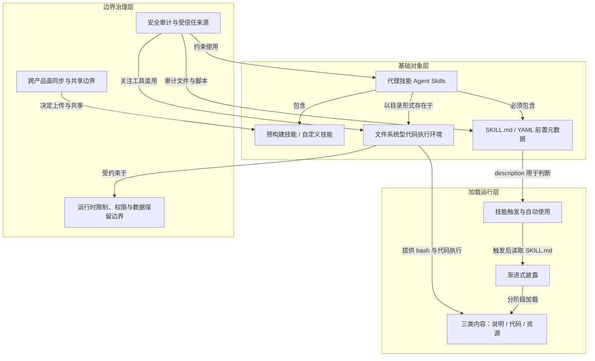

# 概念解析辞典

> 针对《Using Agent Skills with the API（用 API 使用 Agent Skills）》（Claude Platform Docs，platform.claude.com）的概念提取

## 一、核心概念

### 1. **代理技能（Agent Skills）**

- **context**：

  > 代理技能是扩展 Claude 功能的模块化功能。每个技能都包含指令、元数据和可选资源（脚本、模板），Claude 会在需要时自动使用这些资源。

  > 技能是基于文件系统的可重用资源，赋予 Claude 特定领域的专业知识：工作流程、上下文和最佳实践，使通用代理转变为专家。与提示（针对一次性任务的对话级指令）不同，技能按需加载，因此您无需在不同的对话中重复相同的指导。

- **费曼一下**：本文把“技能”定义为一种可复用、基于文件系统的能力包，而不是一次性的对话提示。技能里可以放指令、元数据和脚本模板，Claude 在相关任务出现时自动加载。它解决的是“通用代理如何变成特定领域专家”和“如何不重复写同一套指导”的问题。全文的加载方式、文件结构、共享模型、安全边界都围绕这个对象展开。

### 2. **预构建技能与自定义技能（Pre-built vs Custom Skills）**

- **context**：

  > Anthropic 提供预置的代理技能，用于处理常见的文档任务（PowerPoint、Excel、Word、PDF），您也可以创建自定义技能。两者的工作方式相同：一旦技能在您的环境中可用，Claude 就会在与您的请求相关时自动使用它。

  > 自定义技能可让您将领域专业知识和组织经验打包在一起。它们适用于 Claude 的所有产品：您可以在 Claude Code 中创建自定义技能，通过 Claude API 上传，或在 claude.ai 设置中添加。

- **费曼一下**：技能按来源分成两类：Anthropic 提供的预构建文档技能，以及用户自己打包组织经验的自定义技能。关键点是，两类技能在运行方式上没有区别；一旦进入某个环境，Claude 都会在相关时自动使用。但它们的来源、上传方式和后续的共享范围不同，这会影响“谁能用、在哪里用”。

### 3. **SKILL.md 与 YAML 前置元数据（SKILL.md / YAML frontmatter）**

- **context**：

  > Every Skill requires a SKILL.md file with YAML frontmatter

  > Required fields: name and description

  > The description must include both what the Skill does and when Claude should use it.

  > name:
  >  Maximum 64 characters
  >  Must contain only lowercase letters, numbers, and hyphens
  >  Cannot contain XML tags
  >  Cannot contain reserved words: "anthropic", "claude"
  > description:
  >  Must be non-empty
  >  Maximum 1024 characters
  >  Cannot contain XML tags

- **费曼一下**：SKILL.md 是每个技能的入口文件，YAML 前置元数据是技能的“发现层”。其中 `name` 和 `description` 是必需字段，而 `description` 必须同时说明技能做什么、Claude 什么时候该用它。原因是 Claude 靠这段元数据判断是否触发技能。元数据之外的 SKILL.md 正文才承载具体工作流程和指南。字段限制则构成技能定义文件的边界。

### 4. **技能触发与自动使用（Skill Triggering / Automatic Use）**

- **context**：

  > Claude 会根据此元数据来判断是否触发技能，因此它必须同时说明技能的功能和使用时机。

  > 当您请求的内容与技能描述相符时，Claude 会使用 bash 从文件系统中读取 SKILL.md 文件。只有这样，该文件的内容才会显示在上下文窗口中。

  > 一旦技能在您的环境中可用，Claude 就会在与您的请求相关时自动使用它。

- **费曼一下**：技能不是用户每次手动挑选的，而是 Claude 根据请求与 `description` 的匹配情况自动触发。触发之后，Claude 才会用 bash 读取 SKILL.md，把正文指令带进上下文。这个机制解释了为什么描述必须同时写“功能”和“使用时机”：描述本身就是触发判断的依据。

### 5. **渐进式披露（Progressive Disclosure）**

- **context**：

  > 这种基于文件系统的架构实现了渐进式披露： Claude 根据需要分阶段加载信息，而不是预先获取上下文。

  > Level 1: Metadata Always (at startup) ~100 tokens per Skill name and description from YAML frontmatter
  > Level 2: Instructions When Skill is triggered Under 5k tokens SKILL.md body with instructions and guidance
  > Level 3+: Resources As needed None until accessed Bundled files. Reference files load into context when read. Scripts run through bash, and only their output enters context

  > Progressive disclosure ensures only relevant content occupies the context window at any given time.

- **费曼一下**：渐进式披露是技能节省上下文的核心机制。技能不是一启动就把全部内容塞进上下文，而是分层加载：启动时只有元数据，触发后才读 SKILL.md 正文，资源文件被引用时才读取，脚本则只把输出带进上下文。这样即使安装很多技能，也只有当前相关的内容占用上下文窗口。

### 6. **三类内容：说明、代码、资源（Instructions, Code, Resources）**

- **context**：

  > 技能可以包含三种类型的内容，每种内容的加载时间都不同：

  > 说明：包含专门指导和工作流程的附加 Markdown 文件（FORMS.md、REFERENCE.md）

  > 代码： Claude 使用 bash 运行的可执行脚本（fill_form.py、validate.py），无需将代码加载到上下文中即可提供确定性操作。

  > Resources: Reference materials such as database schemas, API documentation, templates, or examples

  > The filesystem model means each content type has different strengths: instructions for flexible guidance, code for reliability, resources for factual lookup.

- **费曼一下**：技能内部不是只有一段说明，而是分成三类内容。说明适合灵活指导；代码通过 bash 执行，只把输出带进上下文，因此可靠且省 token；资源是数据库结构、API 文档、模板、示例等事实材料，被引用时才读取。这个分类决定了每种内容如何加载、为什么能节省成本，以及它们在技能里各自承担什么角色。

### 7. **文件系统型代码执行环境（Filesystem-based Code Execution Environment）**

- **context**：

  > Skills 利用 Claude 的虚拟机环境，提供仅凭提示无法实现的功能。Claude 在具有文件系统访问权限的虚拟机中运行，使得 Skills 可以以目录的形式存在，其中包含指令、可执行代码和参考资料，其组织方式类似于您为新团队成员创建的入职指南。

  > Skills run in a code execution environment where Claude has filesystem access, bash commands, and code execution capabilities. Skills exist as directories on a virtual machine, and Claude interacts with them using the same bash commands you'd use to navigate files on your computer.

  > When a Skill is triggered, Claude uses bash to read SKILL.md from the filesystem, bringing its instructions into the context window.

- **费曼一下**：技能不是纯文本提示，而是放在虚拟机目录里的文件包。Claude 在这个环境中有文件系统访问、bash 命令和代码执行能力，可以像人操作电脑文件一样读取 SKILL.md、引用其他文件、运行脚本。这个环境解释了技能为什么能包含脚本和资源，也解释了为什么脚本代码本身不必进入上下文，只有输出会进入。

### 8. **跨产品面的同步与共享边界（Surface-specific Sync and Sharing）**

- **context**：

  > Custom Skills do not sync across surfaces. Skills uploaded to one surface are not automatically available on others:
  > Skills uploaded to claude.ai must be separately uploaded to the API
  > Skills uploaded through the API are not available on claude.ai
  > Claude Code Skills are filesystem-based and separate from both claude.ai and API

  > Skills have different sharing models depending on where you use them:
  > claude.ai: Individual user only. Each team member must upload separately.
  > Claude API: Workspace-wide. All workspace members can access uploaded Skills.
  > Claude Code: Personal (~/.claude/skills/) or project-based (.claude/skills/). Can also be shared through Claude Code Plugins.

  > claude.ai does not support centralized admin management or org-wide distribution of custom Skills.

- **费曼一下**：技能在不同产品面之间不会自动同步。上传到 claude.ai 的技能不会自动出现在 API，API 上传的也不会出现在 claude.ai，Claude Code 的技能则基于文件系统，和两者分开。共享范围也不同：claude.ai 是个人级，API 是工作区级，Claude Code 是个人或项目级。理解“技能在哪里可用、谁能看到”必须看这个边界，不能假设一次上传处处可用。

### 9. **运行时限制、权限与数据保留边界（Runtime Limitations, Constraints, and Retention）**

- **context**：

  > The exact runtime environment available to your Skill depends on the product surface where you use it.

  > Claude API: No network access: Skills cannot make external API calls or access the internet. No runtime package installation: Only pre-installed packages are available. You cannot install new packages during execution.

  > claude.ai: Varying network access: Depending on user/admin settings, Skills may have full, partial, or no network access.

  > Claude Code: 完全网络访问权限： Skills 与用户计算机上的任何其他程序具有相同的网络访问权限。不建议进行全局软件包安装： Skills 应该只在本地安装软件包，以避免干扰用户的计算机。

  > Agent Skills is not covered by ZDR arrangements. Skill definitions and execution data are retained according to Anthropic's standard data retention policy.

- **费曼一下**：技能能做什么，取决于它在哪个产品面运行。API 是沙箱，不能访问网络，也不能在运行时安装新包；claude.ai 的网络权限可能完整、部分或没有；Claude Code 有完整网络权限，但原文不建议全局安装软件包。数据保留方面，Agent Skills 不在 ZDR 覆盖范围内，技能定义和执行数据按标准数据保留政策保留。这些限制决定技能是否可规划、能否联网、能否装包，以及数据如何被保留。

### 10. **安全审计与受信任来源（Security Considerations / Trusted Sources）**

- **context**：

  > Use Skills only from trusted sources: those you created yourself or obtained from Anthropic. Skills give Claude new capabilities through instructions and code, which also means a malicious Skill can direct Claude to invoke tools or execute code in ways that don't match the Skill's stated purpose.

  > If you must use a Skill from an untrusted or unknown source, exercise extreme caution and thoroughly audit it before use. Depending on what access Claude has when executing the Skill, malicious Skills could lead to data exfiltration, unauthorized system access, or other security risks.

  > Key security considerations:
  > Audit thoroughly: Review all files bundled in the Skill: SKILL.md, scripts, images, and other resources. Look for unusual patterns such as unexpected network calls, file access patterns, or operations that don't match the Skill's stated purpose
  > External sources are risky: Skills that fetch data from external URLs pose particular risk, as fetched content may contain malicious instructions. Even trustworthy Skills can be compromised if their external dependencies change over time
  > Tool misuse: Malicious Skills can invoke tools (file operations, bash commands, code execution) in harmful ways
  > Data exposure: Skills with access to sensitive data could be designed to leak information to external systems
  > Treat like installing software: Be especially careful when integrating Skills into production systems with access to sensitive data or critical operations

- **费曼一下**：安全边界来自技能能通过指令和代码给 Claude 新能力。恶意技能可能让 Claude 以不符合声明目的的方式调用工具、执行代码，导致数据外泄或未授权访问。本文把技能当作要安装的软件来对待，强调来源可信，并要求审计技能包中的所有文件，包括 SKILL.md、脚本、图片和其他资源。外部 URL 风险、工具滥用、数据暴露是这条防御结构里的几个关键边界。

## 二、概念架构图

