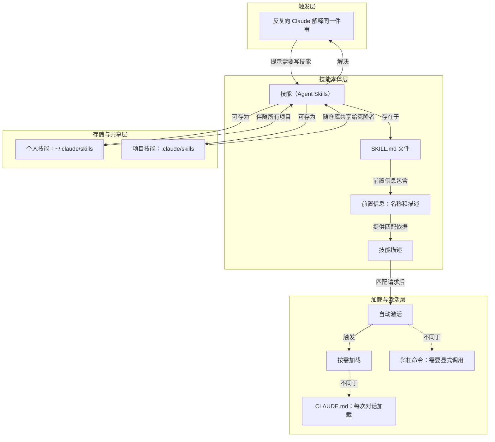

# 概念解析辞典

> 针对《Claude 官方课程 · 第 1 课：什么是 Agent Skills》（Claude Academy，academy.claude.com）的概念提取

## 一、核心概念

### 1. **技能（Agent Skills）**

- **context**：课程先给出技能的定义，再说明它作为 Markdown 文件所解决的问题。

  > 技能是 Claude Code 可以发现和使用的指令文件夹，用于更准确地处理任务。每个技能都存在于一个SKILL.md文件中，其前端包含名称和描述。

  > 技能是一个 Markdown 文件，它教会 Claude 如何做某事一次。之后，Claude 会在需要时自动应用这些知识。

- **费曼一下**：在本文里，技能就是把重复要解释的做事方式封装起来，让 Claude Code 能发现、匹配并在需要时自动应用的专业指令包。它是全文的中心对象：后面讲的存储位置、描述、加载方式、手动调用对比，都是为了说明这个指令包如何工作。

### 2. **SKILL.md 与前置信息**

- **context**：课程说明技能的物理载体和内部结构：前置信息放名称与描述，正文放实际说明。

  > 每个技能都存在于一个SKILL.md文件中，其前端包含名称和描述。

  > 以下是技能的前置信息示例：

  > 在前言下方，你可以写出实际的说明——你的审阅清单、格式偏好，或者克劳德需要知道的关于该任务的任何信息。

- **费曼一下**：SKILL.md 是技能的文件形态。它上面有前置信息，至少包含名称和描述；下面是真正的任务说明，比如审阅清单或格式偏好。这个结构很重要，因为 Claude 一开始只用前置信息来发现和匹配技能，不必先加载完整正文。

### 3. **技能描述**

- **context**：课程把技能描述说成 Claude 决定是否使用技能的依据。

  > 技能描述是克劳德决定是否使用该技能的依据。当你请求克劳德审核PR时，它会将你的请求与可用的技能描述进行匹配，找到相关的技能。克劳德会阅读你的请求，将其与所有可用的技能描述进行比较，并激活匹配的技能。

  > 克劳德会根据技能描述来匹配你的请求。当你请求克劳德做某事时，他会将你的请求与可用的技能描述进行比较，并激活匹配的技能。

- **费曼一下**：技能描述不是技能正文，而是让 Claude 判断“这个请求该不该用这个技能”的匹配依据。用户发出请求后，Claude 把请求与可用技能描述比较，匹配成功才激活技能。没有清楚描述，自动匹配就无法可靠发生。

### 4. **按需加载**

- **context**：课程通过与 CLAUDE.md 的每次加载对比，说明技能何时进入上下文。

  > 技能按需加载——与CLAUDE.md（每次对话都会加载）或斜杠命令（需要显式调用）不同，当克劳德识别到相应情况时，技能会自动激活。

  > 技能会在与您的请求匹配时按需加载。Claude 最初只会加载名称和描述，因此不会占据整个上下文窗口。您的 PR 审核清单在您调试时无需显示在上下文中——它会在您实际请求审核时加载。

- **费曼一下**：按需加载是技能的上下文策略。Claude 最初只加载名称和描述，只有当请求匹配时，才加载技能正文。它不同于 CLAUDE.md 那种每次对话都加载的方式，因此能让很多专业知识存在，而不会一直占满上下文窗口。

### 5. **自动激活**

- **context**：课程用斜杠命令作为对照，说明技能不需要手动调用。

  > 技能按需加载——与CLAUDE.md（每次对话都会加载）或斜杠命令（需要显式调用）不同，当克劳德识别到相应情况时，技能会自动激活。

  > 斜杠命令需要你手动输入，而技能则不需要。克劳德会在识别到相应情况时自动应用技能。

- **费曼一下**：自动激活是技能的触发方式。用户不必像使用斜杠命令那样手动输入；Claude 识别到相应情况后会自动应用技能。它和斜杠命令的边界在于：斜杠命令靠显式调用，技能靠识别与匹配后自动触发。

### 6. **个人技能与项目技能**

- **context**：课程按存储位置区分两种技能作用域，并说明它们的共享边界。

  > 个人技能会~/.claude/skills伴随你参与所有项目。项目技能则会存储.claude/skills在代码仓库中，并与所有克隆该仓库的用户共享。

  > 个人技能记录在~/.claude/skills你的主目录中。这些技能会贯穿你所有的项目——包括你的提交信息风格、文档格式以及你喜欢的代码解释方式。

  > 项目技能放在.claude/skills代码仓库的根目录下。任何克隆该仓库的人都会自动获得这些技能。团队标准也放在这里，例如公司的品牌指南、首选字体和网页设计颜色。

  > 项目技能会与代码一起提交到版本控制系统中，以便整个团队共享。

- **费曼一下**：个人技能保存在用户主目录，跟随个人跨项目使用，适合个人偏好；项目技能保存在代码仓库中，随版本控制提交，克隆仓库的人会自动获得，适合团队标准。这个区分决定技能的共享范围：个人范围还是项目/团队范围。

### 7. **反复解释同一件事**

- **context**：课程把这个现象当作判断技能是否该写的经验法则。

  > 如果你发现自己反复向克劳德解释同一件事，那说明你还有待提高这方面的技能。

  > 每次你向 Claude 解释团队的编码规范时，你都在重复自己。每次 PR 审查，你都要重新描述你希望反馈的结构。每次提交信息，你都要提醒 Claude 你偏好的格式。技能可以解决这个问题。

  > 经验法则很简单：如果你发现自己反复向克劳德解释同一件事，那么这项技能就需要写出来。

- **费曼一下**：在本文中，反复解释同一件事不是普通抱怨，而是创建技能的触发信号。它把“为什么需要技能”具体化了：同一类说明、审查结构、格式偏好如果每次都重复，就可以封装成技能，让 Claude 之后自动应用。

## 二、概念架构图

图按触发、技能本体、加载与激活、存储与共享四层组织；CLAUDE.md 与斜杠命令作为加载和激活的边界对照出现。

