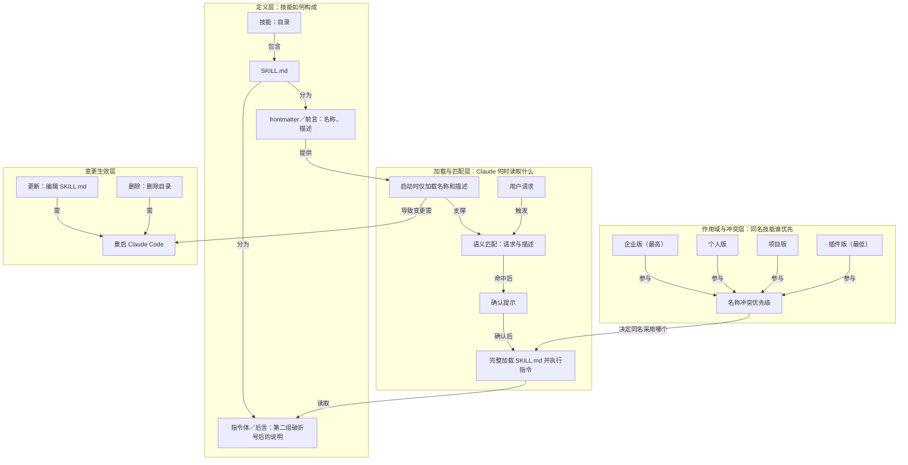

# 概念解析辞典

> 针对《Claude 官方课程 · 第 2 课：技能的结构（SKILL.md 与 frontmatter）》（Claude Academy，academy.claude.com）的概念提取

## 一、核心概念

### 1. **技能与 SKILL.md 结构（Skill / SKILL.md）**

- **context**：材料先给出技能的最小结构：一个目录，以及其中 SKILL.md 的两段划分。

  > 技能是一个目录，其中包含一个SKILL.md文件，该文件的前言部分包含元数据（名称、描述），后言部分包含说明。

  > 第二组破折号之后的所有内容是克劳德激活技能后需要执行的指令。

- **费曼一下**：在本文里，技能不是一段单独的提示词，而是一个目录加一个入口文件 SKILL.md。SKILL.md 又分成两段：前面放元数据，也就是名称和描述；后面放说明，也就是 Claude 激活技能后要执行的指令。名称用来标识技能，描述用来后续匹配；说明不是启动时就读，而是匹配确认后才执行。拿掉这个结构，后面“只加载名称和描述”“第二组破折号后是指令”都无从理解。

### 2. **名称与描述（name / description）**

- **context**：材料明确区分了名称和描述各自的作用。

  > 技能名称代表你的技能。技能描述告诉克劳德何时使用该技能——这是匹配条件。

  > 当你发送请求时，Claude 会将你的消息与所有可用技能的描述进行比对。例如，“解释这个函数的作用”会匹配到“用图表解释代码”这项技能，因为它们的意图有所重叠。

- **费曼一下**：名称和描述不是同一类东西。名称是技能的身份标识，用来在列表、冲突优先级里识别技能。描述是匹配条件，告诉 Claude 什么时候该使用这个技能。用户请求不是直接匹配完整技能内容，而是先匹配描述，而且匹配是语义上的，允许意图重叠。所以描述写的是使用场景，不是技能内容摘要。这个区分是本文匹配机制的核心。

### 3. **启动时仅加载名称和描述**

- **context**：材料反复强调启动阶段只读取轻量元数据，不读取完整内容。

  > Claude在启动时仅加载技能名称和描述，然后使用语义匹配将传入的请求与这些描述进行匹配。

  > Claude Code启动时，会扫描四个位置的技能，但只会加载技能名称和描述，而非完整内容。这是一个重要的细节。

- **费曼一下**：Claude Code 启动时会扫描技能所在位置，但只把技能名称和描述放进可用列表，不把每个 SKILL.md 的完整说明塞进上下文。完整说明要等某个请求匹配到技能后才可能加载。因此启动阶段很轻，匹配阶段依赖描述。这个设计也解释了为什么技能文件改动后需要重启才生效。

### 4. **匹配后的确认与完整加载**

- **context**：材料说明匹配命中之后，还有一个确认步骤，然后才读取完整 SKILL.md。

  > 在克劳德将全部技能内容加载到上下文之前，你会收到一个确认提示。

  > 找到匹配项后，克劳德会要求你确认加载技能。这个确认步骤能让你了解克劳德正在获取哪些上下文信息。确认后，克劳德会读取整个SKILL.md文件并执行其中的指令。

- **费曼一下**：语义匹配成功不等于立即执行。Claude 会先要求确认；确认前，完整技能内容还没有进入上下文。确认后，整个 SKILL.md 才被读取，里面的指令才被执行。这个确认提示是加载机制的边界：用户能知道 Claude 将要获取哪些技能内容。

### 5. **名称冲突优先级与技能作用域**

- **context**：材料先给出完整冲突顺序，后面又列出企业级、个人、插件的位置和优先级。

  > 名称冲突优先级：企业版 → 个人版 → 项目版 → 插件版

  > 企业级— 管理设置，最高优先级 
  > 个人— 您的主目录 ( ~/.claude/skills) 
  > 插件— 已安装的插件，优先级最低

  > 如果贵公司已有企业级“代码审查”技能，而您又创建了一个同名的个人“代码审查”技能，则企业级版本优先。

- **费曼一下**：同名技能不是简单由后来者覆盖，而是按作用域排优先级。材料顶部给出的完整顺序是企业版最高，其后是个人版、项目版，插件版最低；后面的局部列表再次明确企业级最高、插件最低，并把个人技能定位在主目录。这样企业可以用企业级技能强制执行标准，个人定制不能覆盖企业版本。理解这个优先级，才能判断同名技能最终哪个生效。材料后面的局部列表没有列出项目版，但顶部顺序已经把项目版放在个人版之后、插件版之前。

### 6. **技能变更生效条件：编辑、删除、重启**

- **context**：材料说明如何更新和删除技能，并点明改动要生效必须重启。

  > 要更新技能，请编辑其配置SKILL.md文件。要删除技能，请删除其配置文件目录。请务必重启 Claude Code以使更改生效。

  > Claude Code 会在启动时加载技能，因此创建技能后请重启游戏。

- **费曼一下**：技能不是热更新对象。改技能就是改它的 SKILL.md；删技能就是删目录。因为 Claude Code 在启动时加载技能，所以创建、修改、删除后都要重启 Claude Code 才生效。这个操作边界直接来自前面的启动加载机制。

## 二、概念架构图

