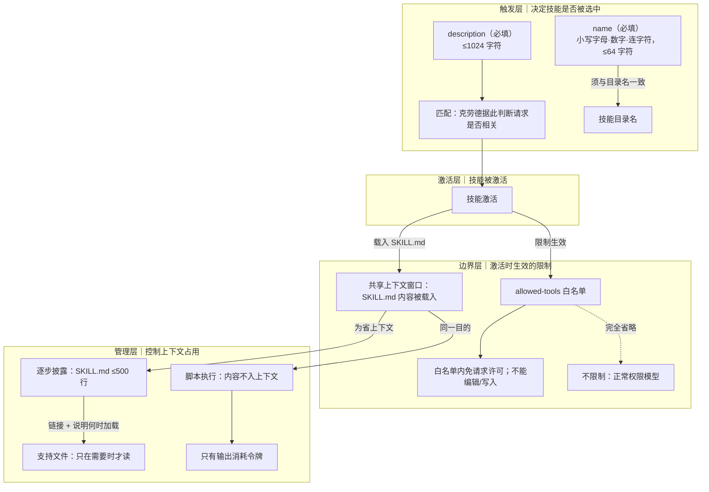

# 概念解析辞典

> 针对《Claude 官方课程 · 第 3 课：写好 name 与 description》（Claude Academy，academy.claude.com）的概念提取

## 一、核心概念

### 1. **name（必填字段）**

- **context**：课程标题把 name 与 description 并列，字段清单里它排在第一位。

  > 名称（必填）— 用于标识您的技能。仅使用小写字母、数字和连字符。最多 64 个字符。名称应与您的目录名称一致。

- **费曼一下**：name 解决的是"这个技能叫什么、放在哪个目录下"的身份问题：必填，只能用小写字母、数字和连字符，最长 64 字符，并且必须和技能所在目录同名。它管的是标识，不管触发——正文把"最重要"的判语留给了 description，因为真正决定技能会不会被用上的是描述匹配。

### 2. **description（必填字段）**

- **context**：作者用两条规则加一条排查办法说明它。

  > 描述（必填）— 告诉克劳德何时使用该技能。最多 1024 个字符。这是最重要的字段，因为克劳德会用它来进行匹配。

  > 好的描述应该回答两个问题：这项技能有什么作用？克劳德应该在什么情况下使用它？

  > 如果你的技能没有在预期的时间触发，请尝试添加更多与你实际请求措辞相匹配的关键词。克劳德会根据描述来判断技能是否相关，所以措辞很重要。

  写作原则上，作者用一句模糊指令作反例：

  > 指示要明确。如果有人告诉你"你的工作是帮忙处理文件"，你肯定不知道该怎么做——克劳德也是这么想的。

- **费曼一下**：description 是克劳德做匹配的依据：它拿当前请求去比对描述，判断这个技能相不相关，从而决定是否启用。因此它必须回答两个问题——技能有什么作用、克劳德应在什么情况下用它；上限 1024 字符。它还连着一条排查规则：技能没在预期时机触发，就往描述里补上与真实请求措辞一致的关键词。写法上不要写"帮忙处理文件"这类含糊指令，要说清楚具体做什么。

### 3. **allowed-tools（可选字段）**

- **context**：它被定位为一条权限边界，并配了正反两种情形。

  > allowed-tools（可选）— 限制克劳德在技能激活时可以使用的工具。

  > allowed-tools限制克劳德在技能激活时可以使用的工具——适用于只读或对安全性要求较高的工作流程。

  示例中白名单为 Read、Grep、Glob、Bash：

  > 当这项技能激活时，克劳德无需请求许可即可使用这些工具——不能编辑，也不能写作。

  > 如果完全省略allowed-tools，该技能不会限制任何内容。克劳德使用其正常的权限模型。

- **费曼一下**：这是技能激活期间的权限白名单。列进去的工具可以免许可直接调用；列不进去的能力（编辑、写入）在这个技能里被挡死。反向边界同样重要：完全省略该字段就等于不设限，克劳德回到正常权限模型。作者把它推荐给只读任务、高安全要求或需要设护栏的工作流程。

### 4. **共享上下文窗口（技能激活即载入 SKILL.md）**

- **context**：它被直接放在"逐步披露"之前，作为后者的起因。

  > 技能会与你的对话共享克劳德的上下文窗口。当克劳德激活一个技能时，它会将该技能的 SKILL.md 文件内容加载到上下文中。

- **费曼一下**：技能不在真空中生效——它和当前对话抢同一个上下文窗口，一旦激活，整份 SKILL.md 就被加载进来。理解这一点才能理解后面两个做法为什么存在：正因为 SKILL.md 会占上下文，才需要限制它的行数、才需要把细节挪到别处、才需要脚本只交输出。

### 5. **逐步披露（progressive disclosure）**

- **context**：作者先说明把所有内容堆在一个文件里的代价，再给出做法和经验边界。

  > 逐步披露：将 SKILL.md 文件控制在 500 行以内，并链接到 Claude 仅在需要时才阅读的支持文件（参考资料、脚本、资源）。

  > 将所有内容塞进一个 2000 行的文件中有两个问题：它会占用大量的上下文窗口空间，而且维护起来很麻烦。

  > 将必要的说明保留在 SKILL.md 文件中，并将详细的参考资料放在单独的文件中，Claude 只在需要时才阅读。

  > 在这个例子中，Claudearchitecture-guide.md只会在有人询问系统设计时才会读取文件。如果他们问的是在哪里添加组件，它就不会加载该文件。这就像在上下文窗口中显示的是目录，而不是整个文档。

  > 一个好的经验法则是：SKILL.md 文件最好控制在 500 行以内。如果超过这个限制，请考虑是否将内容拆分成单独的参考文件。

- **费曼一下**：把技能分成两层：SKILL.md 只保留必要说明，并附上指向支持文件的链接和"何时加载它"的清晰说明；详细参考资料、脚本、资源各放单独文件，Claude 只在该内容真的相关时才去读。它同时解两个问题——上下文被大文件占满、文件难维护。经验边界是 SKILL.md 不超过 500 行，超了就拆成单独的参考文件。效果被作者形容为：上下文里看到的是目录，而不是整份文档。

### 6. **脚本执行（不入上下文）**

- **context**：与"逐步披露"并列的另一条省上下文机制。

  > 脚本执行时无需将其内容加载到上下文中——只有输出会消耗令牌，从而保持上下文的高效性。

  > 技能目录中的脚本无需加载其内容即可运行。脚本执行后，只有输出会消耗令牌。SKILL.md 文件中的关键指令是告诉 Claude 运行脚本，而不是读取脚本。

- **费曼一下**：脚本是"运行"的对象，不是"阅读"的对象：它不必被读进上下文就能执行，执行完只有输出消耗令牌。因此 SKILL.md 里的写法关键是让克劳德去运行脚本，而不是去读取脚本内容。边界在于——省掉的是脚本正文进入上下文，而不是省掉脚本本身。

## 二、概念架构图

