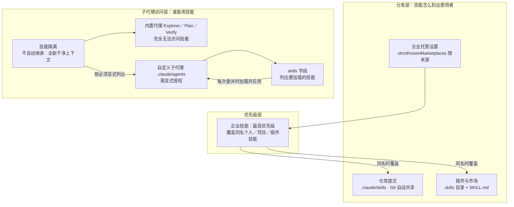

# 概念解析辞典

> 针对《Claude 官方课程 · 第 5 课：技能的分发与共享》（academy.claude.com｜Claude Academy）的概念提取

## 一、核心概念

### 1. **仓库提交（.claude/skills 中的项目技能）**

- **context**：作者把它列为"最简单的共享方法"，共享的载体就是代码仓库本身。

  > .claude/skills 中的项目技能会通过 Git 自动共享——任何克隆该仓库的人都会获得这些技能

  > 最简单的共享方法是将技能直接提交到您的仓库。将它们放在 .claude/skills 中，任何克隆该仓库的人都会自动获得这些技能——无需额外安装。

  > 当您推送更新时，每个人在下次拉取时都会获得这些更新。

- **费曼一下**：这条路把技能当成仓库里的普通文件——技能跟着 Git 走，没有第二条分发通道。克隆即获得，不装任何东西；推送更新后，别人下次拉取就同步。它界定的机制边界是"零安装、零额外渠道、随版本控制"，所以作者称它最简单，也是项目专属技能的自然归宿。

### 2. **插件与市场（Plugin / Marketplace）**

- **context**：三种方法中范围居中、面向社区的一种，作者给出了目录结构约定与适用判断。

  > 插件是一种通过自定义功能扩展 Claude Code 的方式，旨在跨团队和项目共享。在您的插件项目中，创建一个遵循与 .claude 目录类似文件结构的 skills 目录——每个技能都有自己的文件夹，里面包含一个 SKILL.md 文件。

  > 在您将插件分发到市场后，其他用户可以自行发现并将其安装到 Claude Code 中。

  > 当您的技能不是过于特定于某个项目，并且对直接团队以外的社区成员也有用时，这种方法是最佳选择。

- **费曼一下**：插件把技能从单个仓库里解放出来。它的目录结构模仿 `.claude`（一个 skills 目录，每个技能一个文件夹，内含 SKILL.md），但分发不走仓库，而走市场：别人自己发现、自己安装。作者给的适用标准是"技能对直接团队以外的人也有用"——反过来说，过度绑定某个项目的技能就不该走这条路。

### 3. **企业托管设置（Managed Settings）与 strictKnownMarketplaces**

- **context**：由管理员部署，作用范围是整个组织，并附带一个控制插件来源的配置项。

  > 管理员可以通过托管设置在整个组织范围内部署技能。企业技能具有最高优先级——它们会覆盖同名的个人、项目和插件技能。

  > 托管设置文件支持诸如 strictKnownMarketplaces 之类的功能，用于控制可以从哪里安装插件：

  > ```
  > "strictKnownMarketplaces": [
  >  {
  >  "source": "github",
  >  "repo": "acme-corp/approved-plugins"
  >  },
  >  {
  >  "source": "npm",
  >  "package": "@acme-corp/compliance-plugins"
  >  }
  > ]
  > ```

  > 对于必须在整个组织中保持一致的强制性标准、安全要求、合规工作流程和编码实践，这是正确的选择。这里的关键词是"必须"。

- **费曼一下**：这条路的推动者不是使用者而是管理员：技能由托管设置统一下发到整个组织。它有两个机制要点：一是优先级最高（见下一条），二是 `strictKnownMarketplaces` 限定了插件只能从白名单来源安装——它管的不是技能内容，而是"允许从哪里拿插件"这道准入闸门。作者把判断标准压缩成一个词："必须"——只有强制性标准、安全要求、合规工作流程和编码实践才值得动用这一层。

### 4. **企业技能的最高优先级（同名覆盖）**

- **context**：原文在介绍企业部署时直接给出的冲突裁决规则。

  > 企业技能具有最高优先级——它们会覆盖同名的个人、项目和插件技能。

- **费曼一下**：它解决的理解难点是"同名技能谁说了算"。答案是：当个人、项目、插件、企业各存在一份同名技能时，企业版生效，其余被覆盖。（原文只交代了企业技能对其他三类的覆盖，没有进一步说明这三者彼此之间的次序。）正因为有这条强制覆盖，企业托管才可能承载"强制性标准"——否则组织无法保证所有人跑的是同一套规则。

### 5. **子代理的技能隔离（子代理不自动继承技能）**

- **context**：作者点明这是全文最反直觉的一点，并给出了原因。

  > 有一件事会让人感到意外：子代理不会自动看到您的技能。当您将任务委派给子代理时，它会以全新、干净的上下文开始。

  > 子代理不会自动看到您的技能——您必须在自定义代理的前置元数据 skills 字段中明确列出技能

- **费曼一下**：委派任务时，子代理是从"全新、干净的上下文"起步的，所以主会话里能用的技能，它默认一个也看不到。这不是配置失误，而是默认规则——也正因为是默认规则，后面的自定义子代理才必须显式写 `skills` 字段。这条是理解"为什么还要多做一步配置"的前提。

### 6. **内置代理与自定义子代理的技能访问边界**

- **context**：作者把"能不能用技能"分成两类代理来讲，其中内置代理是一条硬边界。

  > 内置代理（Explorer、Plan、Verify）完全无法访问技能——只有在 .claude/agents 中定义的自定义子代理才可以

  > 您定义的自定义子代理可以使用技能，但只有在您明确列出它们时才可以

- **费曼一下**：内置代理（Explorer、Plan、Verify）对技能是"完全无法访问"，这是一道靠配置打不开的硬边界；有资格使用技能的只有写在 `.claude/agents` 里的自定义子代理，而且还得满足"明确列出"这个条件。这条边界决定了"给代理配技能"这件事的有效范围：不是给任意代理加配置，而是专门走自定义子代理这条路。

### 7. **skills 字段（前置元数据中的显式授权）**

- **context**：这是让自定义子代理真正拿到技能的具体机制，作者给出了创建方式与文件样例。

  > 要创建带有技能的自定义子代理，请在 .claude/agents 中添加一个代理 markdown 文件。您可以使用 Claude Code 中的 /agents 命令以交互方式创建一个：

  > 生成的代理文件包含一个 skills 字段，列出要加载的技能。以下是前置元数据的样子：

  > ```
  > ---
  > name: frontend-security-accessibility-reviewer
  > description: "Use this agent when you need to review frontend code for accessibility..."
  > tools: Bash, Glob, Grep, Read, WebFetch, WebSearch, Skill...
  > model: sonnet
  > color: blue
  > skills: accessibility-audit, performance-check
  > ---
  > ```

  > 当您委派给这个子代理时，它会加载这两项技能，并将它们应用于每次审查。首先确保这些技能存在于您的 .claude/skills 目录中，然后创建一个新的子代理，或将 skills 字段添加到现有代理的 markdown 文件中。

  > 您希望在委派的工作中强制执行标准，而不依赖于提示

- **费曼一下**：`skills:` 这一行就是隔离规则的解药——只有在自定义子代理的前置元数据里点名写出技能，它才会加载，并在每次被委派时都应用。它的前置条件是技能已存在于 `.claude/skills`；操作上可以用 `/agents` 交互生成，也可以往已有的代理 markdown 里补字段。作者点出它的价值在于"强制执行标准，而不依赖于提示"：把规则沉淀成技能并绑定到代理上，比每次在提示里重申更可靠。

## 二、概念架构图



图中三层的划分依据是功能角色：分发层决定技能以何种渠道、何种范围到达使用者；优先级层裁决同名冲突；子代理访问层处理"委派出去的工作能不能用上技能"。企业托管设置单独指向优先级层，是因为它同时具备部署方式与最高优先级两重身份。
