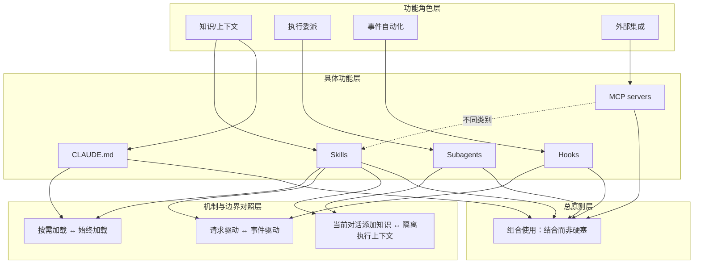

# 概念解析辞典

> 针对《Claude 官方课程 · Skills 与其他 Claude Code 功能的比较》（Claude Academy，academy.claude.com）的概念提取

## 一、核心概念

### 1. **Skills（按需加载的特定任务专业知识）**

- **context**：原文把 Skills 放在与其他 Claude Code 功能的对照中定义，核心是加载时机、触发方式和作用位置。

  > Skills 按需加载，最适合用于特定任务的专业知识

  > 当 Claude 将某个请求与某个 skill 匹配时，该 skill 的指令就会加入对话。当您在编写新代码时，您的 PR 审查清单并不需要出现在上下文中——它只在您请求审查时才会激活。

  > Skills 会为您当前的对话添加知识。当某个 skill 激活时，其指令会加入现有的上下文。

  > Skills 是请求驱动的。它们根据您的请求内容激活。

- **费曼一下**：在本文里，Skills 不是始终存在的规则，也不是独立执行环境。它是特定任务的知识包，平时不进入上下文，只有当请求与某个 skill 匹配时才被激活，并把指令加入当前对话。它解决的是“有些专业知识只在某些情况下才相关，不该让每次对话都变杂乱”的问题，也是全文比较其他功能的中心参照物。

### 2. **CLAUDE.md（始终加载的项目标准）**

- **context**：原文用 CLAUDE.md 代表“每次对话都生效”的那一类自定义方式。

  > CLAUDE.md 会加载到每次对话中，最适合用于始终生效的项目标准。

  > 如果您希望 Claude 在您的项目中使用 TypeScript 严格模式，请将其写入您的 CLAUDE.md 文件。

  > 始终适用的项目级标准；诸如“永远不要修改数据库架构”之类的约束；框架偏好和编码风格

- **费曼一下**：CLAUDE.md 在本文中指始终装入每次对话的项目级标准和约束，例如 TypeScript 严格模式、框架偏好、不能修改数据库架构这类规则。它的关键是“始终生效”，因此适合不管请求内容是什么都必须成立的要求；这与 Skills 的“按需激活”形成边界对照。

### 3. **Subagents（隔离的执行上下文）**

- **context**：原文用 Subagents 代表与当前对话隔离的委派执行方式。

  > Subagents 在隔离的执行上下文中运行——用于委派工作。Skills 则为您当前的对话添加知识

  > 它们接收一个任务，独立完成工作，然后返回结果。它们与主对话是隔离的。

  > 您需要与主对话不同的工具访问权限

- **费曼一下**：Subagents 在本文里不是给当前对话补充知识，而是拿到一个任务，在独立、隔离的上下文中完成，再把结果返回。它可以有不同的工具访问权限，作用是把委派工作与主上下文隔开。理解这个边界，才能区分“增强当前对话的知识”和“把工作交出去执行”。

### 4. **Hooks（事件驱动）**

- **context**：原文用 Hooks 代表由系统事件触发、而不是由请求内容触发的自动化。

  > Hooks 是事件驱动的（在文件保存、工具调用时触发）。Skills 是请求驱动的（根据您的请求内容激活）

  > 某个 hook 可能会在 Claude 每次保存文件时运行代码检查工具，或在特定工具调用之前验证输入。它们是事件驱动的。

  > 应在每次文件保存时运行的操作；特定工具调用之前的验证；Claude 操作的自动化副作用

- **费曼一下**：Hooks 在本文中指在文件保存、工具调用这类事件发生时自动运行的操作，例如每次保存都跑代码检查、在工具调用前验证输入。它不是根据用户请求内容来激活知识，而是在特定动作或事件上执行自动化。它和 Skills 的关键区别是触发机制：事件驱动，而不是请求驱动。

### 5. **MCP servers（外部工具和集成）**

- **context**：原文强调 MCP servers 与 Skills 不属于同一类别，避免把它们混为一谈。

  > MCP servers 提供外部工具和集成——这与 skills 完全是不同的类别

  > MCP 提供外部工具。

- **费曼一下**：MCP servers 在本文里负责外部工具和集成，是另一类能力来源，不是用来给当前对话注入任务知识的。理解这一点，读者才不会把“接入外部工具”误当成“写一个 skill”，也才能看清为什么作者说每种功能各有专长。

### 6. **按需加载与始终加载（加载模型）**

- **context**：这是原文区分 Skills 与 CLAUDE.md 的核心机制。

  > CLAUDE.md 会加载到每次对话中，最适合用于始终生效的项目标准。Skills 按需加载，最适合用于特定任务的专业知识

  > 当您在编写新代码时，您的 PR 审查清单并不需要出现在上下文中——它只在您请求审查时才会激活。

- **费曼一下**：这一对概念讲的是内容什么时候进入上下文。始终加载适用于任何请求都必须遵守的标准；按需加载适用于只在某些情况下才相关的知识。PR 审查清单在写新代码时不需要占用上下文，所以适合放进 skill；TypeScript 严格模式则适合放进 CLAUDE.md。它是判断某个内容该放哪里的边界规则。

### 7. **请求驱动与事件驱动（触发模型）**

- **context**：这是原文区分 Skills 与 Hooks 的核心机制。

  > Hooks 是事件驱动的（在文件保存、工具调用时触发）。Skills 是请求驱动的（根据您的请求内容激活）

  > Skills 是请求驱动的。它们根据您的请求内容激活。

  > Hooks 在事件发生时触发。

- **费曼一下**：这一对概念讲的是“什么导致功能被激活”。Skills 由请求内容匹配触发；Hooks 由文件保存、工具调用等事件触发。因此，影响 Claude 如何处理请求的知识适合做成 skill，而每次保存都要执行的操作、工具调用前的验证适合做成 hook。它决定了自动化的边界在哪里。

### 8. **功能组合（结合使用，而非硬塞）**

- **context**：这是原文最后给出的总体配置原则，把前面所有功能组织成一个方案。

  > 每个功能都各有专长——将它们结合使用，而不是把所有事情都硬塞进一种方案中

  > 每种功能都各有专长。当其他选项更合适时，不要把所有事情都硬塞进 skills 中——而且您可以同时使用多种功能。

  > 一个典型的配置可能包括：CLAUDE.md —— 始终生效的项目标准；Skills —— 按需加载的特定任务专业知识；Hooks —— 由事件触发的自动化操作；Subagents —— 用于委派工作的隔离执行上下文；MCP servers —— 外部工具和集成

- **费曼一下**：在本文里，功能组合不是简单罗列工具，而是作者的结论：Claude Code 的这些自定义选项解决不同问题，所以应根据每种功能的专长分别使用，再组合成一个完整配置。它防止读者把所有需求都塞进 Skills，也把前面各个概念收束成一个整体框架。

## 二、概念架构图

