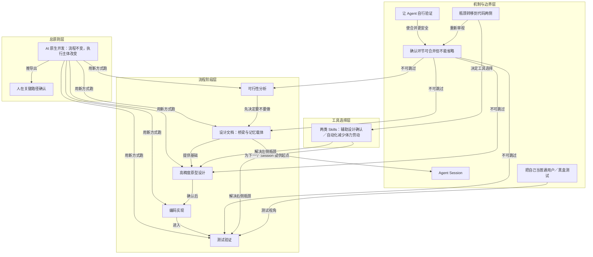

# 概念解析辞典

> 针对《我的 AI 原生开发流程：一个真实案例的完整复盘》（宝玉，baoyu.io）的概念提取

## 一、核心概念

### 1. **AI 原生开发（AI-native development）**

- **context**：作者先纠正常见理解，再给出贯穿全文的总定义。

  > AI 原生开发，本质上还是传统的软件开发流程——可行性分析、方案设计、原型设计、编码实现、测试验证。这些步骤一个都没少。
  >
  > AI 原生开发不是发明了一套新流程，而是用新的方式跑旧的流程。

- **费曼一下**：在本文里，AI 原生开发不是让 AI 写代码的同义词，也不是一套全新流程。它指旧的软件开发流程照跑，但每个环节的执行方式和承担者变了。它是全文的起点，因为只有先接受这个定义，读者才会把注意力从编码移到代码之外。

### 2. **执行主体从人变成 Agent**

- **context**：作者说明流程中真正变化的是什么。

  > 变的是什么？执行主体。
  >
  > 以前每个环节都是人亲手干。现在，人变成了指挥官，Agent 变成了执行者。人只在关键路径上做确认和决策，但具体的分析、设计、编码、调试，全部交给 Agent 去执行。

- **费曼一下**：流程步骤没变，但具体做分析、设计、编码、调试的人不再是人，而是 Agent。人升到指挥官位置。这个概念承重，因为后面讲的确认合并、文档桥梁、瓶颈转移，都是执行主体改变后的结果。

### 3. **人在关键路径确认**

- **context**：作者用一个具体模式解释人的新角色。

  > 注意这里的模式：Agent 做分析和罗列方案，人做最终判断和拍板。这就是“人在关键路径确认”的含义——你不需要自己去研究每个技术方案的细节，但你需要基于自己的产品判断和技术直觉做最终决策。

- **费曼一下**：人不是全程不参与，也不是全程亲手做；只在决定做不做、选哪个方向、交互是否友好、能不能用等关键节点拍板。它定义了人不可替代的判断力边界。

### 4. **可行性分析**

- **context**：作者把它称为最不该跳过的一步，并说明它看两个层面。

  > 这是整个流程中最容易被跳过、但最不该被跳过的一步。
  >
  > 它是一个期望值的赌注：大部分时候能帮你避开弯路，偶尔也会看走眼。
  >
  > 可行性分析通常看两个层面：
  > 产品角度：这个功能有没有价值？和 App 的定位是不是匹配？
  > 技术角度：技术上能不能做到？成本是不是可控？

- **费曼一下**：先决定要不要做，再进入设计和编码。产品角度看价值与定位，技术角度看可行与成本。它不是不出错的保险，而是期望值下减少更多坑的关卡。它是流程第一关，也是后面所有工作的前提。

### 5. **设计文档（桥梁与记忆载体）**

- **context**：作者重新定义文档在 AI 时代的角色。

  > 文档在 AI 时代有了全新的角色，它是人和 Agent 之间、以及 Agent 和 Agent 之间的桥梁。
  >
  > 换句话说，文档是 AI 原生开发中的“记忆载体”。
  >
  > 确认后的文档，就是下一个 Agent Session 的全部起点。

- **费曼一下**：传统文档可能是写完就过时的负担；本文里文档是核心中间物。人靠它确认和修改方案，Agent Session 靠它继承前一个 Session 的决策和上下文。没有它，人无法高效确认，Agent 也无法跨阶段接力。

### 6. **Agent Session**

- **context**：作者用 Session 的上下文限制说明文档为何成为记忆载体。

  > 每一个 Agent Session 的上下文窗口是有限的，当你从“设计”进入“开发”，往往是一个新的 Session。前一个 Session 的思考过程、决策依据、技术方案，都需要通过文档传递给下一个 Session。没有文档，下一个 Session 就是从零开始。

- **费曼一下**：Agent Session 是一次上下文有限的工作会话。阶段切换常开新 Session，旧 Session 的记忆不会自动延续。文档因此成为跨 Session 传递上下文的载体。它是理解文档作用的机制性概念。

### 7. **高精度原型设计**

- **context**：作者认为这是 AI 原生开发中变化最大的环节之一。

  > 在 AI 的加持下，这三者可以合并成一个步骤——高精度原型设计。什么意思？就是你做出来的原型，不是线框图，而是接近最终成品的高保真设计，直接包含了交互逻辑和视觉设计。
  >
  > 原型设计阶段的修改成本相对很低，而做出真正的产品后再改成本就很高了。

- **费曼一下**：把需求、原型、UI 设计合成一步，产出接近成品、包含交互和视觉的高保真原型。AI 把过去成本极高的事变快。它让确认环节可以合并，也让修改发生在低成本阶段。

### 8. **让 Agent 自行验证**

- **context**：作者把它作为减少人类介入次数的关键技巧。

  > 让 Agent 自行验证，可以减少你需要介入的次数。
  >
  > 相当于给 Agent 一个自己的反馈循环，让它在你看到结果之前先自己检查一遍。
  >
  > 这也是为什么合并一些确认环节（比如跳过 Code Review 直接黑盒测试）相对是安全的

- **费曼一下**：Agent 写代码后自己跑测试、调试、截图确认，形成内部反馈循环。人拿到的不是粗糙初稿，而是已自检结果。它解释了为什么可以合并确认而不牺牲太多质量。

### 9. **确认环节可以合并，但不能省略**

- **context**：作者把它列为三个本质变化之一，并划出边界。

  > 变化二：确认环节可以合并，但不能省略
  >
  > 但确认环节本身绝对不能省。
  >
  > 你可以加速确认（合并环节、简化流程），但不能跳过确认。人的判断力是整个流程中不可替代的部分。

- **费曼一下**：需求、原型、UI 等确认可以合并成一次，流程可以简化；但可行性、技术方向、原型／UI、测试这些确认不能取消。它划出 AI 原生开发中可优化和绝对禁止的边界。

### 10. **瓶颈转移到代码两侧**

- **context**：作者用这个判断重新分配流程注意力。

  > 代码已经不是瓶颈了。
  >
  > 瓶颈转移到了代码两侧：左边是设计和确认，右边是测试、验证和部署。
  >
  > 这些环节仍然在以人类速度运行，它们才是现在需要优化的地方。

- **费曼一下**：编码被 Agent 加速后，不再是拖慢流程的中心。真正慢的是编码前的设计确认和编码后的测试验证部署。它是全文重新分配注意力的框架，也解释为什么重点谈可行性、原型和测试。

### 11. **把自己当普通用户／黑盒测试**

- **context**：作者说明测试阶段的关键心态，也给出这种取舍的边界。

  > 关键心态转变：把自己当普通用户，而不是开发者。
  >
  > 你要问我有没有 Review 代码？没有。我把自己当成 QA，只做了黑盒测试，我信任 Fable 5 的编码能力。
  >
  > 当然，这个取舍取决于项目的重要程度。如果是金融系统的核心逻辑，你可能还是需要 Code Review。

- **费曼一下**：测试时不按开发者的预期路径走，要假装第一次用，凭直觉乱点、输入意外内容。作者自己只做黑盒测试，不逐行 Review；但这不是绝对规则，核心系统仍可能要 Code Review。它说明测试确认的用户视角，以及合并确认的安全边界。

### 12. **两类 Skills（辅助设计确认／自动化减少体力劳动）**

- **context**：作者给出一个反直觉结论，并说明它和瓶颈的关系。

  > 我的答案可能会出乎意料：大部分开发类 Skills 是没必要的。
  >
  > 我一般只用两类 Skills，恰好对应这两个瓶颈：
  >
  > 第一类是辅助设计确认的——解决左侧瓶颈。
  >
  > 第二类是自动化减少体力劳动的——解决右侧瓶颈。

- **费曼一下**：作者不靠大量编码类 Skills，因为模型编码已足够好。只用两类：帮助左侧设计确认，如高精度原型工具；帮助右侧自动化，如部署发布。它是瓶颈转移后的工具选择结论。

## 二、概念架构图

按功能角色分层：总原则层说明整体判断，流程阶段层呈现旧流程，机制与边界层解释 AI 原生开发如何运转，工具选择层对应瓶颈两侧的 Skills。边只表示原文能支持的关系。

