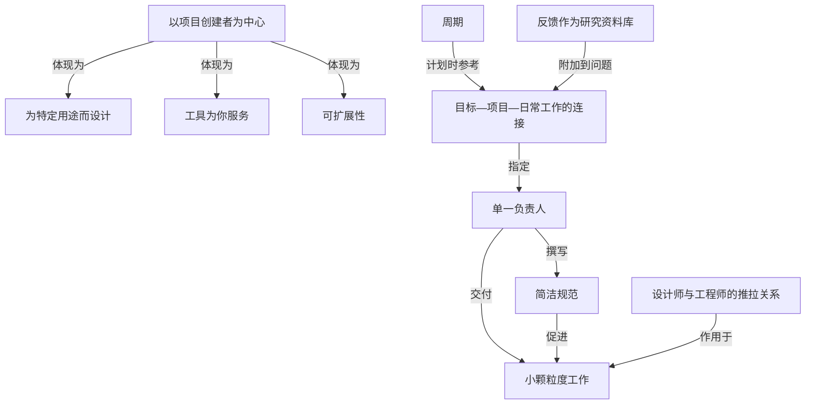

# 概念解析辞典

> 针对《原则与实践（Linear 的产品原则）》（linear.app）的概念提取

## 一、核心概念

### 1. **以项目创建者为中心（最终用户）**

- **context**：

  > 软件项目管理工具的设计应该以最终用户（即项目创建者）为中心。保持个人高效工作比生成完美的报告更重要。

- **费曼一下**：这是全文的出发点。工具为谁而造？作者的回答是"做活的人"——即创建项目的那个人，而不是查看报告的管理者。它决定了衡量标准：个人能否高效工作，优先于报表是否漂亮。拿掉这一条，后面"简洁""小颗粒度""工具为你服务"都会失去依据。

### 2. **为特定用途而设计（反对过度灵活）**

- **context**：

  > 生产力软件必须根据特定用途进行设计。只有这样，产品才能真正发挥其应有的作用。过于灵活的软件允许每个人自行创建工作流程，但随着团队规模的扩大，最终会导致混乱。

- **费曼一下**：作者把"灵活"当成陷阱而非优点。人人自建流程在小团队里没问题，但规模一上来就变成混乱。这是全文里少见的"边界性"判断：好工具应当收窄可能性，围绕特定用途把一件事做对，而不是什么都能改。理解它才能明白为什么 Linear 主张固定流程、固定用词。

### 3. **周期（Cycle）**

- **context**：

  > 周期性的工作安排能够建立健康的日常流程，并让团队专注于下一步需要完成的工作。在软件开发中，两周周期最为常见。这个周期既足够短，不会忽略其他优先事项，又足够长，可以构建重要的功能。周期应该合理。不要让每个周期都塞满任务，未完成的任务应该自动进入下一个周期。

- **费曼一下**：周期是让节奏落地的机制。它解决"什么时候重新排优先级、下一步做什么"的问题。边界很明确：两周——短到不会漏掉其他优先事项，长到能做出真功能；而且是软边界，未完成的任务自动滚入下一周期，避免每个周期都被塞死。这套"既…又…"的取舍是承重部分。

### 4. **目标—项目—日常工作的连接**

- **context**：

  > 将日常工作与更大的目标联系起来，并通过项目来实现这些目标。

  > 所有项目和工作都应与这些目标直接相关。在项目启动会议上审查项目及其目标日期，并在制定周期计划时参考项目内容。

- **费曼一下**：这是把"远大目标"和"今天在干什么"缝在一起的结构。目标是方向，项目是抓手，日常工作通过项目挂到目标上——而不是各自漂浮。作者还给出操作点：启动会上审目标日期、排周期计划时回看项目。承重之处在于它回答了"怎么保证琐碎工作不偏离长期方向"。

### 5. **工具为你服务，而非你为工具服务**

- **context**：

  > 工具不应该让你成为它们的开发者和维护者。工具应该为你服务，而不是你为工具服务。移除或自动化那些"变通之法"，这样你才能专注于真正重要的事情。

- **费曼一下**：这是一条关于人与工具关系的原则。判断标准是：你在用工具做事，还是在花时间伺候工具本身？作者给的机制动作是"移除或自动化变通之法"——那些为了将就工具而发明的绕路操作，本身就是信号，说明工具没服务好你。它承接了"以创建者为中心"的立场。

### 6. **单一负责人（Owner）**

- **context**：

  > 每个项目都应该指定一位负责人，负责撰写项目简报并交付成果。同样的原则也适用于问题处理。即使涉及其他人，责任也应该由一个人承担。

- **费曼一下**：责任不摊薄到团队，而是收束到一个人身上：写简报、交成果。作者强调"即使涉及其他人"也由一个人负责——区分了"参与"和"负责"。它是项目能否被推动的关键机制，也是后面"简报""小颗粒度交付"的执行主体。

### 7. **简洁规范（项目简报）**

- **context**：

  > 力求简洁。简短的规范更容易被阅读。规范的目的是向团队其他成员简要传达项目的"为什么"、"是什么"和"如何做"。理想情况下，这些简短的文档能够促使团队明确工作范围，从而清晰地划分优先级，避免团队开发错误的东西。

- **费曼一下**：规范的价值在短，不在全。它只回答三个问题——为什么做、做什么、怎么做。作者把"简洁"当成强制划范围的手段：正因为写不下细节，团队才被迫把范围想清楚，进而排好优先级、避免做错东西。它是"单一负责人"的产物。

### 8. **分解为小颗粒度工作**

- **context**：

  > 处理大型任务时，很难看到明显的进展，这可能会打击积极性。尽可能将工作分解成更小的部分，并为每个部分创建一个问题。理想情况下，每周可以完成几个具体的任务。将问题标记为已完成会带来成就感。

  > 判断某项工作是否完成的最直接方法是查看代码或设计文件中的差异。当任务范围较小时，你的修改也会较小，更容易审查。

- **费曼一下**：把大任务切小，有两个作用：一是让人看得见进展、获得完成感、维持动力；二是让审查变容易——小任务对应小 diff，小改动好审。作者用"查看差异"作为判断完成的最直接办法，反过来要求改动别太大。这条机制同时服务于动力和可审查性。

### 9. **反馈作为研究资料库**

- **context**：

  > 产品越受欢迎，收到的反馈就越多。邮箱爆满是个好兆头（除非是bug报告）。收集用户反馈，并将其作为开发新功能的研究资料库。尝试发现趋势。将请求和反馈附加到相关问题中，让客户的声音直接融入产品开发。阅读反馈，即使是抱怨，也是了解用户并打造他们真正需要的产品的好机会。

- **费曼一下**：反馈不是待办债务，而是研究材料。作者要的不是逐条满足，而是"发现趋势"，并把请求挂到相关问题里，让用户的声音直接进入开发过程。这解释了为什么"重要的请求会再次出现"，也说明为什么不必无限期保存所有请求——只留能形成趋势的部分。

### 10. **可扩展性**

- **context**：

  > 团队规模不同，需求也不同。一款好的工具应该易于上手，并能随着团队规模的扩大而不断增强功能。

- **费曼一下**：工具要在两端都成立——小团队上手容易，团队变大后功能还能跟上。这条与"为特定用途设计"配套：既不能灵活到失控，也不能僵化到撑不住增长。它是判断一款工具好坏的规模维度。

### 11. **设计师与工程师的推拉关系**

- **context**：

  > 设计师和工程师应该在项目中通力合作，形成自然的推拉关系。设计师运用他们的技能探索创意，推动团队的思考。工程师则着眼于实施方案，挑战既有的思维模式，并将最终的创意变为现实。优秀的创造者往往兼具这两种才能。

- **费曼一下**：这是两种角色在项目中的协作模型——设计师往前推（探索创意、推动思考），工程师往回拉（盯可行性、挑战思路、把想法落地）。作者强调这种张力是"自然的推拉"，而非谁服从谁，并且最好的创造者两种能力兼具。它为"项目怎么被做出来"补上人的维度。

## 二、概念架构图

材料本身是一份并列的原则清单，多数条目平行铺开；下图只保留原文能支持的分层与关系，边标注的是原文给出的关系（如"撰写""附加到""参考"）。其余并列原则不再强行连边。

