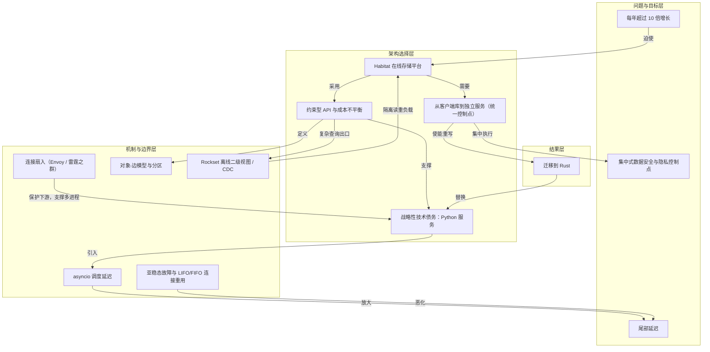

# 概念解析辞典

> 针对《Rapidly scaling online storage to serve over 1 billion ChatGPT users（存储平台 Habitat 的扩容复盘）》（openai.com｜OpenAI）的概念提取

## 一、核心概念

### 1. **每年超过 10 倍增长**

- **context**：文章用常规系统扩容节奏作对照，给出全文的背景约束。

  > 通常，系统工程师会以 10 倍的规模进行构建，并希望它能维持几年，同时为下一个 10 倍的增长做好准备。而我们，在过去三年中，每年都实现了超过 10 倍的增长。

- **费曼一下**：这是全文的问题设定。Habitat 不是在一个稳定规模上慢慢优化，而是每年规模增长超过 10 倍，所以团队必须在超增长过程中同时建设平台。这个约束解释了后文为什么会出现战略性技术债务、服务化、约束 API 和快速重写等选择。

### 2. **Habitat（在线存储平台）**

- **context**：文章先定义 Habitat 的定位和规模，再说明它从简单库演化成分布式系统。

  > Habitat 是我们构建的在线存储平台，旨在让 OpenAI 产品能够快速可靠地访问所需信息。Habitat 目前每秒处理超过 7000 万个请求，为每周超过 10 亿用户使用的产品提供支持，覆盖近 40 个地理区域。
  >
  > Habitat 最初于 2023 年的 DevDay 大会上发布，旨在支持 GPT 模型，最初只是一个简单的 Python 客户端库，连接到单个数据库。如今，它已发展成为一个复杂的分布式系统，能够处理超过 500 PB 的数据。

- **费曼一下**：Habitat 是 OpenAI 产品与底层存储之间的平台。产品工程师不必关心数据库管理、路由、授权、加密、序列化、请求整形和连接池等问题。全文讨论的扩容、服务化、Python 性能、API 约束、Rust 重写，都是围绕 Habitat 如何从一个 Python 库长成大规模在线存储平台展开的。

### 3. **从客户端库到独立服务（统一控制点）**

- **context**：客户端库变更需要协调数十个服务，最终迫使 Habitat 解耦为独立服务。

  > 到 2025 年年中，Habitat 作为客户端实现已达到其极限。
  >
  > 通过将存储逻辑解耦为独立服务，我们建立了一个统一的控制点，用于部署、可观测性和平台增强。

- **费曼一下**：原先把 Habitat 做成客户端库时，任何改动都要推动许多产品服务一起部署、回滚和上线，协调成本高且脆弱。把存储逻辑变成独立服务后，部署、观测和平台增强集中在一个控制点，改进可以立即惠及所有 OpenAI 产品。这是全文架构转折点。

### 4. **集中式数据安全与隐私控制点**

- **context**：服务化不仅解决部署问题，也建立统一的安全和权限边界。

  > 集中式服务为我们提供了一个统一的控制点，从而能够提供最强大的数据安全和隐私保护机制。通过 Habitat 服务，我们可以集中执行访问控制策略、执行审计日志记录，并限制对底层存储资源（例如 Azure Cosmos DB）的访问。

- **费曼一下**：Habitat 作为独立服务后，访问控制策略、审计日志和对底层存储资源的访问限制都集中在一层执行。这样，外部、内部和代理的未授权访问都要先经过 Habitat 的权限边界。拿掉这个控制点，读者就无法理解服务化在安全与隐私上的承重作用。

### 5. **约束型 API 与成本不平衡**

- **context**：Habitat 故意限制 API 能力，让请求成本可预测，避免 SQL 式成本不对称。

  > One reason we could scale Python this far was Habitat’s constrained API, which keeps request cost predictable.
  >
  > The problem here is in cost imbalance: it is cheap and easy to write SQL queries that are expensive and hard to run. In Habitat, we avoid this and make expensive queries exceedingly obvious client-side.
  >
  > 我们旨在优化简单、可预测、恒定工作量的请求。

- **费曼一下**：写一条 SQL 查询很便宜，但让它高效运行可能很贵；一条热路径上的昂贵查询就可能拖垮数据库。Habitat 不开放任意 SQL，而提供简单 NoSQL API，使请求成本可预测、工作量恒定。这个约束是 Python 服务能扩展到很大规模的原因之一，也是 Habitat 设计中的明确取舍。

### 6. **对象-边模型与分区**

- **context**：约束型 API 的具体数据形态是客户端定义的对象和边，像图但不支持典型图遍历。

  > Habitat exposes a NoSQL API modeled around client-defined object and edge types, inspired by TAO. Clients predefine objects and edges and how they relate to each other, but not the content of each type. The resulting relationships resemble a graph, but Habitat itself does not support typical graph traversal queries outside of querying direct edges of a particular object.
  >
  > We partition this graph so that each object and its corresponding edges are colocated in a storage-level partition, but we make no concerted database-level effort to colocate objects and the remote objects to which their edges point.

- **费曼一下**：Habitat 的数据模型像图：客户端预先定义对象和边，但只能查某个对象的直接边，不支持典型图遍历。分区时，每个对象和它的边放在同一存储分区，便于水平扩展；但不保证远程对象也同区，所以跨对象跳转可能跨区域，图遍历效率低。这解释了约束 API 的边界在哪里。

### 7. **Rockset 离线二级视图（CDC 逃生舱）**

- **context**：复杂查询不直接压在线 Habitat，而是通过 CDC 同步到隔离的 Rockset 实例。

  > For clients with more complex querying needs, we do provide an offline secondary view of Habitat exposed via Rockset. We use change data capture (CDC) to stream changes from the online storage out to isolated Rockset instances in near-real-time.
  >
  > making simple queries the default while providing an escape hatch for those who need complex queries.

- **费曼一下**：Habitat 把简单查询作为默认路径，复杂查询通过变更数据捕获同步到隔离 Rockset 实例，由客户团队自行扩展。这样在线存储与读很重的分析、搜索负载隔离开来。它是约束型 API 的配套逃生舱，防止复杂查询破坏在线存储的可预测性。

### 8. **战略性技术债务：Python 服务**

- **context**：团队明知 Python 高吞吐服务有性能代价，仍暂时选择它，以先解决更紧迫问题，并赌未来能重写。

  > 我们当时将此视为一种战略性的技术债务承担。我们的首要目标并非成本或资源优化，而是为产品开发人员扫清障碍，实现平台稳定性。
  >
  > 我们还做出了一个经过深思熟虑的赌注：我们自身编码模型的快速发展将在未来简化技术路径。我们预测，到需要完全从 Python 迁移的时候，Codex 和 GPT 将会使这种迁移成为可能。最终，这个赌注被证明是正确的。

- **费曼一下**：用 Python 跑高吞吐服务会增加网络延迟、CPU 和内存成本，100 倍规模下几乎肯定要重写。但团队优先建立核心 API 和基础设施，把性能优化延后，作为战略性技术债务。这个选择是理解为何 Habitat 先用 Python、后来又迁移到 Rust 的关键。

### 9. **asyncio 调度延迟与尾部延迟**

- **context**：Habitat 的请求由大量数据库调用组成，用户感受到的是最慢那次；Python 的 asyncio 调度延迟会放大尾部延迟。

  > 当平均每个用户请求都会导致数百次数据库调用时，用户感受到的延迟往往是最慢的那次。我们发现，在这种规模下运行 Python 服务的主要挑战在于如何管理这些尾部延迟。
  >
  > 由于我们的服务中包含大量 CPU 密集型工作负载和后台任务，asyncio 调度延迟很容易导致尾部请求延迟过高。

- **费曼一下**：一个用户请求可能触发数百次数据库调用，总体验由最慢的调用决定，这就是尾部延迟。Python 的 asyncio 能并发处理 I/O，但不能绕过 GIL 提供 CPU 并行性；CPU 密集任务会让事件循环上其他协程等待，产生调度抖动，放大尾部延迟。因此 Habitat 限制每个进程并发请求数，并大规模扩展 Python 工作进程。

### 10. **亚稳态故障与 LIFO/FIFO 连接重用**

- **context**：突发流量移除后，部分进程仍持续过载，直到重启；根因是连接池的 LIFO 重用形成反馈循环。

  > 尽管我们停止了导致部分服务过载的客户端，但部分进程在突发流量过后仍然处于降级状态。事实上，我们注意到这些进程出现了失控降级，接收到的请求越来越多，直到我们重启它们为止。一旦某个 Pod 过载，某些行为就会将更多流量集中到过载的 Pod 上。我们的一些团队成员在之前的工作中已经熟悉这类故障：亚稳态故障。
  >
  > Python 的 aiohttp TCPConnector 默认采用后进先出 (LIFO) 的连接重用机制：即选择最近返回的连接用于下一个请求。
  >
  > 在请求激增期间，对速度较慢、负载过重的服务器的请求会稍后才将连接返回到连接池，因此后续请求会更频繁地选择这些连接，从而逐渐将更多流量集中在已经不堪重负的 Pod 上。将连接池修改为使用先进先出 (FIFO) 的连接重用机制打破了这种反馈循环，甚至还降低了我们稳定状态下的请求波动。

- **费曼一下**：亚稳态故障是指外部触发压力消失后，系统仍卡在坏状态。这里，慢 Pod 最后才把连接归还连接池，而 LIFO 又优先重用最近归还的连接，于是后续请求更频繁地打向慢 Pod，流量越来越集中。FIFO 打破这个正反馈，使连接和工作负载更公平地分配。它是理解连接池为什么会影响尾部延迟和稳定性的机制边界。

### 11. **连接扇入（Envoy / 雷霆之群）**

- **context**：大量 Python 进程会带来过多连接，可能压垮下游；Habitat 用 Envoy 做连接扇入、多路复用和集中限流。

  > 调整为降低 asyncio 延迟并拥有如此多的 Python 进程的一个副作用是，很容易使下游依赖项被大量的连接压垮（被称为“雷霆之群”）。
  >
  > We also rely on Envoy to maximize our connection fan-in. We use it to upgrade Python’s HTTP/1 connections to HTTP/2 to take advantage of multiplexing and then to pool those connections and extend connection lifetimes. Envoy also gives us a central place to implement rate limits and circuit breakers that would be less effective in each standalone Python process.

- **费曼一下**：为了降低 asyncio 延迟，Habitat 增加了很多 Python 进程，但进程一多，连接数会暴涨，容易形成雷霆之群，压垮下游依赖或 NAT 网关。Envoy 把 HTTP/1 连接升级为 HTTP/2，利用多路复用、连接池和更长连接寿命，把相同请求合并到更少连接上，并集中实现限流和熔断。它保护下游，也支撑了 Python 服务的大规模进程模型。

### 12. **迁移到 Rust（Python→Rust）**

- **context**：平台成熟后，团队借助 Codex 和 GPT-5.5 将整个服务重写为 Rust。

  > In Q2 2026, with just 2 engineers, Codex, and GPT‑5.5, we were able to rewrite the entire service in Rust. This new Rust service is now handling 95% of our production requests; we’ll be deprecating Python entirely in the coming weeks. Our data shows the Rust service is 6x more CPU efficient and 15x more memory efficient than the Python version, with significantly lower average and tail latencies.

- **费曼一下**：这是战略性技术债务的收束。平台成熟、增长继续加速，团队终于把 Python 服务重写为 Rust。两名工程师借助 Codex 和 GPT-5.5 完成整个服务重写，Rust 服务处理 95% 生产请求，并且 CPU 效率、内存效率和延迟都显著优于 Python。它验证了先前“未来编码模型会让迁移成为可能”的赌注。

## 二、概念架构图

