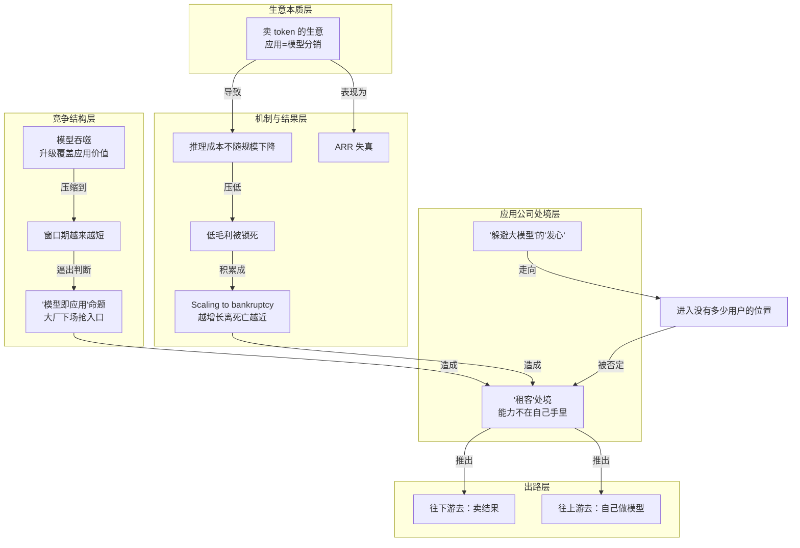

# 概念解析辞典

> 针对《有用户，有收入，AI 应用却不是好生意》（晚点团队）的概念提取

## 一、核心概念

### 1. **卖 token 的生意**

- **context**：文章用它重新定义 AI 应用公司的本质——不是在经营可持续的软件订阅，而是在做模型能力的分销。

  > 他说，所有 AI 应用本质上都在卖 token，"你拿几个大客户， annualized 了一下不就 1000 万了吗？"

  > 卖 token、做大模型的分销商，起量确实快。

- **费曼一下**：作者把一个流传的说法拆开：AI 应用明面上是卖软件，实际上是从模型公司买入推理能力、加价卖给用户。所以它的收入更像电商的 GMV（流水），而不是传统软件那种"客户会一直续费的订阅收入"。这个概念是全文的支点——一旦承认应用只是在"卖货"，那么收入越大、交给上游的钱越多，规模本身就失去了意义。

### 2. **ARR（年度经常性收入）的失真**

- **context**：原文先指出 ARR 曾是 AI 应用唯一的成功标志，再拆解它如何被放大，最后用续约率对照说明它为什么不可靠。

  > ARR 一度是 AI 应用公司唯一的 "成功" 标志，Kuse 也曾引以为豪。

  > 一位投资人见过很多把 ARR 做大的荒谬算法：把难以持续一次性收入、或某个月收到的年费乘以 12，写成年化收入；更夸张的，取一年里最高一天或一周的收入，乘以 365 或 52。

  > "典型的 SaaS，你这个月付款的人，下个月 95% 还会付款，所以它确实是 recurring。现在的 AI 应用是 coding plan ，续约率会远低于传统的 SaaS。"

- **费曼一下**：ARR 本来指"可反复、稳定收到的年收入"，但在 AI 应用里这个词被玩坏了——把一次性收入、甚至最高一天的流水乘一乘，就吹成"年化千万"。加上 AI 应用续约率远低于 SaaS，这个数字既不可重复、也不可持续。理解这个概念的失真，才能明白为什么文中的"有收入"并不等于"是好生意"。

### 3. **推理成本锁死毛利**

- **context**：原文用传统 SaaS 作对照，说明 AI 时代成本结构发生了什么根本变化。

  > 传统 SaaS 时代，一个产品被市场验证后，通常可以放心扩大规模，因为新增用户带来的服务器成本很低。到了 AI 时代，被验证和成为一门可持续的生意成了两件事：用户可能愿意用、愿意付费，但每次使用都会产生推理成本，这笔成本不会随增长下降，毛利始终压在低位。

  > 美国老牌风险投资机构 Bessemer 曾研究过 20 家高速增长的 AI 公司……但平均毛利只有约 25%；传统云软件成熟期的毛利通常在 70% 左右。

- **费曼一下**：这是全文最硬的机制边界。传统软件多一个用户几乎不增加成本，所以规模越大越赚钱；AI 应用每被用一次，就要为模型推理和云服务付一次钱，这笔钱不随规模摊薄。于是"用户愿意付费"和"公司能赚钱"被切成了两件事，毛利被结构性锁在低位。拿掉这一条，读者就无法理解文章为什么说"被验证"和"可持续"是两回事。

### 4. **Scaling to bankruptcy**

- **context**：作者借用一句话概括 AI 应用的增长悖论，并用 Kuse 压低增长作为实例。

  > 他认同 Fireworks CEO Lin Qiao 对初创公司处境的概括——"scaling to bankruptcy"：越增长，离死亡越近。

- **费曼一下**：这句话字面意思是"扩张到破产"。它把前两条概念（卖 token、成本锁死毛利）推到极端：在成本不随规模下降的结构里，用户增长不但不救公司，反而加速烧钱。"越增长越接近死亡"是文章的判断核心，也是理解 Kuse 为何主动压低增长、OiiOii 为何不再看日活的关键。

### 5. **模型吞噬**

- **context**：原文用 Devv、AI 写作、工作流等案例，反复展示模型升级如何拿走应用的核心价值。

  > 模型每释放一种新能力，都会催生一批产品，也会在下一次升级时拿走其中一批的核心价值。

  > 对独立应用公司来说，模型的吞噬不是瞬间发生的。三家公司转向时，原产品都还没归零。创业者失去的不是眼前的用户，而是未来的可能；他们必须跑得更快，才有下一次机会。

- **费曼一下**：这不是"应用明天就死"，而是一种缓慢的抽空：模型每次升级，就把一批应用原本赖以生存的功能变成模型自带的能力。创业者丢掉的当下用户可能不多，丢的是"这条路还能走多久"的未来。作者用 a16z 榜单里 50 名中只有 14 家常驻、Epoch AI 估算的模型能力加速曲线来支撑这个判断。

### 6. **窗口期**

- **context**：原文用多个具体时间跨度，量化"被模型吞掉"的速度。

  > 张佳圆原本预计持续一两年的搜索阶段只维持了半年，市场直接跳过第二阶段、进入自动化开发。"没有想到它来得那么快。"

  > 张佳圆后来判断，这个方向真正可行的窗口只有 2024 年 9 月至 11 月

  > 但一个月后，Skill 开始在 Agent 产品中流行，逐渐成为标准配置。这个工作流上线后再去融资，投资人已经认为 "Skill 会替代 Workflow"。他拿不到下一轮了。

- **费曼一下**：窗口期是一个应用"还能独立存在并被验证"的时间长度。文章的关键观察是它越来越短：从一年、半年，缩到两三个月，甚至一个月。窗口期短到积累不了足够的用户习惯、使用频率和收入，应用就逃不出模型的引力。它把"模型吞噬"从抽象威胁变成了可计数的时间约束，是理解创业者频繁转向的机制边界。

### 7. **"模型即应用"**

- **context**：这是作者借创业者之口提出的核心命题，也是全文判断的分水岭。

  > 他认为，唯一关键的问题是："模型即应用" 是否成立？

  > 2025 年 3 月，Manus 上线、突然爆火，创始人肖弘一句 "壳有壳的价值" 曾经否定这个命题，给了很多独立 AI 应用信心。但 2026 年以来，Claude Code、Codex 的快速发展，又让判断偏向另一端。

  > 布鲁金斯学会（Brookings）分析，训练和运营模型要巨额投入，模型能力逐渐趋同后，单卖模型 API 撑不起这些投入，做应用反而成了模型公司回收利润的一种方式。

- **费曼一下**：这个命题问的是：模型本身是不是就构成应用，应用层还有没有独立价值？如果成立，模型公司会直接下场，把应用变成自己的产品线；如果不成立，应用外壳就还有生存空间。原文明确说它有两个方向的证据——肖弘那句"壳有壳的价值"曾压住这个命题，而 Claude Code、Codex 又把它推回来。理解这个概念，才能理解为什么"卖模型的人来抢用户"是比成本更深的威胁。

### 8. **"躲避大模型" 的"发心"**

- **context**：作者用画布案例，指出一种错误的选方向方法，并把它归因于创业者的出发点。

  > 但 "躲避大模型" 的出发点带来了新问题。为了证明自己与模型不同，产品容易把交互做得更复杂，去追一些小众、看上去很特别的需求。每加一层差异，能理解和使用产品的人就少一些。团队以为找到了模型公司不会进入的位置，最后可能只是进入了一个没有多少用户的位置。

  > 一年后，吴显昆把这次失误归因于选方向时的 "发心"。当一个创业者先想 "躲避" 而不是释放大模型的能力，再到空白处寻找需求，路只会越走越窄。盯着模型公司不会做什么，做不出一个好产品。

- **费曼一下**："发心"指创业者做产品时的第一动机。如果第一动机是"躲开大模型"，就会不断往模型不会做的偏门走，越走越窄，最后躲开的其实是用户——文章原话叫"逃离竞争，也逃离了用户"。这是作者对创业方法论的一条批判，也是理解 Kuse 后来从画布转向文件夹式交互的原因。

### 9. **应用公司的"租客"处境**

- **context**：作者用两个比喻说明应用公司的能力依赖，一个讲工作状态，一个讲产权归属。

  > 杨博麟说，应用公司某种程度上成了 "模型评测博主"，谁发新模型就立刻测一遍，刚适配完一轮，上游又更新了，而且不会提前通知。

  > 他由此觉得，AI 应用看似属于自己，最重要的能力却不在自己手里，"我们永远只是一个租客。"

- **费曼一下**：这两个比喻都在描述同一件事——应用公司名下的产品，核心竞争力却攥在上游模型手里。"模型评测博主"讲的是日常：工程师大部分时间在测试和切换别人的模型，上游一更新就可能抹掉几个月的工程。"租客"讲的是产权：房子（产品）看着是你的，地基和产权不在你手里。这一处境是两条出路（往下游、往上游）的直接动因。

### 10. **往下游去：卖结果**

- **context**：作者把创业者的一条出路概括为"不卖产品，卖结果"，并用交付价值、重交付、收购经营三个案例展开。

  > 还在探索的创业者大致走两条路：一条往客户业务深处走，从卖工具改成对结果、交易和利润负责；另一条往技术上游走，自己做模型，把产品验证过的需求和数据训练到模型里。

  > 闹闹对比，给客户的交付物如果靠工具做，两分钟，成本可能也就 200 块钱，但把符合需求的视频交给他们，两分钟可能卖 1 万块钱

  > 创始人把它称为 "重交付"：客户买的是从学会工具到做出内容、赚到钱的结果。

  > 他后来决定探索另一种方式：与投资机构合作，先收购服务公司，再用 AI 改造流程，通过持股分享利润。

- **费曼一下**："往下游"指不再只卖工具，而是对客户业务的结果、交易和利润负责。核心动作是：用后训练小模型解决通用模型做不好的具体场景（例如 2D 日番动画），把交付物从"工具"变成"符合需求的结果"，从而卖出远高于算力成本的价格。文章还展示了更深的版本——从重交付到直接收购服务公司、用 AI 改造流程分成。这是对"低毛利卖 token"的一种摆脱尝试。

### 11. **往上游去：自己做模型**

- **context**：作者把另一条出路概括为"从应用进入模型层"，并用杨博麟的转向说明其逻辑。

  > 另一部分人选择反方向，往上游去，自己做模型。Cursor、Krea、Captions、Perplexity、HeyGen、LiblibAI 都从应用进入模型层，大多沿着已验证的编程、搜索、设计、图像、视频和虚拟人场景，训练更垂直的模型。

  > 回到模型层，对他来说是 "胜率更高" 的选择。

  > 杨博麟认为，他们真正的优势不是做模型本身，而是能在场景和模型间持续互相强化：先找到真正有价值、能持续产生数据的场景，再把对场景的理解通过后训练和持续反馈沉淀进模型。

- **费曼一下**："往上游"指应用公司反向进入模型层，自己训练更垂直的模型，把原本握在别人手里的核心能力拿回自己手里。作者强调它的真正优势不一定是模型技术本身，而是"场景和模型的持续互相强化"——先找到能持续产生数据的场景，再把场景理解沉淀进模型。代价也很清楚：要搭后训练管线、要数百张 GPU、要重新面对商业化。

## 二、概念架构图

图中关系均取自原文：卖 token 的成本结构导致低毛利与 ARR 失真；低毛利积累成 scaling to bankruptcy；模型吞噬把窗口期压缩并逼出"模型即应用"之争；这一命题与亏损共同造成应用公司的"租客"处境；处境推出往下游、往上游两条出路；"躲避大模型"的出发点则通向"没有多少用户的位置"，是被作者明确否定的一条路径。
