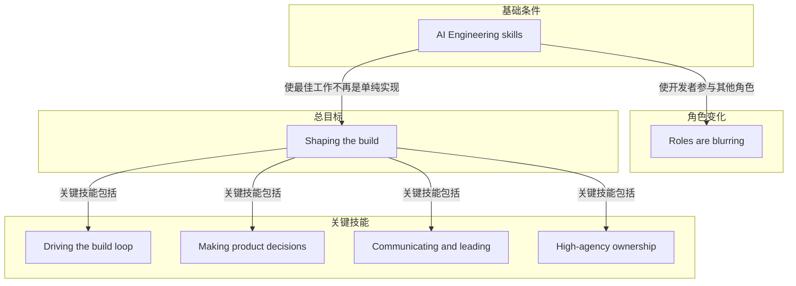

# 概念解析辞典

> 针对《AI Engineering Skills Map: Shaping the build》（X / Andrew Ng）的概念提取

## 一、核心概念

### 1. **AI Engineering skills（AI 工程技能）**

- **context**：文章开头用这个总命题点出 AI Engineering skills 的作用。

  > When you’re skilled at AI Engineering, your best work won’t be merely implementing a product that someone else spec’ed out. Instead, you will actively shape the build.

- **费曼一下**：在本文里，AI Engineering skills 指一套让开发者不再只按别人写好的规格去实现产品的技能。它让开发者参与产品、设计、沟通、领导和高自主负责，从而扩展单个开发者能承担的工作范围。它是全文的前提，因为后面说的 shaping the build 和四项关键技能，都建立在这套技能之上。

### 2. **Shaping the build（塑造构建过程）**

- **context**：作者把它作为 AI Engineering 与普通实现工作的区别，并在列出关键技能时再次点明。

  > The key skills for shaping the build are:

  > The opportunity to not just build but to shape the build makes AI Engineering more exciting than traditional software development.

- **费曼一下**：在本文里，shaping the build 指主动参与决定要构建什么、下一步做什么、为什么这样做，而不是只实现别人已经定义好的产品。它解决的问题是 AI Engineering 的价值在哪里：不只是更快编码，而是扩大开发者对构建过程的决定权。它是全文的总目标，四个关键技能都服务于它。

### 3. **Roles are blurring（角色正在模糊）**

- **context**：作者先描述传统分工，再说明这种分工正在变化。

  > Before modern AI tools accelerated and expanded what a single developer could do, tech companies established the practice of having product managers (PMs) and designers specify what should be built and then developers build it. Perhaps a project manager additionally drives the timeline. However, these roles are blurring.

  > A developer who is skilled at AI engineering not only builds software but participates in these other roles. (Similarly, product managers and designers are gaining AI Engineering skills and participating in building software.)

- **费曼一下**：在本文里，roles are blurring 指传统产品经理、设计师、开发者、项目经理之间的分工边界正在消失。开发者会用 AI Engineering 技能参与产品和设计等角色，产品经理和设计师也会参与构建软件。它解释为什么开发者做产品决策不是偏离本职，而是角色边界变化的一部分。

### 4. **Driving the build loop（驱动构建循环）**

- **context**：作者先定义软件构建的循环，再说明 AI 工程师在其中的角色。

  > Most software is built via a loop in which you write some code, then get some feedback, and decide what to do next. As a skilled AI engineer, you play a key role in driving this loop, repeatedly deciding on the next step to move your project forward. You have a bias for action, and drive this loop at the high velocity that AI has made possible.

  > For example, you might decide to build a quick prototype to test a technical concept or user feature, build an MVP (minimum viable product) to take to users to demonstrate value, add features, or invest in an enterprise-grade system. You frequently ship in small batches to keep up velocity. You know when to get feedback from users or other stakeholders, or when to run a technical experiment (such as train a model) to gather information to decide the next step.

- **费曼一下**：build loop 是写代码、获取反馈、决定下一步的循环。driving the build loop 指开发者主动掌控这个循环，持续判断下一步该做原型、MVP、加功能、企业级系统，还是收集用户反馈或做技术实验。它解决项目如何高速推进的问题：不是等待别人指定下一步，而是有行动偏好地驱动循环。它是 shaping the build 的第一个关键技能。

### 5. **Making product decisions（做产品决策）**

- **context**：作者说明开发者不必变成 PM，但要补上规格没有覆盖的决定，并解释这些决定依靠什么。

  > Developers don’t have to become PMs, but you will make decisions the product spec doesn’t cover. If you are asked to build without a spec, you know how to develop one.

  > You have product sense that enables you to pick a product direction that meets real user needs, without having to wait for a PM to make every decision. You also have at least a basic design sense, and can build things that aren’t just functional but pleasing to use. You also have some basic business sense, so you can think through issues like go-to-market, market size, unit economics, and profit and loss (P&L) and make tradeoffs that are economically sensible. Your ability to make product decisions is rooted in your user empathy.

- **费曼一下**：在本文里，making product decisions 不要求开发者变成全职 PM，而是能处理产品规格没有覆盖的决定。它包括选择满足真实用户需求的产品方向、基本设计判断、基本商业判断，并以用户共情为根基，通过访谈、问卷、A/B 测试、行为分析等方式持续校准。它解决没有完整规格或没有 PM 每一步决策时，构建方向由谁判断的问题。它是 shaping the build 的核心技能。

### 6. **Communicating and leading（沟通与领导）**

- **context**：作者说明 AI Engineering 技能让开发者进入更广的工作范围，因此沟通与领导变得更重要。

  > Your skills in AI Engineering enable you to participate in a broader scope of work than traditional software development allowed. I’ve written previously about how specialized developers (like frontend developers) are now likely to play a broader full-stack role. AI Engineering skills open the door to expanding your scope even beyond this: You might participate in other functions that affect your project like marketing, finance, legal, and so on. This makes your ability to communicate with these other functions more important than before — you can play a key role moving your project forward by aligning and coordinating among stakeholders.

  > Additionally, because AI technology is rapidly evolving, many people outside of engineering are trying to understand the technology, its impact on their jobs, and the new practices and products it makes possible. Your technical skill in AI Engineering puts you ahead of the game and allows you to play a unique role in shaping these perspectives. For example, you can explain why certain initiatives may be technically feasible or not. This allows you to help lead your broader organization forward.

- **费曼一下**：在本文里，communicating and leading 指开发者因 AI Engineering 技能而参与更广的工作范围，与市场、财务、法务等职能沟通协调，并向非工程人员解释 AI 技术是否可行。它解决技术工作超出代码后的协作和领导问题。没有它，shaping the build 只能停在个人开发，难以推动项目和更广组织。

### 7. **High-agency ownership（高自主性负责）**

- **context**：作者说明在很多人还不懂 AI 能做什么时，技术人可以用高自主性填补空白并端到端负责。

  > AI engineering skills give you vast opportunities to make a difference. However, many people — including some executives — do not yet understand what AI can do and therefore do not know what are good project directions. This creates an opening for someone with technical skill to bridge this gap: You can spot problems, propose solutions, and execute on them — being respectful of the organization’s priorities and constraints, but without waiting for precise top-down direction. This skill requires a high degree of agency, in which you identify opportunities, prioritize what matters, and act on them.

  > Additionally, you know how to own an initiative end-to-end, take accountability for issues that arise, act in the face of ambiguity, persist through setbacks, and measure your work not just by task completion, but according to the value you create.

- **费曼一下**：在本文里，high-agency ownership 指在许多人还不清楚 AI 能做什么时，技术人主动发现机会、提出方案并执行。它要求尊重组织优先级和约束，但不等待精确的自上而下指令，并端到端负责、在模糊中行动、坚持、按创造的价值衡量。它解决好方向由谁发起和负责的问题，是 shaping the build 的能动性与责任边界。

## 二、概念架构图

