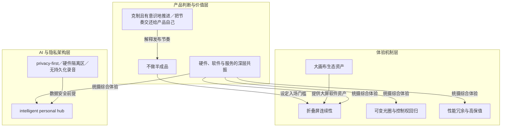

# 概念解析辞典

> 针对《特努斯回答一切，那个懂技术的苹果 CEO 回来了》（爱范儿）的概念提取

## 一、核心概念

### 1. **不做半成品**

- **context**：面对“苹果为何拖到现在才入场折叠屏”的质疑，Ternus 把时机绑定在苹果的质量、耐用和工业设计门槛上；Joz 则把它说成苹果的一贯习惯。

  > 对我们来说，关键始终在于：什么时候我们觉得拿出了一个真正达标的产品构想。它必须过我们的质量关、耐用关，还要过工业设计关。

  > 苹果从来没有拿半成品去凑热闹的习惯

- **费曼一下**：在本文里，不做半成品是苹果决定折叠屏入场时机的筛选标准。它不是说苹果从不失败，而是说苹果不因为某个品类热就急着把未过质量、耐用和工业设计关的产品拿出来。这个标准解释了为什么折叠屏发展快十年苹果才做，也解释了后文为什么大量篇幅在讲铰链、屏幕叠层、纳米纹理、机身比例和软件连续性：这些细节都是达标门槛的组成部分。

### 2. **折叠屏连续性（continuity／内外屏同比例等比缩放）**

- **context**：折叠屏软件最冒险的改动之一，是把核心控件挪到屏幕右侧。Ternus 把原因归到类似护照的机身比例和内外屏同比例。

  > 确认了这种类似护照的机身比例后，软件团队很快给出了方案：把核心交互控件统一收拢到右侧边缘。这样一来，不仅把宝贵的纵向阅读空间彻底腾了出来，还创造出了一套极其符合人体工学的盲操逻辑——合上机身单手握持时，按键落在右手拇指下方；展开变成大屏后，按键依然留在右手拇指原本的位置。

  > 正因为 Duo 的内外屏比例完全一致，所有界面元素得以按固定比例平滑等比缩放。这让软件工程师能够把外屏的直觉操作无缝映射并延伸到内屏上。

- **费曼一下**：本文里的折叠屏连续性，指展开前后交互不断裂。内外屏同比例让界面等比缩放，右侧控件让拇指位置不变，合上外屏的直觉操作能平移到展开内屏。它解决的是折叠屏只把屏幕变大的问题，也是护照比例选择在软件上的落点。拿掉它，读者看不懂右侧控件、等比缩放和盲操逻辑为何是同一套机制。

### 3. **大画布生态资产**

- **context**：Joz 谈折叠屏软件生态时，把苹果与安卓平板区分开，并把 iPad 积累称为核心胜负手。

  > 市面上很多安卓平板说到底更像是等比放大的大屏手机，而 iPad 从诞生起就拥有一套专为大画布定制的生态体系。因此，我们不仅将这套经验融入官方原生 App，也全面开放给了第三方开发者。

  > 我们绝不能容忍平板沦为「大号手机」，而这恰恰是以往安卓平板给人留下的刻板印象。

- **费曼一下**：本文中的大画布生态资产，是苹果过去十几年为 iPad 建立的大屏交互、自适应 API 和第三方适配经验。它不是泛指开发者多，而是说这些现成资产让 iPhone Duo 展开后不必从零设计，Slack 双栏、Netflix 悬停、Procreate 适配可以较快嫁接。它解释苹果为什么把软件生态视为折叠屏竞争壁垒。

### 4. **可变光圈与控制权回归**

- **context**：iPhone 18 Pro 的机械可变光圈，是文章讲 Pro 系列“不只更快”的核心硬件突破。Ternus 用它说明自动与手动两层体验。

  > 在微型模组内部，我们精密嵌配了六片微型机械叶片，它们能够以极高精度完成开合伸缩。当光圈全开时，传感器能捕捉更多光线，暗光与夜景拍摄质量显著提升；而当光圈收缩时，则能显著扩大光学景深。

  > 对于普通用户，这一切全在快门按下的瞬间由系统算法自动完成；而对于摄影爱好者和专业用户们，苹果这次终于把过去被计算摄影在后台承包的控制权重新交了回来，光圈、快门乃至焦点都支持手动深度调节。

- **费曼一下**：本文里的可变光圈与控制权回归，是硬件加算法加用户选择的产品机制。机械叶片改变进光量和景深，算法让普通用户不用懂参数也能受益，手动模式则把计算摄影拿走的控制权交还给专业用户。它说明 Pro 的升级不只是跑分，而是把精密机械、自动算法和创作自由接在一起。

### 5. **性能冗余与高保值**

- **context**：A20 Pro 是文章讲性能、续航与保值率的交汇点。Joz 把高保值率归因于可靠硬件、系统维护和超前芯片性能。

  > 你要它今天快，三年、四年后还快。A20 Pro 是个怪兽，会快很多年。

  > 高保值率的底层基石，靠的就是过硬的可靠性、持久的系统维护以及超前的芯片性能。

- **费曼一下**：本文中的性能冗余与高保值，指苹果不只为发布当天的速度堆芯片，而是用 2 纳米制程、均热板、可靠性设计和多年系统维护，让手机三四年后仍流畅，并在二手市场保住价值。它把 A20 Pro 的约 40% 提升、续航反超、折抵换机串成同一价值主张：硬件耐用和性能超前会转化为用户持有成本和换机选择。

### 6. **intelligent personal hub（智能个人中枢）**

- **context**：面对 AI 穿戴设备热炒，Ternus 在 Keynote 提出 intelligent personal hub，并把中枢落回 iPhone。

  > 智能手机本身就是一种近乎完美的设备形态。它兼具强劲的计算性能、可靠的电池续航，更核心的是它配备了一块出色的显示屏。人是视觉动物，人类在处理与吸收信息时，视觉通道的吞吐效率远远高过被动听觉。

  > 更深层的原因在于隐私掌控权：你最核心、最私密的个人数据资产，全都存储在手机这台属于你个人全权掌控的设备上。这部分个人数据其他任何人无法触碰，苹果无权访问，我们主观上也绝不想去窥探。

  > Apple Watch 和 AirPods 是极佳的感官延伸，但 iPhone 才是那个不可动摇的中枢。

- **费曼一下**：这是本文理解苹果 AI 战略的核心：AI 时代的个人中枢不是眼镜、AI Pin 等新形态，而是用户口袋里的 iPhone。理由有三层：端侧算力、电池和常伴屏幕的物理优势；视觉信息吞吐效率高于被动听觉；核心个人数据留在用户全权掌控的设备上。Apple Watch 和 AirPods 是中枢的感官延伸，不是中枢替代。拿掉它，读者无法理解苹果为何逆着后手机时代叙事押注 iPhone。

### 7. **privacy-first／硬件隔离区（exclave）／无持久化录音**

- **context**：谈到 AI 与隐私边界，Joz 用 Apple Watch 的 Siri Recap 说明苹果如何做到隐私第一。关键是硬件隔离区与无持久化录音。

  > 我们专门为 Apple Watch 设计了集成硬件隔离区（exclave）的全新芯片，确保拾取的声音信号仅在被算法解析提炼、生成高维日程笔记的那一瞬间短暂驻留，随即便从内存中彻底覆写抹除。

  > 系统不留存任何原始录音，不输出任何逐字稿记录，也绝不对环境音做说话人身份匹配归属。

  > 如果我们自己都没存录音，就意味着任何黑客或机构都拿不到录音。它不能被黑，也无法被命令交出去。

- **费曼一下**：本文中的隐私第一不是一句承诺，而是一套技术边界：环境音频只在硬件隔离区里被算法瞬间解析成高维笔记，随后从内存抹除；系统不存原始录音、不存逐字稿、不做说话人身份匹配，连机主自己都调不出音频。因为没有持久化存储，所以黑客无可窃取，机构也无可命令交出。它让隐私从品牌态度变成可理解、可验证边界的机制，并支撑智能个人中枢的安全前提。

### 8. **硬件、软件与服务的深层共振**

- **context**：采访尾声，Ternus 被问如何定义苹果当前产品矩阵，他用硬件、软件与服务的深层共振作答。

  > 只要你完整审视我们目前的产品矩阵就会发现，苹果最具魅力的地方始终在于硬件、软件与服务的深层共振。我最痴迷的瞬间，就是当硬件构件、底层算法与生态服务紧密咬合在一起时，它们所迸发出的综合体验远远超越了各个孤立零件的简单物理相加。

- **费曼一下**：这是全文的整合框架。它说明苹果的卖点不是单个零件，而是硬件、软件、服务咬合后的综合体验：折叠屏要铰链、屏幕叠层、纳米纹理、右侧控件和 iPad 生态一起成立；影像要机械光圈、算法和手动控制一起成立；AI 要端侧芯片、屏幕、隐私架构一起成立。拿掉它，文章会退化成产品功能清单，而不是 Ternus 解释苹果如何做产品。

### 9. **克制且有意识地推进／把节奏交还给产品自己**

- **context**：面对工程师当掌门是否会重新激活苹果创新，Ternus 谈 AI 浪潮下的推进方式；文章结尾把这种回答概括为产品节奏。

  > 我们必须保持克制，在推进时深思熟虑；但你已经能够清晰感知到，现在的我们拥有了许多过往难以想象的产品实现力。

  > 从抚平折痕的纳米纹理、右侧控件，再到机械光圈与硬件隔离区，面对关于创新的拷问，他给出的答案很朴实：苹果或许并没有丢掉什么，它只是把节奏重新交还给了产品自己。

- **费曼一下**：本文中的克制且有意识地推进，是 Ternus 对创新的定义方式：在 AI 带来新工程机会时，不先宣布颠覆性蓝图，而是先做 Smart Take 这类能改善现有产品的小功能，同时为未来新品类留空间。文章结尾把它称为把节奏交还给产品自己，意思是发布与创新的节拍由产品成熟度决定，而不是由外界期待或赛道热度决定。它连接不做半成品、隐私边界和硬件软件服务共振，构成 Ternus 时代的产品节奏观。

## 二、概念架构图

