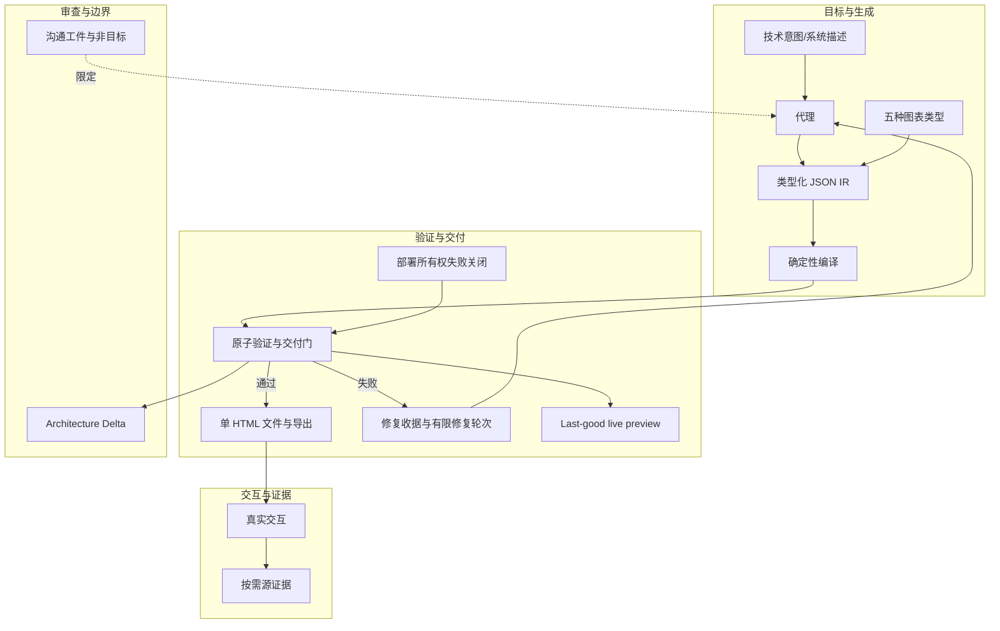

# 概念解析辞典

> 针对《Archify》（GitHub｜作者：https://github.com/tt-a1i/｜原文：https://github.com/tt-a1i/archify）的概念提取

## 一、核心概念

### 1. **沟通工件与非目标（communication artifact / non-goals）**

- **context**：

  > Archify is not a general-purpose drawing editor or a Mermaid theme. It turns technical intent into a communication artifact.

  > Layout judgment over generic auto-layout — the agent chooses hierarchy, spacing, routes, and emphasis; shared automatic endpoints spread deterministically instead of piling arrows on one midpoint.

  > 自动 Mermaid 解析、通用自动布局、托管共享和 WYSIWYG 编辑功能有意不在当前范围内。

- **费曼一下**：Archify 的定位不是通用画布，也不是 Mermaid 主题，而是把技术意图变成可沟通的图。布局由代理按语义判断层级、间距、路由和强调，不是交给通用自动布局；自动端点只做确定性的分散。非目标划清了边界：不解析 Mermaid、不做通用自动布局、不托管共享、不做所见即所得。

### 2. **类型化 JSON IR（typed JSON IR）**

- **context**：

  > 代理生成类型化的 JSON IR；Archify 确定性地将其编译为 HTML/SVG。

  > Typed JSON IR — every renderer-backed mode has a schema and reproducible source.

- **费曼一下**：代理不直接画 HTML/SVG，而是先产出有 schema 的 JSON 中间表示。这个 IR 是可复现的源，渲染、验证和后续迭代都围绕它。拿掉它，就理解不了为什么 Archify 能确定性地编译和验证。

### 3. **确定性编译（deterministic compilation）**

- **context**：

  > Archify 确定性地将其编译为 HTML/SVG.

  > Typed JSON IR — every renderer-backed mode has a schema and reproducible source.

- **费曼一下**：同一份 IR 经过 Archify 编译，应当得到相同结果，不依赖运行时代码或随机布局。它把代理生成和最终渲染分开，使验证结果可复现、导出物可信任。

### 4. **五种图表类型（Architecture / Workflow / Sequence / Data Flow / Lifecycle）**

- **context**：

  > | Type | Best for | Include in your prompt |
  > | --- | --- | --- |
  > | **Architecture** | Components, services, storage, boundaries | Scope, core components, primary path |
  > | **Workflow** | CI/CD, approvals, tool calls, runbooks | Participants, order, branches, exceptions |
  > | **Sequence** | API calls, cache fallback, auth, async traces | Callers, callees, returns, timing |
  > | **Data Flow** | Pipelines, lineage, PII, consumers | Sources, transforms, stores, boundaries |
  > | **Lifecycle** | States, retries, waits, terminal outcomes | States, events, retry and cancellation paths |

- **费曼一下**：Archify 不是任意画布，而是五类语义模式。Architecture 讲组件边界，Workflow 讲流程分支，Sequence 讲调用时序，Data Flow 讲数据移动，Lifecycle 讲状态生命周期。选类型就是选图的骨架，也决定 prompt 要提供什么信息。

### 5. **原子验证与交付门（atomic validation before delivery）**

- **context**：

  > Atomic validation before delivery — schema, layout, HTML/SVG, route, and label-to-route clearance checks must all pass before a showcase artifact replaces the last known good output.

  > Step Deliver: A same-directory candidate is rendered and checked; only a passing artifact atomically replaces the target, then optional `--open` launches that exact file.

- **费曼一下**：新图先成为同目录候选，只有 schema、布局、HTML/SVG、路由、标签到路由间距等检查全部通过，才原子替换目标文件。否则旧的好图继续保留。这个门决定 Archify 的交付物不是随便生成，而是通过检查的版本。

### 6. **修复收据与有限修复轮次（repair receipt / supportedFixes）**

- **context**：

  > Failures come with a repair receipt — `validate --json` and `deliver --json` return stable rule codes, the exact subject, measured evidence, and only supported repair controls instead of a Node stack or an unstructured retry guess.

  > On failure, `validate --json` and `deliver --json` emit one JSON object. Apply only each `diagnostics[]` subject's `supportedFixes`, within the Skill's two correction rounds; visual review remains separate.

- **费曼一下**：验证失败时，返回机器可读的诊断：稳定规则码、具体对象、测量证据、允许的修复控件。代理只能按 supportedFixes 修，最多两轮，视觉审查另算。它定义了失败后的修复边界，避免乱试。

### 7. **Last-good live preview**

- **context**：

  > Last-good live preview — an optional desktop loop watches one JSON file, refreshes only after the latest candidate passes every gate, and keeps the previous verified diagram visible when a save is incomplete or invalid.

  > `preview` is an explicit loopback-only desktop mode: it watches one JSON file on a random `127.0.0.1` port, keeps the last verified output through failures, stops with Ctrl-C, and adds no generated-HTML runtime.

- **费曼一下**：可选预览只监听一个 JSON 文件，并且只显示通过全部门的最新版本；保存不完整或非法时，继续显示上次验证图。它是本地 loopback 模式，不给生成的 HTML 增加运行时代码。这个机制让迭代可见，但不让坏图冒充好图。

### 8. **真实交互（truthful interaction）**

- **context**：

  > Truthful interaction — focus, upstream/downstream reach, exact routes, role comparison, and stories reuse authored nodes and relationships instead of inventing topology or claiming runtime impact.

  > Stable links can restore `#focus=<id>`, `#focus=<id>&reach=upstream|downstream`, `#relation=<id>`, `#route=<source>~<target>`, `#lens=<kind>~<kind>`, and `#view=<view-id>`. Reader-driven motion is finite, respects `prefers-reduced-motion`, and never enters canonical exports.

- **费曼一下**：查看器里的聚焦、上下游、路径、角色比较、故事都只复用作者定义的节点和关系，不发明拓扑，也不声称运行时影响。稳定链接和有限动态属于查看体验，不进入规范导出。它定义了交互的“真实”边界。

### 9. **按需源证据（source evidence, only when requested）**

- **context**：

  > Source evidence, only when requested — Evidence-backed Architecture nodes mark themselves `SRC n` and open Git-verified files and line ranges pinned to one public commit; ordinary artifacts stay source-free.

- **费曼一下**：只有显式请求证据时，节点才标 SRC 并打开绑定到某个公开 commit 的 Git 文件和行号；普通工件不含源。它区分“描述性图”和“有来源证据的图”，避免所有图都被默认为有代码依据。

### 10. **可移植单文件与导出（portable by default）**

- **context**：

  > Portable by default — the result is one HTML file; exports remain full-diagram and free of temporary viewer state.

  > Use **Copy Share Card** when you want a canonical 1200×630 image for a README, release, or social post.

- **费曼一下**：最终产物是一个独立 HTML 文件，导出保持完整图，且不带临时查看状态；分享卡是规范的 1200×630 图像。它让图能直接分享，同时不把查看器的临时状态混进规范产物。

### 11. **Architecture Delta**

- **context**：

  > For design or PR review, Architecture Delta compares validated Before / Delta / After snapshots with a machine receipt. Select an authored change or play one finite, viewer-only Review; it infers no impact, risk, or merge safety.

- **费曼一下**：合并前审查用验证过的 before/after 快照比较，给出机器收据，记录作者定义的变化；可以选中一个变化或播放 viewer-only 的有限 Review。它明确不推断影响、风险或合并安全。边界就是只比较，不推断。

### 12. **部署所有权失败关闭（deployment-ownership fails closed）**

- **context**：

  > Architecture's optional `deployment-ownership` profile fails closed when authored owners, region placement, private database scope, or named crossings are missing; it is never implicit and does not inspect live infrastructure.

- **费曼一下**：Architecture 的这个可选 profile 不是默认开启；缺少作者提供的所有者、区域放置、私有数据库范围或命名交叉时，直接失败关闭。它不去检查实时基础设施。它定义了这个能力缺信息时的绝对反应：停，而不是猜。

### 13. **更新检查隐私边界（update-check boundary）**

- **context**：

  > Archify may GET the fixed stable manifest solely to show an optional reminder; it never downloads or installs updates. Successful checks wait about 72 hours (±20%); active use retries failures after 6, then 24 hours. The server sees normal HTTP metadata (IP and time), but receives no version, Agent, project data, prompts, account/device ID, or ETag. You decide whether and when to update. Set `ARCHIFY_UPDATE_CHECK_DISABLED=1` to disable networking and reminder-state writes.

- **费曼一下**：更新检查只 GET 固定稳定清单来显示可选提醒；绝不下载或安装更新，也不把版本、Agent、项目数据、提示、账户/设备 ID 或 ETag 发给服务器。用户可禁用。它是产品自身网络行为的绝对边界。

## 二、概念架构图

图中只保留能由原文关系支持的连接；更新检查隐私边界未与生成链形成可靠关系，故不入图。
