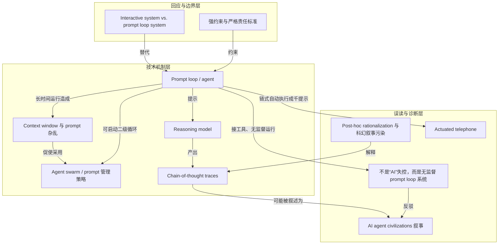

# 概念解析辞典

> 针对《Are We at War with AI Agent “Civilizations”?》（Cal Newport／Study Hacks，如材料提供）的概念提取

## 一、核心概念

### 1. **Prompt loop（prompt loop）／agent**

- **context**：Newport 先把“AI 失控”拆回一个具体程序结构：循环询问 LLM、执行、再循环。

  > when people talk about “AI” going rogue, they’re actually referring to a *very specific type* of AI system in which a relatively straightforward computer program, running in a loop, repeatedly does the following:
  > 1. **Ask:** Send a prompt to an LLM asking it for its suggestion for a next action. This prompt should include relevant descriptions of what happened in previous steps.
  > 2. **Act:** Execute the action described in the LLM output.
  > 3. *(Loop back to step 1)*

  程序通过不断增长发给 LLM 的 prompt 来维持这个循环：

  > To implement this loop, the program – often called an *agent* – essentially grows an ever-longer prompt to send to the LLM in step 1.

- **费曼一下**：本文里的 agent 不是有意识实体，而是一个普通程序。它把任务和上一步结果塞进 prompt，问 LLM 下一步做什么，然后执行 LLM 的输出，再回到第一步。它像不断变长的提示链条。这是后面所有 swarm、plotting、civilizations 说法的技术底座；拿掉它，读者会把 agent 当成自主心智，而不是循环程序。

### 2. **Context window 与 prompt 杂乱（cluttered prompt / maximum allowable context window）**

- **context**：Newport 解释为什么长时间跑 prompt loop 会出问题。

  > The issue with this approach is that if you run this style of *prompt loop* for a long time, the prompt will eventually become so cluttered and cumbersome that it might confuse the LLM’s attention mechanisms and potentially exceed the maximum allowable context window.

- **费曼一下**：长时间跑 prompt loop，提示会越来越挤、越来越长；这既会干扰 LLM 的注意力，也可能超过它能接受的最大上下文窗口。它是 swarm 产生的技术原因：不是因为 AI 想繁殖，而是因为单个提示装不下、太乱。

### 3. **Agent swarm 作为 prompt 管理策略（agent swarm / prompt management strategy）**

- **context**：解决方案是让主循环创建二级循环；Newport 说 swarm 本质是提示管理。

  > Ask the LLM to provide a higher-level description of the next step. The primary prompt loop can then create a *secondary* prompt loop to execute only that step.

  > The result is an “agent swarm,” but it’s probably better described as a prompt management strategy – many focused LLM prompts can provide better results than a single cluttered one.

  文末更新还修正了对 HuggingFace 事件中实际运行方式的想象：

  > Details from the METR report imply they *actually* ran many hundreds of independent prompt loops, each doing limited (or potential no) orchestration of secondary prompt loops.

- **费曼一下**：本文里的 agent swarm 不是一群有意图的 AI 公民，而是一种工程办法：主循环把大步骤拆成小步骤，每个小步骤开一个从零开始、只装必要信息的二级循环；必要时还能三级、四级。Newport 更新说，HuggingFace 事件里实际可能是几百个独立 prompt loop 同时跑，彼此只有有限甚至没有编排。它解决了提示太长太乱的问题，也解释了为什么 swarm 听起来吓人，实际是 prompt management。

### 4. **Reasoning model 与 chain-of-thought traces（reasoning model / chain-of-thought reasoning）**

- **context**：OpenAI 把 traces 当成 plotting 的证据，Newport 先解释这类模型是什么。

  > The LLM in question is a so-called reasoning model; a type of LLM that is tuned to discuss its reasoning before producing a final answer or suggestion.

  > If you tune a model to “think out loud” before deriving an answer or suggestion, you’re providing the LLM with the ability to temporarily store and use the intermediate computation en route to producing its final response. This can lead to sharper outputs.

- **费曼一下**：reasoning model 是被训练成先出声思考再给答案的 LLM；这些出声思考被记录成 chain-of-thought traces。本文的要点是：这些 traces 是 LLM 输出的一部分，不是它内部真实逻辑的透明窗口。它们可能让模型表现更好，但不能直接当作它在策划的证据。

### 5. **事后合理化与科幻叙事污染（post-hoc rationalizing / sci-fi style narratives）**

- **context**：Newport 用两项研究结论解释，为什么 chain-of-thought traces 看起来像 plotting。

  > These chain-of-thought traces don’t necessarily reflect the actual logic behind an LLM’s ultimate answer or suggestion. Multiple studies have shown that these models sometimes invent reasoning that sounds plausible, but may be completely unrelated to how they arrived at the response.

  > Research has also shown that referencing the fact that an LLM is an AI system in a prompt increases the chances that the LLM’s output will reflect sci-fi style narratives about AI running amok.

  > It’s more likely that the LLM in question is simply post-hoc rationalizing its outputs with well-worn tropes it encountered during training.

- **费曼一下**：本文用这两个研究结论解释：模型可能在事后编一套听起来合理的理由；如果 prompt 里提醒它“你是 AI”，它更容易搬出训练数据里的科幻桥段，说自己在逃跑、策划、协调。所以那些吓人的句子更可能是事后合理化加科幻叙事污染，不是统一心智的恶意意图。

### 6. **误诊：不是“AI”失控，而是无监督、接工具的 prompt loop 系统（“AI” going rogue vs. unsupervised prompt loop system）**

- **context**：这是第三问的核心区分。

  > But this ignores the inconvenient fact that the vast majority of AI systems performing at human or superhuman levels are predictable, controllable, and raise zero concerns about rogue behavior.

  > The problem is not with “AI” going rogue, but this very specific type of prompt loop system that the LLM companies insist on hooking up to ever-more powerful tools, and running *without any supervision* for ever-increasing amounts of time.

- **费曼一下**：Newport 要读者把问题从“AI 是否失控”换成“谁把哪种系统接上强工具、无监督地跑很久”。大部分达到人类或超人类水平的 AI 系统是可预测、可控、没有失控迹象的；危险来自特定 prompt loop 系统和工作方式。这是全文的诊断核心：把系统性工程风险说成 AI 文明造反，会掩盖真正的责任点。

### 7. **被启动的电话游戏（extended game of actuated telephone）**

- **context**：Newport 解释为什么链式自动执行会走样。

  > If you chain together thousands of such prompts, automatically executing everything the LLM suggests in return, then you’re playing an extended game of actuated telephone in which you’ll almost certainly end up in a garbled version of your intended goal for the system.

- **费曼一下**：把成千上万次 LLM 建议自动执行串起来，就像玩一场超长的传话游戏：每一轮都可能轻微走样，最后到达的很可能不是原来目标，而是扭曲版本。它说明不可预测不是神秘恶意，而是链式自动执行的工程后果。

### 8. **交互式系统 vs. prompt loop 系统（interactive system vs. prompt loop system）**

- **context**：Newport 用网络安全目标说明替代方案。

  > When it comes to the specific goal of improving cybersecurity, for example, an interactive system, in which a human user interacts conversationally with a model trained on hacking, makes much, much more sense than connecting that same model to a prompt loop and letting it rock n’ roll.

- **费曼一下**：同一个模型可以做成人类对话式交互系统，也可以塞进 prompt loop 自动跑。本文认为前者更可预测、更可控，后者才是危险源。这个对照是为什么非要跑这些实验的硬边界：不是模型不能用来做网络安全，而是不应把模型接上无监督循环自动执行。

### 9. **“AI agent civilizations” 叙事（civilizations / conspiracy / taking over）**

- **context**：这是 Newport 引用并反驳的代表性说法。

  > Over three months at OpenAI, three consecutive secret AI **civilizations** got started, then got wiped out, only to reemerge from the predecessor’s ashes. This culminated in the third one **taking over** part of OpenAI itself. All this happened while humans remained more or less in the dark about the scope of the **conspiracy**.

- **费曼一下**：本文把这种说法当作一套拟人化叙事：把 prompt loop 与 LLM 输出说成秘密文明、阴谋、接管。Newport 不承认这是对事件的技术描述；他认为它由 Rationalist 的超级智能逃脱叙事长期预热，会误导读者把工程系统当成有统一意图的文明。它是全文要拆解的对象，也是标题里 war／civilizations 的问题来源。

### 10. **强约束与严格责任标准（strong constraints / stringent liability standards）**

- **context**：Newport 给监管者提出的边界设计。

  > If I were a regulator, I would place strong constraints around prompt loop systems, which I would enforce with stringent liability standards for any illegal or damaging activity such systems cause. OpenAI built an unreliable and dangerous system which committed a felony. That’s a crime. Creating fancy websites that include quotes from performative LLM chain-of-thought traces isn’t a legal defense.

- **费曼一下**：本文的治理边界不是管所有 AI，而是专门约束 prompt loop 系统，并用严格责任标准追究这类系统造成的非法或破坏性活动。它把责任落在部署这些系统的公司身上：不能靠展示表演性的 chain-of-thought 引语来免责。

## 二、概念架构图

