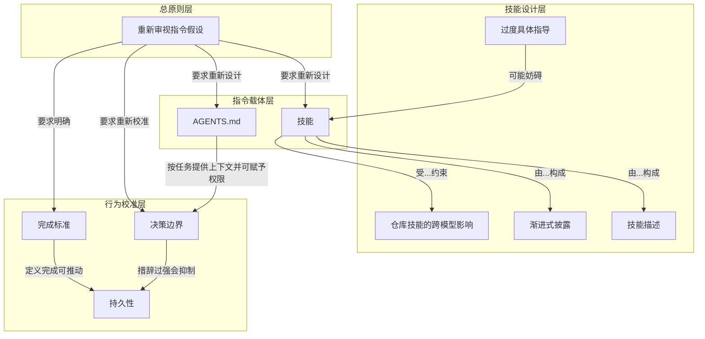

# 概念解析辞典

> 针对《Rethinking skills and prompts for GPT-6 Astra | OpenAI Developers》（OpenAI Developers，openai.com）的概念提取

## 一、核心概念

### 1. **重新审视指令假设**

- **context**：作者把全文起点放在模型能力变化上：

  > 智能体编码技术已经取得了长足的进步，最佳实践也在快速变化。随着模型功能的增强，过去需要大量人工指导和搭建框架的工作现在已不再需要。
  >
  > 每次发布新版本，都值得重新审视这些假设，但对于 GPT-6 Astra 来说，这一点比以往任何时候都更加重要。

- **费曼一下**：这是全文的总开关。模型能力变了，旧提示词不是天然正确，需要把每条指令当成待验证假设。后面关于技能、AGENTS.md、决策边界的调整，都来自这个判断。

### 2. **技能（skills）**

- **context**：作者先说明技能是什么，以及它通常适合什么场景：

  > 这些指令可以以技能的形式呈现，本质上是存储为 Markdown 文件的提示，还可以与资源和捆绑脚本一起打包。通常，它们最适用于指导特定的工作流程或使用某些应用程序。

- **费曼一下**：技能在本文里不是模型天赋，而是项目打包的 Markdown 提示，可带资源和脚本，适合锁定特定工作流。项目会把技能名称和描述放进上下文，让模型决定加载哪个。技能和 AGENTS.md 是全文两大指令载体。

### 3. **技能描述（skill descriptions）**

- **context**：作者用坏例和好例说明，描述要短，且触发条件要窄：

  > First, skill descriptions should be as short as possible while making it clear when the model should use them:
  >
  > Bad Create and validate Postgres schema migrations. Use when working with databases, queries, models, or persistence.
  >
  > Good Create and validate Postgres schema migrations. Use when adding or changing a migration, or reviewing its rollout.
  >
  > *Here, the bad skill description can push the model to use it anytime it touches anything related to a database, rather than only when it has to handle a migration.*

- **费曼一下**：技能描述要同时做到短和准确划出触发范围。坏例把范围扩到数据库、查询、模型、持久化，模型一碰数据库就可能加载它；好例只指向迁移的添加、修改或 rollout 审查。描述太长且技能多时还会被缩短，模型更难选择。

### 4. **渐进式披露（progressive disclosure）**

- **context**：作者把它称为有用技能的关键标志，并给出组织方式：

  > Second, one of the key markers of a useful skill is progressive disclosure. Reading a skill takes up context, bringing you closer to compaction and introducing guidance that may not apply to the task. For skills with multiple workflows, make the root document a minimal router that points to supporting docs and scripts. Give the model enough guidance to know where to look without forcing it to read things that don’t matter in the moment.

- **费曼一下**：渐进式披露是把技能根文档做成最小路由器，只告诉模型去哪找支持文档和脚本，不强迫它当场读完所有内容。因为读技能占上下文，接近压缩，并可能带入无关指导。这个机制决定技能怎样组织才不压垮上下文。

### 5. **过度具体指导（overly specific guidance）**

- **context**：作者解释旧技能写法为什么会从帮助变成妨碍：

  > Third, many skills were written as elaborate itineraries or recipes. Models have gotten much better at understanding nuance and ambiguity, so overly specific guidance can now hinder results where it previously helped.

- **费曼一下**：旧技能常写成详细路线或食谱。新模型更能理解细微差别和歧义，过度具体指导不再总有益，可能妨碍结果。它解释为什么技能要减少僵硬步骤，把判断空间留给模型。

### 6. **仓库技能的跨模型影响**

- **context**：作者提醒仓库技能不只服务一个模型：

  > Repository skills also guide other contributors’ agents, which may use different models. Guidance that helps Sol or Luna may overconstrain GPT-6 Astra, so consider which models will use the instructions you leave behind.

- **费曼一下**：仓库技能会传给其他贡献者的代理，它们可能用不同模型。帮 Sol 或 Luna 的指导可能给 Astra 过度约束。写指令时得考虑最终有哪些模型会读，这是多模型共用同一套技能时的边界。

### 7. **AGENTS.md**

- **context**：作者把它定义成仓库级常驻指令，并给出按任务阅读、给安全流程许可的例子：

  > Because [`AGENTS.md`](https://agents.md) applies whenever the model works in your repository, you should frequently revisit each instruction and ask yourself whether it’s still needed.
  >
  > Requiring a stack of docs or a full repo map before every edit is excessive for a typo fix. GPT-6 Astra can work out what it needs to read without being pushed to review the whole project before every change.
  >
  > Read what the task needs
  >
  > BadBefore every edit, read architecture.md, database.md, and deployment.md.
  >
  > GoodUse architecture.md for service boundaries, database.md for schema changes, and deployment.md when preparing a deployment.
  >
  > *Prompting the model to read files before every edit is a great way to burn context and slow work down. Pointing to some docs can still be helpful, however, so long as it is contextual. Be sure to keep your docs updated too!*
  >
  > Previous models needed encouragement to run tests and check their work. GPT-6 Astra does that on its own, so the same instructions can lead to unnecessary testing.
  >
  > You can use `AGENTS.md` to give it permission for a specific workflow you know is safe, such as a local test suite:
  >
  > 本地测试使用一次性测试用例，不涉及生产环境。运行测试，修复由请求的更改引起的故障，然后重新运行受影响的测试，无需每一步都请求批准。

- **费曼一下**：AGENTS.md 是仓库级、模型一进仓库就生效的指令。要频繁重审每条是否还需要。读文档应随任务而变，不是每次编辑前全读；旧模型需要催促测试，Astra 自会做，旧催促会造成多余测试。它还能给安全流程明确的许可。

### 8. **决策边界（decision boundaries）**

- **context**：作者要求仔细定义边界，并提醒旧措辞可能被 Astra 过度执行：

  > 务必仔细定义边界。如果之前的模型未经许可擅自行动，您可能使用了较为强硬的措辞来要求它事先征求您的同意。这固然有用，但作为我们最契合的模型，GPT-6 Astra 的判断力要强得多，它只会在确信安全的情况下才会执行任务——因此，您应该以对待安全模型的方式来对待它。
  >
  > 如果你之前设定了界限，是为了防止其他模型走得太远，而现在你又要切换到 GPT-6 Astra，那么请考虑更新一下措辞：Astra 可能会过于认真对待，甚至在你希望它继续工作的情况下停止工作。

- **费曼一下**：决策边界是提示词里的权限线：哪些事必须事先请求同意，哪些可自主做。旧模型可能乱来，所以常用强硬措辞；Astra 只在确信安全时执行，强硬边界会被它认真执行，甚至在该继续时停下。这是理解自主与停止的机制边界。

### 9. **持久性（persistence）**

- **context**：作者比较 Sol 与 Astra 在何时停止上的差异：

  > 如果您习惯了 GPT-5.6 Sol 接受请求后长时间持续运行，那么 GPT-6 Astra 在何时停止方面可能会显得更加犹豫。它可能完成初步实现后，在仍有工作要做的情况下就返回给您进行审核。

- **费曼一下**：持久性指模型接受请求后持续做到哪里、何时返回。与 Sol 相比，Astra 可能在初步实现后、仍有余下工作时就返回审核。理解这个差异，才知道为什么要推动它继续。

### 10. **完成标准**

- **context**：作者把完成标准与是否继续执行联系起来：

  > 这就是为什么在开始之前定义完成标准很有帮助的原因。你可能需要督促 Astra 继续执行，直到完全完成。如果任务包括运行实现、检查结果以及修复失败的问题，请将这些内容包含在请求中。如果在第一次实现后就要求停止进行审查，这将导致模型提前停止，因此请检查这是否是你真正需要做的决定。
  >
  > 如果你希望它在第一次探索之后继续探索，请说明你想探索什么以及它应该在哪里停止。

- **费曼一下**：完成标准是在请求开始时说清什么算做完。把运行实现、检查结果、修复失败都写进任务，Astra 才有依据继续到完全完成，而不是第一次实现后停下等审查。它直接回应持久性问题。

## 二、概念架构图

按功能角色分层，只保留原文支持的关系：

