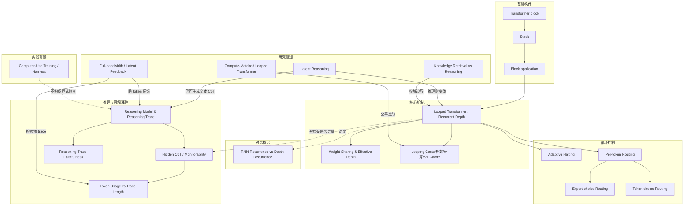

# 概念解析辞典

> 针对《GPT-6 Astra, Looped Transformers, and Hidden Reasoning》（Sebastian Raschka, PhD，sebastianraschka.com）的概念提取

## 一、核心概念

### 1. **Transformer Block、Stack、Block Application（transformer block, stack, block application）**

- **context**：作者在解释 looped transformer 前先定义三个贯穿全文的构件。

  > * A **transformer block** is a unit containing attention, a feedforward module, normalization, and shortcut connections. These blocks are often called “transformer layers” in papers.
  > * A **stack** is a sequence of transformer blocks.
  > * A **block application** means running an input through a transformer block once.

- **费曼一下**：这三个词是后文数“深度”和“参数”的量尺。block 是基本结构单元；stack 是按顺序排起来的一串 block；block application 是输入过一次 block 这个动作。后文说 Nanbeige 有 22 个 block、跑两遍、得到 44 次 block application，就是用这个单位区分“有多少不同参数”和“实际经过多少次计算”。

### 2. **Looped Transformer / Recurrent Depth（looped transformer, recurrent depth）**

- **context**：这是全文的核心架构概念。

  > A Looped Transformer is essentially an architectural tweak, with the main idea being to pass the intermediate representations through the same transformer blocks multiple times (instead of just once). Compared to just adding more blocks, the “trick” here is that the weights stay the same across these passes.

- **费曼一下**：它不是把模型做成更多不同的层，而是让同一批 transformer blocks 被反复使用：中间表示绕回 stack 再走一遍。这样模型的有效计算深度增加，但权重不随循环次数增加。它是文章讨论 Astra 架构传闻和隐藏推理争议的中心机制。

### 3. **Weight Sharing and Effective Depth（权重共享、有效深度）**

- **context**：作者用 Nanbeige 的例子说明循环展开后发生了什么。

  > If we were to unroll this computation, we would have 44 transformer block applications. However, compared to a conventional transformer with 44 distinct blocks, the second stack of 22 block applications reuses the weights from the first stack.
  >
  > So, the whole idea here is that we increase the effective depth from 22 to 44 block applications without adding another set of transformer weights.

- **费曼一下**：把循环展开看，同一个 token 会经过更多次 block application，所以有效深度变大；但第 23 次用的仍是第 1 个 block 的权重，第 24 次用第 2 个 block 的权重。参数没有按深度翻倍，计算路径却变长了。这个区别是理解 looped transformer 为什么省参数但不省计算的前提。

### 4. **Looping Costs：参数、计算与 KV Cache（looping costs）**

- **context**：作者专门说明循环省什么、不省什么。

  > a model that uses 22 transformer blocks twice has roughly half as many (transformer-block) parameters compared to a model with 44 conventional blocks.
  >
  > Of course, reusing the same blocks in a loop still requires computation. More precisely, we pass the intermediate inputs through 44 block applications during the forward pass. And, during training, gradients flow backward through both repetitions of the shared stack. So, compared to using the 22 blocks only once, this adds substantial work. Actually, it’s similarly expensive as having 44 distinct blocks (except the optimizer has fewer distinct parameters to update; backprop still runs through all 44 block applications).
  >
  > ... there are no KV cache-related savings either.
  >
  > ... the repeated stack of 22 blocks has the same KV cache requirements as a conventional transformer with 44 distinct blocks.

- **费曼一下**：循环省下的是不同 block 权重的参数/显存，不省前向和反向计算，也不省 KV cache。因为第二次进 block 时中间状态不同，产生的 keys/values 也不同，必须分开缓存。作者用这个成本边界判断 looped transformer 是否真的划算。

### 5. **Adaptive Halting（adaptive halting, halting probability）**

- **context**：Universal Transformer 中，循环次数可以按 token 位置灵活决定。

  > the paper also explores adaptive halting. For example, a token at a particular position may only go through one or two loops. Another may go through three or four loops, and so on. This gives the model flexibility to allocate the compute to those tokens that benefit from extra computation.
  >
  > Here, the model uses a small, trained function that outputs a so-called halting probability for each position at each step. It adds up these probabilities over these successive loops and then stops looping at a given position once the sum exceeds a threshold value. In addition, a maximum loop count also limits the computation just in case.

- **费曼一下**：不是所有 token 都固定跑同样次数。模型用学习到的 halting probability 累积到阈值就停止，并用最大循环数兜底，从而把额外计算分配给更需要它的 token。它回答了“循环次数能不能不是固定值”的问题。

### 6. **Per-token Routing：Expert-choice vs Token-choice（Mixture-of-Recursions, routing）**

- **context**：Mixture-of-Recursions 把循环次数交给 router 按 token 决定。

  > This Mixture-of-Recursion approach here uses a small, learned router. This is similar to the routing idea in a mixture-of-experts model, except that here the routing decision determines how many times to apply the shared stack.
  >
  > The router operates on a token’s hidden representation, which also contains information about its context. So, we shouldn’t think of this as assigning every occurrence of a particular token the same number of passes...
  >
  > In *expert-choice routing*... each recursion step selects which tokens it will process. Tokens that exit are excluded from later steps. In *token-choice routing*... the router makes one decision at the beginning, assigning each token to a path with one, two, or three passes.

- **费曼一下**：这是比 adaptive halting 更细的循环决策：由 learned router 根据 token 的隐藏表示和上下文决定它过几次共享 stack。expert-choice 是每一步挑选哪些 token 继续走；token-choice 是一开始就给 token 分配路径。它解释了灵活循环如何按 token 粒度实现。

### 7. **RNN Recurrence vs Looped Transformer Depth Recurrence（RNN 对比）**

- **context**：作者用 RNN 帮助区分“复用权重”的两种含义。

  > The main distinction is that RNNs reuse their weights across time steps. That is, the hidden state is carried forward from one token to the next. In the looped transformer, the looping of a token is across the architecture depth.
  >
  > In a looped transformer, the intermediate representation of a given token goes through the transformer stack multiple times. The model still uses attention to pass information between tokens.

- **费曼一下**：两者都复用权重，但复用轴不同：RNN 沿时间步复用，把 hidden state 从上一个 token 带到下一个；looped transformer 沿架构深度复用，同一个 token 的表示多次穿过 transformer stack，token 间仍靠 attention 通信。这个对比防止把 recurrent depth 误当成 RNN 回归。

### 8. **Computer-Use Training / Harness（computer use, harness）**

- **context**：文章第一部分解释 Astra 的强项之一——通过 harness 操作本机软件。

  > The Macs (or their macOS operating system, to be precise) serve as an environment that the model can interact with during training.
  >
  > The Mac is mostly the environment here and not the machine for running or updating the model during training. The model likely sits on NVIDIA GPUs and is fed via API to said Mac.
  >
  > However, computer use is a relatively new capability, enabled by the harness, and usually feels not quite as mature yet.

- **费曼一下**：Computer use 指模型通过 harness 操作本机软件：harness 提供截图，模型预测鼠标键盘动作，动作在环境中执行，再返回新截图和成功/失败信号。训练时 Mac 主要是环境，模型仍在 GPU 上。它说明 Astra 的强项来自环境交互和 harness，而不是 looped transformer 或 CoT 隐藏机制。

### 9. **Reasoning Model and Reasoning Trace / Chain of Thought（reasoning model, reasoning trace, chain of thought）**

- **context**：作者进入“隐藏推理”争议前，先定义推理模型如何工作。

  > Reasoning models typically generate intermediate steps before producing a final answer. These steps use regular text token (that are optionally hidden from the user in some user interfaces) and called a reasoning trace or chain of thought.
  >
  > Note that the model still generates one token at a time, using the prompt and previous tokens as context. So, these intermediate steps work as a scratch pad and add computation before the final answer.

- **费曼一下**：推理模型先逐步生成中间文本 token，再给最终答案；这些中间步骤就是 reasoning trace 或 chain of thought，充当 scratch pad，为最终答案增加外部计算。理解这一点，才能把它和 looped transformer 增加的内部计算对照起来。

### 10. **Hidden Chains of Thought / Monitorability（hidden reasoning traces, chain-of-thought monitoring）**

- **context**：文章区分“对用户隐藏”与“开发者能否监控 CoT”。

  > First, OpenAI has been hiding (most of) the reasoning traces from users from the very beginning, since OpenAI o1, anyway. So, for the end-user, there shouldn’t be a big difference.
  >
  > So, the interpretation-concern is mostly with respect to the model developers.
  >
  > Either way, I don’t think that looped transformers are significant contributors towards hiding or obscuring chains of thought.
  >
  > Now, Astra’s system card does state that there is also evidence of reduced monitorability of their reasoning traces, and there is a bit of regression relative to Sol. It’s mostly associated with shorter, less informative traces. But again, this doesn’t establish looping as the root cause.

- **费曼一下**：对用户隐藏 CoT 和开发者能否监控 CoT 是两件事。OpenAI 从 o1 起就对用户隐藏大部分 trace；文章中真正讨论的是 monitorability 下降。Astra 的 system card 提到 trace 更短、信息更少导致监控变差，但作者强调这不能 establishing looping 是根因。

### 11. **Reasoning Trace Faithfulness（faithfulness）**

- **context**：作者把“隐藏推理”担忧收窄到一个可检验的问题。

  > It’s also worth keeping in mind that a reasoning trace is not guaranteed to faithfully describe everything that happens inside the model. In my view, the only valid concern is that looped transformers purposefully mislead users by presenting “fake” reasoning traces more often than conventional transformers. But I don’t think we have any strong evidence that this is happening.

- **费曼一下**：CoT 可读，但不保证忠实描述模型内部实际计算。作者把有效担忧限定为：looped transformer 是否比传统 transformer 更常给出误导性的 fake trace。因为没有强证据，这个担忧不能直接当作反对 looped 的理由。

### 12. **Token Usage vs Reasoning Trace Length（efficiency vs interpretability）**

- **context**：作者解释为什么更短的 CoT 不自动等于可解释性危机。

  > One might argue that a model with looping uses more computation internally, it doesn’t need as many external thinking tokens.
  >
  > Using fewer tokens could just mean that the model is more capable and makes fewer mistakes, uses less backtracking, and so on. I.e., it might just get more things right on the first try. To me, that doesn’t raise an immediate concern regarding interpretability.
  >
  > Rather, the more plausible answer here is that more capable (bigger, well-trained models that use more compute) can solve problems more efficiently, where “efficient” here means fewer tokens.

- **费曼一下**：输出 token 少、CoT 短，不自动等于可解释性变差。它可能只是模型更强、少犯错、少回溯，第一次就做对。作者用 Luna 与 Sol 的 token 效率差异说明，token 数量和可解释性不是同一个维度。

### 13. **Latent Reasoning（inference-time looping）**

- **context**：近期研究把 looped transformer 用到推理时。

  > Related to the Universal Transformer, the 2025 *Scaling up Test-Time Compute with Latent Reasoning: A Recurrent Depth Approach* paper studies how a model can use additional loops at inference time.
  >
  > However, while the title of the paper mentions “latent reasoning”, the model can still generate a textual chain of thought. Looping just gives it additional computation before each output token.

- **费曼一下**：Latent reasoning 是 looped transformer 的一种推理时用法：多跑循环，让每个输出 token 前有更多内部计算，而不必全部写成外部 CoT。但它仍可生成文本 CoT，所以它不是“隐藏推理”的同义词，而是内部计算与外部 trace 分工的一种变体。

### 14. **Knowledge Retrieval vs Reasoning（memorization vs reasoning）**

- **context**：作者引用论文说明循环到底增加的是什么。

  > There’s a useful distinction between storing information and using it to solve a problem.
  >
  > First, in the memorization experiments, looping leaves the amount of stored information nearly unchanged when the parameter count stays fixed. Increasing the number of distinct parameters does increase this capacity. From this, we can conclude that looping doesn’t add or let’s the model retrieve more knowledge. ... looping in itself is computing not “storing” mechanism.
  >
  > Second, in separate reasoning experiments, reusing the blocks improves performance on multi-step math problems without adding parameters. ... extra computation can help a model solve problems even when it doesn’t have more space to store information.

- **费曼一下**：这个区分说明循环的收益边界：固定参数数时，循环几乎不增加存储知识的能力；要增加知识容量得增加不同参数。循环能帮助多步数学推理，因为推理更依赖计算深度而不是知识存储。它解释了 looped transformer 为什么更像“多想几步”，不是“多记知识”。

### 15. **Compute-Matched Looped Transformer（SMELT）**

- **context**：SMELT 把 looped 与常规 transformer 放在更公平的成本条件下比较。

  > What happens if we compare looped and conventional transformers with approximately the same compute per token, total non-embedding parameters, and KV cache requirements?
  >
  > ... the researchers estimate that SMELT requires about 6.8-18% less training compute to reach the same validation loss within the studied compute range.
  >
  > So, this answers the question of whether looped transformers are worth it computationally: Yes! They give us a slightly better model when using the same compute budget.

- **费曼一下**：SMELT 把比较条件收紧到相同每 token 计算、相同非嵌入参数、相同 KV cache，再比较 looped/MoE 与传统 transformer。在这个公平比较下，looped 版仍可用更少训练计算达到同样 validation loss。这是作者判断 looped transformer 值得的关键证据。

### 16. **Full-bandwidth Transformer / Latent Feedback**

- **context**：另一种 recurrence：跨 token 位置，把前一个 token 的最终 hidden state 反馈到下一个 token 的输入。

  > At each decoding step, it combines the previous token’s final hidden state with the newly sampled token’s embedding through a learned gate. This becomes the input for the next forward pass.
  >
  > When using a 1B base model, they found that their latent feedback approach outputs shorter reasoning traces on MATH500 while maintaining or improving accuracy. However, the shortening effect disappears after instruction tuning.
  >
  > ... this connects directly to the earlier discussion about whether looping results in shorter reasoning traces. The result depends on both the feedback mechanism and how the model is trained...

- **费曼一下**：这种 recurrence 跨 token 位置：每个解码步把前一个 token 的最终 hidden state 通过 gate 混入新 token 的输入。实验里它能让 base model 的推理 trace 变短且准确率不降，但 instruction tuning 后效果消失。它给“更内部计算是否导致更短 trace”增加了一个条件性、机制依赖的例证。

## 二、概念架构图

图中只保留原文能支持的关系；虚线表示作者讨论中的争议或否定关系，不是已证因果。

