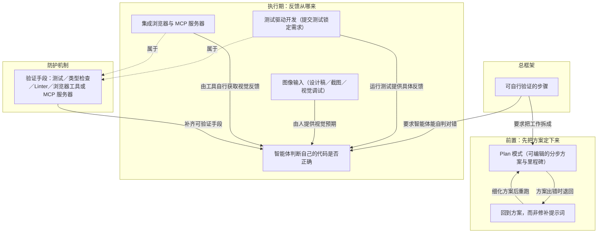

# 概念解析辞典

> 针对《你已完成本节》（cursor.com｜Cursor Documentation）的概念提取

## 一、核心概念

### 1. **可自行验证的步骤**

- **context**：开篇给出的是整章的判断标准，后面所有做法都由它派生。

  > 使用智能体开发功能的关键，是将工作拆分为智能体可自行验证的步骤。每项重要功能都应先制定方案，再设置适当的防护机制，让智能体能够发现并修复自身错误。

  拆分的具体形态：

  > Cursor 会将较大的请求拆分为更小、可独立验证的步骤，让方案更实用。在每一步中，智能体都可以衡量进度、确认步骤是否已成功完成，然后继续下一步。

- **费曼一下**：这是本文对"一个任务该多大"的定义。拆分单位不是"人做起来顺不顺手"，而是"智能体自己能不能判断这一步成了没有"——所以每一步都要带可衡量的完成信号。它是承重结构：先制定方案（把步骤提前定下来）、设置防护机制（给步骤装上自动判对错的手段）、出错时回方案重来，都是为这一条服务的。拿掉它，Plan 模式、TDD、验证清单就只是零散技巧，看不出为什么被放在一起。

### 2. **Plan 模式**

- **context**：写代码之前先梳理要构建的内容。

  > 您可以借助编码智能体，在编写代码前理清这些决策。使用 Cursor 的 Plan 模式，智能体会研究您的代码库、向您提出澄清性问题，并生成一份可供您编辑和调整的分步方案。

  > 您回答后，智能体会生成一份结构化方案，其中包含在构建功能过程中可审查和验证的里程碑。该方案可编辑，如果有任何不妥之处，您可以进行修改

- **费曼一下**：Plan 模式把"想清楚"这一步也交给智能体，但顺序是反的：智能体先提问澄清需求，再研究代码库，最后产出分步方案。方案的关键属性有三条——结构化（含里程碑）、可编辑（你能改）、每个里程碑都可审查和验证。它就是把"一个大请求"翻译成"可自行验证的步骤"的那台机器，也是后面"回到方案"能成立的前提：没有一份可编辑的方案，就没有可返回的地方。

### 3. **回到方案，而非修补提示词**

- **context**：

  > 有时，智能体构建出的内容并不符合预期。与其通过后续提示词尝试修复，不如回到方案。撤销更改，并在再次运行前细化方案，使其更加明确。

  > 例如，如果遗漏了关键的架构或系统设计说明，方案可能会构建出错误的内容。从方案重新开始看似违反直觉，但往往比修补一个从一开始方向就错了的方法更快。

- **费曼一下**：出错时最自然的反应是再补一句提示词修一修，作者说方向错了就该退回方案层。理由在于方案承载的是"方向"，提示词修补只在方向正确时有效；方向错了，补得越多越乱。所以"撤销更改、细化方案、重跑"不是退步，而是更快的路径。这条是机制边界：它规定了错误应该在哪个层级被处理。

### 4. **智能体判断自己的代码是否正确（自我验证）**

- **context**：

  > 智能体能判断自己的代码是否正确时，效果最佳。测试失败后，智能体可以了解问题所在并再次尝试。

  > 为什么这种方法如此有效？因为智能体可以运行测试、查看失败情况、调整代码，然后再次尝试。每次运行测试都会为智能体提供具体反馈。没有测试，它就无法知道自己所做的代码更改是否有效。

- **费曼一下**：智能体的上限不由"写得多快"决定，而由"能不能拿到关于自己产出的具体反馈"决定。有反馈，它就能自己形成"失败→定位→修改→再试"的循环；没反馈，它只能猜，验证的活儿就全落到你头上。这是本文的核心机制，TDD、图像输入、浏览器工具、四类验证手段都是为它供料的。

### 5. **测试驱动开发（TDD）**

- **context**：作者把它列为步骤清单，其中第三步和第四步规定了需求的锁定方式。

  > 3. **提交测试。** 当您对测试覆盖和质量感到满意后，提交测试。这会锁定需求，供智能体据此实现。
  > 4. **要求智能体编写代码。** 告诉它在不修改测试的前提下让所有测试通过。不断迭代，直到全部通过。

  执行时下发的提示词：

  > 让 src/\_\_tests\_\_/discountCode.test.ts 中的所有测试通过。遵循 src/services/PricingService.ts 中的服务模式。不要修改测试。

  它还说明了先写测试时要说清意图，以及这套方法在哪种代码上价值最大：

  > 明确说明您在进行 TDD，避免它为尚不存在的代码创建模拟函数。

  > 这种方法对后端代码尤其有价值，因为您无法通过查看屏幕来验证其正确性。您在测试中描述预期行为，智能体则编写与之匹配的代码。

- **费曼一下**：在本文里 TDD 不只是编程习惯，它是给智能体造反馈回路的手段。要害在第三步：测试先提交，"需求"就被锁住；第四步的"不修改测试"是硬约束——智能体只能改实现去迁就测试，不能改测试来迁就实现。第一、二步（先写测试、确认它失败）保证测试真的在描述还不存在的行为，而不是给已有代码补一份永远通过的说明。后端之所以尤其受益，是因为它的正确性看不见屏幕，只能在测试里被描述出来。

### 6. **图像输入（设计稿／截图／视觉调试）**

- **context**：

  > 智能体可以处理和理解图像。你可以直接将屏幕截图或设计稿粘贴到提示词输入框中，智能体会根据图像还原设计。

  > 适用于：
  > * **设计稿**：粘贴线框图或 Figma 导出内容，让智能体构建组件
  > * **视觉调试**：截取非预期的 UI 状态，让智能体进行排查
  > * **迭代**：截取当前结果的屏幕截图，并说明需要更改的内容

- **费曼一下**：后端可以用测试描述"预期行为"，UI 的预期很多时候只能看出来。把设计稿或截屏贴进提示词，等于把视觉预期交给智能体，让它有了可对照的对象——这种对照有三种用法：照着还原、拿来排查、按截图迭代。它是"给智能体具体反馈"在视觉这一侧的入口。

### 7. **集成浏览器与 MCP 服务器**

- **context**：

  > 你还可以连接 Figma MCP 服务器，让智能体直接从你的 Figma 文件中提取设计 token、变量和组件规格。

  > 集成浏览器可让你在智能体进行更改时预览效果。借助此浏览器，智能体可以浏览页面、截取屏幕截图并验证自己的视觉输出。这样你无需再手动将屏幕截图传回给智能体。

- **费曼一下**：上一个概念里视觉反馈靠人手动粘贴，人就卡在回路中间。集成浏览器把这个环节交给智能体自己：它能自己开页面、截图、比对，从而"验证自己的视觉输出"；Figma MCP 让它直接从设计文件取 token 与组件规格，不必由人转述。二者的分界很清楚——图像输入是人给的材料，浏览器与 MCP 是智能体自取的反馈，后者把它从半自动变成了闭环。

### 8. **验证手段（防护机制）**

- **context**：

  > 快速开发功能时，最大的风险是跳过验证。智能体可以快速生成大量代码，但一味追求速度而不保证正确性，日后反而会增加工作量。

  > 以下是帮助智能体验证其工作成果的具体方法：
  > * 验证逻辑和行为的**测试**
  > * 验证结构正确性的**类型检查**
  > * 强制执行代码风格和模式的 **Linter**
  > * 获取 UI 更改反馈的**浏览器工具或 MCP 服务器**

  > 如果智能体无法验证其输出，后续你将花费更多时间进行修正。

- **费曼一下**：这是开头所说的"防护机制"落到实处的清单：四类手段各管一层正确性——行为、结构、风格、UI，合起来决定智能体能不能自己发现错误。作者给的判据很直白：无法验证输出，你日后就要花更多时间修正。落到实践上，判断一项功能该怎么做的标准之一，是先问"智能体靠什么知道它做对了"。

## 二、概念架构图

分四层：总框架决定一切；前置层在动手前把方向和步骤固定下来；执行层说明反馈从哪几条路来，并统一汇入"自我验证"；最下层是防护机制清单，其中测试与浏览器工具本身也是清单里的成员。

