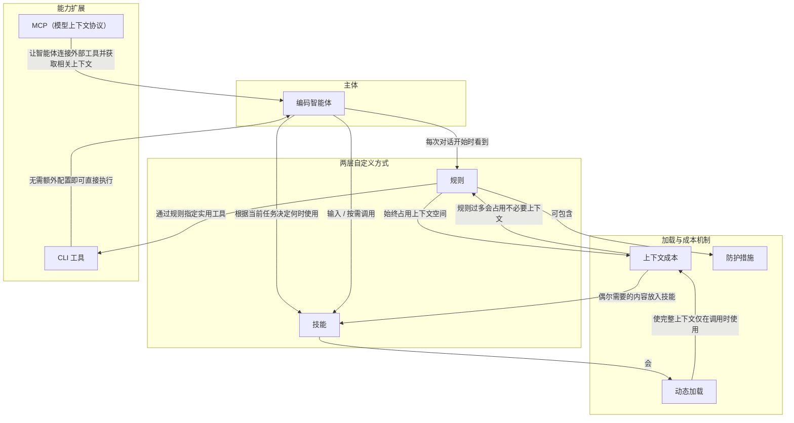

# 概念解析辞典

> 针对《自定义 Agent》（Cursor Documentation）的概念提取

## 一、核心概念

### 1. **规则（Rules）**

- **context**：作者先给出规则的定义与位置，并说明它应如何书写。

  > 规则是存储在 `.cursor/rules/` 中的 markdown 文件，智能体会在每次对话开始时看到这些文件。您可以将其视为始终包含的指令，用于指导智能体如何处理您的代码。

  > 好的规则文件应简短、具体，引用示例而非直接复制示例：

- **费曼一下**：规则是始终进入每次对话的自定义指令，放在 `.cursor/rules/` 里，用 markdown 写。它补足智能体不了解团队习惯、偏好工具和业务上下文的问题。因为智能体每次都会看到规则，规则会一直占用上下文，所以作者强调它应简短、具体、引用权威示例，而不是照搬整套风格指南或记录所有命令。它是两层自定义的第一层，也是理解“始终生效的约定”与“按需技能”区别的基础。

### 2. **技能（Skills）**

- **context**：作者用技能说明另一种自定义方式，并把它与规则进行对照。

  > 技能可通过专业知识和工作流扩展智能体的能力。与规则不同，技能会动态加载。智能体会根据当前任务决定何时使用它们。

  > 技能在 `SKILL.md` 文件中定义，可包含领域知识、自定义工作流，以及智能体可执行的脚本和代码。

  > 您还可以在智能体输入框中输入 `/`，按需调用技能。这样便可将技能转为可通过名称触发的可复用工作流，非常适合每天需要多次执行的任务。

  > | **用途** | 始终生效的约定 | 专门的工作流 |
  > | **上下文成本** | 始终占用上下文空间 | 仅在调用时使用完整上下文 |
  > | **最适合用于** | 智能体应始终了解的内容 | 智能体在被要求时可以执行的操作 |

- **费曼一下**：技能是按需使用的专业知识和工作流，定义在 `SKILL.md` 中，可以包含领域知识、自定义流程，以及智能体能执行的脚本和代码。它不必像规则那样每次对话都出现；智能体会根据当前任务决定何时使用，用户也可以输入 `/` 主动调用。它解决的是“需要时再拿出专门知识或操作”的问题，是两层自定义中偏向专门工作流和可执行操作的一层。

### 3. **动态加载**

- **context**：作者用“动态加载”说明技能与规则在加载方式上的根本不同。

  > 与规则不同，技能会动态加载。智能体会根据当前任务决定何时使用它们。

- **费曼一下**：动态加载是指技能不是一开始就全部塞进上下文，而是由智能体根据当前任务判断何时调用、何时把完整内容加载进来。它解释了技能为什么能做到“需要时才有专门知识”，同时不必一直占用上下文。拿掉它，读者就看不出技能和规则在机制上为什么不同。

### 4. **上下文成本**

- **context**：作者在规则与技能的对照表中列出上下文成本，并在后文解释规则过多的后果。

  > | **上下文成本** | 始终占用上下文空间 | 仅在调用时使用完整上下文 |

  > 规则过多会占用不必要的上下文，还可能让智能体感到困惑。

  > 如果只是偶尔需要某些内容，请将其放入技能中。

- **费曼一下**：上下文成本是指自定义内容占用智能体可用上下文空间、影响其注意力的代价。规则始终生效，所以它的成本持续存在；技能只在调用时使用完整上下文，所以平时成本较低。作者正是用这个成本解释为什么规则要精简、为什么偶尔才需要的内容应放进技能。它是规则/技能分工背后的边界条件。

### 5. **防护措施**

- **context**：作者把防护措施列为规则最适合的用途之一。

  > 规则最适合用于：

  > * 防护措施 (不得修改的文件、应避免的模式)

- **费曼一下**：防护措施是规则里写明的禁止或避免边界，例如不得修改某些文件、应避免某些模式。它说明规则不仅告诉智能体“应该怎么做”，也能限定智能体“不能做什么”。这是规则机制中的权限边界，拿掉它，读者会看不到规则如何限制智能体的行为范围。

### 6. **MCP（模型上下文协议）**

- **context**：作者把 MCP 作为连接外部工具、获取相关上下文的机制。

  > MCP (模型上下文协议) 可让智能体连接外部工具，并获取相关上下文。MCP 服务器提供智能体可按需使用的上下文和操作。

  > 例如，您可以将智能体连接到：

  > * **Slack**，读取消息和发布更新
  > * **Datadog**，排查生产环境日志
  > * **Sentry**，查找错误详情和堆栈跟踪
  > * **数据库**，直接查询数据
  > * **Figma**，获取设计 token 和组件规格

- **费曼一下**：MCP 是让智能体连接外部工具并获取相关上下文的协议。通过 MCP 服务器，智能体能按需使用外部上下文和操作，例如读 Slack、查 Datadog、看 Sentry、查数据库、取 Figma 设计信息。它扩展的是智能体可触达的外部能力，区别于规则和技能这种自定义知识或工作流。

### 7. **CLI 工具**

- **context**：作者说明除 MCP 外，智能体还能直接运行终端里的 CLI 工具，并可用规则指定使用哪个工具。

  > 除 MCP 外，智能体还可以运行终端中安装的任何 CLI 工具。`gh`、`aws`、`kubectl` 和 `docker` 等工具无需额外配置即可使用。智能体可以直接执行这些工具。

  > 通过规则为智能体指定实用工具：

  > - 所有 GitHub 操作（问题、PR、CI 检查）均使用 `gh`
  > - 文件存储操作使用 `aws s3`

- **费曼一下**：CLI 工具是智能体可以直接在终端执行的外部程序。与 MCP 不同，它们不需要额外配置，只要终端里安装了就能用。作者用 `gh`、`aws`、`kubectl`、`docker` 说明智能体能操作 GitHub、云服务、Kubernetes、Docker 等。规则还可以指定某类操作该用哪个 CLI 工具。它补全了智能体扩展操作能力的另一条路径。

## 二、概念架构图

