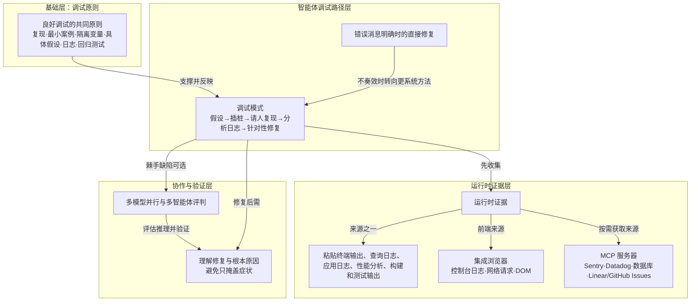

# 概念解析辞典

> 针对《查找并修复缺陷》（Cursor Documentation，cursor.com）的概念提取

## 一、核心概念

### 1. **良好调试的共同原则**

- **context**：文章先给出总起和六条原则，作为全文的方法地基。

  > 无论由人还是智能体执行，良好的调试都遵循相同的原则：
  >
  > 1. **建立可靠的复现步骤。** 如果无法复现缺陷，就无法验证修复是否有效。记录触发问题的确切步骤、输入和条件。
  > 2. **缩减到最小案例。** 去除一切与缺陷无关的内容。复现案例越小，越容易找到根本原因。
  > 3. **隔离变量。** 每次只改动一项。如果改了三项后缺陷消失，就无法确定是哪项改动修复了它。
  > 4. **提出具体假设。** 针对可能的根本原因提出几个假设。“缺陷可能出在支付代码中”太过模糊。“缺陷发生是因为 `calculateTotal()` 未考虑负折扣”则足够具体，可以进行验证。
  > 5. **为您的代码添加日志。** 在怀疑存在问题的位置的输入和输出处添加日志记录。将预期值与实际观察到的值进行比较。
  > 6. **用测试防止回归。** 找到并修复缺陷后，编写一个本可以捕获该缺陷的测试。这样可以防止同一缺陷再次出现。

- **费曼一下**：这组原则是全文的地基。它说明调试不是凭感觉改代码，而是先让缺陷可重复出现，再缩小范围、控制变量、提出可验证假设、用日志看真实值，最后用测试锁住修复。后面智能体的直接修复和调试模式，都是把这些原则交给智能体执行或自动化。若拿掉它，读者就看不出智能体调试为什么仍然要求复现、假设、证据和回归测试。

### 2. **错误消息明确时的直接修复**

- **context**：文章把它作为轻量路径，与后文调试模式形成对照。

  > 对于错误消息明确或原因显而易见的缺陷，智能体通常可以直接定位并修复问题。粘贴错误信息，补充一些发生时的上下文，然后交给智能体处理。
  >
  > 当能从错误消息中看出原因时，这种方法效果很好。智能体可以读取堆栈跟踪，找到相关代码并修复。不过，这种方法并非总是奏效，你可能需要采用更系统的方法来查找根本原因。

- **费曼一下**：这是智能体调试中最直接的方式：当错误消息或堆栈跟踪已经指向原因时，智能体可以读错误、读代码、直接修改。它的价值在于划出适用边界——它只适合明确错误，不是所有缺陷都能这样解决；一旦不奏效，就需要转向更系统的调试模式。没有这个对照，读者会误以为智能体调试只有一种路径。

### 3. **调试模式（Debug Mode）**

- **context**：文章用它处理更棘手的缺陷，并说明它先收集运行时证据。

  > 对于更棘手的缺陷，调试模式采用不同的方法。它不会猜测如何修复，而是先收集运行时证据。
  >
  > 调试模式遵循五个步骤，反映了调试的基本方法：
  >
  > 1. **提出假设**，判断可能出错的原因
  > 2. 通过有针对性的日志记录**为您的代码插桩**
  > 3. 在收集数据时**请您复现**缺陷
  > 4. **分析日志**以确定根本原因
  > 5. 根据收集到的证据**进行针对性修复**

- **费曼一下**：调试模式是文章针对棘手缺陷给出的核心机制。它把修复动作推迟到证据之后：先假设可能原因，再插桩记录，请人复现，分析日志，最后才做针对性修复。它解决的是“没有一致错误消息、仅靠读代码难定位”的问题。它与前面的基本调试原则一致，但由智能体主导，把原本手动排查的过程自动化。

### 4. **运行时证据**

- **context**：文章反复用它解释智能体为什么能更深入分析，以及为什么需要浏览器和 MCP 等工具。

  > 智能体仅凭阅读代码就能发现性能问题和常见缺陷。但你提供的运行时证据越多，它就能分析得越深入。
  >
  > 当仅靠代码分析还不够时，为智能体提供真实数据。将终端输出、查询日志或其他数据粘贴到对话中。智能体可以利用这些数据更高效地找出根本原因。

- **费曼一下**：运行时证据是程序真实运行后留下的数据，而不是静态代码本身。它可以是终端输出、查询日志、应用日志、性能分析数据、构建和测试输出等。文章用它区分两种智能体调试能力：只读代码时，智能体能找常见问题和性能隐患；拿到运行时证据后，它才能按真实数据追溯根因。运行证据越多，分析越深，这是调试模式、集成浏览器和 MCP 的共同价值基础。

### 5. **多模型并行与多智能体评判**

- **context**：文章用它处理棘手缺陷，并强调独立工作和比较证据。

  > 对于棘手的缺陷，不同模型有时会发现不同的线索。Cursor 允许你同时让多个模型运行同一条调试提示词。每个智能体都在隔离环境中工作，因此不会相互干扰。
  >
  > 工作流程：
  >
  > 1. 编写清晰的调试说明，包含复现步骤和你的假设
  > 2. 从智能体下拉菜单中选择多个模型
  > 3. 提交提示词；每个模型独立工作
  > 4. 比较各模型提出的修复方案
  > 5. 保留证据最充分的方案
  >
  > Cursor 会建议它认为最佳的解决方案，但你应评估其推理过程，而不只是最终方案。要进一步确认修复是否准确，可以要求模型验证其工作，并确保该方案正确。

- **费曼一下**：面对棘手缺陷，文章不建议只押注一个模型的答案，而是让多个模型在隔离环境中并行调查同一调试提示词，再比较它们提出的修复方案和支撑证据。选择标准不是“推荐了哪个”，而是“哪个证据最充分”。这还引出了人的判断责任：要评估推理过程，并要求模型验证工作。它承重，因为文章把智能体可能编造合理解释的风险，转化为多路径比较和人工评估。

### 6. **集成浏览器**

- **context**：文章把它作为前端问题的运行时证据入口。

  > 对于前端问题，Cursor 的集成浏览器让智能体可以直接访问你的 Web 应用。它可以读取控制台日志、检查网络请求并查看 DOM，无需你手动复制任何内容。
  >
  > 让智能体打开页面、复现问题，并检查控制台中的错误或网络标签页中的慢请求。智能体能看到你在 DevTools 中看到的内容，并可将问题追溯到源代码。

- **费曼一下**：集成浏览器让智能体在前端调试中不必等用户手动粘贴日志，而是直接打开页面、复现问题、读取控制台、检查网络请求、查看 DOM，并追溯到源代码。它相当于让智能体拥有类似人在 DevTools 中观察页面运行情况的能力。它是运行时证据的一种专门通道，说明智能体能获取的不只是文本日志。

### 7. **MCP 服务器**

- **context**：文章用它说明智能体如何连接生产可观测性工具，按需获取数据。

  > MCP 服务器可为智能体提供新能力，并将其连接到生产环境的可观测性工具。智能体无需手动粘贴数据，可按需获取所需信息。
  >
  > 在上面的示例中，智能体通过 MCP 查询 Sentry 并获取相关错误详情。它将错误与日志关联，找到问题代码并提出修复方案，所有操作都在同一对话中完成。

- **费曼一下**：在这篇文章里，MCP 服务器不是泛泛的协议知识，而是让智能体连接外部工具和生产数据的机制。它把调试所需的信息从人工粘贴变成按需拉取，例如从 Sentry 取错误详情、从 Datadog 取生产日志和 APM 跟踪、查数据库验证假设、从 Linear 或 GitHub Issues 引入缺陷报告和复现步骤。它扩展了运行时证据的获取方式，也支撑了后续自动触发调查的工作流。

### 8. **监控告警自动触发智能体调查**

- **context**：文章用它展示智能体调试可以前移到生产告警阶段。

  > 你可以设置工作流，让生产环境应用的监控告警自动触发智能体调查。如果错误率激增，Linear 会创建一个工单，智能体会在人工介入前开始诊断问题。这可以缩短解决客户报告的错误所需的时间，甚至在客户察觉前修复问题。

- **费曼一下**：这是把调试触发点从“人发现问题后叫智能体”前移到“监控告警和工单系统自动叫智能体”。错误率激增时，工单被创建，智能体在人工介入前开始诊断。它体现智能体调试的自动化边界：不仅能被动回答提示词，还能接入生产监控流程，争取在客户报告前发现问题并缩短解决时间。

### 9. **理解修复与根本原因**

- **context**：文章用它划定验证智能体修复的质量边界，防止只让错误消失。

  > 如果你不理解修复方案，就无法验证它是否正确。智能体可能会添加空值检查，让错误消失，但底层的数据不一致问题依然存在。
  >
  > 当智能体提出修复方案时，要不断追问，直到完全理解。为什么这个值是 null？是什么变化导致了这种情况？这是根本原因，还是只是在掩盖症状？

- **费曼一下**：验证修复的标准不是错误是否消失，而是人能否解释因果链并确认根本原因。智能体可能加一个空值检查让报错消失，但底层数据不一致仍然存在。文章要求不断追问“为什么这个值是 null”“什么变化导致这种情况”“这是根本原因还是掩盖症状”，并用调查数据确认智能体是否找到真正根因。它承重，因为它把人的理解放在智能体建议之上，划出了智能体调试的质量边界。

## 二、概念架构图

