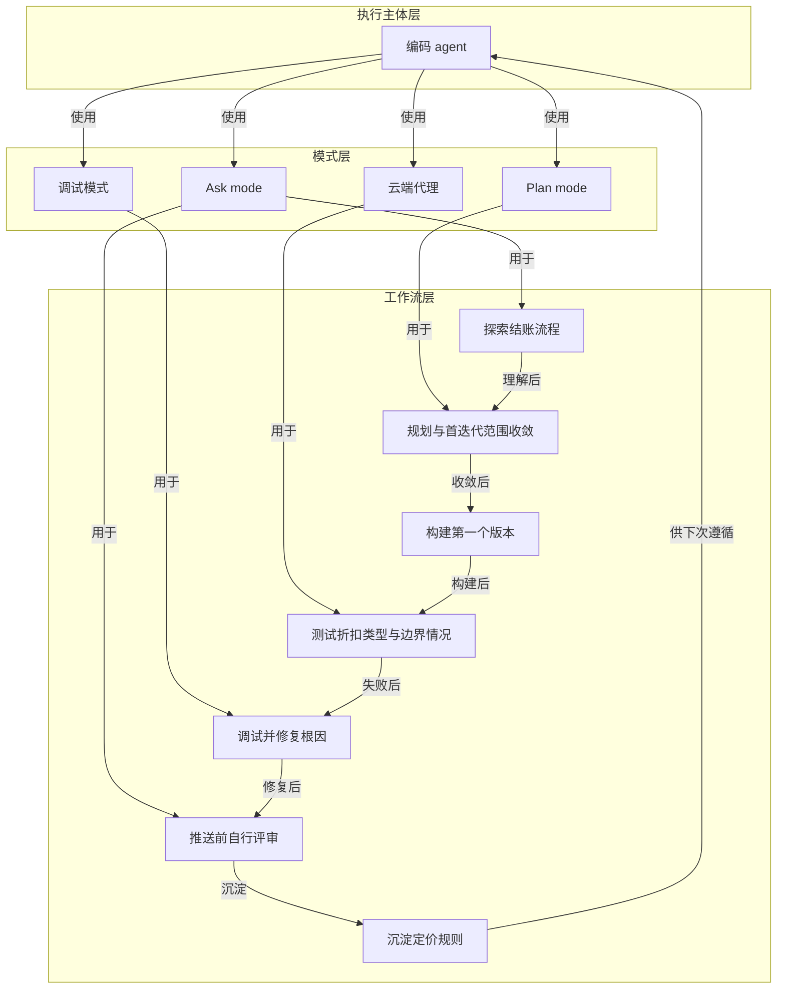

# 概念解析辞典

> 针对《你已完成本节》（Cursor Documentation，cursor.com）的概念提取

## 一、核心概念

### 1. **编码 agent（coding agent）**

- **context**：全文把它当作贯穿始终的协作执行者。

  > 恭喜，您已经学会如何与编码 agent 协作。
  >
  > 现在，您已经知道如何利用 agents 理解代码库、快速开发功能、搜索代码并查找缺陷、更高效地评审代码，以及按需自定义 agents。

- **费曼一下**：在本文里，编码 agent 不是只补全一行代码的工具，而是被用来完成理解代码库、开发功能、搜索和查找缺陷、评审代码以及按需自定义的执行主体。给结账流程加折扣码的示例，就是让编码 agent 参与探索、规划、构建、调试、评审和沉淀规则。去掉它，后面的模式、调试和规则沉淀都没有执行者。

### 2. **Ask mode（Ask 模式）**

- **context**：文中用 Ask mode 做两件事——动手前探索，以及推送前自评。

  > 在动手之前，先探索结账流程。借助智能体建立整体认知。
  >
  > Ask mode example: 探索结账流程
  >
  > 我需要在结账流程中添加折扣码。在进行任何更改之前，请带我了解结账流程的运作方式。涉及哪些组件、API 路由和服务？请展示从购物车到付款确认的数据流。
  >
  > Ask mode example: 推送前自行评审
  >
  > 评审我为折扣码功能所做的所有更改。检查缺陷、遗漏的错误处理、边界情况，以及是否遵循现有模式。代码审阅人会标出哪些问题？

- **费曼一下**：Ask mode 在本文中是“先提问、先理解”的模式。用于探索时，它帮助建立从购物车到付款确认的数据流认知，并找到折扣应该应用的位置；用于评审时，它让 agent 站在代码审阅人角度检查缺陷、遗漏的错误处理、边界情况和是否遵循现有模式。去掉它，读者就看不懂“先探索”和“推送前评审”具体靠什么完成。

### 3. **Plan mode（Plan 模式）**

- **context**：理解代码库之后、构建之前，用 Plan mode 把工作列出来。

  > 现在你已经理解了代码库，接下来创建一个方案。切换到 Plan 模式 (`Shift+Tab`) ，列出需要完成的工作：
  >
  > 为结账流程添加折扣码支持。用户输入折扣码后，系统会进行验证，并在计算税费前将折扣应用到订单总额中。
  >
  > 添加包含验证逻辑的 DiscountService（有效期、用量限额）
  >
  > 修改 PricingService.calculateTotal()，使其接受可选的折扣
  >
  > 添加 /api/discount/validate 端点
  >
  > 然后点击 **构建**，创建该功能的第一个版本。

- **费曼一下**：Plan mode 是写代码前的规划动作。它把“加折扣码”拆成可执行条目：建 DiscountService、改 PricingService.calculateTotal()、加验证端点、写测试等。文章强调在理解代码库之后、构建之前使用它，让方案先显式列出来，再进入构建。去掉它，读者就无法理解构建第一个版本的依据从哪里来。

### 4. **首迭代范围收敛**

- **context**：方案列出来之后，还要评审并砍掉首版不需要的部分。

  > 评审方案。移除对首次迭代而言范围过大的步骤。聚焦核心流程：应用折扣码、计算折扣，并在摘要中显示。然后点击 **构建**，创建该功能的第一个版本。

- **费曼一下**：这不是把需求全部砍掉，而是在方案评审时划出“首次迭代”的边界：去掉范围过大的步骤，只保留核心流程——应用折扣码、计算折扣、在摘要中显示。它解释了为什么 Plan mode 列出的所有步骤不是一次性全做，也解释了构建第一个版本的取舍标准。拿掉它，读者会以为方案里的每一步都必须进入首版，机制的边界就丢了。

### 5. **调试与根因修复**

- **context**：一个测试始终失败，文章用调试模式和根因原则处理。

  > 构建后，有一个测试始终失败：将百分比折扣与固定金额折扣叠加时，计算出的总额不正确。同一组折扣因应用顺序不同而得出不同结果。
  >
  > 使用调试模式，或让智能体调查根本原因：
  >
  > 折扣叠加测试失败。同一组折扣因应用顺序不同而得出不同的总额。找出原因，并修复 src/services/DiscountService.ts 中折扣应用的顺序。在每一步显示调整前后的值。
  >
  > 这运用了“查找和修复缺陷”章节中的调试原则：不要只修复症状，要找到根本原因。

- **费曼一下**：本文用这个失败测试说明调试不是把错误数字改对，而是定位根因：折扣叠加时，百分比折扣和固定金额折扣的应用顺序导致同一组折扣产生不同总额。修复对象因此落在 DiscountService.ts 中折扣应用的顺序上。去掉这个机制，读者只能看到“测试失败—修复”，看不到为什么修复顺序才是根本解。

### 6. **云端代理的边界测试（Cloud Agents）**

- **context**：推送和合并前，可用云端代理补测本地可能漏掉的边界情况。

  > 如果你已配置云端代理，可以启动几个来测试可能遗漏的边界情况：折扣码中的 Unicode 字符、大额折扣值或折扣码的并发使用。云端代理会反馈它们覆盖的情况和需要进一步测试的方面，让你能在合并前补齐空缺。

- **费曼一下**：云端代理在本文里是可选的并行测试手段：启动多个代理去覆盖本地可能漏掉的边界情况，如 Unicode、大额折扣值、并发使用。它反馈覆盖范围和待测方面，目的是在合并前补齐空缺。它把“测试”从跑通主流程扩展到边界情况，是评审和合并前质量边界的一部分。

### 7. **规则沉淀 / 定价规则**

- **context**：开发中发现的顺序问题被写成规则，供智能体下次遵循。

  > 你在开发此功能时发现：为确保结果不受输入顺序影响，折扣计算应始终先应用百分比折扣，再应用固定金额折扣。将这一点记录为规则，方便智能体下次遵循：
  >
  > ```
  > # 定价规则
  >
  > - 在应用固定金额折扣之前先应用百分比折扣
  > - 订单总额不得低于 $0
  > - 有关标准计算模式，请参见 src/services/PricingService.ts
  > ```

- **费曼一下**：规则沉淀是把调试和开发中发现的不变量写下来，供智能体下次遵循。这里的“定价规则”记录了三条：百分比折扣先于固定金额折扣、订单总额不得低于 $0、标准计算模式看 PricingService.ts。它让一次性的经验变成可复用的约束，解释了“为未来沉淀知识”如何落地。去掉它，闭环就少了对未来 agent 行为的约束机制。

### 8. **完整闭环（探索—规划—构建—测试—调试—评审—沉淀）**

- **context**：这是全文对工作流的总体概括。

  > 这是一个很现实的场景。构建前需要先探索，编写代码前需要先制定方案，上线前需要先测试，合并前需要先评审。
  >
  > 至此形成完整闭环。你已完成探索、规划、构建、测试、调试、评审，并为未来沉淀了知识。

- **费曼一下**：这是全文的主框架：把编码 agent 的不同能力串成一个有顺序的闭环。先探索结账流程，再在 Plan mode 制定并收敛方案，然后构建第一个版本，测试失败后调试根因，推送前用 Ask mode 自我评审，可用云端代理补边界情况，最后把定价规则记录下来供下次使用。它回答的是“如何把前面学到的能力组合起来做一件事”。去掉它，各模式就只是零散工具。

## 二、概念架构图


