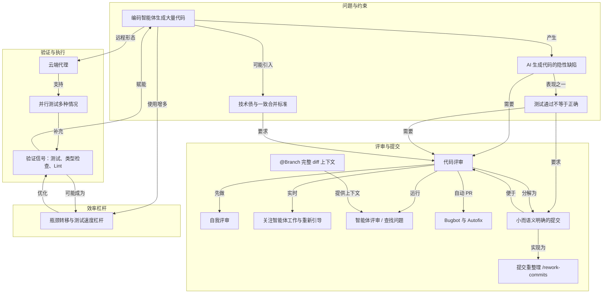

# 概念解析辞典

> 针对《评审和测试代码》（来源：cursor.com｜作者：Cursor Documentation）的概念提取

## 一、核心概念

### 1. **编码智能体（Coding Agent）**

- **context**：作者在开篇就把编码智能体的产出能力与质量风险连在一起。

  > 编码智能体可以生成大量代码，这也意味着可能引入技术债。快速开发固然很好，但质量标准不能降低。无论代码是手写还是由智能体编写，合并标准都应一致。

- **费曼一下**：在本文里，编码智能体不是一次性的代码补全，而是一个能生成大量代码、评审 diff、写测试、整理提交、在云端自主创建 PR 的执行主体。全文讨论的评审、验证、测试提速，都是围绕如何管理这种执行主体的产出。

### 2. **技术债与一致合并标准**

- **context**：作者先承认智能体开发速度快，再提出不能因此降低质量门槛。

  > 编码智能体可以生成大量代码，这也意味着可能引入技术债。快速开发固然很好，但质量标准不能降低。无论代码是手写还是由智能体编写，合并标准都应一致。

- **费曼一下**：技术债在这里指智能体快速生成代码后留下的维护成本。一致合并标准意味着不能因为代码是智能体写的，就放宽审查；手写代码和智能体代码进入代码库前要面对同一套质量标准。

### 3. **AI 生成代码的隐性缺陷**

- **context**：作者解释了为什么“看起来没问题”的代码仍然危险。

  > AI 生成的代码看起来可能没问题，但实际上可能存在不易察觉的错误。它可能遵循现有模式、能够编译并通过您编写的测试，但仍可能遗漏边界情况、存在安全问题，或重复代码库其他位置已有的逻辑。

- **费曼一下**：这类缺陷不是编译失败或现有测试变红，而是边界遗漏、安全漏洞、重复实现。它让评审变得必要，因为表面通过并不能证明代码真正正确。

### 4. **测试通过不等于正确**

- **context**：作者在讲完测试能力后，补充了测试的局限。

  > 测试通过并不意味着代码一定能正确运行。测试可能验证了错误的行为。智能体编写的代码或许能处理正常情况，却未考虑所有边界情况。

- **费曼一下**：测试是验证信号，不是正确性证明。如果测试本身写错，或只覆盖正常路径，绿灯也会掩盖问题。因此仍需要理解代码更改；更改太大时，要拆分成更容易评审的部分。

### 5. **代码评审**

- **context**：作者把代码评审放在质量流程的核心位置。

  > 这正是代码评审如此重要的原因。您需要建立合适的流程，以确保代码库质量，并在问题进入生产环境前发现它们。作为工程师，您有责任投入精力，确保代码评审有效开展。

- **费曼一下**：代码评审是问题进入生产前的质量门。它不是形式上的点头，而是需要流程和工程师投入的检查机制，用来发现智能体或人类都可能遗漏的问题。

### 6. **自我评审（让智能体评审自己的工作）**

- **context**：作者先给出顺序原则，再说明可以让智能体一次评审所有更改。

  > 在请他人查看之前，您应先评审自己的代码。

  > 让智能体一次评审所有更改。在提示词中添加 `@Branch`，即可将当前分支的完整 diff 提供给智能体。您可以说“评审此分支上的更改”或“我现在正在做什么？”，为智能体提供丰富的上下文，并发现跨多个文件的问题。

- **费曼一下**：自我评审是在请别人看之前，先由自己或让智能体检查自己的改动。它不是代替人工评审，而是前置过滤：先让智能体带着完整分支上下文找出缺陷、错误处理和模式不一致。

### 7. **关注智能体工作 / 停止与重新引导**

- **context**：作者强调不要等智能体完全跑偏才处理。

  > 关注智能体的工作。diff 视图会实时显示更改。如果发现智能体正朝错误的方向推进，请点击 **停止** 或按 Cmd Shift BackspaceCtrl Shift Backspace 取消并重新引导。无需等它完成。若需进行较大的调整，请先还原更改并完善方案，再次运行。

- **费曼一下**：这是生成过程中的实时控制。diff 视图让方向错误可见，停止、取消、还原、重新引导则是干预手段。它避免智能体在错误方向上生成更多需要丢弃的改动。

### 8. **@Branch 完整 diff 上下文**

- **context**：作者把 `@Branch` 作为让智能体评审整组更改的机制。

  > 在提示词中添加 `@Branch`，即可将当前分支的完整 diff 提供给智能体。您可以说“评审此分支上的更改”或“我现在正在做什么？”，为智能体提供丰富的上下文，并发现跨多个文件的问题。

- **费曼一下**：`@Branch` 的作用是给智能体完整分支差异，而不是零散片段。完整 diff 让评审能看到文件之间的关系，从而发现单个文件视角看不到的跨文件问题。

### 9. **智能体评审 / 查找问题**

- **context**：作者描述了一个专门的评审入口。

  > 智能体完成任务后，点击 **评审**，再点击 **查找问题**，即可运行专门的代码评审。智能体会逐行分析拟议的编辑，并标记潜在问题。

  > 如需评审所有本地更改，请打开源代码控制标签页并运行 智能体评审，将其与主分支进行比较。这能发现整组更改中的问题。

- **费曼一下**：这是让智能体从“写代码”切换到“审代码”的模式。它逐行分析拟议编辑，也可以把本地所有更改与主分支比较，目的是找出整组更改中的问题，而不是继续生成功能。

### 10. **Bugbot 与 Autofix**

- **context**：作者介绍了自动 PR 评审工具及其修复闭环。

  > Bugbot 可与您的源代码控制服务商集成，自动评审 PR。它是日益增多的可直接在 PR 上提供反馈的工具之一。

  > 每当您推送代码时，Bugbot 都会评审 PR。它会读取变更的完整上下文，包括修改后的代码与代码库其余部分的关联，并查找可能流入生产环境的缺陷。不同于只能发现格式问题的 linter，Bugbot 能找出空指针异常、竞态条件、缺少错误处理和安全问题等逻辑错误。

  > 当 Bugbot 发现问题时，还可以提出修复方案。启用 Autofix 后，您可以直接在 PR 评论中提交修复。

- **费曼一下**：Bugbot 是接入源代码控制服务商的自动 PR 评审机制。它与 linter 的区别在于关注逻辑错误，而不是只看格式。Autofix 则把“发现问题”接到“在 PR 评论中提交修复”的闭环上。

### 11. **小而语义明确的提交**

- **context**：作者针对智能体容易产生巨大提交的问题给出提交规范。

  > 我们建议使用小而语义明确、描述清晰的提交。每次提交只代表一项逻辑更改。人工审阅人可以逐个查看提交历史，而无需面对成片的代码改动。

- **费曼一下**：小提交不是单纯减少行数，而是让每个提交只承担一项逻辑更改。这样评审者可以按提交历史逐个理解，而不是面对一次包含数百行改动、难以评审的大 diff。

### 12. **提交重整理（/rework-commits）**

- **context**：作者先描述手动整理提交很繁琐，再给出让智能体重整理提交的流程。

  > 1. 自由开发功能。迭代过程中无需担心提交规范。
  > 2. 一切正常后，让智能体将提交历史重新整理为便于评审的提交。
  > 3. 智能体会重置到 `main`，通读所有更改，并规划合理的顺序，创建整洁且提交信息清晰的提交。
  > 4. 它会验证最终 diff 与原始内容一致，确保不会丢失任何更改。

- **费曼一下**：提交重整理是把开发过程和评审过程分开：开发时可以自由迭代，功能稳定后让智能体重置到主分支、通读所有更改、按逻辑顺序创建整洁提交，并验证最终内容没有丢失或改变。`/rework-commits` 技能把这一流程固定为可复用命令。

### 13. **验证信号（测试、类型检查、Lint）**

- **context**：作者把测试、类型检查、Lint 统一为智能体可自查的信号。

  > 为了帮助确保您的代码正确无误，您需要向智能体提供明确的验证信号，让它能够自行检查工作成果：
  >
  > * **测试**可发现行为回归
  > * **类型检查**可发现结构性错误
  > * **Lint 检查**可发现风格和模式违规
  >
  > 这些检查越完善，您就越能放心地将工作委派给智能体。建议在使用智能体时，采用具备测试覆盖和 lint 规则的强类型语言。

- **费曼一下**：验证信号是智能体判断自己工作是否正确的反馈渠道。测试管行为回归，类型检查管结构错误，Lint 管风格和模式违规。信号越完善，委派给智能体自主工作的信心越高；智能体还可以写测试，甚至通过浏览器做手动测试。

### 14. **云端代理**

- **context**：作者把本地智能体与云端代理区分开。

  > 到目前为止，你使用的一直是在编辑器中本地运行的智能体。云端代理 在远程沙盒中运行，因此你可以合上笔记本电脑，稍后再查看结果。

  > 1. 描述任务并提供相关上下文
  > 2. 智能体克隆你的仓库并创建分支
  > 3. 它会自主工作，完成后创建 PR
  > 4. 评审更改，准备就绪后合并

- **费曼一下**：云端代理是运行在远程沙盒里的编码智能体，不需要本地编辑器一直开着。它克隆仓库、创建分支、自主工作并创建 PR，适合处理待办任务，也适合并行测试。

### 15. **并行测试多种情况**

- **context**：作者把云端代理用于并行探索边界情况。

  > 一种高效的做法是利用云端代理并行测试多种情况。您可以启动多个云端代理，针对应用中的不同边界情况、错误条件和输入组合进行测试。

  > 每个云端代理都会创建一个包含测试用例和结果的分支。随后，您可以将失败情况汇总为可在本地复现的测试用例，并在合并前修复。

- **费曼一下**：这不是让一个智能体顺序跑测试，而是启动多个云端代理，分别覆盖不同边界、错误条件和输入组合。每个代理产出带测试用例和结果的分支，失败情况再汇总成可以在本地复现的用例。

### 16. **瓶颈转移与测试速度杠杆**

- **context**：作者指出多智能体并行后，等待公共慢步骤会成为新瓶颈。

  > 随着您使用的编码智能体越来越多，瓶颈会转移到系统中最慢的环节。这往往是等待测试套件完成、在整个代码库中运行类型检查和 Lint 检查，或 CI 流水线中的其他步骤。

  > 每次与智能体对话都要付出这些时间成本。如果测试运行需要 10 分钟，而您并行启动了 10 个智能体，等待时间就接近两小时。将测试速度提升 50%，每次就能节省近一小时。

  > 这些改进会在每个会话、每个分支和每个智能体中持续带来收益。

- **费曼一下**：当多个智能体并行工作时，整体吞吐取决于最慢的公共环节，通常是测试、类型检查、Lint 或 CI。测试速度的改进有复利：每个会话、分支和智能体都会受益。智能体也可以代劳分析测试性能、找最慢测试、审计依赖等范围明确且可验证的任务。

## 二、概念架构图

