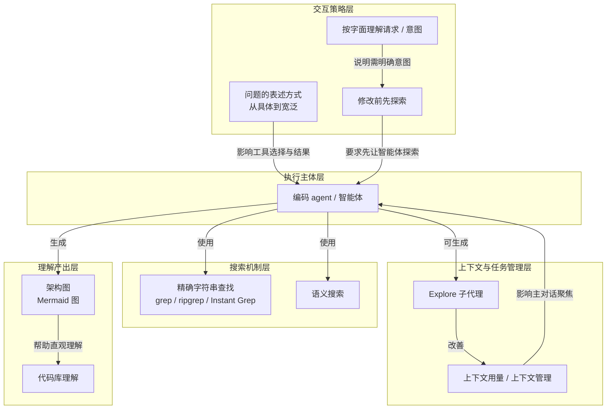

# 概念解析辞典

> 针对《理解您的代码库》（Cursor Documentation，cursor.com｜原文：https://cursor.com/cn/learn/understanding-your-codebase）的概念提取

## 一、核心概念

### 1. **编码 agent / 智能体（coding agent / Agent）**

- **context**：

  > 借助编码 agent，您可以用自然语言描述要查找的内容，让智能体使用工具帮您找到。

- **费曼一下**：本文里的编码 agent 不是被动补全代码的工具，而是能接收自然语言目标、选择搜索工具、读取代码并返回线索的执行者。后面的 grep、语义搜索、Explore 子代理、架构图和“修改前先探索”都围绕它展开。

### 2. **精确字符串查找 / grep（grep / ripgrep / Instant Grep）**

- **context**：

  > 要精确查找某段代码，最直接的方法是寻找完全匹配的内容，例如函数名、变量名或其他代码片段。
  >
  > 智能体可以使用 `grep` 这一精确字符串查找工具，也可以创建更复杂的正则表达式模式或词边界匹配。还有 `ripgrep` 等在 `grep` 基础上改进的工具，支持递归搜索。
  >
  > 这两种工具都非常好用。不过，Cursor 借助 [Instant Grep](https://cursor.com/changelog/2-1#instant-grep-beta) 将 grep 进一步优化；与 `ripgrep` 相比，它能显著加快在大型代码库中的智能体搜索速度。

- **费曼一下**：本文把 grep 类工具当作“知道要找什么”时的搜索方式：输入完全匹配、正则或词边界，`ripgrep` 支持递归搜索，Instant Grep 是 Cursor 对 grep 的进一步加速。它解决的是精确符号或代码片段的定位问题，是定向搜索的基础。

### 3. **语义搜索（semantic search）**

- **context**：

  > 当您不知道确切的符号或文本时，Agent 可以按语义搜索您的代码库。它会结合 grep 查找相关文件，并追踪精确引用。详见 [Agent 如何搜索您的代码库](https://cursor.com/docs/agent/tools/search)。

- **费曼一下**：当不知道函数名或字符串，只能描述意图时，Agent 先按语义找到相关文件，再用 grep 追踪精确引用。它不是精确匹配的替代，而是宽泛探索的入口，并最终落回精确查找。

### 4. **问题的表述方式（从具体到宽泛）**

- **context**：

  > 问题的表述方式会影响智能体使用哪些搜索工具，以及搜索结果的效果。提问可以从具体到宽泛：你可以先要求精确匹配某段文本，例如函数名；也可以提出宽泛的问题，例如“帮我了解用户在我们的应用中提交付款后会发生什么。”
  >
  > 知道自己要找什么时，就从具体的问题开始。探索陌生领域时，则可以扩大范围。

- **费曼一下**：用户怎么问，会改变智能体选择 grep 还是语义搜索，也会改变结果质量。知道目标时就从具体问题开始，让智能体先做精确匹配；探索陌生领域时就把问题放宽，让它先找相关文件。这个概念把用户意图和搜索机制连接起来。

### 5. **Explore 子代理（Explore subagent）**

- **context**：

  > 智能体还可以生成子代理，更高效地完成任务。
  >
  > 内置的 Explore 子代理可帮助您搜索代码库。Explore 子代理在独立于父智能体的上下文窗口中运行，并使用速度更快的模型，因此可以执行大量并行搜索，而不会占用过多主对话的上下文。
  >
  > 您无需手动调用它。智能体会在判断其适用时使用它。不过，您也可以直接要求使用该子代理。

- **费曼一下**：Explore 子代理是智能体在需要时生成的搜索帮手。它有自己的上下文窗口，使用更快模型做大量并行搜索，只把发现结果交回来，所以不会把大量搜索内容塞进主对话。它解释了大型代码库搜索如何保持主对话聚焦。

### 6. **上下文用量 / 上下文管理（context usage / context management）**

- **context**：

  > 正如我们在基础课程中所讲，了解并关注上下文用量很重要。如果您要搜索代码库中的许多文件，就会生成大量上下文。子代理仅返回其发现结果，让主对话保持聚焦，从而显著改善上下文管理。

- **费曼一下**：上下文用量指对话中累积的信息量。搜索很多文件会让上下文膨胀，影响主对话聚焦；本文用子代理只返回发现结果来管理它。这个机制说明子代理不是装饰，而是大型搜索中的边界条件。

### 7. **架构图（Mermaid 图）**

- **context**：

  > 对于大型或不熟悉的代码库，您可以让智能体生成架构图，例如 Mermaid 图，帮助您直观理解代码库。
  >
  > 这些图有助于入职、编写文档和设计评审。它们还能揭示架构问题，例如某个服务依赖过多其他服务，或数据流走了意料之外的路径。

- **费曼一下**：本文的架构图是让智能体把代码库结构画出来，例如 Mermaid 图，帮助直观理解大型或不熟悉的代码库。它不只用于看懂结构，也能暴露依赖过多或数据流异常等架构问题。

### 8. **修改前先探索**

- **context**：

  > 一个常见错误是，在不了解现有实现的情况下就让智能体修改代码。智能体可能会在已有工具函数的情况下新建一个，或采用与代码库其余部分不同的模式。
  >
  > 提出修改请求前，先让智能体进行探索：
  >
  > 在进行任何更改之前，请向我展示现有的表单验证是如何工作的。我们使用哪些模式？共享验证器在哪里？

- **费曼一下**：本文把“先探索再修改”当作避免模式不一致的做法：不让智能体在不知道现有实现时动手，否则可能重复造工具函数，或采用与代码库其余部分不同的模式。先让它展示现有实现、模式和共享验证器，再提修改请求。

### 9. **按字面理解请求 / 意图（literal interpretation / intent）**

- **context**：

  > 编码 agent 会按字面理解您的请求。如果您没有提供意图，它们会自行做出最佳判断。有时这样做效果不错。但对于需要遵循现有模式的更改，先理解代码库并明确知道该提出什么要求，通常能获得更好的结果。

- **费曼一下**：编码 agent 不会自动知道你的真实意图，它按字面处理请求；没提供意图时，它会自行判断。本文用它解释为什么在需要遵循现有模式的修改里，先理解代码库并明确说出要求更重要。这个机制把“修改前先探索”和“明确提问”连起来。

## 二、概念架构图

