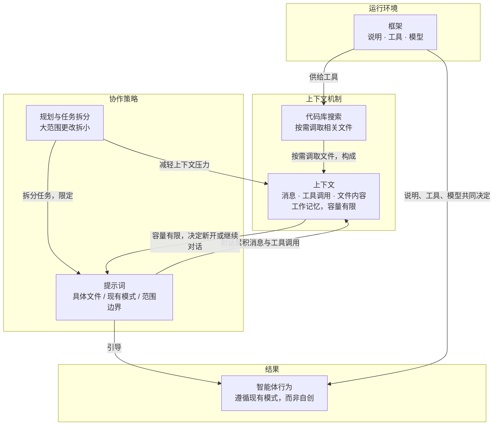

# 概念解析辞典

> 针对《与智能体协作》（Cursor Documentation，cursor.com）的概念提取

## 一、核心概念

### 1. **框架**

- **context**：作者先定义智能体运行在什么之中，再列出它的三个组成部分。

  > Cursor 是一款内置编码智能体的 AI 编辑器。智能体在一个称为“框架”的环境中运行，该框架由三部分组成：
  >
  > 1. **说明**：引导行为的系统提示词和规则
  > 2. **工具**：文件编辑、代码库搜索、终端执行等
  > 3. **模型**：你为任务选择的智能体模型

  > 每个框架的行为会因调优方式和所用模型而略有不同。

  > 有些模型经过训练，会更频繁地调用 shell 命令；另一些则需要更明确的说明。Cursor 的目标是支持所有前沿模型，并尽可能优化框架，包括智能体可访问的工具。

- **费曼一下**：框架就是智能体运行的那套装配，由三件东西组成——管它怎么干的说明（系统提示词和规则）、它能动手做什么的工具（改文件、搜代码库、跑终端）、以及这次任务用哪个模型。它解决的理解难点是：为什么同一个模型在不同产品里表现不一样、为什么有的模型爱跑 shell 命令而有的需要更明确的说明——差异来自这三件的组合，不是模型单独决定的。所以你想改变智能体的行为，能调的就是这三处。

### 2. **提示词**

- **context**：作者用两种做法作对比，并给出选择题的标准答案。模糊提示的结果是：

  > 智能体得猜测所有细节：您需要什么布局、哪些组件、采用何种样式方案等。有时这样也能奏效，但通常您需要更清楚地说明意图。

  好提示词的例子（原文标注为“明确约束的提示词”）：

  > 添加用户设置页面。查看 src/app/profile/page.tsx 中现有的配置文件页面，参考我们的布局模式。使用 src/components/ui/Form.tsx 中的同一套表单组件。……使用现有的 useUserPreferences hook 存储设置。遵循与 src/app/api/user/profile/route.ts 相同的 API route 模式。

  > 第二个提示词好得多，因为它为智能体提供了基于代码库的具体指引：现有文件、组件和清晰的范围。智能体会遵循您的现有模式，而不是自行创造新模式。

  > 引用具体文件和现有模式，并明确范围边界。

- **费曼一下**：提示词不只是“把需求说清楚”，而是要把智能体锚在代码库里已经存在的东西上：点名具体文件、指定复用哪个组件、说明要遵循哪条既有模式，同时划出范围边界。为什么这是承重的：作者给了因果——模糊的提示把布局、组件、样式全留给智能体去猜，通常不奏效；而给了代码库锚点，智能体会沿用你现有的模式，而不是自创一套新模式。

### 3. **上下文**

- **context**：作者先给出定义和限制，再据此推出对话该继续还是重开。

  > 与智能体协作时，对话会逐渐积累上下文：消息、工具调用、文件内容等。上下文是智能体的工作记忆，但容量有限。

  > 请留意智能体使用的上下文量。切换到新任务时，或发现智能体开始出错时，请新开对话。

  > 如果你仍在处理同一功能，且智能体保留了早先消息中的有用上下文，继续当前对话会更合适。但如果智能体反复兜圈子，即使你正处于功能开发中途，也请重新开始。你可以引用旧对话，让智能体读取聊天会话记录。

- **费曼一下**：上下文是智能体的工作记忆，由这次对话里累积的消息、工具调用、文件内容构成，容量有限。它的作用是给“该继续聊还是重开一段”提供判断依据：换任务了、或它开始出错，就新开对话（等于清空记忆）；还在做同一个功能、早先消息里的信息仍然有用，就继续；但如果它反复兜圈子，哪怕功能做到一半也要重新开始，必要时引用旧对话把需要的那部分记录带过来。关键权衡是保住有用的记忆、甩掉越积越多的噪声。

### 4. **代码库搜索**

- **context**：

  > 最新模型越来越擅长为你查找上下文。借助代码库搜索，智能体可以按需调取相关文件。如果你知道确切的文件，请标记它。否则，向智能体提供大致描述，让它找到合适的文件。

- **费曼一下**：智能体不必靠你预先把所有文件喂给它，它可以按需从代码库里调取相关文件。你要做的边界判断只有两种：知道确切文件就把它标出来；不知道就给个大致描述，让它自己去找。这条和“上下文容量有限”是配套的——正因为工作记忆装不下整个代码库，才靠按需检索来补。

### 5. **规划与任务拆分**

- **context**：作者把它列为最常见错误之一，并给出处理方式。

  > 最常见的错误之一是没有做好规划，就要求进行大范围更改。你可能会发现智能体做了无关的更改、编辑了你不希望修改的文件，或逐渐偏离重点。

  > 如果发现这种情况，不妨停下来想想能否将任务拆分成更小的部分。

  > 如果你正在规划一项复杂的功能，我们将在创建功能中介绍如何制定可靠的方案和规格说明。有了方案并开启首次对话后，通常在后续较小的对话中迭代会更快。

- **费曼一下**：在让智能体做跨多个文件的大改动之前，先规划、先把任务拆小。作者点出的失败症状很具体：出现无关改动、改到你不希望修改的文件、逐渐偏离重点——出现这些就该停下来看能不能拆分。对复杂功能的建议节奏是先有方案和规格说明，用首次对话定好方向，然后在后续更小的对话里迭代，这样更快。

## 二、概念架构图

图中“智能体行为”取自原文“智能体会遵循您的现有模式，而不是自行创造新模式”与“每个框架的行为会因调优方式和所用模型而略有不同”，作为提示词与框架共同作用的结果节点保留。
