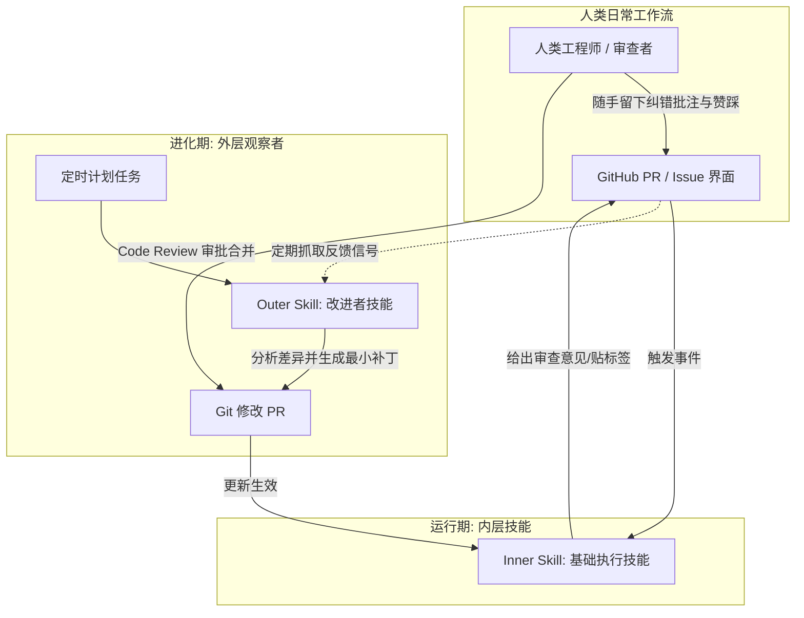

# 概念解析辞典

> 针对《How Warp builds self-improving agents on Claude》（Claude Blog / Warp）的概念提取

## 一、核心概念

### 1. **基于文件的技能（File-based skills）**

- **context**：作者定义了剥离单次 Prompt 膨胀的知识编码载体。

  > “File-based skills are a way of encoding knowledge for agents without putting that knowledge directly in the prompt, as something the agent can simply look up in the course of doing its job,” says Zach.

- **费曼一下**：指将操作指令、业务规范和领域知识从巨大的系统提示词中抽离出来，保存为纯文本 Markdown 文件的工程范式。Agent 在执行任务时按需查阅该文件，且模型自身可以像编辑代码一样对其进行增删改查。

### 2. **外层改进者技能（Outer / Improver skill）**

- **context**：负责从零散反馈中提炼进化补丁的观察者机制。

  > The outer/improver skill functions as an observer agent that runs on a schedule rather than per-task. It pulls the accumulated human feedback, compares what the agent suggested against how humans responded, and proposes a small, focused edit to the base skill.

- **费曼一下**：指一个独立于日常任务、按周期定时运行的元智能体（Meta-Agent）。它不直接给用户干活，而是收集过去一段时间内内层技能的执行记录与人类批评，做差异对比后，向内层基础技能提出最小粒度的改进补丁。

### 3. **PR 驱动的审查合并闭环（PR-driven review and approval workflow）**

- **context**：保证模型自进化的安全与可控的人机协作边界。

  > Because skills are plain files, agents are extremely good at updating them. These updates, which are reviewable, approvable, and mergeable, can flow through a normal PR/code-review workflow; once merged, the next run of the inner skill inherits the improvement.

- **费曼一下**：指 Agent 对自身技能的修改不直接在线热更新，而是通过 Git 创建一个 Pull Request。人类工程师对模型的修改方案进行 Code Review、讨论并点击 Merge，新技能才正式生效。既放手让模型自我迭代，又让人类保持绝对的终审权。

### 4. **写原则而非写死规则（Write principles, not rules）**

- **context**：指导编写可泛化自改进技能的撰写原则。

  > Write principles, not rules. "Construct the skill as though you're instructing a smart person, not like you're programming a computer,” Zach says. “Including direction in the skill like ’Look for repeated code’ provides better direction than exhaustive variable naming rules.”

- **费曼一下**：指撰写 Skill 时应像指导一个高智商员工一样阐述核心思想和判据理由（Why），而不是像给计算机写程序一样罗列穷尽的 if-else 规则。原则赋予了模型在未知边界下的推理灵活性，避免了规则爆炸与僵化。

### 5. **技能与记忆的本质区别（Skills vs. Memory）**

- **context**：团队在实践中划定的核心系统架构分类红线。

  > Skills are procedural and stable—"how to do X," run-agnostic, changed deliberately. Memory is auto-written by the agent at inference time and never stops changing.

- **费曼一下**：技能回答的是“做事的方法”，具有程序性、长期稳定性和跨会话通用性，每一次修改都必须经过验证；记忆回答的是“当下的事实与上下文”，是推理期间自动写入、随交互不断重写变动的动态状态。

## 二、概念架构图

