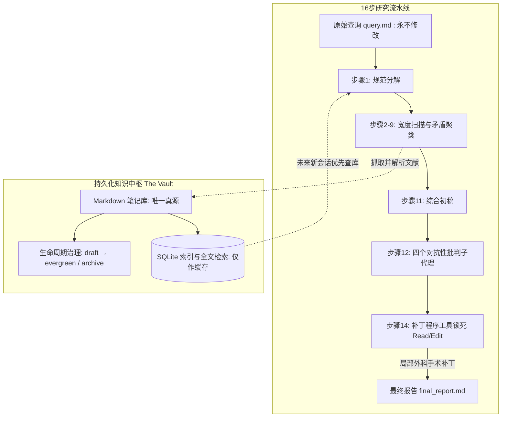

# 概念解析辞典

> 针对《jordan-gibbs/hyperresearch：基于智能体的研究知识库》（GitHub 开源项目）的概念提取

## 一、核心概念

### 1. **分层对抗式研究流水线（Hierarchical adversarial research pipeline）**

- **context**：系统实现高质量长程深度研究的总体执行架构。

  > Hyperresearch 将 Claude Code 改造成一个深度研究代理：目前在 DeepResearch-Bench RACE 排行榜上名列前茅（内部基准测试）。一个分层自适应的 16 步流程只需接收一个提示，即可生成一份经过对抗性审计并包含完整源代码来源的报告。

- **费曼一下**：指将复杂研究任务拆分为分解、宽度扫描、矛盾聚类、深度调查、三方综合、多角度对抗批判、引文核实等 16 个严密步骤的系统。每个步骤的专有技能只有在执行时才动态载入上下文，防止长流程导致任务目标漂移。

### 2. **只打补丁绝不重写（Patch, never regenerate）**

- **context**：系统在报告修改阶段恪守的第一承重原则。

  > Patch, never regenerate. After step 11 produces the synthesized report (or step 10 for light tier), the only modifications are surgical Edit hunks. The patcher and polish auditor are tool-locked to [Read, Edit] at the Claude Code allowlist level so they physically cannot Write a new draft.

- **费曼一下**：指在初稿生成之后，任何针对批评意见的修改只能以极小粒度的局部补丁（Edit hunk）形式进行。负责修改的 Agent 在系统权限层被锁死，根本没有新建或覆写整个文件的权限，从物理机制上彻底断绝了模型推倒重来引入新错误的风险。

### 3. **原始查询即圣经（Canonical research query is gospel）**

- **context**：防止多智能体在多层派生传递中歪曲初衷的第二承重原则。

  > Canonical research query is gospel. The verbatim user prompt is persisted to research/runs/<vault_tag>/query.md once and re-read by every subsequent step and every spawned subagent.

- **费曼一下**：指用户的原始输入提示词被逐字持久化为一个静态文件，流水线中派生出的所有子智能体在每一步都必须重新阅读这份原始文本。外围的格式要求与路径配置作为独立契约隔离，确保核心研究主旨绝不因多代转述而走样。

### 4. **Markdown 为真源，SQLite 为缓存（Markdown is truth, SQLite is cache）**

- **context**：支撑知识库跨会话终身积累的存储架构设计。

  > Markdown is truth, SQLite is cache. Notes live as plain markdown with YAML frontmatter in research/notes/. The SQLite index is fully rebuildable: delete it and hyperresearch sync reconstructs it from the markdown.

- **费曼一下**：指所有抓取的文献与笔记均以纯文本 Markdown 和标准 YAML 头持久化存储，无需任何专有工具即可在任意编辑器中阅读和 Git 追踪；而 SQLite 仅作为加速检索的只读缓存，即使删掉也能随时根据 Markdown 瞬间重建。

### 5. **笔记生命周期策展（Note curation lifecycle）**

- **context**：防止自动化知识库因资料堆积而迅速退化为垃圾场的内容治理机制。

  > Every session ends with a curation pass, and notes move through draft → review → evergreen, or stale → deprecated → archive as material ages out. That's what keeps a vault from turning into a landfill of half-read pages.

- **费曼一下**：每轮研究结束时由智能体对文献笔记进行状态晋级或退役治理：经过核实的内容逐步晋级为常青笔记（Evergreen），过时内容被标记为陈旧（Stale）并归档，保证知识库规模扩张的同时始终保持高信息密度。

## 二、概念架构图

