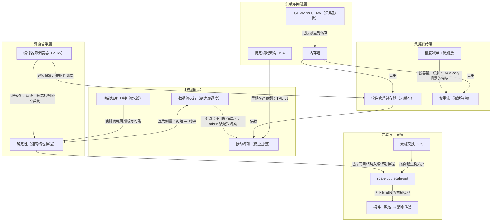

# 概念解析辞典

> 针对《都承诺提供6GW的运维能力》（Jacob Peake，jacobpeake.com）的概念提取

## 一、核心概念

### 1. **特定领域架构（DSA）**

- **context**：全文从亨尼西与帕特森的图灵演讲起笔，DSA 是他们给出的框架词：性能曲线走平后，要为一类负载专门造芯片。

  > 该架构已投入生产：在神经网络推理方面，其吞吐量是CPU的29倍，能效提高了80倍。最后他们预测：***“未来十年将迎来计算机架构的寒武纪式爆发。”***

- **费曼一下**：DSA 指不为通用计算、只为某一类工作负载定制的芯片架构。当通用 CPU 的单线程性能年增长从 52% 跌到 3%，专用化反而能换来数量级收益，TPU v1 就是他们举的在产例子。它是全文的前提：如今数十种在研架构（GPU、TPU、LPU、NPU、晶圆级引擎、光子计算等）正是这个预言的展开，文章要比较的是其中真正部署了的几家。

### 2. **内存墙（memory wall）**

- **context**：作者把负载讲完后给出全文的核心难题。

  > 这就是所谓的***内存墙***：计算能力呈指数级增长，而内存带宽却没有相应提升。

- **费曼一下**：内存墙是算力与喂料速度的裂缝：计算涨得指数级，内存带宽跟不上，于是架构问题不再只是算多快，而是如何把计算任务搬到数据够近、矩阵乘够快的地方。它是承重中的承重：后文四个问题（数据住哪、怎么搬到计算单元、计算单元长什么样、芯片怎么互联）都是对它的回答，六家方案的全部差异都从这里长出来。Cerebras 更是把整家公司建立在对它的另一种诊断上（墙是切晶圆切出来的）。

### 3. **GEMM 与 GEMV（训练/预填充对解码）**

- **context**：作者先确立AI计算就是矩阵乘法，再区分两种负载形状。

  > 训练和预填充阶段都会将大量词元堆叠到同一个权重矩阵上

  > 生成一个词元需要完整遍历模型中的每个权重，以及完整读取键值缓存以获取注意力信息。

- **费曼一下**：GEMM 是大矩阵乘大矩阵，GEMV 是矩阵只乘一个向量。训练和预填充把几千个词元同时堆上同一份权重，每一层都是 GEMM、计算密集；解码一次只出一个词元，矩阵乘退化成 GEMV，算术强度掉几个数量级，而且每个词元都要读完全部权重和 KV 缓存。这对概念承重，因为它解释了推理系统为什么靠连续批处理、推测解码、多词元预测把 GEMV 拼回 GEMM，为什么解码是纯带宽问题，也解释了 Cerebras 和 Groq 为什么都宣称自己为解码而生、而训练要另想办法。

### 4. **脉动阵列与权重驻留（systolic array, weight-stationary）**

- **context**：TPU 与 Trainium 共同的计算基石。

  > matrix B's values are pre-loaded one weight per cell: ***weight-stationary*** dataflow, the choice that distinguishes TPUs from output-stationary arrays elsewhere.

  > The dominant cost in computing is not the multiplication itself (a few picojoules) but reading and writing memory at 100–1000× more energy per access; the systolic array deletes that cost by construction.

- **费曼一下**：脉动阵列是一张乘加单元网格：权重一格一个预先驻进阵列不动（即权重驻留），激活从边缘一格格流过，部分和向下流进累加队列——数据一旦进阵列就不再访存，数据复用被焊进导线而不是靠缓存仲裁。它解决了访存比乘法贵 100–1000 倍这个成本结构问题。代价是 underfill（形状不合就浪费硅，256×256 阵列跑 128×128 浪费 75%），靠 XLA 按 128/256 的倍数切块补齐。拿掉它就看不懂 TPU、Trainium 为什么没缓存也没关系，也看不懂 SparseCore/CAE 为什么存在（阵列形状不对的负载旁路掉）。

### 5. **向上扩展与向外扩展（scale-up / scale-out）**

- **context**：进入各家扩展策略前，作者先立下这对组织性概念。

  > AI infrastructure uses both: bandwidth-hungry collectives (tensor parallelism, MoE expert routing) stay inside the scale-up domain; data parallelism and pipeline parallelism cross the scale-out fabric.

- **费曼一下**：向上扩展是把越多芯片绑成一个紧耦合域（NVL72 机架、TPU pod、Trainium UltraServer、Helios 机架都是域）；向外扩展是域与域之间走通用网络。分工固定：张量并行、MoE 专家路由这类吃带宽的集合通信必须留在域内，数据并行和流水线并行才跨域。这对概念承重，因为每家的机架规格、fabric 带宽、拓扑选择全部围绕把域做多大、用什么连展开，AMD 的核心缺口也正是只有盒子没有域。

### 6. **硬件一致性对消息传递（cache-coherent fabric vs message-passing）**

- **context**：这是英伟达与谷歌向上扩展语法的根本对照。

  > so a load or store on one GPU can target another GPU's HBM with the hardware handling address translation and coherence.

  > There is no remote-load semantics, no cache coherence, no crossbar.

- **费曼一下**：NVLink/NVSwitch 是缓存一致的——一块卡上的读写可以直接瞄准另一块卡的 HBM，地址转换和一致性硬件管；谷歌 ICI 是消息传递——没有远程读写语义、没有一致性、没有交叉开关，多芯片操作全是编译器写明的显式集合通信。这对对照承重：它决定了编程模型（把远端内存当本地用，还是把通信当指令写），也解释了 Trainium 的 NeuronLink 为什么精神上更近 ICI 而非 NVSwitch，以及 Groq 为什么连远端操作数都不是被加载、而是被排程到准时到达。

### 7. **软件管理暂存器（software-managed scratchpad，no caches）**

- **context**：TPU 片上层级的总纲，Trainium 明确沿用。

  > The hardware does no prefetching, no eviction, no coherence; when the compiler gets it right, the array never stalls; when it gets it wrong, there is no fallback path.

  > This is exactly Google's VMEM bet, an explicit scratchpad the compiler must schedule perfectly with no cache to paper over a mistake, and the opposite of NVIDIA's hardware-managed L2 and L1.

- **费曼一下**：暂存器是显式寻址的片上 SRAM（TPU 的 VMEM/CMEM、Trainium 的 SBUF/PSUM、Groq 的 MEM、Cerebras 的核内 SRAM 同属此列）：没有预取、没有逐出、没有一致性硬件，每个张量在编译期就钉死在哪一层。它换来的硅面积变成更多乘加单元，付出的代价是全押编译器——排对了阵列永不停摆，排错了没有任何硬件兜底。这是理解非英伟达阵营软件栈为什么是编译器中心的物质基础。

### 8. **编译器即调度器（the compiler is the scheduler）**

- **context**：TPU 架构的总原则，也是与 CUDA 路线对峙的哲学极点。

  > There is no instruction cache miss, no warp scheduler, no out-of-order engine, no branch predictor: the compiler is the scheduler, and the silicon area saved is spent on more MACs.

  > the compiler is the scheduler, the torus is the topology, and the optical switch is the universal reconfigurable substrate

- **费曼一下**：把下一步做什么的决定权从硬件整体搬进编译器：VLIW 每周期八个功能槽由编译器提前填满，无乱序、无预测、无动态调度。它解决了硬件 second-guess 浪费硅的问题，也定义了这些芯片的软肋——负载必须静态可预测。TPU 编译器排一颗芯片，Groq 编译器排一整个系统（连网络都排），Trainium 干脆共用同一个编译器；代价被作者点破：XLA 不手调就更接近理论上限，但关掉剩下的差距也更难。

### 9. **数据流执行（dataflow, wavelet）**

- **context**：Cerebras 的调度方案，与编译器排程构成两极。

  > No warps, no warp schedulers, no caches to miss, no reorder buffer: *the arrival of data is the schedule*.

  > each holding a tensor descriptor: base address, extent, and stride, up to four dimensions.

- **费曼一下**：数据流执行指核不取指令等活干，而是等数据（wavelet）到达才触发绑定的处理任务，八个微线程按操作数到达逐周期切换；指令的操作数就是张量描述符（DSR），一条指令对着到来的流一直算到张量尽头。它给出了谁排程这个问题的另一半答案——不用时钟排程，用到达排程。跳零因此免费（零不触发任何计算），这是 Cerebras 稀疏故事的来源；而与 Groq 的对照（WSE 对数据做反应、LPU 按时钟准时）是全文最有辨识度的架构对照之一。

### 10. **确定性（determinism）**

- **context**：Groq LPU 的第一性选择。

  > (no cache, no branch predictor, no arbiter, no reorder buffer, not even an on-chip crossbar) and hand the entire scheduling problem to the compiler, which places every instruction and every byte on an exact cycle. What is left is a chip whose latency is known before it runs.

  > Groq's own measurement is the proof: 24,240 runs of BERT-Large returned inside a ~75 µs band, and the compiler's predicted latency sat within 2% of measured.

- **费曼一下**：确定性指每条指令、每个字节的执行周期在运行前就已定死——删掉一切反应式部件后，延迟不再是统计量而是事实（两万多次 BERT 运行挤在 75 微秒带宽里，预测与实测差 2%）。它是 Groq 其余所有选择的解释项：不跳零（跳零会让时间依赖数据）、连芯片间网络也静态排程（重传会扰动时刻表，所以用前向纠错）、只做推理（训练的动态性容不下编译器预知一切）。

### 11. **权重流（weight streaming）**

- **context**：Cerebras 训练时对数据流向的倒转。

  > on a GPU or TPU, weights are resident and activations stream through; on a WSE, ***activations are resident and weights stream through***

  > The wafer never stores weights, "not even temporarily"

- **费曼一下**：别家训练是权重驻留、激活流过；晶圆级引擎反着来——激活钉在片上 SRAM，权重从旁边的 MemoryX（DRAM+闪存一体机）逐层流进来、触发乘加、流走。它解决了两个难点：模型大小与晶圆内存解耦（由 MemoryX 决定，44 GB 只管激活和批次）；集群扩展坍缩成纯数据并行——GPU 训练那套并行策略组合在 Cerebras 上没有对应页。代价是训练规模证据薄弱（最大披露集群 64 台、最大模型 70B），而推理时这套玩法在算术上致命，只能反过来把权重泊进 SRAM。

### 12. **功能切片（functional slices，空间计算）**

- **context**：Groq 的芯片组织法，与复制同一种核的主流相反。

  > a full-height column of identical hardware, and the columns stand side by side across the die. Homogeneous down each slice, heterogeneous across the chip.

  > horizontally through the slices like parts down an assembly line, East and West, one register hop per cycle, while VLIW instructions issue Northward from the control slices to meet it.

  > the operator fusion a GPU kernel builds by hand is here just the physical order of the slices.

- **费曼一下**：功能切片是把一颗常规核心拆开竖放：指令控制、向量、矩阵、搬移、存储各成一整列，数据像流水线上的工件横穿切片，VLIW 指令从北面迎上来。它解决了算子融合问题——GPU kernel 里手工排的矩阵乘接着 softmax 接着残差加，在这里就是切片的物理排列顺序，数据复用活在导线里。这是计算是空间的、而非发给共享单元这一设计的实体，也是 LPU 敢说融合零成本的物质基础。

### 13. **光路交换（OCS, optical circuit switch）**

- **context**：谷歌向上与向外扩展共有的签名部件。

  > Tiny mirrors physically rotate to map any input fibre to any output.

  > pick a topology at job start, run it for a week, then reconfigure for the next workload.

  > Three problems collapse into one component: topology reconfiguration per workload (twisted tori give up to 70% better bisection), sub-pod slicing on demand, and

- **费曼一下**：OCS 是 3D-MEMS 微镜阵列：物理转动微镜，把任意输入光纤接到任意输出。它是电路交换——毫秒级重配置不碍事，因为开工时选好拓扑、一跑一周，下一个任务来了再重配。一个器件坍缩三个问题：按负载重配拓扑（扭曲环面让剖分带宽提升至多 70%）、按需切分子 pod、容错（芯片坏了光路换入备用 cube）。谷歌从机架（Palomar）到数据中心 spine（Apollo，2022 年起全光）用同一个原语，这正是光交换是通用可重构基底这一哲学的实体，也是英伟达没有对应物的部件。

### 14. **精度减半与微缩放（precision halving, MX microscaling）**

- **context**：贯穿六家的共同节拍，作者在英伟达节先给出总括。

  > Every generation buys roughly 2× per-watt throughput by cutting bits in half and restoring accuracy with a finer-grained scaling scheme

  > (block-level shared exponents that recover most of the accuracy lost at FP4)

- **费曼一下**：精度减半指 FP16→FP8→FP4 逐代把位数砍半，每砍一半换来约 2× 每瓦吞吐；微缩放是找回精度的手段——把共享指数做成块级（MX 格式），用更细粒度的缩放恢复低位宽丢掉的准确度，英伟达、AMD、TPU 用的是同一套开放格式。这个节拍承重有二：它是逐代性能曲线的引擎；它也反衬出 Cerebras 与 Groq 停在 16-bit 的张力——片上 SRAM 最稀缺、最需要 8-bit 省容量的机器，恰恰没拿到低精度数据通路（作者标为 open question）。

## 二、概念架构图

- 分层说明：负载与问题层是全文的出发点；数据供给层与计算组织层回答数据住哪、算什么；互联与扩展层回答芯片怎么连；调度哲学层是贯穿各层的分岔——交给编译器时刻表（TPU/Trainium/Groq），或交给数据到达（Cerebras），或留在硬件 warp 层级（NVIDIA，对应图中未单列的缓存加线程藏延迟路线，与 SCRATCH/COMPILER 两节点相对）。仅画原文明确支持的关系。
