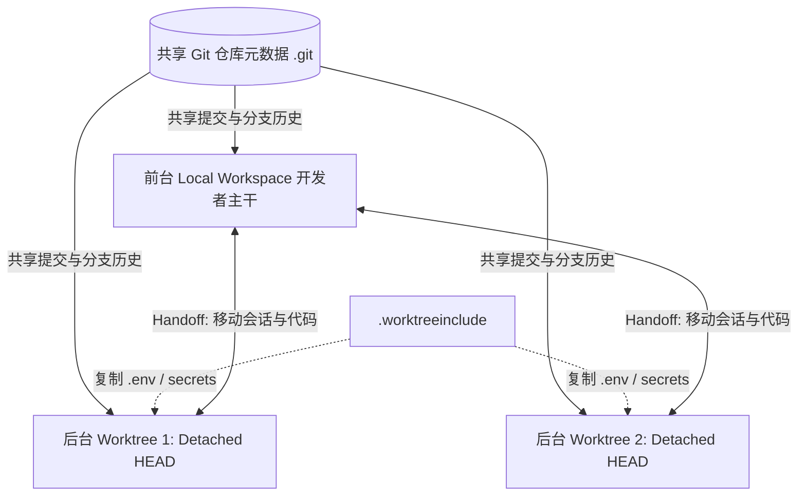

# 概念解析辞典

> 针对《Worktrees》（ChatGPT Learn / OpenAI Codex）的概念提取

## 一、核心概念

### 1. **Git 工作树并发隔离（Git worktree isolation）**

- **context**：官方阐述 Codex 实现多任务无冲突并行的底层基石。

  > Worktrees let Codex run multiple independent chats in the same project without interfering with each other. The repository, worktree, and commands remain on the computer or remote development environment that contains the project.

  > Each worktree has its own copy of every file in your repo but they all share the same metadata (.git folder) about commits, branches, etc. This allows you to check out and work on multiple branches in parallel.

- **费曼一下**：指借助 Git 原生的 `git worktree` 功能，为每个 AI 会话在硬盘上单独克隆一份工作目录，但底层共用同一个 `.git` 元数据仓库。这让前台开发者与多个后台 AI 助手能够同时修改不同分支的代码，物理上互不干扰、互不覆盖。

### 2. **会话与工作交接机制（Handoff）**

- **context**：连接前台 Local 与后台 Worktree 的安全流转系统。

  > Under the hood, Handoff handles the Git operations required to move work between two checkouts safely. This matters because Git only allows a branch to be checked out in one place at a time.

- **费曼一下**：指在用户当前的前台本地工作区与后台 Agent 工作树之间，无缝迁移对话上下文和代码修改状态的自动化流程。Codex 自动执行底层的 Git 分支切换与暂存操作，绕开同一分支不可在多处同时检出的限制。

### 3. **单分支单一权威工作副本保证（One-branch-per-worktree rule）**

- **context**：Codex 解释为什么不能在多个工作树同时检出同一分支的底层安全原理。

  > By enforcing a one-branch-per-worktree rule, Git guarantees that each branch has a single authoritative working copy, while still allowing other worktrees to safely reference the same commits via detached HEADs or separate branches.

- **费曼一下**：指每个分支只能同时在一个工作区被检出的硬性规则。它保证了每一个可变分支指针在同一时刻只有一个合法的修改入口，避免多会话并发写入时产生竞态条件和提交丢失。

### 4. **未跟踪文件携带清单（.worktreeinclude）**

- **context**：解决 Git 忽略文件（如密钥、环境配置）跨工作树丢失的配置方案。

  > If your repository ignores local setup files that a new worktree needs, add a .worktreeinclude file to the repository root and list the ignored paths or .gitignore-style patterns to copy when Codex creates a managed worktree.

- **费曼一下**：指在仓库根目录添加的一个专门配置文件，里面列出需要被自动复制进新工作树的被忽略文件（如 `.env`、`secrets.json` 等）。它解决了代码隔离导致必要环境变量丢失、进而导致后台测试无法运行的断档问题。

### 5. **单分支单一可变引用限制（Single mutable reference rule）**

- **context**：深入剖析 Git 分支指针特性的机制描述。

  > Git prevents the same branch from being checked out in more than one worktree at a time because a branch represents a single mutable reference (refs/heads/<name>) whose meaning is “the current checked-out state” of a working tree.

- **费曼一下**：Git 的安全红线规定：一个分支本质上只是一个指针文件，代表某一棵工作树的当前状态。如果允许多个工作区同时改写同一个分支指针，就会引发类似多线程抢写同一变量的竞态条件，导致提交丢失或索引损坏。

## 二、概念架构图

