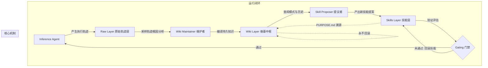

# 概念解析辞典

> 针对《谷歌重磅发布WikiSkill，技能可以自己进化了！》（Google Research / Datawhale）的概念提取

## 一、核心概念

### 1. **三层知识架构（Three-layer knowledge architecture）**

- **context**：作者在开头确立 WikiSkill 区别于以往单层修改技能的核心设计。

  > 这套架构的核心是把"经验"和"知识"分开。以前的技能进化方法（EvoSkill、Trace2Skill、SkillOpt）分析完执行轨迹就直接改 Skill，经验用一次就丢。WikiSkill 在中间加了一层持久知识库，让经验先沉淀、再复用。

- **费曼一下**：指将智能体系统切分为 Raw Layer（原始不可变轨迹）、Wiki Layer（结构化持久知识库）、Skills Layer（带溯源的可执行技能）的三层设计。它打破了过去将经验与技能直接绑定的做法，让经验首先被编译为持久知识，再由知识驱动技能生成。

### 2. **原始轨迹层（Raw Layer）**

- **context**：第一层的作用是为分析提供不可篡改的事实基础。

  > Raw Layer 存储每次迭代的执行轨迹，包括 Agent 的完整推理过程、工具调用、输出结果。这一层不可变，目的是保留"到底发生了什么"的原始记录。

- **费曼一下**：指记录智能体每次尝试中每一步思考、工具调用与环境返回结果的底层存储。它的关键特征是只读不可变，保证后续分析失败模式和理解设计意图时，始终有一份未经污染的第一现场事实依据。

### 3. **持久维基层（Wiki Layer & Wiki 永不回滚）**

- **context**：架构的核心中枢及其不可逆累积的设计哲学。

  > 第一，Wiki 永不回滚。Skill 被拒绝时，Skills Layer 回到上一版本，但 Wiki 保留所有积累的知识。下一轮 Proposer 能看到"上次这个改法为什么被拒"，避免重复踩坑。

  > 第二，Knowledge 和 Skill 分离。知识回答"我们知道什么"，技能回答"我们该怎么做"。以前的方法把两者混在一起，改技能时丢失了背后的推理上下文。

- **费曼一下**：Wiki 层是将具体成败轨迹提炼为抽象规律的中间数据库。其核心机制是“永不回滚”：即便提出的某个技能在测试中失败被撤回，该次失败的因果教训也会永远保留在 Wiki 中，使模型在后续迭代中不会重复犯同样的错误。

### 4. **技能溯源（PURPOSE.md）**

- **context**：Skills 层中用于锚定知识来源的元数据文件。

  > PURPOSE.md 解决的是"这个技能为什么存在"的问题。当技能需要修改时，Proposer 可以通过 PURPOSE.md 回溯到对应的知识模式，理解当初的设计意图，而不是盲目地打补丁。

- **费曼一下**：每个技能除了包含实际执行指令的 SKILL.md 外，还标配一个 PURPOSE.md，专门记录该技能是为了解决 Wiki 中的哪条具体失败模式而建立的。它为后续修改提供了因果上下文，防止盲目打补丁导致历史意图丢失。

### 5. **维基消融效应（Wiki ablation effect）**

- **context**：验证持久知识中枢对复杂自愈不可或缺的量化证据。

  > 去掉 Wiki 访问后，平均分从 63.7% 降至 48.7%，回落约 15 个百分点。Wiki Maintainer 积累的跨迭代知识是 Skill Proposer 能解决复杂失败模式的前提。

- **费曼一下**：实验证实若撤掉中间的 Wiki 知识层，仅靠提议者直接从原始轨迹修改技能，模型表现会断崖式下跌 15 个百分点。这证明持续积累的抽象知识库才是智能体解决复杂长尾缺陷的真正承重支柱。

## 二、概念架构图

