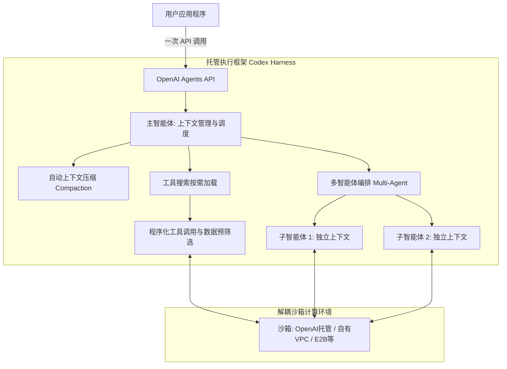

# 概念解析辞典

> 针对《推出 Agents API | OpenAI》（OpenAI 官方公告）的概念提取

## 一、核心概念

### 1. **长期运行智能体执行框架（Long-running agent execution framework）**

- **context**：官方对生产级智能体基础设施的总体定义。

  > 实用的智能体需要一个强大的执行框架，用于管理上下文、高效使用工具并协调子智能体。它们还需要可靠支持其连续运行数天的基础设施，以及能让它们处理文件、运行代码并保存中间结果的环境。

- **费曼一下**：指支撑一个 AI 智能体连续稳定工作几天所需的完整操作系统底座。它不仅是给大模型发一条指令，而是包含了上下文压缩管理、沙箱文件存取、长会话恢复、异常重试与多任务协作的一整套系统级调度能力。

### 2. **上下文自动压缩（Context compaction）**

- **context**：解决智能体长程运行跨越多个上下文窗口上限的官方解法。

  > 当会话接近上下文上限时，Agents API 会[自动压缩⁠](https://developers.openai.com/api/docs/guides/compaction)较早的上下文，同时保留智能体继续工作所需的信息。开发者无需自行实现压缩逻辑，即可构建跨越多个上下文窗口的工作流。

- **费曼一下**：当对话和代码越积越多、快要把模型窗口挤爆时，系统在后台自动把前期的历史细节摘要成高密度的关键信息，只保留当前任务不可缺少的因果链条。这使得开发者不用自己手写截断算法，就能让 Agent 永不中断地干活。

### 3. **工具按需搜索（Tool search）**

- **context**：降低海量工具对提示词和模型缓存开销的机制。

  > [工具搜索⁠](https://developers.openai.com/api/docs/guides/tools-tool-search)会按需加载相关工具定义，在保留模型缓存的同时减少 Token 用量和成本。

- **费曼一下**：指不把上百个 API 工具文档一次性全塞进系统提示词，而是在 Agent 遇到具体问题时，才根据语义去搜索并临时加载相关的工具说明。既保护了提示词缓存（Prompt Cache）的高命中率，又大幅节省了输入 Token 的花费。

### 4. **程序化工具调用（Programmatic tool calling）**

- **context**：让智能体批量吞吐海量外部数据而不撑爆上下文的高级工具调用方式。

  > [程序化工具调用⁠](https://developers.openai.com/api/docs/guides/tools-programmatic-tool-calling)可让智能体并行执行调用、串联相关操作，并通过代码筛选或合并结果，从而处理海量数据，同时只将相关结果送回上下文。

- **费曼一下**：以往模型每调一次工具，都要把长篇累牍的原始 JSON 数据全灌进对话框里。程序化调用让模型在沙箱内用一段脚本直接并行调好几个接口、过滤出最后那几条关键结果，再交回给上下文，有效阻断了数据洪水对注意力的污染。

### 5. **子智能体并行委派（Subagent delegation and orchestration）**

- **context**：将复杂长尾任务并行加速的核心编排模式。

  > 借助[多智能体支持⁠](https://developers.openai.com/api/docs/guides/agents-api/multi-agent)，Agents API 可将复杂任务拆分为相互独立的部分，并委派给多个子智能体并行处理。每个子智能体都维护各自的上下文，以便专注于分配到的任务；主智能体则协调它们的工作并汇总结果。

- **费曼一下**：主智能体像项目经理一样把大任务拆成几个模块，分别指派给几个副手（子智能体）去独立跑。每个副手各自带着干净的上下文专心排查（互不干扰），主智能体最后只收集它们的汇报并拍板，大幅压缩了等待时间。

### 6. **开源 Codex 执行线圈（Open-source Codex harness）**

- **context**：Agents API 核心调度逻辑的技术溯源与透明性保障。

  > The Agents API is powered by the open-source Codex harness, giving developers visibility into the core logic that coordinates model calls, tools, and context.

- **费曼一下**：指驱动 ChatGPT 与 Codex 后台任务调度的开源核心底座。它向外界公开了模型、工具和上下文之间是如何完成状态机流转与事件分发的，为云端全托管 API 提供了透明可检验的架构基础。

## 二、概念架构图

