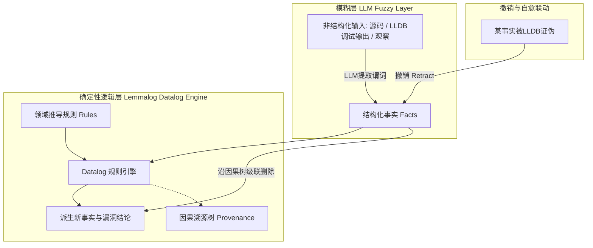

# 概念解析辞典

> 针对《Some things should probably stay fuzzy》（pwning.systems / Lemmalog）的概念提取

## 一、核心概念

### 1. **状态维护型记忆（State-maintaining memory vs. Conversational memory）**

- **context**：作者界定漏洞挖掘与普通聊天在记忆机制上的根本区别。

  > 我希望它能**保持我们目前所知的状态**。

  > 显然，告诉一个法学硕士（LLM）某些事情是错误的，并不一定意味着它会停止相信所有依赖于它的事情 :)

- **费曼一下**：指不仅记录过去说了什么话，而且时刻维护一份经过逻辑校验的“当前已知事实清单”。在复杂任务中，当一个前提被推翻后，普通对话记忆会同时保留新旧矛盾，而状态型记忆会联动清理所有下游推论。

### 2. **事实与推导的自动级联失效（Automatic invalidation of derived facts）**

- **context**：借鉴程序分析增量更新机制解决事实推翻的核心动力。

  > If an observation changes, I don’t want the model to reconstruct the entire investigation from a transcript and hopefully notice all of the consequences. I want the affected conclusions to become invalid automatically.

- **费曼一下**：当现实中的某条事实发生变化时，我们不需要模型去重新阅读长篇历史记录并赌它能发现所有连锁反应；底层数据库直接像多米诺骨牌一样，把所有依赖于该事实的推论全自动标记为失效。

### 3. **模糊与确定性解耦范式（Fuzzy-Deterministic split）**

- **context**：Lemmalog 将大语言模型与逻辑数据库各司其职的系统设计。

  > The basic idea is that an LLM should not necessarily be responsible for maintaining its own knowledge. Instead, I split the problem into two parts.

- **费曼一下**：模型擅长处理非结构化、充满噪音的“模糊”输入（如阅读源码、解析调试器输出），但极不擅长做长程确定性状态推导。该范式让 LLM 专心把输入翻译成结构化事实，状态推导与一致性维护全权交给确定性的 Datalog 引擎。

### 4. **推论因果溯源图（Provenance of conclusions）**

- **context**：使智能体的每个信念均可被解释与追根溯源的透明机制。

  > Because Lemmalog already tracks the dependencies of derived facts, we can ask it for the provenance of a conclusion.

- **费曼一下**：在系统中，任何一条推导出的结论都挂载着一棵严密的证据树，详细记录了它是由哪条基础事实和哪条逻辑规则推导出来的。这使得人类能直接质问“你凭什么得出这个结论”，一旦发现源头虚假，即可精确顺藤摸瓜。

### 5. **声明式逻辑记忆引擎（Datalog-based memory engine）**

- **context**：底层采用的声明式逻辑语言及其运作机制。

  > Datalog is a declarative logic programming language. Instead of writing instructions describing how something should be calculated, we describe facts and rules from which new facts can be derived.

- **费曼一下**：Datalog 是一种只声明“事实”与“如果……那么……”规则的逻辑编程语言。将其作为智能体记忆引擎，能够自动计算知识不动点，并且在事实发生增删时以极高效率重新计算依赖，不耗费任何大模型推理 Token。

## 二、概念架构图

