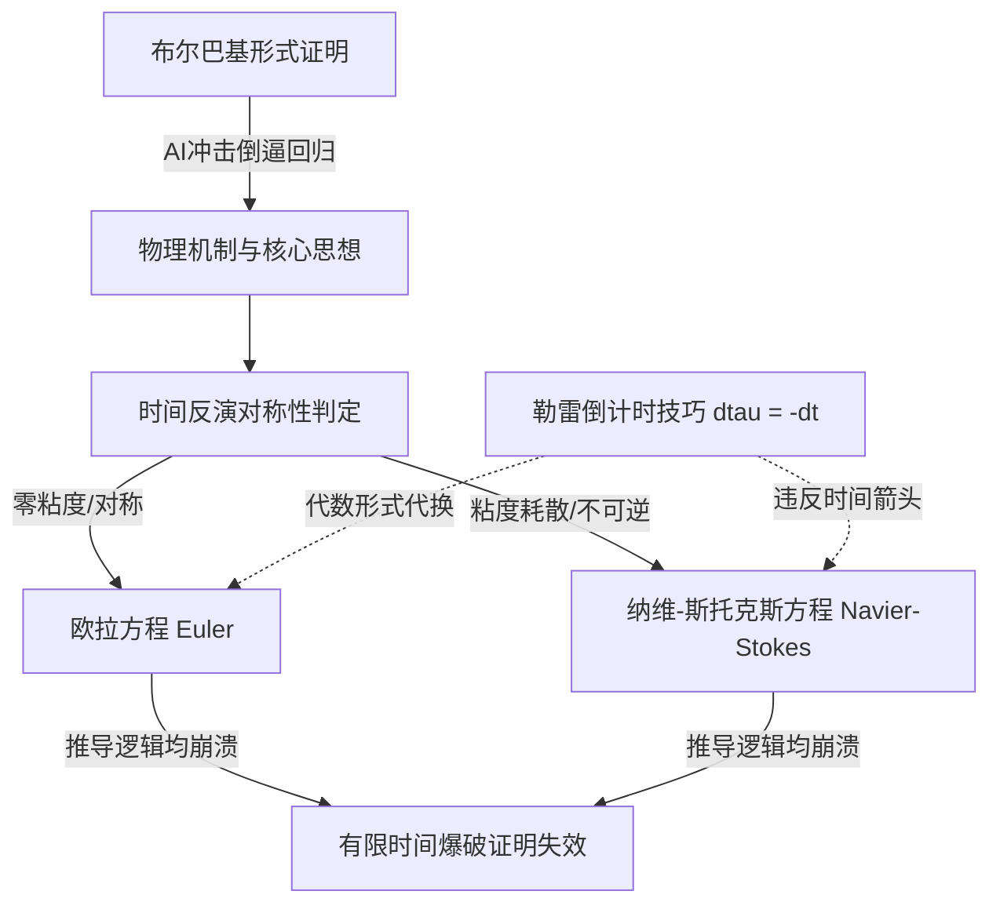

# 概念解析辞典

> 针对《“深奥的定理曾经稀少且晦涩，因此成为识别深刻思想的有效机制。人工智能打破了这一体系。”》（陶哲轩 / What's new）的概念提取

## 一、核心概念

### 1. **布尔巴基风格证明（Bourbaki style proofs）**

- **context**：作者在开头指出 AI 对数学证明风格产生的范式冲击。

  > AI will force mathematics to move away from the overly formal proofs of the French Bourbaki style and instead focus on the ideas.

- **费曼一下**：指以法国布尔巴基学派为代表的、高度公理化和形式主义符号推演的数学证明风格。作者认为纯符号的代数推导往往掩盖了物理实质，而 AI 将倒逼数学界放弃这种繁复的形式主义，重新聚焦到核心的物理机制与直觉思想。

### 2. **勒雷奇点倒计时技巧（Leray's countdown trick）**

- **context**：AI 在证明中构造向奇点逼近的时间代换变量。

  > The AI uses the definition tau = (1-t) and describes it as a countdown to a singularity. Jean Leray first did this ‘trick’ in his foundational 1934 paper on fluid dynamics.

- **费曼一下**：指让时间反向流动的数学变量替换（令 $\tau = 1-t$），将爆破奇点设为倒计时终点的方法。该技巧最早由勒雷在 1934 年奠基性论文中使用，其导数为负（$d\tau = -dt$），在纯无耗散系统中可利用对称性推导，但在不可逆系统中不能随意倒置。

### 3. **欧拉方程与纳维-斯托克斯的时间反演对称性（Time reversibility: Euler vs. Navier-Stokes）**

- **context**：作者对比了理想流体与真实粘性流体在时间反演上的本质物理分歧。

  > The Euler equations are time reversible. They are identical to the Navier-Stokes equations but have zero viscosity.

  > Navier-Stokes has viscosity, so it is not time reversible. Energy dissipates; this is like entropy defining the arrow of time.

- **费曼一下**：欧拉方程描述零粘度流体，能量守恒且时间正反向对称；而纳维-斯托克斯方程包含粘性阻尼，能量会自然耗散，像热力学熵增一样定义了时间的唯一箭头。作者以此指出，在有粘性耗散的系统中，时间反向的数学推演绝不等同于正向的物理真实。

### 4. **有限时间爆破失效（Invalidation of finite time blowup）**

- **context**：作者给出 AI 证明根本无效的最终裁决。

  > The AI proof setting dtau = -dt over the chosen interval invalidates the proof of finite time blowup for both the Euler and Navier-Stokes equations.

- **费曼一下**：指 AI 试图证明流体速度在有限时间内趋向无穷大（出现奇点）的结论彻底破产。AI 通过强行定义负微元，在欧拉方程中等同于设定了非法初始条件，在纳维-斯托克斯方程中则违反了能量耗散与时间不可逆性，证明在两套方程上均不成立。

## 二、概念架构图

