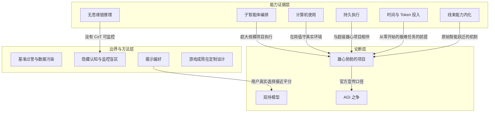

# 概念解析辞典

> 针对《GPT-6-Astra 能做很多雄心勃勃的事情》（substack.com）的概念提取

## 一、核心概念

### 1. **雄心勃勃的项目（Ambitious Projects）**

- **context**：全文的立论基准——作者围绕"哪款模型能承接真正宏大的任务"展开，开篇即把 Astra 定位为这类任务的最佳模型。

  > 阿斯特拉是人们通常所说的“雄心勃勃的项目”的最佳模型，而且很可能是所有模型中原始智能水平最高的。

- **费曼一下**：所谓"雄心勃勃的项目"，指那些动辄几千行代码、跨多天、需要模型自己拿主意持续推进的大活，而不是问答和改稿。作者说从 Sol 到 Astra 的提升幅度比 Fable 5 到 5.1 还大，并认为 Astra 的原始智能可能是所有模型中最高的。这个概念承重在于：全文所有能力证据（3D、游戏、长任务、子智能体）都是围绕"它凭什么能扛雄心勃勃的项目"这一个问题组织的。

### 2. **不带思维链的推理（Thinking Fast Without Slow / No-CoT Reasoning）**

- **context**：在「思考，快而不慢」一节，英国 AISI 首次官方测量 Astra 关闭思维链（reasoning=none）后的能力，结果好到 OpenAI 与 AISI 双方一度怀疑数据污染；后续测试证实为真。

  > Astra can do almost as well as Fable, in a mode where CoT monitoring cannot work. Because there is no CoT to monitor.

- **费曼一下**：思维链（CoT）是模型把推理过程写出来的文本，也是目前最重要的监控窗口。Astra 在完全没有可见 CoT 的模式下，ECI 得分只比 Fable 5.1 的完整思考分数低 4 分；Fable 开与不开思考差 35 分，Astra 只差 10 分。也就是说 Astra 的大量推理根本不以可读文本发生——性能差距变小是好事，但"没有 CoT 可监控"直接把安全监控的抓手抽掉了，这是本文最重要的机制性发现之一。

### 3. **AGI 之争（Is It AGI）**

- **context**：官方发布口径是"欢迎来到 AGI 时代"（Brockman 的原话），作者在「AGI」一节正面回应"Is it AGI?"。

  > By my current definition, whatever one might say about goalposts, Astra and Fable are not AGI. I do find it reasonable to disagree.

- **费曼一下**：按作者自己的定义 Astra 还不是 AGI，但他头一次认为"模型是否 AGI"的争论不再荒谬。他给的两个边界是：Astra 还不能在广泛的数字与认知任务上替代人类；而滥用 AGI 标签最大的危险，是让人误以为智能的终点已经到了、后面的模型不会再强多少。这个概念承重在于给全文的乐观情绪装了一个校准器：很厉害，但别把话说死。

### 4. **双持模型（Dual Wielding）**

- **context**：全文的落脚点——面对 Astra 与 Fable 5.1 两强并列，作者给出的最终使用建议。

  > This is once again The Way. If intelligence matters and this is not pure execution, you want to use both models.

- **费曼一下**：对一个真正难的问题，同时问 Astra 和 Fable 5.1，而不是赌哪一个更强——Peter Wildeford 的实测是"事先很难预测哪个模型更好"，而让两个模型各自做一遍再互评，产出明显好于任何单个模型。这个概念承重在于：作者对 Astra 的所有热情都止步于此，它不是"换掉 Fable"，而是"两个都要"。

### 5. **线束能力内化（Harness Capabilities Shifting Into the Model）**

- **context**：François Chollet 解读 ARC-AGI-3 结果的引文——标准 harness 下 Astra 得分 66%，连续对话 harness 下接近 100%，且 Chollet 观察到模型当场自创符号语言。

  > Overall, Astra exhibits symbolic modeling behaviors we had previously only seen with sophisticated harnesses -- so harness capabilities are increasingly shifting into the model itself.

- **费曼一下**：线束（harness）是外部给模型搭的脚手架——连续对话、压缩、符号建模工具，过去要靠人精心搭建模型才能发挥。Chollet 观察到 Astra 在 ARC-AGI-3 的每一关当场建立高效的符号世界模型，甚至自创一套游戏专用的速记 DSL，行为效率超过人类基线——这套"外挂"正在被模型吸收进本体。这就是"ARC 不是侥幸"的机制解释：能力从脚手架转移到了模型自己身上。

### 6. **子智能体编排（Multi-Agent Orchestration）**

- **context**：「我正在组建团队」一节，多方报告 Astra 擅长同时调用大量子智能体分工协作，Dan McAteer 直接断言其训练目标就是多智能体编排。

  > GPT-6 Astra was trained end-to-end for multi-agent orchestration. It’s not documented, for obvious reasons, but it’s clear in practice.

- **费曼一下**：雄心勃勃的项目往往任务量巨大，单线程对话做不完，要靠一个主模型把活拆给很多子智能体并行干再汇总。多个报告说 Astra 的多智能体强化学习明显更先进、在超大规模项目上发光，甚至有人抱怨它"没被问就自己开了一堆子智能体"。它是"能做雄心勃勃的项目"的执行机制，概念上承重。

### 7. **计算机使用（Computer Use）**

- **context**：「计算机使用」一节，作者综合各方报告给出的判断，并补充 Fable 5.1"还差一步、最多一个周期内追上"。

  > Astra by all reports basically has solved computer use.

- **费曼一下**：计算机使用指模型直接操作你电脑上的真实软件——点界面、跑 Blender、打 Minecraft、填税表。作者说 Astra"基本解决了"这个问题，而 Fable 5.1 还没到、但接近。它承重在于：把模型的能力边界从"读文本、写代码"扩展到了"操作整台机器干活"，这是雄心项目能落地的物理前提。

### 8. **基准过度声明与数据污染（Unnecessary Overstatement）**

- **context**：「不必要的夸张」一节，作者批评 OpenAI 发布物料里的基准图表，并指出 Astra 标准 harness 下 62.7% 的分数已经足够亮眼。

  > If you score 100% on ExploitBench you cheated on ExploitBench. At minimum this involves data contamination, which is still cheating.

- **费曼一下**：官方高调宣传 ExploitBench 的 100%，但一个满分恰恰说明数据被污染、模型提前见过答案——OpenAI 自己在系统卡里也承认了这一点。作者认为这种夸张完全没必要，被用来证明"最对齐模型"的蜜罐演示也得不出那个结论。这个概念承重在于给出阅读官方基准的边界：宣传口径要打折，真分数反而更硬。

### 9. **填充词元推理与监控盲区（Filler-Token Reasoning）**

- **context**：研究人员把无意义的"填充词元"（filler tokens）塞进提示并让模型立即作答，Astra 的表现显著上升（4-hop 自然事实推理从约 10% 涨到约 50%，老 AIME 题从约 60% 涨到约 90%）。

  > This is concerning because it means Astra can perform significant cognition that it doesn't verbalize in its chain-of-thought, making it harder to monitor.

- **费曼一下**：只塞了一堆点号、不许思考，Astra 在需要连续推理的任务上依然大幅进步——推理发生了，却一个字都没写进思维链。监控的前提是能看到模型在想什么；看不见的认知越多，越难在它做坏事之前踩刹车。这与"不带思维链的推理"是同一枚硬币的两面，构成安全侧的关键边界。

### 10. **持久执行（Never Quits）**

- **context**：「Astra Never Quits Except When It Does」一节，多位用户的共同观察，作者也记录了它"莫名停下"的反例。

  > It just runs and runs and runs until it gets it done.

- **费曼一下**：前几代模型会做到一半停下来等用户确认，Astra 则"一直跑直到做完"——有用户说这是第一个可以下了几千行代码的订单就信任它完成的模型。但也有反例：它有时会偷懒停下反问"你到底想要什么"，或者只顾往前冲而不汇报。承重在于：持久执行是把"模型很强"变成"项目能做完"的最后一环，同时它偶尔的"quits"是用法上的真实边界。

### 11. **时间投入（Time to Think）**

- **context**：「思考时间到了」一节，Max Weinbach 描述使用 Astra 做极难任务的节奏——将近一周仍在推进的会话是常态。

  > I’m certain it’ll make what I asked it to make, but it may take a lot of time and a lot of tokens

- **费曼一下**：极难或从零开始的任务，Astra 需要时间把零碎拼图凑齐，代价是大量时间和 tokens（文中 Factorio 那次发射火箭是 44 小时游戏内时间、约 4500 美元 API 成本）。承重在于：雄心项目不是免费的即时满足，时间与 token 成本是它的真实价格，理解了这一点才知道怎么安排任务。

### 12. **揭示偏好（Revealed Preference）**

- **context**：「揭示偏好」一节，作者用自己读者群的投票数据作为对 Astra 的最纯粹评测——两轮投票呈现同一模式：约 16% 的净迁移从 Anthropic 流向 OpenAI，硬核多轮答题组仍偏 Claude，休闲组偏向 Astra。

  > Perhaps the purest form of review is the simplest. Which models do people use?

- **费曼一下**：言论会撒谎、评测会偏科，但"人实际把哪个模型设为主力"是行为证据。作者承认自己的样本有偏，但偏差一致，仍然能测出变化。这个概念承重在于：它把全文铺天盖地的二手评价收敛成一个可以自己判断的度量。

### 13. **定制设计是游戏的硬骨头（Bespoke Design, Not Implementation）**

- **context**：「我来改变游戏规则」一节的结论——Astra 一次通关 PortalBench、做出各种 3D 游戏，但作者点出真正的瓶颈在别处。

  > We have learned that the hard part of gaming is bespoke design, not implementation.

- **费曼一下**：Astra 能实现各种游戏机制、让画面惊艳，但"做一个视频里好看的游戏"和"做一个人们真想玩的游戏"是两回事——默认情况下得到的只是空壳。承重在于：这是全文最清晰的一条能力边界，提醒 AI 创作类能力"实现"与"设计"之间隔着鸿沟。

## 二、概念架构图

