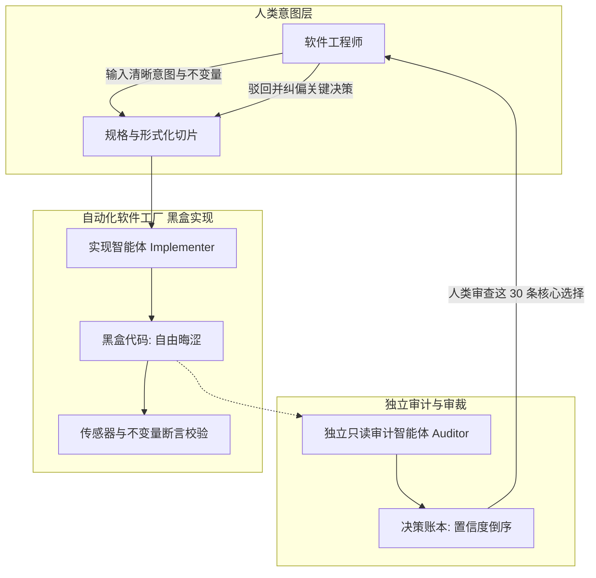

# 概念解析辞典

> 针对《Building software factories (with no slop)》（David / @dzhng on X）的概念提取

## 一、核心概念

### 1. **烂代码生成陷阱（AI Slop & Verification bottleneck）**

- **context**：作者在开头对现代代码库恶化的本质归因。

  > Slop is what happens when generation is unbounded and verification is bottlenecked on a human reading the output.

  > If the goal is still to read every line, we are bottlenecked by our own ability to review, and quality degrades toward zero.

- **费曼一下**：指当 AI 写代码的速度呈指数级增长，而人类审查只能按每分钟几十行的恒定生理速率进行时，传统 Code Review 必然沦为敷衍的扫视点赞（LGTM），导致低质冗余代码（Slop）不可逆地腐蚀整个系统的不可调和现象。

### 2. **代码黑盒化与可解释性转向（Codebase as a black box & Interpretability）**

- **context**：放弃逐行肉眼阅读、重构验证范式的核心主张。

  > The way I've been thinking about this is to stop treating this as a code review problem. Treat it as an interpretability problem.

- **费曼一下**：指不再把代码审查当成一行行检查语法和写法的文字校对，而是像观察黑盒机器一样，把代码库切成具有严格输入输出的组件，在外围布设传感器检测其行为是否违背核心业务不变量（Invariants）。用检测系统行为替代逐行阅读实现。

### 3. **隐式决策账本（Decision ledger）**

- **context**：作者在实践中沉淀出的最高效、最关键的人机协作制品。

  > Sensors and invariants tell you a piece does what it says. They don't tell you that the agent silently picked optimistic concurrency, or invented a retry policy nobody specified, or decided two features should share a table. Those aren't defects — the tests pass, the outputs are correct, the sensors are green. They're decisions, and they're what bites you three months later when you need to change something.

- **费曼一下**：指要求 Agent 在交付代码的同时，交出一份清单，把所有“需求规格书没写明、但模型在编码时自己擅自拍板拿主意”的地方（如重试策略、并发锁选择、表结构合并等）逐条写下来，并按“自己最没把握”到“最有把握”倒序排列。人类不看万行代码，专审这几十条决策。

### 4. **独立只读审计智能体（Independent read-only auditor）**

- **context**：防止模型自圆其说、确保决策账本真实诚实的关键工程实践。

  > Small implementation detail: always make sure the auditor is a separate pass from the implementer (via an independent sub agent), because a model reviewing its own work is primed by its own intent and will rationalize.

- **费曼一下**：指负责审查和记录决策的智能体，必须是独立于写代码智能体之外的副手。它绝对不能被授予改代码的权限，因为一旦它能自己去修代码，它就会倾向于掩盖漏洞以产出一份看起来完美的虚假绿灯报告。

### 5. **软件工厂全景闭环（Software factory loop）**

- **context**：作者总结的取代传统 SDLC 的端到端生产范式。

  > The reason is that the job was never writing code. Engineering is about solving problems. That's the actual difference between being a programmer and being an engineer - a programmer's output is code, an engineer's output is a solved problem, and code was only ever the medium we happened to solve it in.

- **费曼一下**：指由“侦测业务迷雾 → 固化形式规格 → 驱动切片构建 → 审查倒序决策账本”组成的流水线体系。在这个工厂里，人类工程师负责输入清晰意图和审查关键架构裁决，AI 负责在黑盒中高速吐出实现代码。

## 二、概念架构图

