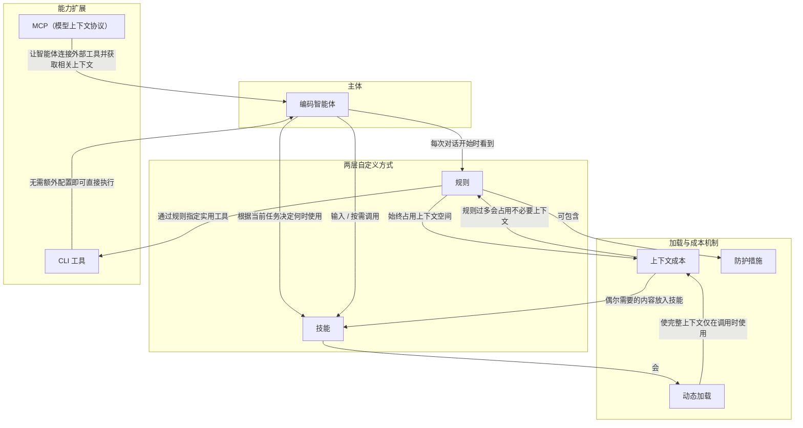

# CLI 工具

> 智能体可直接在终端执行的已装程序，如 gh、aws、kubectl、docker。

**领域** tools-sandbox ｜ **类型** REPRESENTATIONAL ｜ **什么时候学** 做到这里再懂 ｜ **怎么算会了** 能用 ｜ **中心度** 0.124

## 费曼一下

CLI 工具是智能体可以直接在终端执行的外部程序。与 MCP 不同，它们不需要额外配置，只要终端里安装了就能用。作者用 `gh`、`aws`、`kubectl`、`docker` 说明智能体能操作 GitHub、云服务、Kubernetes、Docker 等。规则还可以指定某类操作该用哪个 CLI 工具。它补全了智能体扩展操作能力的另一条路径。

## 二、概念架构图

## 原文 context

除 MCP 外，智能体还可以运行终端中安装的任何 CLI 工具。`gh`、`aws`、`kubectl` 和 `docker` 等工具无需额外配置即可使用。智能体可以直接执行这些工具。

通过规则为智能体指定实用工具：

- 所有 GitHub 操作（问题、PR、CI 检查）均使用 `gh`

- 文件存储操作使用 `aws s3`

## 掌握证据（做到这些才算会）

- 能说出 CLI 工具与 MCP 在配置要求上的区别
- 能通过规则指定某类操作使用哪个 CLI 工具

## 验收问句

> 为什么{{name}}不需要额外配置就能被智能体使用？

## 懂了它才能懂（解锁 1）

- [[精确字符串查找 grep grep ripgrep Instant Grep]] — 不懂【CLI 工具】就做不了【精确字符串查找 / grep】的 ⟨在智能体终端里直接执行 grep 进行递归搜索⟩

## 出场

- AI 内参 260912 ｜ 《自定义 Agent》 ｜ https://cursor.com/cn/learn/customizing-agents
## 反链

- [[精确字符串查找 grep grep ripgrep Instant Grep]]
