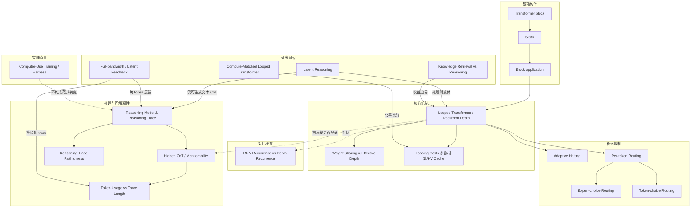

# Full-bandwidth Transformer / Latent Feedback

> 一种跨 token 位置的递归：每个解码步用学到的 gate 把前一个 token 的最终 hidden state 混入新 token 输入。

**领域** model-training ｜ **类型** REPRESENTATIONAL ｜ **什么时候学** 深入研究再懂 ｜ **怎么算会了** 只能认 ｜ **中心度** 0.052

## 费曼一下

这种 recurrence 跨 token 位置：每个解码步把前一个 token 的最终 hidden state 通过 gate 混入新 token 的输入。实验里它能让 base model 的推理 trace 变短且准确率不降，但 instruction tuning 后效果消失。它给“更内部计算是否导致更短 trace”增加了一个条件性、机制依赖的例证。

## 二、概念架构图

图中只保留原文能支持的关系；虚线表示作者讨论中的争议或否定关系，不是已证因果。

## 原文 context

At each decoding step, it combines the previous token’s final hidden state with the newly sampled token’s embedding through a learned gate. This becomes the input for the next forward pass.

> When using a 1B base model, they found that their latent feedback approach outputs shorter reasoning traces on MATH500 while maintaining or improving accuracy. However, the shortening effect disappears after instruction tuning.

> ... this connects directly to the earlier discussion about whether looping results in shorter reasoning traces. The result depends on both the feedback mechanism and how the model is trained...

## 掌握证据（做到这些才算会）

- 能描述每个解码步如何把前一个 token 的最终 hidden state 与新采样 token 的 embedding 组合成下一次前向输入
- 能说出在 1B base model 上推理 trace 变短而准确率不降，但 instruction tuning 后效果消失

## 验收问句

> {{name}} 在每个解码步具体把什么和什么组合起来？

## 出场

- AI 内参 260912 ｜ 《GPT-6 Astra, Looped Transformers, and Hidden Reasoning》 ｜ https://magazine.sebastianraschka.com/p/gpt-6-astra-looped-transformers-and