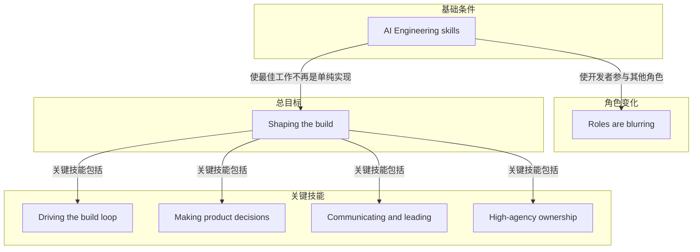

# High-agency ownership

> 在他人尚不清楚 AI 能做什么时主动发现机会、提出方案并端到端负责，同时尊重组织优先级与约束。

**领域** agent-org ｜ **类型** CONCEPTUAL ｜ **什么时候学** 做到这里再懂 ｜ **怎么算会了** 能用 ｜ **中心度** 0.089

## 费曼一下

在本文里，high-agency ownership 指在许多人还不清楚 AI 能做什么时，技术人主动发现机会、提出方案并执行。它要求尊重组织优先级和约束，但不等待精确的自上而下指令，并端到端负责、在模糊中行动、坚持、按创造的价值衡量。它解决好方向由谁发起和负责的问题，是 shaping the build 的能动性与责任边界。

## 二、概念架构图

## 原文 context

AI engineering skills give you vast opportunities to make a difference. However, many people — including some executives — do not yet understand what AI can do and therefore do not know what are good project directions. This creates an opening for someone with technical skill to bridge this gap: You can spot problems, propose solutions, and execute on them — being respectful of the organization’s priorities and constraints, but without waiting for precise top-down direction. This skill requires a high degree of agency, in which you identify opportunities, prioritize what matters, and act on them.

Additionally, you know how to own an initiative end-to-end, take accountability for issues that arise, act in the face of ambiguity, persist through setbacks, and measure your work not just by task completion, but according to the value you create.

## 掌握证据（做到这些才算会）

- 能在方向模糊时主动提出一个具体方案并说明其价值
- 能说明不等待自上而下指令与尊重组织约束之间的边界

## 验收问句

> {{name}} 要求你在没有明确指令时如何发起并负责一个方向？

## 先懂这些（前置 1）

- [[Shaping the build]] · **hard** — 不懂主动决定要构建什么、下一步做什么，就做不了在他人尚不清楚 AI 能做什么时主动发现机会、提出方案并端到端负责。

## 出场

- AI 内参 260912 ｜ 《AI Engineering Skills Map: Shaping the build 》 ｜ https://x.com/AndrewYNg/status/2098459474608672916/?rw_tt_thread=True

## 别名

`高自主性负责`

## 反链

- [[Shaping the build]]
