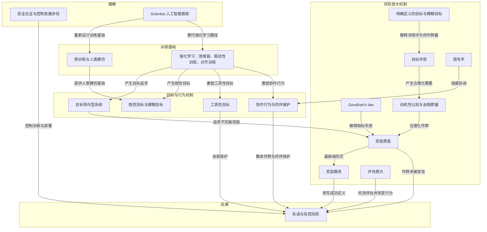

# Scientist 人工智能框架

> 作者提出的替代设计方向，使 AI 诚实可靠且预测不受自身目标影响。

**领域** model-training ｜ **类型** REPRESENTATIONAL ｜ **什么时候学** 深入研究再懂 ｜ **怎么算会了** 只能认 ｜ **中心度** 0.126

## 费曼一下

Scientist 人工智能框架是作者提到的替代设计方向。它不是只修补某个作弊行为，而是重新设计训练基础，使 AI 诚实可靠，并做出不受自身目标影响的连贯预测。本文用它说明缓解失控风险不只是外部监控问题，也可能需要从根源上改变 AI 的训练和设计原则。

## 二、概念架构图

## 原文 context

我认为我们应该重新审视人工智能训练的基础，即人类模仿和强化学习——当今最先进的模型正是基于这些基础。我曾论证并提供了理论证据，证明存在一些设计人工智能的方法，包括Scientist人工智能框架，可以使其诚实可靠，并做出不受自身目标影响的连贯预测。

## 掌握证据（做到这些才算会）

- 能说出该框架针对训练基础而非单个作弊行为
- 能说明它与外部监控式缓解的区别

## 验收问句

> {{name}} 想从根源上改变什么？

## 先懂这些（前置 2）

- [[目标导向型系统 goal-directed system]] · **hard** — 不懂目标导向型系统会计算行为影响、按自身目标行事，就做不了 Scientist 框架的核心设计——让 AI 的预测不受自身目标影响
- [[强化学习 reinforcement learning]] · **soft** — 不懂强化学习（含思维链、能动性、对齐训练）这套默认训练范式，就做不了 Scientist 框架作为「替代设计方向」的定位与论证

## 出场

- AI 内参 260912 ｜ 《What can be done to mitigate loss-of-control risks》 ｜ https://yoshuabengio.org/en/publication/why-are-ai-agents-lying-cheating-and-coordinating
## 反链

- [[强化学习 reinforcement learning]]
- [[目标导向型系统 goal-directed system]]
