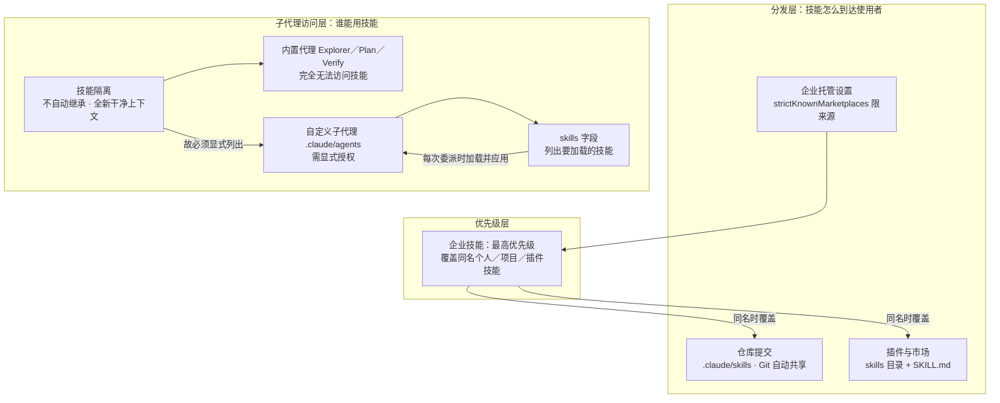

# skills 字段

> 自定义子代理前置元数据中列出待加载技能的 skills 字段，委派时应用。

**领域** harness-runtime ｜ **类型** REPRESENTATIONAL ｜ **什么时候学** 现在先懂 ｜ **怎么算会了** 能用 ｜ **中心度** 0.298

## 费曼一下

`skills:` 这一行就是隔离规则的解药——只有在自定义子代理的前置元数据里点名写出技能，它才会加载，并在每次被委派时都应用。它的前置条件是技能已存在于 `.claude/skills`；操作上可以用 `/agents` 交互生成，也可以往已有的代理 markdown 里补字段。作者点出它的价值在于"强制执行标准，而不依赖于提示"：把规则沉淀成技能并绑定到代理上，比每次在提示里重申更可靠。

## 二、概念架构图



图中三层的划分依据是功能角色：分发层决定技能以何种渠道、何种范围到达使用者；优先级层裁决同名冲突；子代理访问层处理"委派出去的工作能不能用上技能"。企业托管设置单独指向优先级层，是因为它同时具备部署方式与最高优先级两重身份。

## 原文 context

要创建带有技能的自定义子代理，请在 .claude/agents 中添加一个代理 markdown 文件。您可以使用 Claude Code 中的 /agents 命令以交互方式创建一个：

生成的代理文件包含一个 skills 字段，列出要加载的技能。以下是前置元数据的样子：

```

---

name: frontend-security-accessibility-reviewer

description: "Use this agent when you need to review frontend code for accessibility..."

tools: Bash, Glob, Grep, Read, WebFetch, WebSearch, Skill...

model: sonnet

color: blue

skills: accessibility-audit, performance-check

---

```

当您委派给这个子代理时，它会加载这两项技能，并将它们应用于每次审查。首先确保这些技能存在于您的 .claude/skills 目录中，然后创建一个新的子代理，或将 skills 字段添加到现有代理的 markdown 文件中。

您希望在委派的工作中强制执行标准，而不依赖于提示

## 掌握证据（做到这些才算会）

- 能在 .claude/agents 的代理 markdown 前置元数据里写出 skills 字段
- 能说明该字段的前提是技能已存在于 .claude/skills

## 验收问句

> {{name}} 写在哪里？生效前提是什么？

## 懂了它才能懂（解锁 1）

- [[内置代理与自定义子代理的技能访问边界]] — 不懂要在自定义子代理前置元数据的 skills 字段里列出待加载技能，就没法让某个自定义子代理在委派时真正用上技能（内置代理则始终访问不到）。

## 出场

- AI 内参 260912 ｜ 《Claude 官方课程 · 第 5 课：技能的分发与共享》 ｜ https://academy.claude.com/zh-CN/courses/introduction-to-agent-skills/sharing-skills

## 别名

`前置元数据中的显式授权`

## 反链

- [[内置代理与自定义子代理的技能访问边界]]
