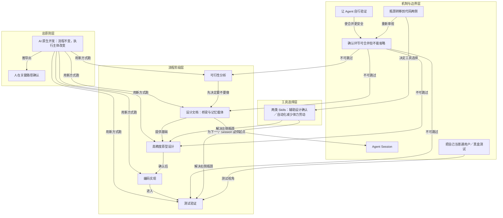

# 两类 Skills

> 作者只用两类 Skills：辅助设计确认与自动化减少体力劳动。

**领域** harness-runtime ｜ **类型** CONCEPTUAL ｜ **什么时候学** 做到这里再懂 ｜ **怎么算会了** 能判 ｜ **中心度** 0.07

## 费曼一下

作者不靠大量编码类 Skills，因为模型编码已足够好。只用两类：帮助左侧设计确认，如高精度原型工具；帮助右侧自动化，如部署发布。它是瓶颈转移后的工具选择结论。

## 二、概念架构图

按功能角色分层：总原则层说明整体判断，流程阶段层呈现旧流程，机制与边界层解释 AI 原生开发如何运转，工具选择层对应瓶颈两侧的 Skills。边只表示原文能支持的关系。

## 原文 context

我的答案可能会出乎意料：大部分开发类 Skills 是没必要的。

> 我一般只用两类 Skills，恰好对应这两个瓶颈：

> 第一类是辅助设计确认的——解决左侧瓶颈。

> 第二类是自动化减少体力劳动的——解决右侧瓶颈。

## 掌握证据（做到这些才算会）

- 能说出不使用大量开发类 Skills 的理由是模型编码已足够好
- 能把两类 Skills 分别对应到瓶颈左右两侧

## 验收问句

> {{name}} 分成哪两类，各自解决哪一侧瓶颈？

## 出场

- AI 内参 260912 ｜ 《我的 AI 原生开发流程：一个真实案例的完整复盘》 ｜ https://baoyu.io/blog/2026-08-24/ai-native-dev-workflow

## 别名

`辅助设计确认／自动化减少体力劳动`
