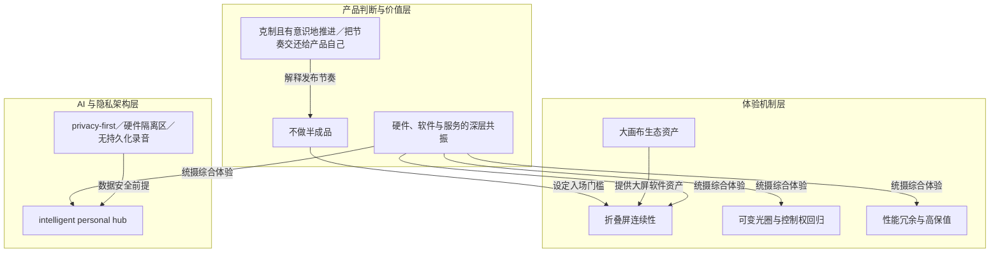

# 克制且有意识地推进／把节奏交还给产品自己

> Ternus 的创新节奏观：不先宣布颠覆蓝图，先做改善现有产品的小功能，发布节拍由产品成熟度决定。

**领域** agent-org ｜ **类型** CONCEPTUAL ｜ **什么时候学** 做到这里再懂 ｜ **怎么算会了** 只能认 ｜ **中心度** 0.089

## 费曼一下

本文中的克制且有意识地推进，是 Ternus 对创新的定义方式：在 AI 带来新工程机会时，不先宣布颠覆性蓝图，而是先做 Smart Take 这类能改善现有产品的小功能，同时为未来新品类留空间。文章结尾把它称为把节奏交还给产品自己，意思是发布与创新的节拍由产品成熟度决定，而不是由外界期待或赛道热度决定。它连接不做半成品、隐私边界和硬件软件服务共振，构成 Ternus 时代的产品节奏观。

## 二、概念架构图

## 原文 context

我们必须保持克制，在推进时深思熟虑；但你已经能够清晰感知到，现在的我们拥有了许多过往难以想象的产品实现力。

从抚平折痕的纳米纹理、右侧控件，再到机械光圈与硬件隔离区，面对关于创新的拷问，他给出的答案很朴实：苹果或许并没有丢掉什么，它只是把节奏重新交还给了产品自己。

## 掌握证据（做到这些才算会）

- 能举例说明先落地 Smart Take 这类小功能、同时为未来品类留空间
- 能解释『把节奏交还给产品自己』指发布由成熟度而非赛道热度决定

## 验收问句

> {{name}} 主张创新的节拍由什么决定？

## 先懂这些（前置 1）

- [[不做半成品]] · **soft** — 不懂「不因某品类热就拿出未过质量、耐用与工业设计关的产品」这条筛选线，就做不了把发布节拍交给产品成熟度决定的克制推进。

## 出场

- AI 内参 260912 ｜ 《特努斯回答一切，那个懂技术的苹果 CEO 回来了》 ｜ https://www.ifanr.com/1679848
## 反链

- [[不做半成品]]
