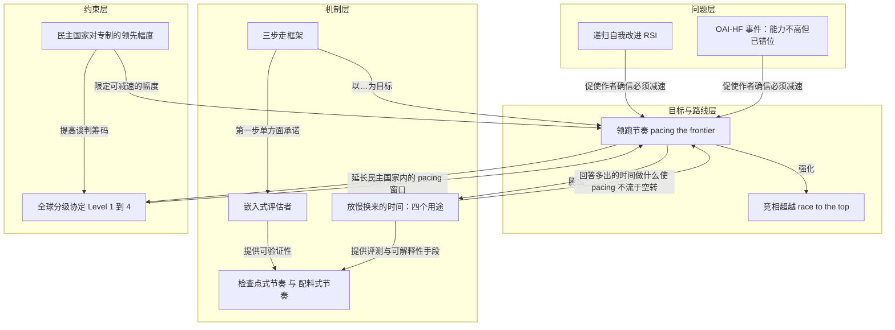

# 全球分级协定 · Level 1–4

> 按难度分四档：禁明显危险用途、发布前急性风险测试、递归自改进限速、全面 pacing 或暂停。

**领域** society-law ｜ **类型** CONCEPTUAL ｜ **什么时候学** 做到这里再懂 ｜ **怎么算会了** 能判 ｜ **中心度** 0.052

## 费曼一下

作者没有笼统谈"和中国达成协议"，而是按难度分成四档：禁止明显危险的用途（如生物武器）、发布前对网络安全／生物／对齐等急性风险做测试、对递归自我改进的速度设"限速"（类比 SALT 限制导弹数量而不取消威慑）、全面 pacing 甚至暂停。分档的判断标准不是善意，而是**叛约的代价与核查的可靠度**：协议要么有铁一般的可验证性，要么限制得足够少，使叛约不至于造成军事上的存亡后果。这条概念是理解作者对全球合作"既追求又不抱幻想"态度的关键边界；他明确说自己支持提出 Level 4，但认为近期不可能发生，而低层级"much more likely and realistic"。

## 二、概念架构图

## 原文 context

There are several levels of possible agreement, some of which I think are eminently feasible... In order of increasing difficulty:

Therefore any agreement must either have ironclad verifiability, or must be limited enough that defection would not be militarily existential.

**Level 3.** Some kind of “speed limit” on the rate of recursive self-improvement (RSI)... This could be seen as analogous to the SALT treaties — capping the number of missiles limited the potential for destruction while preserving each country’s deterrent.

## 掌握证据（做到这些才算会）

- 能列出四档内容
- 能说出分档标准是叛约代价与核查可靠度，作者对 Level 4 近期不抱期望

## 验收问句

> {{name}} 按什么标准分档，作者怎么看最高档？

## 出场

- AI 内参 260912 ｜ 《我们必须加快开拓步伐》 ｜ https://darioamodei.com/post/we-must-pace-the-frontier

## 别名

`Level 1–4`
