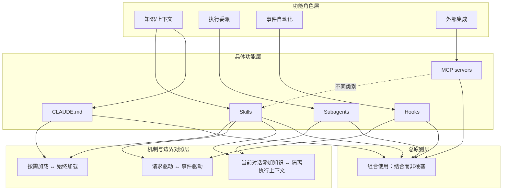

# 功能组合

> 各功能各有专长，应结合使用，而不是把所有事情硬塞进 skills。

**领域** harness-runtime ｜ **类型** CONCEPTUAL ｜ **什么时候学** 现在先懂 ｜ **怎么算会了** 能判 ｜ **中心度** 0.052

## 费曼一下

在本文里，功能组合不是简单罗列工具，而是作者的结论：Claude Code 的这些自定义选项解决不同问题，所以应根据每种功能的专长分别使用，再组合成一个完整配置。它防止读者把所有需求都塞进 Skills，也把前面各个概念收束成一个整体框架。

## 二、概念架构图

## 原文 context

每个功能都各有专长——将它们结合使用，而不是把所有事情都硬塞进一种方案中

每种功能都各有专长。当其他选项更合适时，不要把所有事情都硬塞进 skills 中——而且您可以同时使用多种功能。

一个典型的配置可能包括：CLAUDE.md —— 始终生效的项目标准；Skills —— 按需加载的特定任务专业知识；Hooks —— 由事件触发的自动化操作；Subagents —— 用于委派工作的隔离执行上下文；MCP servers —— 外部工具和集成

## 掌握证据（做到这些才算会）

- 能说出 CLAUDE.md、Skills、Hooks、Subagents、MCP 各自角色
- 能给出一个同时含多种功能的典型配置

## 验收问句

> 按 {{name}}，典型配置包含哪些功能、各管什么？

## 出场

- AI 内参 260912 ｜ 《Claude 官方课程 · Skills 与其他 Claude Code 功能的比较》 ｜ https://academy.claude.com/zh-CN/courses/introduction-to-agent-skills/skills-vs-other-claude-code-features

## 别名

`结合使用，而非硬塞`
