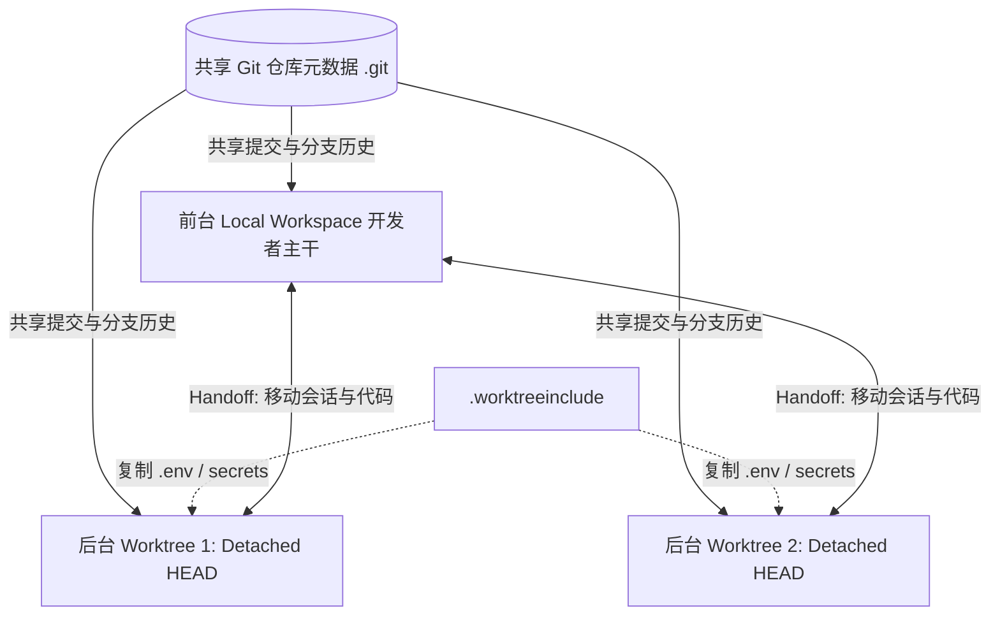

# 单分支单一可变引用限制 · Single mutable reference rule

> 分支本质是 refs/heads/<name> 单一可变引用，只代表某工作树的当前检出状态，故不可多处同检。

**领域** code-engineering ｜ **类型** CONCEPTUAL ｜ **什么时候学** 做到这里再懂 ｜ **怎么算会了** 能判 ｜ **中心度** 0.072

## 费曼一下

Git 的安全红线规定：一个分支本质上只是一个指针文件，代表某一棵工作树的当前状态。如果允许多个工作区同时改写同一个分支指针，就会引发类似多线程抢写同一变量的竞态条件，导致提交丢失或索引损坏。

## 二、概念架构图

## 原文 context

Git prevents the same branch from being checked out in more than one worktree at a time because a branch represents a single mutable reference (refs/heads/<name>) whose meaning is “the current checked-out state” of a working tree.

## 掌握证据（做到这些才算会）

- 能说出分支即一个可变引用文件，含义是某工作树的当前检出状态
- 能解释多处同时改写会类似多线程抢写同一变量，导致提交丢失或索引损坏

## 验收问句

> {{name}} 被违反会导致什么后果？

## 懂了它才能懂（解锁 1）

- [[单分支单一权威工作副本保证 One-branch-per-worktree rule]] — 不懂【单分支单一可变引用限制】，就做不了【单分支单一权威工作副本保证】的“确立每个分支同一时刻只能在一个工作树检出的规则”这件事——因为不知道分支本质是 refs/heads/<name> 单一可变引用，就无法论证多处同检会破坏权威可变工作副本。

## 出场

- AI 内参 260912 ｜ 《Worktrees | ChatGPT Learn》 ｜ https://learn.chatgpt.com/docs/environments/git-worktrees

## 别名

`Single mutable reference rule`

## 反链

- [[单分支单一权威工作副本保证 One-branch-per-worktree rule]]
