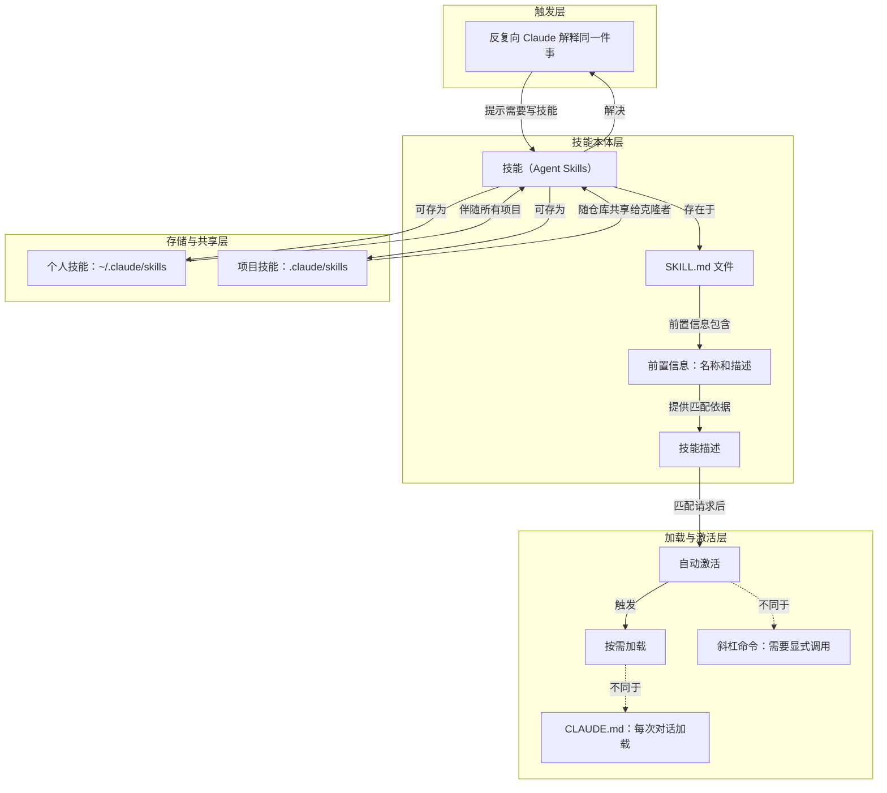

# 反复解释同一件事

> 反复向 Claude 解释同一件事，是应为该内容写一个技能的触发信号与经验法则。

**领域** harness-runtime ｜ **类型** CONCEPTUAL ｜ **什么时候学** 现在先懂 ｜ **怎么算会了** 能判 ｜ **中心度** 0.052

## 费曼一下

在本文中，反复解释同一件事不是普通抱怨，而是创建技能的触发信号。它把“为什么需要技能”具体化了：同一类说明、审查结构、格式偏好如果每次都重复，就可以封装成技能，让 Claude 之后自动应用。

## 二、概念架构图

图按触发、技能本体、加载与激活、存储与共享四层组织；CLAUDE.md 与斜杠命令作为加载和激活的边界对照出现。

## 原文 context

如果你发现自己反复向克劳德解释同一件事，那说明你还有待提高这方面的技能。

每次你向 Claude 解释团队的编码规范时，你都在重复自己。每次 PR 审查，你都要重新描述你希望反馈的结构。每次提交信息，你都要提醒 Claude 你偏好的格式。技能可以解决这个问题。

经验法则很简单：如果你发现自己反复向克劳德解释同一件事，那么这项技能就需要写出来。

## 掌握证据（做到这些才算会）

- 能举出自己反复向 Claude 解释的同一类内容
- 能据此判断哪些内容值得封装成技能

## 验收问句

> {{name}} 在本文中被当作什么信号？

## 出场

- AI 内参 260912 ｜ 《Claude 官方课程 · 第 1 课：什么是 Agent Skills》 ｜ https://academy.claude.com/courses/introduction-to-agent-skills/what-are-skills