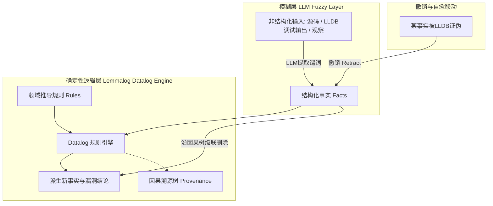

# 声明式逻辑记忆引擎 · Datalog-based memory engine

> 用 Datalog 只声明事实与规则，由引擎自动派生新事实并在事实增删时重算依赖，不耗推理 Token。

**领域** memory-retrieval ｜ **类型** REPRESENTATIONAL ｜ **什么时候学** 做到这里再懂 ｜ **怎么算会了** 能判 ｜ **中心度** 0.072

## 费曼一下

Datalog 是一种只声明“事实”与“如果……那么……”规则的逻辑编程语言。将其作为智能体记忆引擎，能够自动计算知识不动点，并且在事实发生增删时以极高效率重新计算依赖，不耗费任何大模型推理 Token。

## 二、概念架构图

## 原文 context

Datalog is a declarative logic programming language. Instead of writing instructions describing how something should be calculated, we describe facts and rules from which new facts can be derived.

## 掌握证据（做到这些才算会）

- 能说明声明式写规则与写“怎么算”的指令式写法的区别
- 能指出维护这类记忆不消耗大模型推理 Token

## 验收问句

> 在 {{name}} 里，事实与规则由谁写、推导由谁做、代价是什么？

## 先懂这些（前置 1）

- [[推论因果溯源图 Provenance of conclusions]] · **hard** — 不懂推论因果溯源图，就做不了声明式逻辑记忆引擎在事实增删时重算依赖这件事。

## 出场

- AI 内参 260912 ｜ 《Some things should probably stay fuzzy》 ｜ https://pwning.systems/posts/llm-memory-program-analysis/

## 别名

`Datalog-based memory engine`

## 反链

- [[推论因果溯源图 Provenance of conclusions]]
