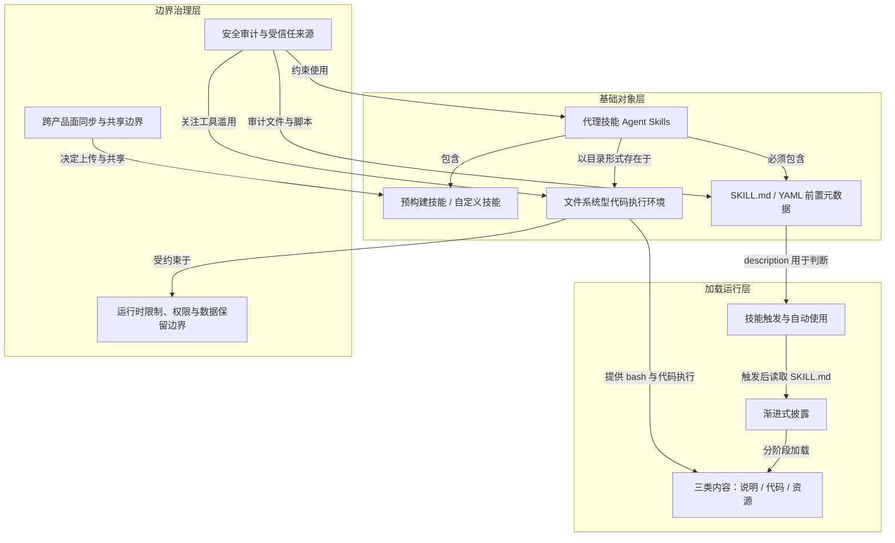

# 安全审计与受信任来源 · Security Considerations / Trusted Sources

> 技能等同要安装的软件：只用可信来源，并审计包内全部文件以防恶意指令与代码。

**领域** safety-governance ｜ **类型** CONCEPTUAL ｜ **什么时候学** 现在先懂 ｜ **怎么算会了** 能判 ｜ **中心度** 0.248

## 费曼一下

安全边界来自技能能通过指令和代码给 Claude 新能力。恶意技能可能让 Claude 以不符合声明目的的方式调用工具、执行代码，导致数据外泄或未授权访问。本文把技能当作要安装的软件来对待，强调来源可信，并要求审计技能包中的所有文件，包括 SKILL.md、脚本、图片和其他资源。外部 URL 风险、工具滥用、数据暴露是这条防御结构里的几个关键边界。

## 二、概念架构图

## 原文 context

Use Skills only from trusted sources: those you created yourself or obtained from Anthropic. Skills give Claude new capabilities through instructions and code, which also means a malicious Skill can direct Claude to invoke tools or execute code in ways that don't match the Skill's stated purpose.

If you must use a Skill from an untrusted or unknown source, exercise extreme caution and thoroughly audit it before use. Depending on what access Claude has when executing the Skill, malicious Skills could lead to data exfiltration, unauthorized system access, or other security risks.

Key security considerations:

Audit thoroughly: Review all files bundled in the Skill: SKILL.md, scripts, images, and other resources. Look for unusual patterns such as unexpected network calls, file access patterns, or operations that don't match the Skill's stated purpose

External sources are risky: Skills that fetch data from external URLs pose particular risk, as fetched content may contain malicious instructions. Even trustworthy Skills can be compromised if their external dependencies change over time

Tool misuse: Malicious Skills can invoke tools (file operations, bash commands, code execution) in harmful ways

Data exposure: Skills with access to sensitive data could be designed to leak information to external systems

Treat like installing software: Be especially careful when integrating Skills into production systems with access to sensitive data or critical operations

## 掌握证据（做到这些才算会）

- 能说出恶意技能可能造成数据外泄或未授权访问
- 能列出需审计的文件类型：SKILL.md、脚本、图片及其他资源

## 验收问句

> 按 {{name}}，拿到第三方技能应先做什么？

## 懂了它才能懂（解锁 2）

- [[企业托管设置（Managed Settings）与 strictKnownMarketplaces]] — 不懂【安全审计与受信任来源】，就做不了【企业托管设置（Managed Settings）与 strictKnownMarketplaces】的 ⟨判定哪些 marketplace / 插件源有资格进白名单，并解释为什么限定来源白名单本身不等于安全、包内文件仍需逐一审计⟩
- [[企业技能的最高优先级]] — 不懂【安全审计与受信任来源】，就做不了【企业技能的最高优先级】的 ⟨解释企业版同名技能凭什么能无条件压过个人、项目与插件版本——只有先把技能当作要审计的软件、只认可信来源，才说得通把最高优先级给企业版⟩

## 出场

- AI 内参 260912 ｜ 《Using Agent Skills with the API（用 API 使用 Agent Skills）》 ｜ https://platform.claude.com/docs/en/agents-and-tools/agent-skills/overview

## 别名

`Security Considerations / Trusted Sources`

## 反链

- [[企业托管设置（Managed Settings）与 strictKnownMarketplaces]]
- [[企业技能的最高优先级]]
