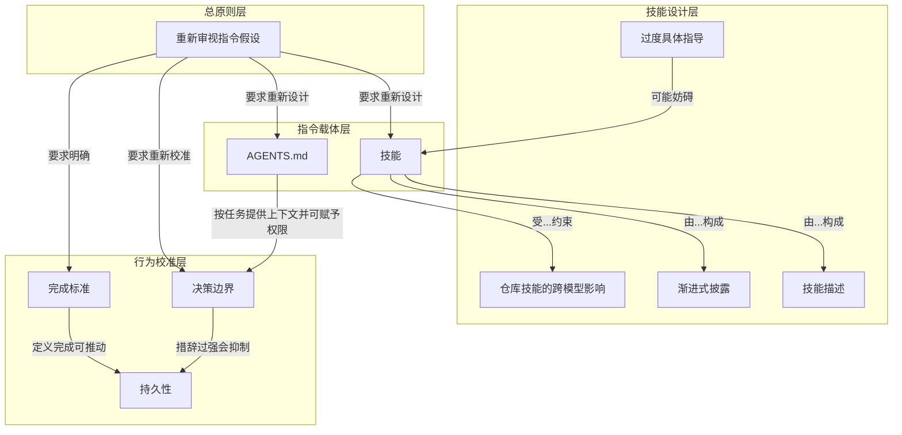

# 完成标准

> 开始前说清什么算做完，把运行、检查、修复都写进请求，模型才有依据做到完全完成。

**领域** loop-autonomy ｜ **类型** PROCEDURAL ｜ **什么时候学** 现在先懂 ｜ **怎么算会了** 能用 ｜ **中心度** 0.144

## 费曼一下

完成标准是在请求开始时说清什么算做完。把运行实现、检查结果、修复失败都写进任务，Astra 才有依据继续到完全完成，而不是第一次实现后停下等审查。它直接回应持久性问题。

## 二、概念架构图

按功能角色分层，只保留原文支持的关系：

## 原文 context

这就是为什么在开始之前定义完成标准很有帮助的原因。你可能需要督促 Astra 继续执行，直到完全完成。如果任务包括运行实现、检查结果以及修复失败的问题，请将这些内容包含在请求中。如果在第一次实现后就要求停止进行审查，这将导致模型提前停止，因此请检查这是否是你真正需要做的决定。

> 如果你希望它在第一次探索之后继续探索，请说明你想探索什么以及它应该在哪里停止。

## 掌握证据（做到这些才算会）

- 能在请求里写出可执行的完成标准
- 能指出“要求首次实现后就停下审查”会导致提前停止

## 验收问句

> 如果要让 Astra 推进到完全完成，{{name}} 该怎么写？

## 懂了它才能懂（解锁 2）

- [[持久性 persistence]] — 不懂【完成标准】「开始前说清什么算做完、把运行检查修复都写进请求」，就做不了 ⟨设定持久性：决定模型该连续执行到哪一步、何时返回（例如初次实现后即返回审核）⟩。
- [[Driving the build loop]] — 不懂【完成标准】「先明确什么算做完」，就做不了 Driving the build loop 中的 ⟨决定下一步：判断这一轮反馈之后该继续改还是收工⟩。

## 出场

- AI 内参 260912 ｜ 《Rethinking skills and prompts for GPT-6 Astra | OpenAI Developers》 ｜ https://developers.openai.com/blog/rethinking-skills-and-prompts-for-gpt-6-astra
## 反链

- [[Driving the build loop]]
- [[持久性 persistence]]
